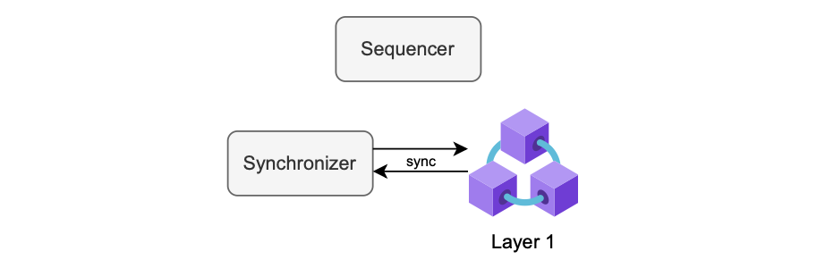

This document explores how Polygon zkEVM deals with _reorganizations_, or simply _reorgs_, compared to Ethereum reorgs, and discusses the role the synchronizer plays in these reorgs.

Among other tasks, the synchronizer is responsible for managing the reorg process.

## L2 reorgs

Consider a reorg of L2 batches. Suppose a sequencer, called _sequencer A_, has closed batch $\mathtt{724}$ and has not sequenced it yet. 

So the batch, denoted by $\mathtt{724^A}$, is part of the trusted state. And thus, the figure below depicts batch $\mathtt{724^A}$ in red.

However, suppose that another sequencer, called _sequencer B_, closes and sequences a different batch $\mathtt{724}$.

The batch, denoted by $\mathtt{724^B}$, is therefore part of the virtual state. The figure below depicts batch $\mathtt{724^B}$ in green.

Therefore, to align with the current virtual state, sequencer A must re-synchronize its state from batch $\mathtt{724^B}$ onwards.

To accomplish this, sequencers must always check sequenced transactions present in the L1, in case another sequencer has virtualized a different batch.

In the zkEVM architecture, a component called the _synchronizer_ is responsible for checking events emitted in L1 when batches are sequenced.

This way the sequencer can re-synchronize if necessary.

In general, the synchronizer checks Layer 1 for instances of sequenced batches. If two or more sequencers, $\mathtt{A}$, $\mathtt{B}$, $\mathtt{C}$, $\mathtt{ \dots }$, have closed different $\mathtt{X}$-th batches,

$$
\mathtt{batch\ X^A_i},\ \mathtt{batch\ X^B_i},\ \mathtt{batch\ X^C_i},\ \dots
$$

and some of these $\mathtt{X}$-th batches have been virtualized and some consolidated, then the synchronizer must notify,

- The sequencers whose batches are 'un-virtualized', and
- The sequencers whose batches are 'un-consolidated',

of the need to reorg.

And, as in the above scenario of sequencer A and B, the synchronizer alerts sequencer A of the need to reorg.

!!! info
    
    Currently, reorgs do not occur in the zkEVM system because a single sequencer is implemented, the _trusted sequencer_.

The possibility of L2 reorgs arises only in the event of L1 reorgs.

There’s a slight chance for a reorg occurrence in the event of [_forced batches_](../protocol/malfunction-resistance/sequencer-resistance.md), where a user is sequencing a batch.

However, the design of forced batches is specifically crafted to mitigate such scenarios.

## L1 reorgs

L1 reorgs happen if there is a reorg in Ethereum itself.

In general, L1 reorgs should never happen because once a state is consolidated, then users have the guarantee that the transactions are finalized.

L1 reorgs are far more critical, since it might be the case that the sequencer has to re-synchronize already virtualized or consolidated batches.

A reorg in L1 requires a change of the state.

The figure below, depicts a reorg scenario where two batches are in the virtual state and one batch is in the consolidated state.

The synchronizer is responsible for identifying such scenarios and informing the sequencer to perform the appropriate reorg.

## Synchronizer

Although the synchronizer is essential for performing reorgs, it is generally needed for detecting and recording any relevant event from L1 (not just reorgs) in the node’s `StateDB`.
