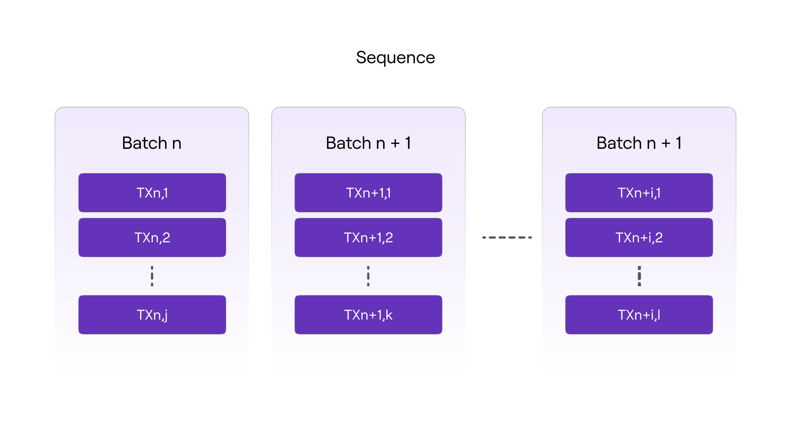
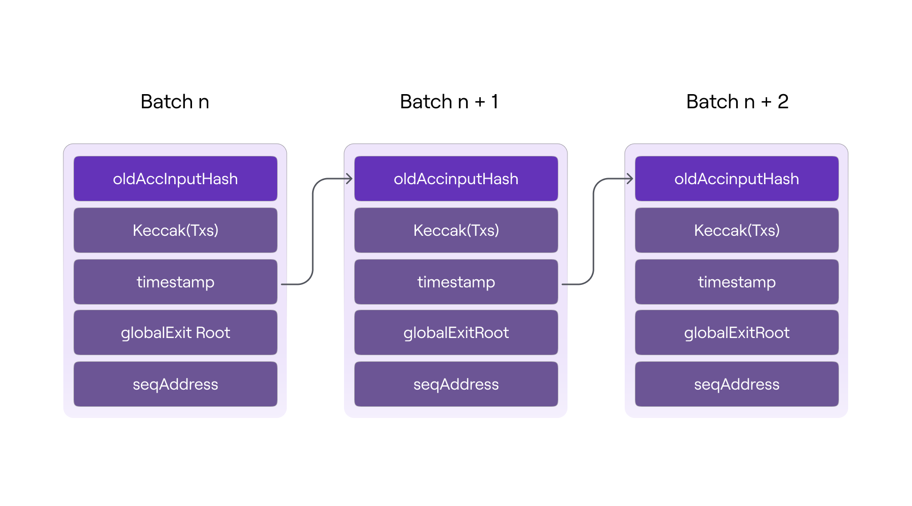

!!!info
    This document is a continuation in the series of articles explaining the [transaction life cycle](transaction-execution.md) inside Polygon zkEVM.

Batches need to be sequenced and validated before they can become a part of the L2 virtual state.

The trusted sequencer successfully adds a batch to a sequence of batches using the L1 `PolygonZkEVM.sol` contract's `sequencedBatches` mapping, which is basically a storage structure that holds the queue of sequences defining the virtual state.

```
// SequenceBatchNum --> SequencedBatchData
mapping(uint64 => SequencedBatchData) public sequencedBatches;
```

Batches must be a part of the array of batches to be sequenced in order to be sequenced. The trusted sequencer invokes the `PolygonZkEVM.sol` contract, which employs its `sequenceBatches` mapping, which accepts an array of batches to be sequenced as an argument. Please see the code snippet provided below.

```
function sequenceBatches ( 
 BatchData[] memory batches
) public ifNotEmergencyState onlyTrustedSequencer
```

The below figure shows the logic structure of a sequence of batches.



## Max & min batch size bounds

The contract's public constant, `MAX_TRANSACTIONS_BYTE_LENGTH`, determines the maximum number of transactions that can be included in a batch (300000).

Similarly, the number of batches in a sequence is limited by the contract's public constant `MAX_VERIFY_BATCHES` (1000). The batches array must contain at least one batch and no more than the value of the constant `MAX_VERIFY_BATCHES`.

Only the trusted sequencer's Ethereum account can access the `sequencedBatches` mapping. It is also necessary that the contract not be in an emergency state.

The function call will be reverted if the above conditions are not met.

## Batch validity & L2 state integrity

The `sequencedBatches` function iterates over every batch of the sequence, checking its validity. A valid batch must meet the following criteria:

- It must include a `globalExitRoot` value that is present in the `GlobalExitRootMap` of the bridge’s L1 `PolygonZkEVMGlobalExitRoot.sol` contract. A batch is valid only if it includes a valid `globalExitRoot`.
- The length of the transactions byte array must be less than the value of `MAX_TRANSACTIONS_BYTE_LENGTH` constant.
- The timestamp of the batch must be greater or equal to that of the last batch sequenced, but less than or equal to the timestamp of the block where the sequencing L1 transaction is executed. All batches must be ordered by time.

If one batch is not valid, the transaction reverts, discarding the entire sequence. Otherwise, if all batches to be sequenced are valid, the sequencing process will continue.

A storage variable called `lastBatchSequenced` is used as a batch counter, and it is thus incremented each time a batch is sequenced. It gives a specific index number to each batch that will be used as a position value in the batch chain.

The same hashing mechanism used in blockchains to link one block to the next is used in batches to ensure the cryptographic integrity of the batch chain. That is, including the previous batch's digest among the data used to compute the next batch's digest.

As a result, the digest of a given batch is an accumulated hash of all previously sequenced batches, hence the name accumulated hash of a batch, denoted by `oldAccInputHash` for the old and `newAccInputHash` for the new.

An accumulated hash of a specific batch has the following structure:

```c++
keccak256 ( 
 abi.encodePacked (
  bytes32 oldAccInputHash, 
  keccak256(bytes transactions), 
  bytes32 globalExitRoot ,
  uint64 timestamp ,
  address seqAddress
 )
)
```

​where,

- `oldAccInputHash` is the accumulated hash of the previous sequenced batch.
- `keccack256(transactions)` is the Keccak digest of the transactions byte array.
- `globalExitRoot` is the root of the bridge’s global exit Merkle tree.
- `timestamp` is the batch timestamp.
- `seqAddress` is address of batch sequencer.



As shown in the diagram above, each accumulated input hash ensures the integrity of the current batch's data (i.e., `transactions`, `timestamp`, and `globalExitRoot`, as well as the order in which they were sequenced.

It is important to note that any change in the batch chain causes all future accumulated input hashes to be incorrect, demonstrating a lack of integrity in the resulting L2 state.

The batch sequence is added to the `sequencedBatches` mapping using the following `SequencedBatchData` struct only after the validity of all batches in a sequence has been verified and the accumulated hash of each batch has been computed.

```
struct SequencedBatchData {
 bytes32 accInputHash;
 uint64 sequencedTimestamp;
 uint64 previousLastBatchSequenced;
}
```

​where,

- `accInputHash` is the batch’s a unique cryptographic finger-print of the last batch in the sequence.
- `sequencedTimestamp` is the timestamp of the block where the sequencing L1 transaction is executed.
- `previousLastBatchSequenced` is the index of the last sequenced batch before the first batch of the current sequence (i.e., the last batch of the previous sequence).

The index number of the last batch in the sequence is used as key and the `SequencedBatchData` struct is used as value when the sequence will be entered into `sequencedBatches` mapping.

## Batch data minimal storage

Since storage operations in L1 are very expensive in terms of gas consumption, it is critical to use it as little as possible. To accomplish this, storage slots (or mapping entries) are used solely to store a sequence commitment.

Each mapping entry commits two batch indices.

- Last batch of the previous sequence as value of `SequencedBatchData` struct.
- Last batch of the current sequence as mapping key.

Along with the accumulated hash of the last batch in the current sequence and a timestamp.

It is important to note that only the accumulated hash of the last batch in the sequence is saved; all others are computed on the fly in order to obtain the last one.

As previously stated, the hash digest will be a commitment of the entire batch chain. Batch indices also commit useful information like the number of batches in the sequence and their position in the batch chain. The timestamp anchors the sequence to a specific point in time.

The data availability of the L2 transactions is guaranteed because the data of each batch can be recovered from the calldata of the sequencing transaction, which is not part of the contract storage but is part of the L1 State.

Finally a `SequenceBatches` event will be emitted.

```solidity
event SequenceBatches (uint64 indexed numBatch)
```

Once the batches are successfully sequenced in L1, all zkEVM nodes can sync their local L2 State by fetching the data directly from L1 `PolygonZkEVM.sol` contract, without having to rely on the Trusted Sequencer alone. This is how the L2 virtual state is reached.
