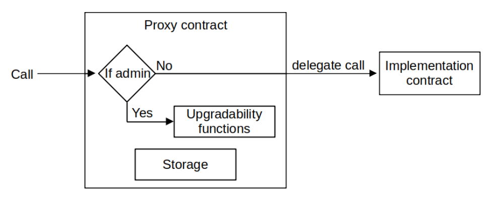

It is inevitable that the current version of the Polygon zkEVM will go through updates and some upgrades, as it gets tested by both the community of Polygon developers and the internal team.

For this reason, and as an effort towards incentivising developers to battle-test the Polygon zkEVM, [bug-bounties](https://immunefi.com/bounty/polygonzkevm/) have been made available.

Since zk-Rollup ecosystems are nascent, it is expected that the frequency of upgrades should decline with time.

In tandem, Polygon intends to move its governance of upgrades from the currently centralized approach to a much more decentralized modus operandi.

These gradual _changes in governance_ will follow Polygon Improvement Proposals (PIPs), as already outlined in Polygon's [Three Pillars of Governance](https://forum.polygon.technology/t/the-three-pillars-of-polygon-governance-call-for-proposals/11847).

Presently, centralization is seen in the form of the _Admin Multisig Contract_ and the [_Security Council Multisig_](security-council.md).

## Deploying battle-tested contracts

To allow for future updates to the zkEVM Protocol implementation (either in the case of adding new features, fixing bugs, or optimizations upgrades), the following contracts are deployed using a **Transparent Upgradeable Proxy (TUP)** pattern:

- **PolygonZkEVM.sol** (Consensus Contract)
- **PolygonZkEVMGlobalExitRoot.sol**
- **PolygonZkEVMBridge.sol**

To inherit security and avoid prolonging and making the audit process more complex, the Polygon zkEVM team has chosen to use the OpenZeppelin’s [openzeppelin-upgrades](https://github.com/OpenZeppelin/openzeppelin-upgrades) library in order to implement this functionality.

!!!info
    Why Use OpenZeppelin Libraries?

    OpenZeppelin is a reputated and well-known brand in the industry because of its audits and open-source libraries of implementations of Ethereum standards, and its **openzeppelin-upgrades** library has been already audited and battle tested.

    Furthermore, **openzeppelin-upgrades** is more than just a set of contracts; it also includes Hardhat and Truffle plugins to help with proxy deployment, upgrades, and administrator rights management.

As shown in the diagram below, Open Zeppelin's TUP pattern separates the protocol implementation of storage variables using delegated calls and the fallback function, allowing the implementation code to be updated without changing the storage state or the contract's public address.

Following OpenZeppelin's recommendations, an instance of the contract **ProxyAdmin.sol**, which is also included in the openzeppelin-upgrades library, is deployed and its address is set as the proxy contract's admin. The Hardhat and Truffle plugins make these operations safe and simple.

Each **ProxyAdmin.sol** instance serves as the actual administrative interface for each proxy, and the administrative account is the owner of each **ProxyAdmin.sol** instance.

The ownership of **ProxyAdmin.sol** was transferred to the Admin role when the zkEVM Protocol was launched.
