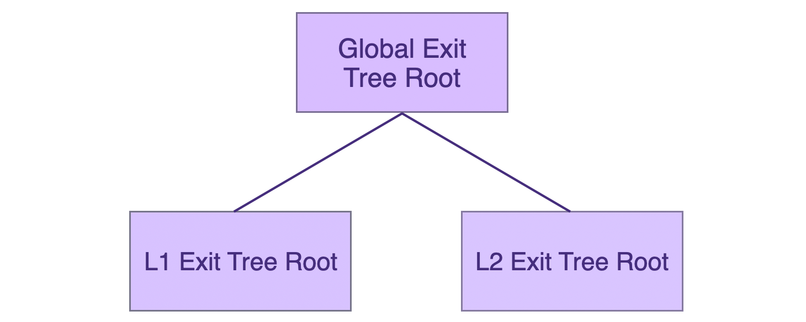
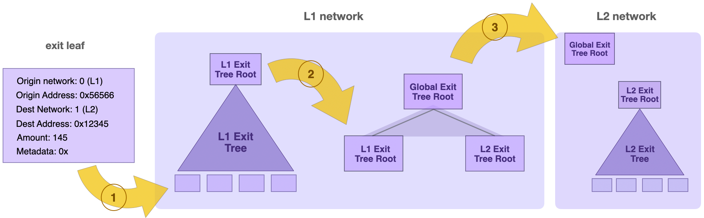

The zkEVM's Bridge SC utilizes a special Merkle Tree called Exit Tree for each of the networks participating in the communication or asset-exchange.

The term Exit Tree refers to an append-only Sparse Merkle Tree (SMT) whose leaf nodes record information about assets being transferred out of the network. Exit Trees of depth 32 are used by Polygon zkEVM.

From now on, a leaf of an exit tree is referred to as a exit leaf. Exit leaves are classified into two types: type 0 for recording asset(s) information and type 1 for recording messaging information.

An exit leaf, in particular, is a Keccak256 hash of the ABI encoded packed structure with the following parameters:

- uint8 leafType: [0] asset, [1] message
- int32 originNetwork: Origin network ID, where the original asset belongs
- address originAddress: If `leafType = 0`, Origin network token address (`0x0000...0000`) is reserved for ether. If `leafType = 1`, `msg.sender` of the message
- uint32 destinationNetwork: Bridging destination network ID
- address destinationAddress: Address that will receive the bridged asset in the destination network
- uint256 amount: Amount of tokens/ether to bridge
- bytes32 metadataHash: Hash of the metadata, metadata will contain information about asset transferred or the message payload

When a user commits to transferring assets from one network to another, the Bridge SC must add an exit leaf to that network's Exit Tree.

The Merkle root of an Exit Tree is known as the Exit Tree Root, and it is the fingerprint of all the information recorded in the Exit Tree's leaf nodes.

As a result, given any network Exit Tree, whether L1 or L2, its Exit Tree Root is the source of state truth for that network.

## Global Exit Tree

Consider a scenario of bridging assets between the L1 Mainnet and L2 network. The Global Exit Tree is a binary Merkle Tree whose leaf nodes are the L1 Exit Tree's Merkle root and the L2 Exit Tree's Merkle root. A Global Exit Tree is depicted in the figure below.



The Merkle root of the Global Exit Tree is called the Global Exit Root.

It should be noted that whenever an exit leaf is added to the L1 or L2 Exit Tree, a new corresponding Exit Tree Root is computed. Following that, the Global Exit Tree is updated with the new L1 or L2 Exit Tree Root. This means that the Global Exit Root always represents the state of both networks at any given time.

Because the Merkle root of the L1 Exit Tree holds the L1 network's state truth and the Merkle root of the L2 Exit Tree also holds the L2 network's state truth, it follows that the most recent Global Exit Root holds the state truth of both the L1 and L2 networks.

Once the Global Exit Root has been synced between networks L1 and L2, users can use a Merkle proof to demonstrate correct exit leaf inclusion and claim transferred assets.

That is how a full asset transfer or cross-chain messaging is accomplished; it begins with the Bridge function in the origin network and ends with the Claim function in the destination network, with Exit Tree Roots carrying the state truth on both ends.

## Asset transfer scenarios

In this subsection we provide two scenarios to demonstrate the role of Exit Trees and the Global Exit Tree during the asset transfer process.

### Transfer from L1 to rollup L2

Consider a scenario where a user wants to transfer assets from the L1 Mainnet to the L2 Rollup.

Once the user commits to a transfer, a new exit leaf with the information of the assets being bridged is appended to the L1 Exit Tree. The transfer data typically looks like this:

```
Origin network: 0 (L1)
Origin address: 0x56566... 
Dest Network: 1 (L2)
Dest Address: 0x12345...
Amount: 145
Metadata: 0x0...
```

The added new exit leaf means the L1 Exit Tree now has a new root. The new L1 Exit Tree Root is then appended to the Global Exit Tree, and thus the root of the Global Exit Tree is updated.

In order to claim the bridged assets on the destination L2 network, the Global Exit Root gets checked with a Merkle proof. That is, one can use a Merkle proof to check if indeed there exists an exit leaf (with the information of assets being bridged to L2) represented in the Global Exit Tree by the corresponding L1 Exit Tree Root.



### Transfer from rollup L2 to L1

It is possible for the transfer to go from an L2 Rollup to the Mainnet L1. In this case the same procedure as in the above example is followed, except in the reverse direction.

That is, once a user commits to a transfer, an exit leaf is added to the L2 Exit Tree with corresponding transfer information. The transfer data in this case looks as follows:

```
Origin network: 3 (L2)
Origin address: 0x34655... 
Dest Network: 0 (L1)
Dest Address: 0x27564...
Amount: 92
Metadata: 0x116...
```

The newly added L2 exit leaf means the L2 Exit Tree has a new root. The new L2 Exit Tree Root is then appended to the Global Exit Tree, and thus the root of the Global Exit Tree is updated.
