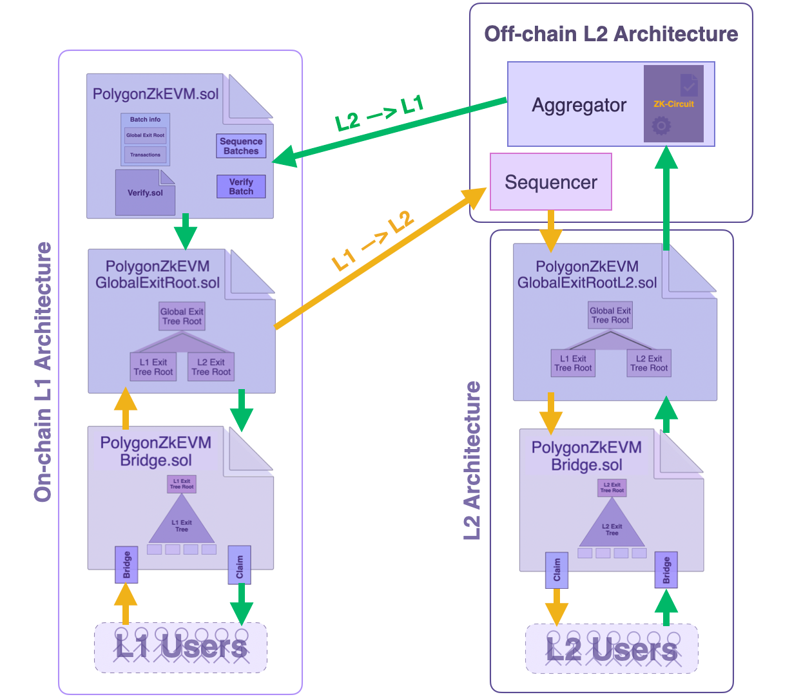

## Asset flow from L1 &rarr; L2

Suppose a user wants to bridge some assets from the L1 Mainnet to L2 (here, Polygon zkEVM).

1. The `Bridge` function of the zkEVM Bridge SC `PolygonZkEVMBridge.sol` on the L1 network is invoked. If the **Bridge request** is valid, the Bridge SC appends an exit leaf to the L1 Exit Tree and computes the new L1 Exit Tree Root.

2. The Global Exit Root Manager (`PolygonZkEVMGlobalExitRoot.sol`) appends the new L1 Exit Tree Root to the Global Exit Tree and computes the Global Exit Root.

3. The Sequencer fetches the latest Global Exit Root from the Global Exit Root Manager.

4. At the start of the transaction batch, the Sequencer stores the Global Exit Root in special storage slots of the L2 Global Exit Root Manager SC (PolygonZkEVMGlobalExitRootL2.sol), allowing L2 users to access it.

5. In order to complete the bridging process, the user calls the `Claim` function of the Bridge SC and provides a Merkle proof to the fact that the correct exit leaf was included and represented in the Global Exit Root.

6. The Bridge SC obtains the L2 Global Exit Root Manager SC's Global Exit Root and validates the user's Merkle proof of inclusion. If the Merkle proof is valid, the bridging process succeeds; otherwise, the transaction fails.

## Asset flow from L2 &rarr; L1

Consider now the case where a user commits to bridging some assets from L2 to L1 Mainnet.

1. The user calls the `Bridge` function of the zkevM Bridge SC (`PolygonZkEVMBridge.sol`) on Layer 2. If the **Bridge request** is valid, the Bridge SC appends an exit leaf to the L2 Exit Tree and computes the new L2 Exit Tree Root.

2. The L2 Global Exit Root Manager (`PolygonZkEVMGlobalExitRootL2.sol`) is called to append the new L2 Exit Tree Root to the Global Exit Tree and compute the Global Exit Root.

!!!info
    Note that there is an intermediate step which, for the sake of simplicity, is not depicted in the below figure. And that step is: **The user's bridging transaction gets included in one of batches selected and sequenced by the Sequencer**.

3. The Aggregator generates a ZK-proof attesting to the computational integrity in the execution of sequenced batches (where one of these batches includes the user's bridging transaction).

4. For verification purposes, the Aggregator sends the ZK-proof together with all relevant batch information that led to the new L2 Exit Tree Root (computed in step 2 above), to the Consensus Contract (`PolygonZkEVM.sol`).

5. The Consensus Contract utilizes the `verifyBatches` function to verify validity of the received ZK-proof. If valid, the Consensus Contract sends the new L2 Exit Tree Root to the Global Exit Root Manager SC (`PolygonZkEVMGlobalExitRoot.sol`) in order to update the Global Exit Tree.

6. In order to complete the bridging process on the L1 network, the user calls the `Claim` function of the Bridge SC, and provides a Merkle proof of the fact that the correct exit leaf was included in the compution of Global Exit Root.

7. The Bridge SC retrieves the Global Exit Root from the L1 Global Exit Root Manager SC and verifies validity of the Merkle proof. If the Merkle proof is valid, the Bridge SC successfully completes the bridging process. Otherwise, the transaction is reverted.

!!!info
    Please note that the architecture shown in below figure is rather simplistic. It focuses on depicting the relationship between the various Bridge elements.

    For example, the interaction between the Consensus Contract and the Sequencer is omitted in the figure.

    For a more wholistic view of the interaction between the Consensus Contract and the Sequencer, the reader is referred to earlier subsections of this documentation, specifically on the consensus contract.

