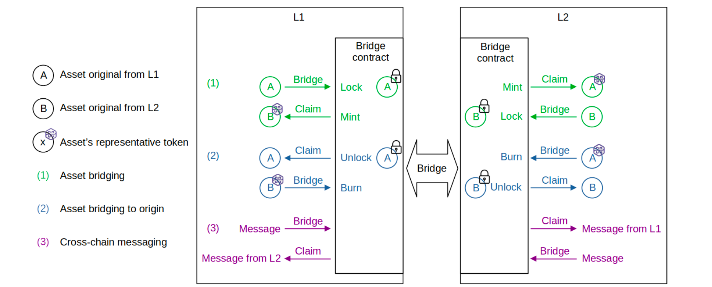

The ability of any blockchain to exchange data with other blockchains is critical, as it allows the blockchain to participate in an ecosystem of other blockchains; this is known as **interoperability**. Many interoperability-enabling solutions have been developed, each with their own set of advantages and disadvantages.

The Polygon team has created an interoperability solution in the form of a bridge for the Polygon zkEVM L2 network. The zkEVM Bridge is a component that enables communication and asset migration between the Polygon zkEVM network and other networks, such as the L1 (Ethereum Mainnet) or any L2 built on top of Ethereum.

The ability to transfer an asset from one network to another without changing the original asset's value or functionality is critical from the user's perspective. In addition, cross-chain messaging is supported, allowing payloads to be sent between networks.

In L2 rollups such as the Polygon zkEVM, L1 smart contracts ensure proper management of L2 state transitions and data availability. As a result, with an appropriate L2 architecture design, both ends of the Bridge smart contract (SC) can be synchronized entirely through the smart contract's logic.

## zkEVM bridge schema

Let's understand the zKEVM Bridge protocol design through an analogy. Make sure to check out the below illustration for easier understanding of the protocol.

Consider two networks; L1 and L2. In order **to bridge an asset between L1 and L2, a user has to lock the asset in the origin network (or Layer 1)**. The **Bridge smart contract then mints an equivalent value representative asset in the destination network L2**. This minted asset is known as a **Wrapped Token**.

Once minting is complete, **the asset can be claimed by the user or recipient in the destination network (L2)**.

It is also possible to perform the opposite operation. That is, after burning the Wrapped Token, the Bridge SC unlocks the original asset in the origin network.

As previously stated, there is the possibility of a third channel where the Bridge SC is used for cross-chain messaging. That is, sending data payloads from one network to another can be achieved using the Bridge SC's **Bridge** and **Claim** operations.

## Comparing with Ethereum 2.0 Deposit Contract

The zkEVM Bridge SC's implementation is based on the Ethereum 2.0 Deposit Contract, except for a **few alterations**.

For example, while **it utilizes specially designed Merkle Trees that are append-only**, it employs the same logic as the Ethereum 2.0 Deposit Contract.

Other differences are related to the base hash and the leaf nodes.

First, the **Deposit Contract uses SHA256, whereas the zkEVM employs the Keccak hash function**. And it's all because, in addition to being EVM-compatible, the Keccak hash function is less expensive in terms of Ethereum gas fees.

Second, the **Bridge SC generates wrapped tokens the first time a new token is added to the zkEVM network**. In addition, the **metadata of the ERC20 token, such as the name, decimal, or symbol, is added to the information contained in the leaf**.

As a result, as stated in this document, every transfer is protected by smart contracts.

## Features

The Polygon zkEVM Bridge smart contract's main feature is the use of Exit Trees and the Global Exit Tree, with the Global Exit Tree Root serving as the primary source of state truth.

The use of two distinct Global Exit Root managers for L1 and L2, as well as separate logic for the Bridge SC and each of these Global Exit Root managers, allows for extensive network interoperability.

Meanwhile, all asset transfers can be validated by any L1 and L2 nodes due to data availability.

The sections that follow explain how the Polygon zkEVM Bridge-related smart contracts ensure the security of assets transferred between the zkEVM and any network.
