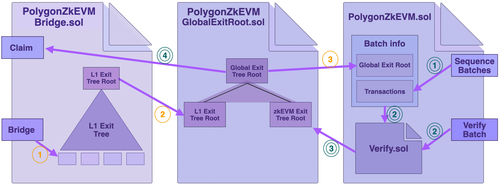
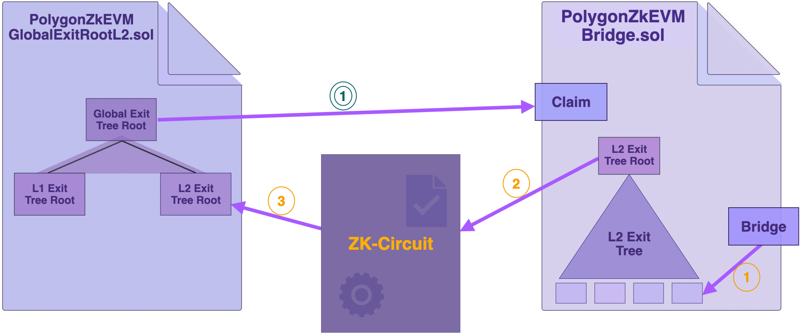

This section describes how asset transfers are enabled by three smart contracts; the Bridge SC (PolygonZkEVMBridge.sol), the Global Exit Root Manager (PolygonZkEVMGlobalExitRoot.sol), and the Consensus Contract (PolygonZkEVM.sol).

## Bridge smart contract

The zkEVM Bridge Smart Contract (PolygonZkEVMBridge.sol) carries out two functions; the Bridge (or deposit) and the Claim (or withdrawal) functions. It enables bridging of assets from one network to another, as well as claiming assets received in the destination network.

As explained in the [Exit Tree](exit-tree.md) document, once a user initiates and commits to a transfer of assets from a network L2 to L1, the zkEVM Bridge SC adds an exit leaf to the L2 Exit Tree. The corresponding transfer data is contained in such an exit leaf. Following that, the L2 Exit Tree's root is updated and made available to the next smart contract in the workflow i.e., the Global Exit Root Manager SC.

## Global Exit Root manager contract

The Global Exit Root Manager SC (PolygonZkEVMGlobalExitRoot.sol) manages the Global Exit Tree Root. It is in charge of updating the Global Exit Tree Root and acts as a repository for the Global Exit Tree's history.

The logic of the zkEVM Bridge SC has been separated from that of the Global Exit Root Manager SC in order to achieve improved interoperability.

This means that the zkEVM Bridge SC, in conjunction with the Global Exit Root Manager SC, can be installed in any network to achieve the same results.

!!!info
    There are two Global Exit Root manager SCs: one deployed in L1, while the other is deployed in L2.

    Their Solidity code files are; [PolygonZkEVMGlobalExitRoot.sol](https://github.com/0xPolygonHermez/zkevm-contracts/blob/main/contracts/PolygonZkEVMGlobalExitRoot.sol), and [PolygonZkEVMGlobalExitRootL2.sol](https://github.com/0xPolygonHermez/zkevm-contracts/blob/main/contracts/PolygonZkEVMGlobalExitRootL2.sol), respectively.

## Consensus contract

The [PolygonZkEVM.sol](https://github.com/0xPolygonHermez/zkevm-contracts/blob/main/contracts/PolygonZkEVM.sol) Smart Contract is the consensus algorithm used in Polygon zkEVM.

The `PolygonZkEVM.sol` SC is located in L1 to help with batch verification. Once batches of transactions have been sequenced, a request is made to an Aggregator to prove the validity of the sequenced batches. The proof, which is a zero-knowledge proof, is verified using the `Verifier.sol` contract.

Following the verification of the ZK-proof, the Consensus Contract sends the zkEVM Exit Tree Root to the Global Exit Root Manager SC `PolygonZkEVMGlobalExitRoot.sol` SC for updating the Global Exit Root.

## zkEVM smart contract interactions

The below diagram shows the interactions of the three Bridge-related smart contracts when assets are bridged, as well as when assets are claimed. The interaction of the smart contracts is described in the following subsections.

### L1 &rarr; zkEVM transfer

1. Whenever a user commits to transferring assets, the Bridge SC `PolygonZkEVMBridge.sol` uses the `Bridge` method to append the corresponding exit leaf to the L1 Exit Tree.

2. The updated root of the L1 Exit Tree is sent to the Global Exit Root Manager `PolygonZkEVMGlobalExitRoot.sol` for an update of the Global Exit Root.

3. The Consensus Contract `PolygonZkEVM.sol` retrieves the updated Global Exit Root from the Global Exit Root Manager, which is used for syncing with the zkEVM as the destination network for the bridged assets.

The transfer from L1 to zkEVM is completed with the `Claim` method of the Bridge SC, but this time in the zkEVM side.

### zkEVM &rarr; L1 transfer

Now the reverse process, while focusing only at the L1 smart contracts.

1. The Consensus Contract uses the `SequenceBatches` function to sequence batches, which include among other transactions the asset transfer information.

2. A special smart contract called `Verify.sol` calls the `VerifyBatches` function and takes Batch Info as input. As part of the Consensus process, but not shown in the above figure, the Aggregator produces a validity proof for the sequenced batches. And this proof is automatically verified in this step.

3. The zkEVM Exit Tree gets updated only after a successful verification of sequenced batches (again, for the sake of simplicity, this is not reflected in the above figure). The Consensus Contract (`PolygonZkEVM.sol`) sends the updated zkEVM Exit Root to the Global Exit Root Manager, which subsequently updates the Global Exit Root.

4. The zkEVM Bridge SC (`PolygonZkEVMBridge.sol`) then retrieves the updated Global Exit Root and uses the `Claim` function to complete the transfer.

## Smart contracts in L2

The focus in this subsection is on the bridge-related smart contracts used in Layer 2, specifically in the zkEVM.

The Bridge SC (`PolygonZkEVMBridge.sol`) in L2 is the same smart contract deployed on Layer 1 (here, Ethereum Mainnet).

But the L2 Global Exit Root Manager SC is different, and it appears in code as `PolygonZkEVMGlobalExitRootL2.sol`. This is a special contract that allows synchronization of L2 Exit Tree Root and the Global Exit Root.

The L2 Global Exit Root Manager has storage slots to store the Global Exit Root and the L2 Exit Tree Root. In order to correctly ensure validity of the synchronization between the Global Exit Tree and L2 Exit Tree, these storage slots are directly accessible to the low-level ZK-proof-generating circuit.

### Interaction among smart contracts in L2

Here is the step-by-step process.

1. When a batch of transactions is processed, the zkEVM Bridge SC ('PolygonZkEVMBridge.sol') appends an exit leaf with the batch information to the L2 Exit Tree and updates the L2 Exit Tree Root.

2. The Bridge SC communicates the L2 Exit Tree Root to the L2 Global Exit Root Manager. The L2 Global Exit Root Manager, however, does not update the Global Exit Tree at this stage.

3. For proving and verification, the ZK-proof-generating circuit obtains the L2 Exit Tree Root from the L2 Global Exit Root Manager.

4. Only after the batch has been successfully proved and verified does the L2 Global Exit Root Manager append the L2 Exit Tree Root to the Global Exit Tree. As a result, the Global Exit Root is updated.

The ZK-proof-generating circuit also writes the L2 Exit Tree Root to the Mainnet. The zkEVM Bridge SC deployed on L1 can then finalize the transfer by using the `Claim` function.

