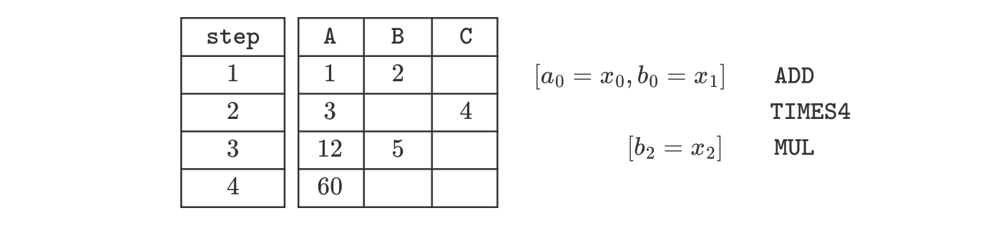

The **zkEVM prover** is a software component with which the zkEVM generates proofs that attest to correct execution of programs given a specific set of inputs.

While the process of generating a proof is resource-intensive, the time required to verify the proof is significantly shorter, enabling verification to be carried out by a smart contract.

On a high level, the prover takes the last batch and the current state as inputs in order to calculate the new state, together with a proof that attests to the computational integrity of the state transition.

The figure below depicts a typical state transition $\big(S_{i}^{L2_x} \to S_{i+1}^{L2_x}\big)$,

- Taking as inputs, a batch $\mathtt{Batch}_i$ and the current L2 state $S_{i}^{L2_x}$.
- And the output as a new L2 state $S_{i+1}^{L2_x}$, together with a proof $\pi_{i+1}$.

The initial step to produce a proof involves creation of an **execution matrix**, which is a matrix that records all intermediate computations constituting a larger computation. Such a matrix is also called an **execution trace**.

This larger computation can be thought of as the _state transition function_, while the smaller intermediate computations are like the zkEVM instructions or opcodes.

As we will later on see, it may take one or more zkEVM opcodes to implement a single EVM opcode.

This indicates the lack of a strict one-to-one correspondence between EVM opcodes and the Polygon zkEVM's.

## Typical execution matrix

Unless otherwise stated, we use a matrix with three columns; $\texttt{A}$, $\texttt{B}$ and $\texttt{C}$.

Furthermore, suppose the number of rows is bounded by some constant $N$, which we will call **length** of the execution trace.

The columns of an execution trace are often called **registers**. So, the terms "column" and "register" are used interchangeably in this document.

We depict an execution trace of length $N$, having three registers $\texttt{A}$, $\texttt{B}$ and $\texttt{C}$, in the figure below.

$$
\begin{aligned}
	\begin{array}{|c|c|c|c|c|}\hline
		\bf{\texttt{ A }} & \bf{\texttt{ B }} & \bf{\texttt{ C }}\\ \hline
		a_0 & b_0 & c_0 \\ \hline
		a_1 & b_1 & c_1 \\ \hline
		\dots & \dots & \dots \\ \hline
		a_N & b_N & c_N \\ \hline
	\end{array}
\end{aligned}
$$

## A toy example (Execution matrix)

Suppose we are given a set of three input values, $x := (x_0, x_1, x_2)$, and we want to use an execution trace to model the following computation:

$$
[(x_0 +x_1)·4]·x_2
$$

Let us also suppose that the only available instructions (or operations) are those described below:

1. Copy inputs into cells of the execution trace.

2. $\texttt{ADD}$ instruction: Add two values in cells on the same row, and leave the result in the first cell of the next row.

3. $\texttt{TIMES4}$ instruction: Multiply a given value by a constant, and leave the result in the first cell of the next row.

4. $\texttt{MUL}$ instruction: Multiply two values in cells on the same row, and leave the result in the first cell of the next row.

Let’s provide a specific example by setting the input $x$ to $x := (1, 2, 5)$.

Substituting the input values in the given computation yields:

$$
[(x0 +x1)·4]·x2 =[(1+2)·4]·5=60
$$

The corresponding execution trace, using only the above-mentioned operations, is as follows:

Let’s take a step-by-step walk-through the above execution trace:

1. First of all, we use the instruction that copies the inputs $1$ and $2$ into the columns $\texttt{A}$ and $\texttt{B}$, respectively. And then invoke the $\texttt{ADD}$ instruction.
2. After executing the $\texttt{ADD}$ instruction, the second row of register $\texttt{A}$ now holds the sum of $1$ and $2$, that is the value $3$. At this point we utilize the $\texttt{TIMES4}$ instruction to obtain $3 \cdot 4 = 12$, and place it in the first cell of row 3.
3. Now, with $12$ in the third row of register $\texttt{A}$, we proceed to copy the third input, $5$, into register $\texttt{B}$. Then the $\texttt{MUL}$ instruction is invoked to multiply the current two values in row 3. (viz. $12$ and $5$). The resulting outcome (which is $60$) of the $\texttt{MUL}$ instruction is placed in the first cell of row 4.
4. Consequently, this last outcome $60$ is in fact the final output for the entire computation.

Observe that we have only used the available instructions as proposed in our scenario.

Notice that, for a specific computation and except for the entries in the matrix, the shape of the execution matrix remains the same irrespective of the variable input values $x = (x_0, x_1, x_2)$.

For example, if $x = (5, 3, 2)$ for the same program, the resulting execution matrix is as follows:

However, if we examine the columns in the above execution trace, we can identify two distinct types of columns:

- **Witness columns**: Values in these columns depend on the input values. They change whenever different input values are used. In the above example, columns $\texttt{A}$ and $\texttt{B}$ are witness columns.
- **Fixed columns**: Values in these columns remain unaffected by changes in the input values. In the above example, column $\texttt{C}$ is a fixed column, and it is only used to store the constant $4$.

In each case of the above example, the constant $4$ is used in the second step of the computation, when the $\texttt{TIMES4}$ instruction is invoked.
