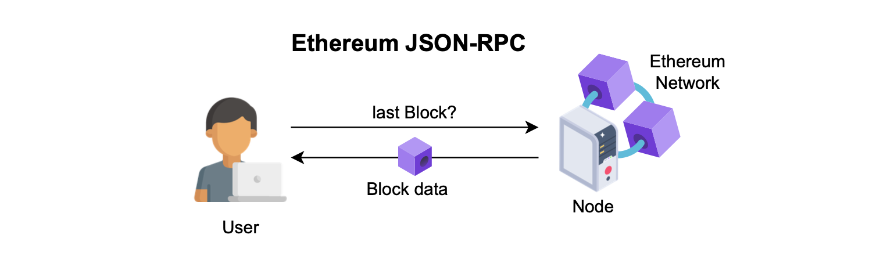
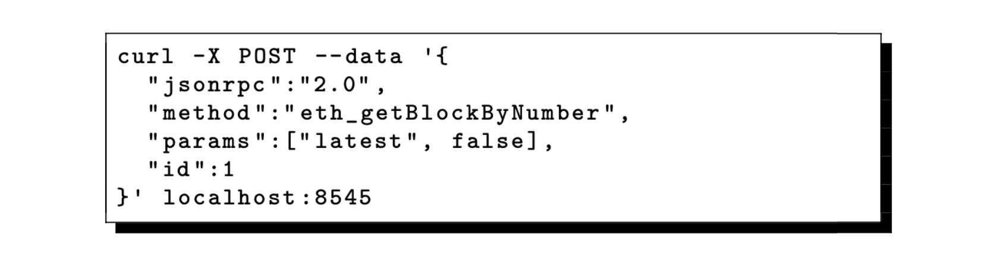
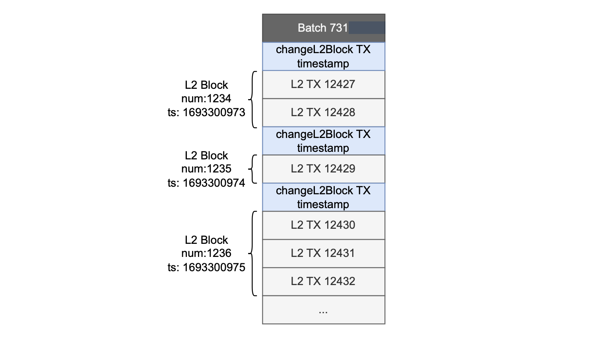
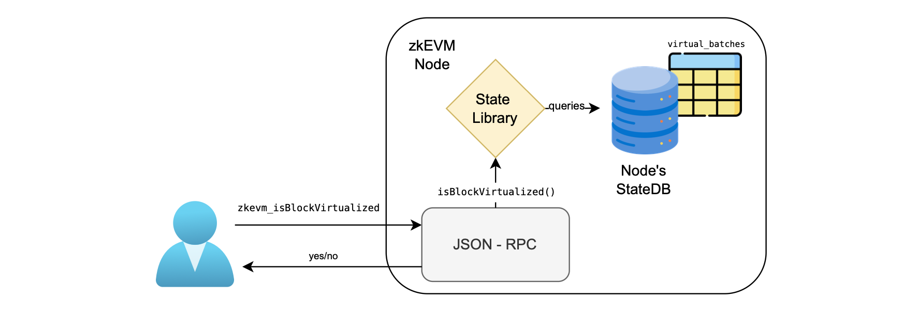
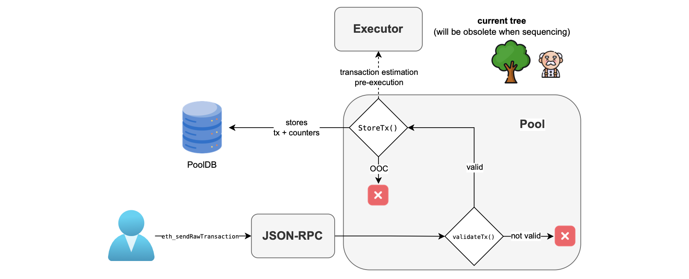
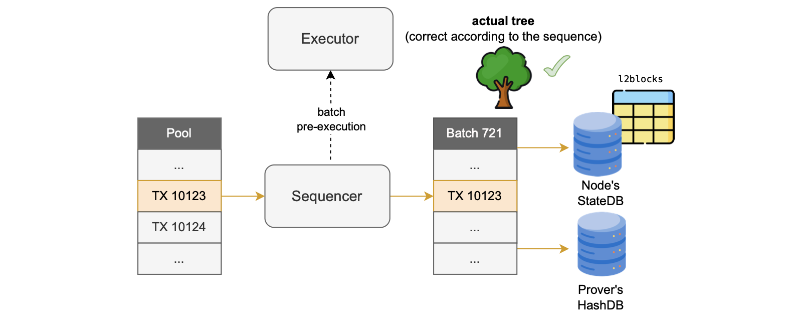
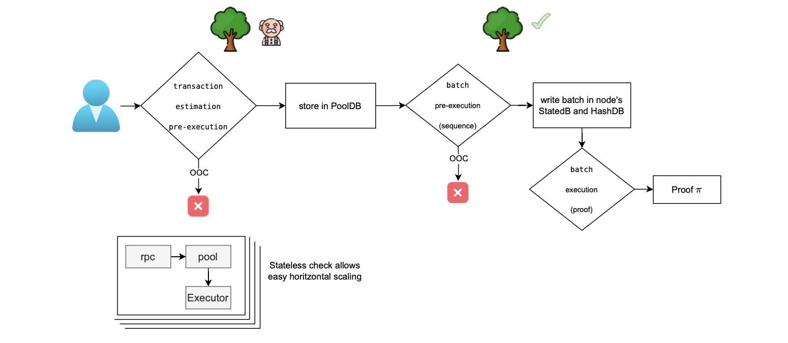

This document describes the interaction of users with the Polygon zkEVM network through a component known as zkEVM JSON-RPC.

It provides,

- An overview of how L2 blocks are generated.
- A detailed explanation of how transactions sent through JSON-RPC are processed, including their validation before being stored in the PoolDB.

The main components involved in this process are the JSON-RPC, PoolDB, sequencer, executor, prover, HashDB, and Node StateDB.

## zkEVM JSON-RPC

The Ethereum JSON-RPC is a standardized collection of methods used by all Ethereum nodes, acting as the main interface for users to interact with the network.

The zkEVM JSON-RPC is an interface compatible with the Ethereum JSON-RPC for any layer 2 system.

It implements the same endpoints as the Ethereum JSON-RPC, and similarly receives queries and provides answers to users. 

The figure below illustrates a user's Ethereum JSON-RPC query to obtain information on the latest forged block.

The user’s retrieved data comprises all information related to the block, including its transactions.

Although the zkEVM JSON-RPC incorporates all Ethereum JSON-RPC methods, some of its answers to queries are only relevant to the zkEVM context.

The user can request for the latest block as shown below:

The zkEVM JSON-RPC not only includes methods from the Ethereum JSON-RPC, but it also offers additional methods to handle zkEVM-specific functionalities. 

The complete list of available endpoints and their current implementation status can be obtained in the [json-rpc-endpoints.md](https://github.com/0xPolygonHermez/zkevm-node/blob/develop/docs/json-rpc-endpoints.md).

The API specification for the zkEVM endpoints, which follows the OpenRPC standard, is available in the [endpoints_zkevm.openrpc.json](https://github.com/0xPolygonHermez/zkevm-node/blob/develop/jsonrpc/endpoints_zkevm.openrpc.json) file.

Ethereum JSON-RPC responds with the most recently created L1 block when requesting the last block. 

zkEVM batches transition through various states: trusted, virtual, and consolidated.

Next, we explore the expected format of data in the zkEVM JSON-RPC's responses to queries for the latest L2 block.

## L2 blocks and batches

In general, it is important to establish a clear distinction between batches and blocks.

Within the zkEVM framework, an L2 batch represents the minimal data unit for which a proof is generated. 

On the other hand, an L2 block is the data form returned to users through the RPC, and each block belongs to some L2 batch.

L2 blocks, similar to their associated batches, go through all three zkEVM states: trusted, virtual, and consolidated.

And, from the user’s perspective, the visible entity is the L2 block.

The primary consideration when defining an L2 block is to minimize any delay in batch processing.

Based on this premise, L2 users can decide on their acceptable latency by choosing among the three L2 states: trusted, virtual, or consolidated.

Clearly, settling for L2 blocks while their associated batches are in the trusted state provides minimal latency and thus the best choice.

The delay in this case is simply the $\mathtt{close\_a\_batch\_time}$.

Therefore, to ensure reduced delay, we must generate at least one L2 block completely before its associated batch is closed.

### Dragonfruit upgrade (ForkID 5)

Generating L2 blocks means incorporating transactions as soon as they are ordered. 

That is, a transaction is included in a block once it is established that it will form part of a batch at a specific location.

And of course, the fastest scenario is to create an L2 block that consists of only one ordered L2 transaction.

This minimizes the delay because each ordered transaction is processed immediately, and without the need to wait for additional transactions before the block is closed.

The delay that occurs with each block generation is equivalent and referred to as the $\mathtt{order\_a\_transaction\_time}$.

All Polygon zkEVM versions up to the Dragonfruit upgrade (which is the ForkID 5) adopted Optimism's approach to block definition: One L2 block consisting of only one L2 transaction.

The formation of a block therefore occurs when the sequencer decides to include a transaction in a batch, that is in the trusted state.

Consequently, every batch contains as many blocks as transactions.

Also, batch data includes only one timestamp which is shared across all the blocks within the batch.

The figure below illustrates the batch structure.

### Etrog upgrade (ForkID 6)

The implementation approach of the Dragonfruit upgrade and prior zkEVM versions assigns one ordered transaction to a block, reducing delay to a minimum threshold of the $\mathtt{order\_a\_transaction\_time}$.

The Dragonfruit upgrade approach has some drawbacks:

- Bloated databases: Since there are as many blocks as there are transactions in each batch, it results in a significant amount of data in the database.
- Incompatibility with dApps: It cannot offer a method for assigning a unique timestamp to each block within a batch, causing breaks in Dapps that rely on this parameter to determine the timing of actions performed by smart contracts.

The Etrog upgrade (which is ForkID 6) addresses these two issues.

That is, each L2 block consists of one or more transactions, and each block has its own unique timestamp.

With this implementation approach, the sequencer needs to ensure that block construction has a shorter timeout than the batch generation.

The sequencer can modify the timestamp of the various blocks in a batch by utilizing a specific transaction as a marker, dubbed `changeL2Block`. 

This transaction is included in the batch to indicate a change from one block to the next, is responsible for modifying the timestamp and the L2 block number.

The figure below depicts the structure of the Etrog upgrade's batches.

Read the [Etrog upgrade document](../protocol/etrog-upgrade.md) for further details and how it differs from the Dragonfruit upgrade.

## Custom zkEVM endpoints

When a user requests information from the JSON-RPC regarding the latest block, the response shows the most recent L2 block.

The L2 block contains the most recent transactions approved by the trusted sequencer.

The information is retrieved with the same RPC call as in Ethereum.

Users are less concerned with the transaction being in a block, and more with when the newly generated batch results in a state transition.

The zkEVM protocol has additional endpoints for retrieving various information pertaining to the state of the L2 block.

For example, the user may query whether a block is in the virtual state or not by using a specific endpoint as shown in the figure below.

Here is a list of custom zkEVM endpoints, each accompanied by a brief description:

- $\mathtt{zkevm\_consolidatedBlockNumber}$: Returns the latest block number within the last verified batch.

- $\mathtt{zkevm\_isBlockVirtualized}$: Returns `true` if the provided block number is in a virtualized batch.

- $\mathtt{zkevm\_isBlockConsolidated}$: Returns `true` if the provided block number is in a consolidated batch.

- $\mathtt{zkevm\_batchNumber}$: Returns the latest batch number.

- $\mathtt{zkevm\_virtualBatchNumber}$: Returns the batch number of the latest virtual batch.

- $\mathtt{zkevm\_verifiedBatchNumber}$: Returns the batch number of the latest verified batch.

- $\mathtt{zkevm\_batchNumberByBlockNumber}$: Returns the batch number of the batch containing the given block.

- $\mathtt{zkevm\_getBatchByNumber}$: Fetches the available info for a batch based on the specified batch number.

## Sending raw transactions

To submit a transaction to the PoolDB, a user invokes the $\mathtt{eth\_sendRawTransaction}$ endpoint.

When an L2 transaction is received, the JSON-RPC node sends it to the pool component.

The pool component is, among other things, responsible for adding transactions into the PoolDB.

It therefore conducts initial validations on transactions.

If any of these validations fail, an error is sent to the JSON-RPC component, which then forwards it to the user.

For valid transactions, the pool conducts pre-execution in which it estimates transaction costs by using the current state root, which may be different when the transaction is ultimately ordered.

As illustrated in the figure below, validation is the first step that takes place in the pool, invoking the `validateTx()` function.

The figure below depicts the submission process.

The `validateTx()` function performs the following preliminary checks:

1. The transaction IP address has a valid format.

2. The transaction fields are properly signed (in both current and pre-EIP-155). EIP-155 states that we must include the `chainID` in the hash of the data to be signed (which is an anti-replay attack protection).

3. The transaction’s `chainID` is the same as the pool’s `chainID` (which is the `chainID` of the L2 Network) whenever `chainID` is not zero.

4. The transaction string has an encoding that is accepted by the zkEVM. (See the [next subsection](./json-rpc-to-proof.md#zkevm-customized-transaction-encoding) for more details on this encoding.)
5. The transaction sender’s address can be correctly retrieved from the transaction, using the `ecRecover` algorithm.

6. The transaction size is not too large (more specifically, larger than 100132 bytes), to prevent DoS attacks.

7. The transaction’s value is not negative (which can be the case since we are passing parameters over an API).

8. The transaction sender’s address is not blacklisted. That is, it is not blocked by the zkEVM network.

9. The transaction preserves the nonce ordering of the account.

10. The transaction sender account has not exceeded the allowed maximum number of transactions per user to be contained in the pool.

11. The pool is not full (currently, the maximum number of elements in the queue of pending transactions is 1024).

12. The gas price is not lower than the set _minimum gas price_. This is explained in more detail in the [Effective gas price section](../effective-gas/index.md).

13. The transaction sender account has enough funds to cover the costs
    
    $$
    \mathtt{value} + \mathtt{GasPrice} \cdot \mathtt{GasLimit}
    $$

14. The computed _intrinsic gas_ is greater than the provided gas. The _intrinsic gas_ of a transaction measures the required gas in terms of the amount of transactional data plus the starting gas for the raw transaction which is currently of $21000$, or $53000$ in the case of a contract creation transaction.

15. The current transaction `GasPrice` is higher than the other transactions in the PoolDB with the same nonce and `from` address. This is because a transaction cannot be replaced with another with lower `GasPrice`.

16. The sizes of the transaction’s fields are compatible with the Executor needs. More specifically:

    - Data size: 30000 bytes.
    - GasLimit, GasPrice and Value: 256 bits.
    - Nonce and chainID: 64 bits.
    - To: 160 bits.

### zkEVM customized transaction encoding

As mentioned in the fourth item of the above list of validation checks, this subsection pertains to the zkEVM's custom encoding of transactions using the $\texttt{validateTx()}$ function.

Currently, the zkEVM only supports non-typed transactions.

You can refer to standard [transaction encodings in Ethereum](https://ethereum.org/en/developers/docs/transactions/) for further information.

The $\texttt{to-be-signed-hash}$ remains consistent with pre-EIP155 and EIP155 transactions, resulting in the respective signatures for these transactions:

$$
\begin{aligned}
&\texttt{to-be-signed-hash}_{\texttt{pre-EIP155}} = \mathtt{keccak(rlp(nonce,gasPrice,startGas,to,value,data))}\\
&\texttt{to-be-signed-hash}_{\texttt{EIP155}}  = \texttt{keccak(rlp(nonce,gasPrice,startGas,to,value,data,chainID,0,0))}\\
\end{aligned}
$$

The transaction string used for L2 transactions included in the batches is a slightly modified version of the regular transaction string. 

The reason for this is to streamline the proving system’s processing of L2 transactions.

#### Analyzing typical transactions

Let’s analyze how an EIP-155 transaction is handled in a chain with $\texttt{chainID = 1101}$ and $\texttt{parity = 1}$. 

Typically, the following transaction string is received:

$$
\texttt{rlp(nonce,gasPrice,startGas,to,value,data,r,s,v = 2238)}
$$

To check the signature, the received string is rlp-decoded in order to extract the $\texttt{nonce}$, $\texttt{gaspPrice}$, $\texttt{startGas}$, $\texttt{to}$, $\texttt{value}$, $\texttt{data}$, $\texttt{r}$, $\texttt{s}$ and $\texttt{v}$.

This is followed by computing the chain identifier and the parity from the given $\texttt{v}$ value:

$$
\begin{aligned}
&\texttt{chainID} = ⌈(\texttt{v} − 35)/2⌉ = ⌈(2238 − 35)/2⌉ = 1101.\\ 
&\texttt{parity} = \texttt{v} − \texttt{(2 · chainID)} − 35 = 2238 − (2 · 1101) − 35 = 1.
\end{aligned}
$$

Next, compute the rlp-encoding of the following parameters:

$$
\texttt{rlp}(\texttt{nonce}, \texttt{gasPrice}, \texttt{startGas}, \texttt{to}, \texttt{value}, \texttt{data}, 1101, 0, 0)
$$

and compute its Keccak hash:

$$
\texttt{to-be-signed-hash} = \texttt{keccak}\big(\texttt{rlp}(\texttt{nonce},\texttt{gasPrice},\texttt{startGas},\texttt{to},\texttt{value},\texttt{data}, 1101, 0, 0)\big)
$$

Finally, validate the ECDSA signature over $\texttt{to-be-signed-hash}$ with $\texttt{r}$, $\texttt{s}$ and the parity.

As seen above, the rlp-decoding and rlp-encoding are performed on the transaction parameters.

After creating the transaction string as the $\texttt{to-be-signed-hash}$, concatenate the $\texttt{r}$, $\texttt{s}$ and parity, which are the only extra parameters required to verify the signature.

According to the above logic, use the following raw transaction string for the zkEVM L2 transactions:

$$
\texttt{rlp}(\texttt{nonce},\texttt{gasPrice},\texttt{gasLimit},\texttt{to}, \texttt{value},\texttt{data}, \texttt{chainID}, 0, 0)\| \texttt{r} \| \texttt{s} \| \texttt{v} \| \texttt{effectivePercentage}
$$

The $\texttt{parity}$ is expressed in the one-byte $\texttt{v}$ parameter that can take the pre-EIP155 $\texttt{parity}$ values: 27 and 28.

The parameter $\texttt{effectivePercentage}$ is a zkEVM-specific parameter related to the [gas fee system](../effective-gas/index.md).

Since the transaction signature is the same, it is easy to transform standard transactions into the zkEVM's custom format and vice-versa. Find JS utilities for carrying out these transformations in the [utilities](https://github.com/0xPolygonHermez/zkevm-commonjs/blob/main/src/processor-utils.js).

### Sequencer batch pre-execution

Once the first checks are completed without any errors, the function $\texttt{StoreTx()}$ is executed. 

The function performs a _transaction estimation pre-execution_, which involves estimating zkCounters for pricing and prioritization purposes, though based on a potentially incorrect state root.

If an out-of-counters (OCC) error occurs, the transaction is not added to the PoolDB but rather discarded.

Further details on this are discussed in the [effective gas fee document](../effective-gas/index.md).

Otherwise, a successful _transaction estimation pre-execution_ results in the transactions being stored in the PoolDB.

The sequencer chooses transactions from the PoolDB to include in blocks before batch-closure, then inserts all included transactions into a designated table within the node’s StateDB.

The sequencer also updates the HashDB with the L2 state data obtained by pre-executing the batch again.

This batch pre-execution performed by the sequencer is actually the second one.

At this stage of transaction processing, the batch pre-execution is expected to be correct because the sequencer uses the current root to calculate the exact gas costs and required zkCounters.

The figure above illustrates the process.

After the above process, the executor performs the last execution known as batch execution during which the prover can generate the corresponding proof.

If all the above-mentioned computations are correct, the second pre-execution and the final execution should be identical.

The whole process is summarized in the figure below. 

It depicts three executions occurring between when the user sends a transaction via the JSON-RPC and the generation of a proof.

Note that the counters check is performed twice, even as depicted in the above figure. The first check is an estimation, while the second one provides the actual values.

As previously mentioned, the two final checks should yield the same outcome if all computations are correct.

