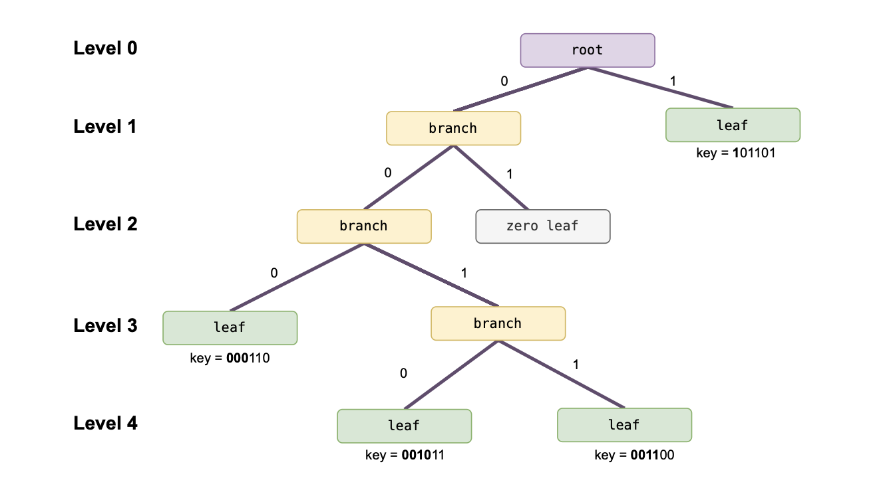
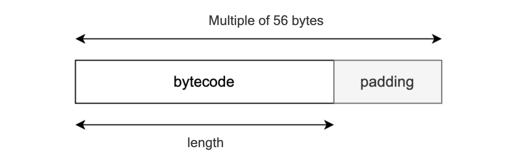
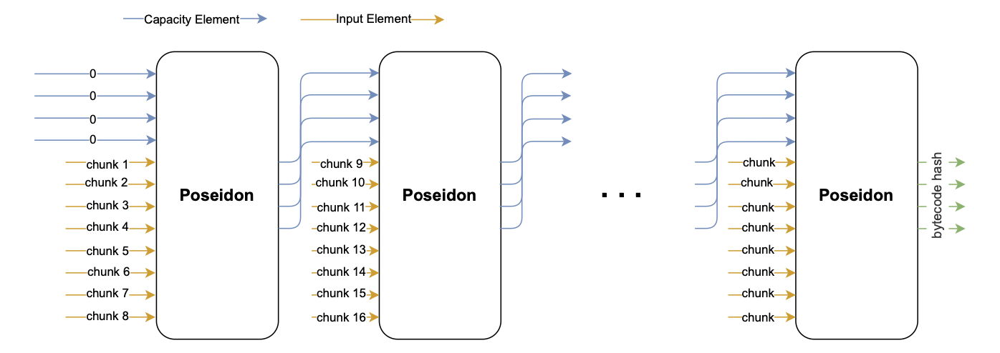
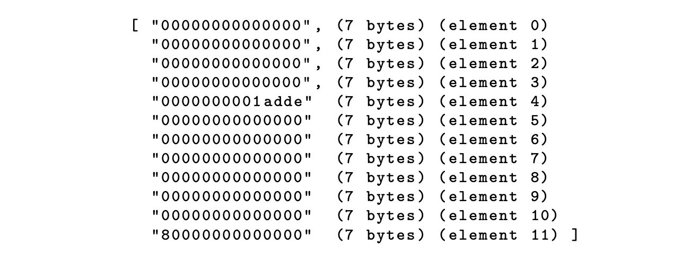

The Polygon zkEVM state is stored in a key-value format within a special Merkle tree known as a _Sparse Merkle Trie_ (SMT). This tree is binary and fully updatable, supporting both `Read` and `Write` operations.

Similar to the use of Merkle Patricia tries in Ethereum, an SMT is a data structure designed to retrieve a _value_ by traversing a branch of nodes that store associated references, called _keys_, which together lead to a leaf containing the *value*.

## Underlying Hash Function

Since Polygon zkEVM is a zk-rollup, a ZK-friendly hash function is the most suitable for constructing SMTs.

The Poseidon hash function, designed to address some of the challenges and limitations of traditional hash functions in implementing ZK-proofs, was a natural choice.

Readers interested in cryptographic details should refer to the [sponge construction document](../zkprover/hashing-state-machines/index.md) for Poseidon's basic design structure and the [Poseidon state machine document](../zkprover/hashing-state-machines/poseidon-sm.md) for its internal mechanism.

We henceforth consider an instantiation of Poseidon over the Goldilocks field $\mathbb{F}_p$ where $p = 2^{64} − 2^{32} + 1$.

### Poseidon inputs and outputs

Observe that Poseidon's input and output elements are represented as arrays.

The Poseidon hash function accepts a full input consisting of 12 field elements: an array of 4 capacity elements and an array of 8 input elements, with each input element being a 32-bit field element.

The output is an array of 4 field elements, each approximately 64 bits long.

Refer to the figure below for a simplified diagram of Poseidon's input and output arrays.

### Poseidon hash types

To safeguard SMTs against second-preimage attacks, two instances of the Poseidon hash function are utilized:

$$
\mathtt{hashType = 0}\ \text{ and }\  \mathtt{hashType = 1}
$$

Referring to the figure above, the `hashType` is indicated by the first element, $\mathtt{capacity[0]}$, of one of the following two arrays:

$$
\mathtt{capacity = [ 0, cap1, cap2, cap3 ]} \text{ or } \mathtt{[ 1, cap1, cap2, cap3 ]}.
$$

That is, $\mathtt{hashType = capacity[0] \in \{ 0, 1 \}}$.

When constructing an SMT, the Poseidon hash with $\mathtt{hashType = 0}$ is used to create branch nodes, while $\mathtt{hashType = 1}$ is used for leaf nodes.

### Example (hashType)

Denote a Poseidon hash as follows:

$$
\texttt{Poseidon(capacity; values)}
$$

where $\mathtt{capacity}$ is an array of 4 field elements and $\mathtt{values}$ is an array of 8 input elements of the hash.

Using this notation, the two instances of the Poseidon hash function are:

- $\mathtt{Poseidon(0; \cdot )}$ corresponding to $\mathtt{hashType = 0}$, and used for branch nodes.

- $\mathtt{Poseidon(1; \cdot )}$ corresponding to $\mathtt{hashType = 1}$, and used for leaf nodes.

## Constructing an SMT

Let’s use an example to visualize how an SMT is constructed.

Suppose a given SMT has values stored at leaves associated with the following four keys:

$$
\mathtt{101101},\ \mathtt{000110},\ \mathtt{001011}  \texttt{ and }  \mathtt{001100}.
$$

Firstly, note that by _non-zero leaves_ we refer to leaves storing some data. Hence, a _zero leaf_ refers to a leaf node that carries no data.

Secondly, when constructing the SMT corresponding to these 4 keys, the key-bit $\texttt{0}$ represents an edge to the left, while the key-bit $\texttt{1}$ means an edge to the right.

This means, non-zero leaf nodes share paths for as long as their associated keys have common least-significant bits.

Therefore, any pair of keys associated with distinct non-zero leaves must differ in at least one of the key bits.

This means that prefixes (short bit strings formed from consecutive least-significant key bits) can be used to accurately position non-zero leaf nodes.

Now, based on the keys provided above, there are four distinct prefixes:

$$
\texttt{1},\ \texttt{000},\ \texttt{0010} \texttt{ and } \texttt{0011}.
$$

Observe that:

1. The path to the leaf associated with $\texttt{key} = \mathtt{101101}$ differs from the other three paths in the very first edge from the root, which is the edge to the right.
    
    Assuming there are no other non-zero leaf nodes, the corresponding leaf is therefore positioned at the first child node of the root, along the edge to the right.

2. Since the prefixes $\texttt{000},\ \texttt{0010} \texttt{ and } \texttt{0011}$ share the first two bits $\texttt{00}$, the paths to the associated leaves coincide only for the first two edges from the root, both of which are to the left.

3. The prefix $\texttt{000}$ differs from the other two prefixes ($\texttt{0010}$ and $\texttt{0011}$) at the third bit.
    
    Hence, assuming there are no other non-zero leaves, the leaf associated with $\texttt{key} = \mathtt{000110}$ is positioned at the third child node, at the end of the third edge from the root, following three consecutive left edges.

4. The last two prefixes ($\texttt{0010}$ and $\texttt{0011}$):
    
    Share a common third key bit $1$, so the paths to their associated leaves coincide up to the third edge, which is to the right.

    Only differ at their fourth key bits, meaning the fourth edge of the path to the leaf associated with $\mathtt{key = 001011}$ is to the left, while the fourth edge of the path to the other leaf is to the right.

    Again, assuming there are no other non-zero leaves in this SMT, each these two non-zero leaf nodes (associated with prefixes $\texttt{0010}$ and $\texttt{0011}$) is positioned at the end of the fourth edge from the root.

The figure below depicts the SMT containing the four non-zero leaves associated with the given keys: $\mathtt{101101}$, $\mathtt{000110}$, $\mathtt{001011}$ and $\mathtt{001100}$.

### Node types

As depicted in the figure above, a typical SMT has four types of nodes: leaf, root, branch, and zero nodes.

1. The _leaf node_ encapsulates the actual data associated with a key.
    
    The data is captured in the form of a hash digest of the key-value pair.

    And, due to Poseidon's cryptographic properties such as collision-resistance, anyone can use a Merkle proof to verify if indeed certain data is stored in a particular leaf of the SMT.

2. The _root node_ is the highest node in an SMT, the sole node at level zero, connecting all branches and leaves.
    
    It's the starting point for traversing down the tree structure.

    As a hash that includes hashes of all data captured in the SMT, the root serves as the cryptographic summary of the entire dataset and thus acts as a fingerprint of all the values stored in the SMT.

3. A _branch node_ refers to any intermediary node that lies between the root node and leaf nodes, between the root node and other branch nodes, or between a branch node and leaf nodes.
    
    Branch nodes are therefore positioned at various levels in an SMT, and store hashes derived from concatenating two hashes of their child nodes.

    The hash at each branch node cryptographically encapsulates the data contained in the subtree (all its child nodes, grandchild nodes, including the leaf nodes) that has the branch node as its root node.

4. A _zero node_ does not represent a zero hash value associated with a specific key, but instead denotes a branch node with no subtree beneath it.
    
    These type of nodes exist whenever two conditions are satisfied:

    - No key associated with non-zero values stored in the SMT has a prefix that leads to the node.

    - The node has a sibling node, which is either a non-zero leaf or a branch node with a non-zero leaf as its child or grandchild.

    Referring to the above example, the node reached by traversing the 2-edge path $\mathtt{01}$ is a zero-node because:

    Firstly, none of the keys ($\mathtt{101101}$, $\mathtt{000110}$, $\mathtt{001011}$ and $\mathtt{001100}$) has $\mathtt{01}$ as a prefix.

    Secondly, the sibling node reached by traversing the 2-edge path $\mathtt{00}$ has 3 non-zero grandchild nodes in its subtree.

## Keys and values

The aim with this subsection is to provide an understanding on how the L2 state is managed in terms of the key-value data within SMTs.

As seen above, keys are crucial in positioning values, as well as traversing SMTs to locate these values. 

Leaf nodes serve as the endpoints of the tree and essentially hold data.

Next, we provide details on the derivation of keys and the computation of values.

### Deriving keys

We begin by describing how keys are derived from their associated leaf data.

Node key is computed as follows:

$$
\mathtt{leafKey = Poseidon(capacityHash; addr, 0, SMT_KEY, 0)}
$$

Each of the four arguments is described below:

1. The address $\mathtt{addr}$ consists of $5$ $32$-bit segments representing the Ethereum address associated with the leaf, having 160 bits in the EVM:
    
    $$
    \mathtt{addr = (addr[0], addr[1], addr[2], addr[3], addr[4])}
    $$

2. The SMT key is a single field element, $\mathtt{SMT_{KEY} \in \{ 0, 1, 2, 3, 4 \}}$, indicating which of the following five L2 state information is being stored:
    
    - $\mathtt{SMT_KEY = 0}$: for the account balances.

    - $\mathtt{SMT_KEY = 1}$: for the account nonces.

    - $\mathtt{SMT_KEY = 2}$: for the smart contract code.

    - $\mathtt{SMT_KEY = 3}$: for the smart contract storage.

    - $\mathtt{SMT_KEY = 4}$: for the smart contract length.

3. The hash of the capacity array, called $\mathtt{capacityHash}$, is computed in one of two ways, depending on whether the stored data is a storage slot or some other type of data.
    
    (a) When storing data that is not a storage slot, $\mathtt{capacityHash}$ is computed as follows:

    $$
    \mathtt{capacityHash = Poseidon(0; 0, 0, 0, 0, 0, 0, 0, 0)},
    $$

    where capacity is shown as $\texttt{0}$ , but it's in fact an array of $4$ field elements, each set to $\texttt{0}$.

    Since a single smart contract’s address can have multiple storage slots, a key $\texttt{storageKey}$ is created for each slot.

    (b) For each storage slot, $\mathtt{capacityHash}$ is computed with a specific $\texttt{storageKey}$ as follows:

    $$
    \mathtt{capacityHash = Poseidon(0; storageKey)}
    $$

    where $\texttt{storageKey}$ is an array of $8$ field elements each constrained to 32-bit values representing storage slot identifiers, which in the EVM have a size of 256-bits.

### Computing values

We now explain how the values stored within leaf nodes are obtained.

The current methodology for hashing the leaf data to derive the leaf node’s value is as follows:

$$
\mathtt{leafValue = Poseidon(1; remLeafKey, valueHash)}.
$$

The first argument is the capacity set to $\texttt{1}$, which is actually an array of 4 field elements: $\mathtt{capacity = [1,0,0,0]}$.

The second argument, $\texttt{remLeafKey}$, is an array of 4 field elements representing the remaining key associated with the leaf node.

The third argument, $\texttt{valueHash}$, is an array of 4 field elements calculated as follows:

$$
\mathtt{valueHash = Poseidon(0; value)},
$$

where $\texttt{value}$ is an array of 8 field elements, each restricted to a 32-bit length.

The 32-bits values in the array are computed differently, depending on the type of the data stored in the tree.

1. For $\texttt{balances}$, $\texttt{nonces}$ and $\texttt{storageSlotValues}$.
    
    In the EVM, $\texttt{balances}$, $\texttt{nonces}$ and $\texttt{storageSlotValues}$ are of 256 bits. So, their $\texttt{valueHashes}$ are computed as expected:

    $$
    \begin{aligned}
    &\texttt{valueHash = Poseidon(0; balance)},\\
    &\texttt{valueHash = Poseidon(0; nonce)},\\
    &\texttt{valueHash = Poseidon(0; storageSlotValue)}.
    \end{aligned}
    $$

    where each input ($\texttt{balances}$, $\texttt{nonces}$ or $\texttt{storageSlotValues}$) is an 8 field element array, each constrained to 32-bit values.

2. For smart contract bytecode.
    
    The hash of the smart contract bytecode is also stored in the L2 state tree.

    However, since bytecode has an arbitrary size, it can exceed 256-bits (32 bytes).

    To manage this issue:

    Firstly, padding is used to adjust the size of the input bytecode to a suitable multiple, in particular, a multiple of 56 bytes.

    Secondly, the resulting padded byte string is linearly hashed.

    

3. For bytecode length.
    
    The length of the actual bytecode is stored in the L2 state tree, because it is necessary to distinguish between payload and padding.

    The bytecode length which is the number of bytes forming the bytecode, is hashed as follows:

    $$
    \texttt{valueHash = Poseidon(0;bytecodeLength)}.
    $$

4. Input bytecode encoding.
    
    We encode the bytecode in segments of 7 bytes (56 bits), which is the biggest amount of bytes that can be represented with an element of the Goldilocks field:

    $$
    2^{56} < 2^{64} −2^{32} +1 < 2^{64}.
    $$

    Since the input values of the Poseidon hash function is an array of 8 field elements, the total input is encoded as $\mathtt{ 7\ bytes\ ×\ 8\ elements = 56\ bytes }$ of bytecode.

5. Padding procedure.
    
    The padding procedure used to adjust the original bytecode string to a padded string, that's a multiple of 56 bytes, is as follows:

    - Add the byte $\texttt{0x01}$ at the end of the original bytecode.

    - Fill with zeros until the padded $\mathtt{bytecode\_ length + 1 }$ is multiple of 56 bytes.

    - Add $\texttt{0x80}$ as the last byte.

6. Example (Bytecode hashing)
    
    Suppose the 2-byte, $\mathtt{0xdead}$, is  the original bytecode.

    The padded bytecode becomes:

    $$
    \texttt{0xdead01000000000000000000...000000000000080}
    $$

    a string of 56 bytes.

7. Recursively chained hashing.
    
    Smart contract bytecodes larger than 256 bits undergo a _chained hashing process_ to obtain a valid representative value (called $\texttt{bytecodeHash}$).

    More specifically, the padded bytecode is split into chunks of 7 bytes, and 8 of these chunks are recursively added as input values of the Poseidon hash function.

    Although the initial capacity value is $\mathtt{capacity = [0,0,0,0]}$, all subsequent capacity values are to the previous output of the Poseidon hash function.

    

8. Example. (Recursively chained Poseidon)
    
    To illustrate this, let's follow on with the previous 2-byte example, $\texttt{0xdead}$, which was padded to:

    $$
    \mathtt{0xdead010000000000000000000000000...000000000000000000000080}
    $$

    Since the 56-byte padded bytecode amounts to 8 chunks of 7 bytes, performing a single Poseidon hashing is sufficient.

    By setting the capacity to an array $\mathtt{capacity = [0,0,0,0]}$, where each $\texttt{0}$ is a 7-byte zero, the total input to the Poseidon hash function is as below:

    

Finally, the $\texttt{valueHash}$ of the bytecode is $\texttt{valueHash = Poseidon(0; bytecodeHash)}$.

## Conclusion

The above construction of SMTs is efficient and optimal in many ways. 

For instance, the design approach to avoid hashing the full height of an empty branch, but rather store it as a zero-leaf where the value stored is an explicit zero value, achieves huge storage savings.

In practical terms, this means that the branch node at level 1 assumes a specific value:

$$
\mathtt{Poseidon(0; leftChildNode, 0). }
$$

This type of optimization is called _partial tree construction_, where leaf nodes are at various levels in the tree.
