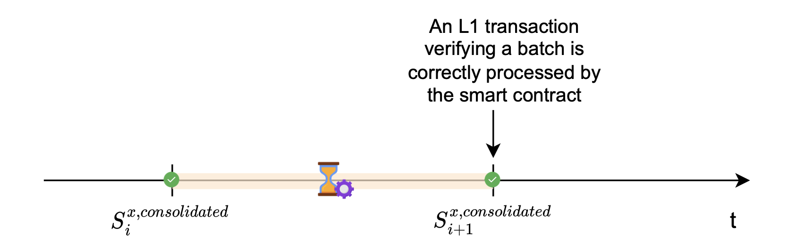
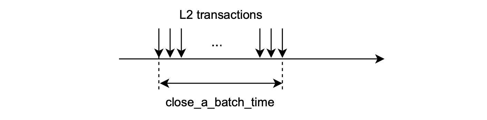
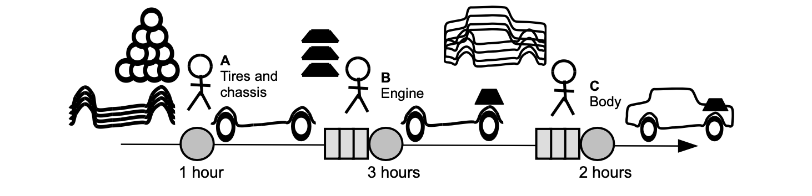
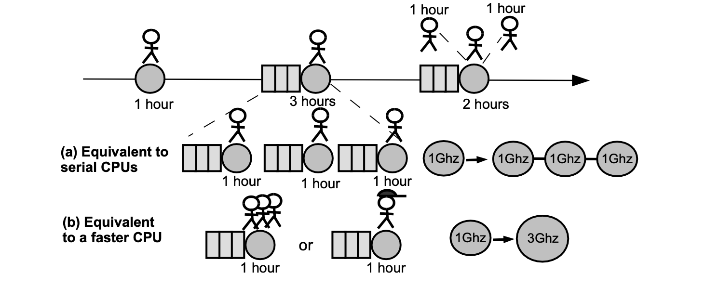
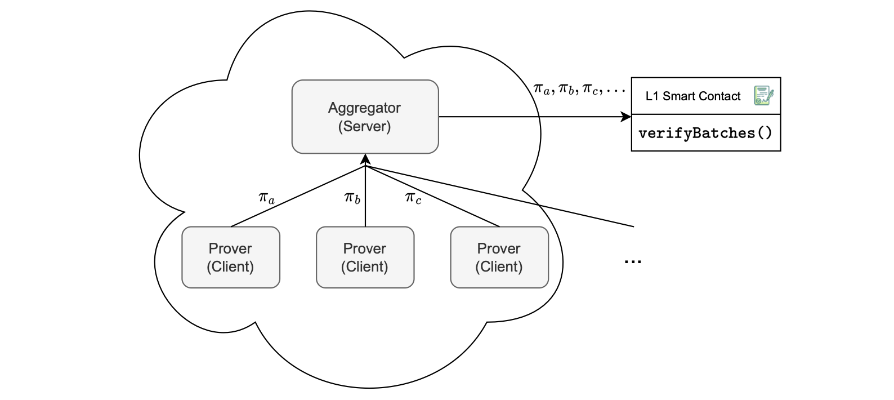
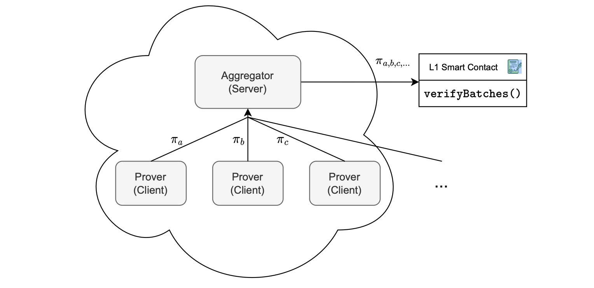

# Order and prove

In this document, we distinguish between the sequencing and proving processes, with emphasis on the need to distinguish between the two stages of the overall transaction flow.

The decoupling of sequencing from proving enhances the system's efficiency.

Central to the zkEVM architecture are the verifier smart contract, the prover, the aggregator, and sequencer.

## Typical state transition

Recall that, a proof of correct execution of transactions in a batch is generated, and the proof needs to be verified by the verifier smart contract.

A new L2 state is reached, and it is dubbed the _consolidated state_. 

The processed batch is referred to as a 'consolidated batch'. That is, it has been verified by the L1 smart contract.

Submitting the proof $\pi$​, together with the corresponding publics, for verification of correct execution, is an L1 transaction.

Once the smart contract successfully verifies this L1 transaction, this proves that the L2 state has correctly evolved from the old state $S^{L2_x}_i$ to a new state $S^{L2_x}_{i+1}$ according to the processed batch.

The figure below depicts a state transition.

## zkEVM key performance indicators

The zkEVM's key performance indicators (KPIs) are _Delay_ and _Throughput_.

_Delay_ refers to the time elapsed from when a user sends an L2 transaction until the transaction's execution results are reflected in the L2 state.

This is a major KPI when it comes to positive user experience (UX).

_Throughput_ measures the system's capacity of processing transactions. 

It can be computed in transactions per second, gas per second, or batches per second.

Let's analyze and possibly re-engineer the current system to improve these KPIs.

There are three parameters affecting these KPIs: $\mathtt{close\_a\_batch\_time}$, $\mathtt{prove\_a\_batch\_time}$ , and $\mathtt{block\_time}$.

1. $\mathtt{close\_a\_batch\_time}$: The time taken to get sufficient transactions to close a batch or a given timeout for this purpose.
    
    

2. $\mathtt{prove\_a\_batch\_time}$: The time taken to generate a proof for a single batch. The size of the batch can obviously affect this time.
    
    

3. $\mathtt{block\_time}$: This is the minimum time taken to execute L1 transactions.
    
    

Let's explore how this parameters impact the _Delay_ and _Throughput_ of the full system.

### Processing pipeline

Consider an example of a simplified processing pipeline, similar to an assembly line in a factory, as illustrated in the figure below.

Identify two key performance indicators (KPIs) of interest: lead time (or delay) and production rate (or throughput).

- Lead time refers to how long it takes to produce the first car after starting the line.
    
    The lead time, as indicated in the figure above, is 6 hours.

- Production rate tells us how many cars can be produced per unit of time.
    
    The production rate is 1 car every 6 hours, which is equivalent to $\mathtt{\frac{1}{6}}$ cars per hour.

#### Two scaling methods

The following question arises: How can we improve both delay and throughput metrics?

The objective is to increase the throughput and reduce the delay.

Two methods are employed: horizontal scaling and vertical scaling.  

- Horizontal scaling involves adding more operators of smaller power in parallel, boosting throughput.
    
    In which case, the delay remains the same. (In our system, operators are equivalent to CPUs.) 

- Vertical scaling, on the other hand, entails adding more powerful operators. This is equivalent to adding faster CPUs.
    
    In this case, delay is reduced but throughput is increased.

As expected, vertical scaling is more expensive to implement compared to horizontal scaling.

Consider the figure below, depicting two scenarios of scaling on the previous _processing pipeline_ scenario.

(a) Serial horizontal scaling. Replacing the 3-hour operator (at the engine-mounting stage) with three 1-hour operators working serially. And, replacing the 2-hour operator (at the body-mounting stage) with two 1-hour operators.

(b) Vertical scaling. Replacing the 3-hour operator (at the engine-mounting stage) with one _3-times_ faster operator, capable of performing the normal 3-hour engine-mounting task in only one hour. And, replacing the 2-hour operator (at the body-mounting stage) with one _2-times_ faster operator, capable of performing the usual 2-hour body-mounting task in just an hour.

Initially, before any scaling was applied, the delay was 6 hours and the throughput was $\mathtt{\frac{1}{6}}$​​ cars per hour.

The serial horizontal scaling, (a), does not result in any improvement on the delay and throughput.

But the vertical scaling, (b), results in the delay of 3 hours, while the throughput increases to _1 car every 3 hours_, which is equivalent to $\frac{1}{3}$ _cars per hour_.

## Improving batch processing KPIs

In the current design, batch processing consists of: closing a batch, generating the proof, and submitting the _verify-this-batch_ L1 transaction to the verifier smart contract.

The two zkEVM KPIs can be computed as follows:

- Delay is computed with this formula,

$$
\texttt{delay} = \mathtt{close\_a\_batch\_time} + \mathtt{prove\_a\_batch\_time} + \mathtt{block\_time}\ [\text{seconds}]
$$

- And throughput is given by this formula, 

$$
\texttt{throughput} = \dfrac{1}{\mathtt{prove\_a\_batch\_time}}\ [\text{batches per second}]
$$

When computing throughput, we assume that closing, proving, and verifying a batch can be done in parallel with other batches.

And thus, in practice, throughput is determined by the longest part of the process, which is to prove the batch.

$$
\begin{aligned}
&\mathtt{close\_a\_batch\_time} << \mathtt{prove\_a\_batch\_time} \\
&\mathtt{block\_time} << \mathtt{prove\_a\_batch\_time}
\end{aligned}
$$

To provide specific numbers:

$$
\begin{aligned}
&\mathtt{block\_time} = 15\ \text{seconds}\ (\text{average})\\
&\mathtt{prove\_a\_batch\_time} = 120\ \text{seconds}\ (\text{min})\\
&\mathtt{close\_a\_batch\_time} = 3\ \text{seconds}\ (\text{max})\\
\end{aligned}
$$

### Improving KPIs with vertical scaling

The aim is to increase throughput and reduce delay.

The one limiting factor in this case is the $\mathtt{prove\_a\_batch\_time}$. 

Vertical scaling means adding more resources to the existing machines.

It can be achieved by running provers on more powerful machines, optimizing the proving system, or a combination of both.

Although vertical scaling seems like a straightforward solution to speed up proof generation, it has limitations:

- Cost-effectiveness: Upgrading to very powerful machines often results in diminishing returns. The cost increase might not be proportional to the performance gain, especially for high-end hardware.
- Optimization challenges: Optimizing the prover system itself can be complex and time-consuming.

### Improving KPIs with horizontal scaling

Another option is to scale the system horizontally. 

Horizontal scaling involves adding more processing units (workers) to distribute the workload across multiple machines and leverage additional hardware resources in parallel. 

In the context of a batch processing system, this translates to spinning up multiple provers to work in parallel.

#### Naive horizontal scaling

Consider the figure below, depicting a naive implementation of horizontal scaling, which involves:

1. Parallelized proof generation by spinning up multiple provers.
2. Proof reception, where each prover individually sends the proof it generated to the aggregator.
3. Proof Verification, which means the aggregator puts all these proofs into an L1 transaction, and sends it to the smart contract for verification of batches.

This approach means closing batches serially, while generating their proofs in parallel.

Notice that, as depicted in the figure above, the proofs $\pi_a$, $\pi_b$ and $\pi_c$ are serially input to the L1 smart contract for verification.

This means the overall verification cost is proportional to the number of proofs sent to the aggregator.

The disadvantage with the naive approach is the associated costs, seen in terms of the space occupied by each proof, and cumulative verification expenses with every additional proof.

#### Proof aggregation in horizontal scaling

Another option is to scale the system horizontally with proof aggregation, as shown in Figure 6. 

Here’s how it works:

1. Parallelized proof generation, by instantiating multiple provers.
2. Proof reception, where each prover individually sends the proof it generated to the aggregator.
3. Proof aggregation, where proofs are aggregated into a single proof.
4. Proof verification here means encapsulating only one proof, the aggregated proof, in an L1 transaction. And hence transmitting it to the smart contract for batch verification.

The foundation of this approach rests on zkEVM's custom cryptographic backend, designed specifically to support proof aggregation.

It allows multiple proofs to be combined into a single verifiable proof.

As depicted in the figure below, the proofs $\pi_a$, $\pi_b$ and $\pi_c$ are aggregated into a single proof $\pi_{a,b,c,...}$.

The key advantage is constant verification costs on L1, regardless of the number of proofs being aggregated.

#### Deep dive into horizontal scaling

Let’s delve deeper into how the use of proof aggregation boosts the system’s throughput.

A crucial metric in this process is $\mathtt{aggregation\_time}$, which represents the time it takes to combine proofs from $N$ batches, which is close to 12 seconds.

Throughput, measured in batches per second, can be computed as follows:

$$
\dfrac{N}{ \text{max} \big(\mathtt{prove\_a\_batch\_time},\ N · \mathtt{close\_a\_batch\_time},\ \mathtt{block\_time},\ \mathtt{aggregation\_time}\big)}
$$

Observe that, since proving and closing batches, and aggregating proofs can run in parallel for a set of $N$ batches, verification of all $N$ batches takes as long as the slowest of the three operations. 

Hence the denominator, in the above formula, is the maximum among the values: $\mathtt{prove\_a\_batch\_time}$,  $N · \mathtt{close\_a\_batch\_time}$, $\mathtt{block\_time}$, and  $\mathtt{aggregation\_time}$.

This means, in the case where the maximum time in the denominator is $\mathtt{prove\_a\_batch\_time}$, the system's throughput increases by a factor of $N$​.

Delay in this scenario can be computed as follows:

$$
\texttt{delay} = N·\mathtt{close\_a\_batch\_time} + \mathtt{prove\_a\_batch\_time} + \mathtt{aggregation\_time}+ \mathtt{block\_time}
$$

A straightforward aggregation of batches substantially increases delay relative to a single batch approach.

As discussed earlier, delay is a critical factor to user experience.

To retain the throughput gains while reducing the delay, we can adopt a two-step approach for batch processing: first, _order_ (also known as _sequence_) and then _prove_. 

This segmentation allows for optimization in each step, potentially reducing the overall delay while maintaining improvements in throughput.

### Enhancing delay by order then prove

The rationale behind decoupling batch ordering (sequencing) from batch proving is twofold:

- Ensure swift responses to users regarding their L2 transactions with minimal delay.
- Enable transaction aggregation for maximizing system throughput.

Sequencing an L2 batch involves deciding which L2 transactions should be part of the next batch. That is, when to create or close the batch, and sent it to L1. 

As the sequence of batches is written to L1, data availability and immutability are ensured on L1. 

Sequenced batches may not be proved immediately, but they are guaranteed to be proved eventually.

This creates a state within the L2 system that reflects the eventual outcome of executing those transactions, even though the proof hasn’t been completed yet. 

Such a state is called a *virtual state* because it represents a future state to be consolidated once the proof is processed.

More precisely, the virtual state is the state reached after executing and sequencing batches in L1, before they are validated using proofs.

It’s crucial for users to understand that once a transaction is in the virtual state, its processing is guaranteed.

Notable improvement lies in the ability to close batches more rapidly than the block time, providing a more efficient and expedited processing mechanism.

Let’s adopt a revised definition for the delay: 

- The duration from the moment a user submits an L2 transaction until that transaction reaches the virtual state.

From the user’s perspective, once the transaction is in the virtual state, it can be regarded as processed.

$$
\mathtt{delay}^{(\mathtt{to\_virtual})} = \mathtt{close\_a\_batch\_time} + \mathtt{block\_time}
$$

The smart contract allows us to sequence multiple batches, in which case the delay can be computed as shown below.

$$
\mathtt{delay}^{(\mathtt{to\_virtual})} = N · \mathtt{close\_a\_batch\_time} + \mathtt{block\_time}
$$

Note that we have experienced a significant reduction in the delay.

Below, we present several advantages of decoupling batch sequencing from batch proving:

- Queue management: This approach enables effective management of the queue for sequenced batches that await consolidation.
- Flexibility in delay and prover resources: It becomes possible to adjust the amount of delay by adjusting the number of provers in operation.
- User perception: Decoupling allows for adjustments in delay and resource alloca- tion without impacting the perceived delay experienced by users.
