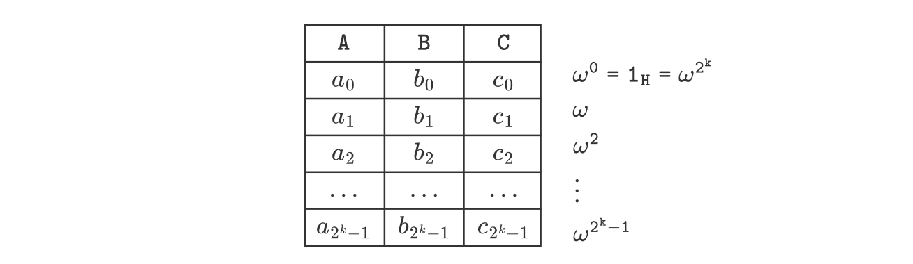
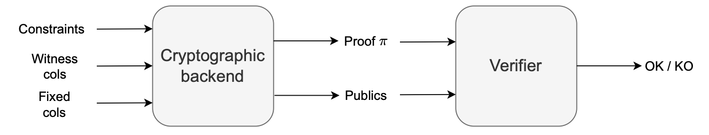
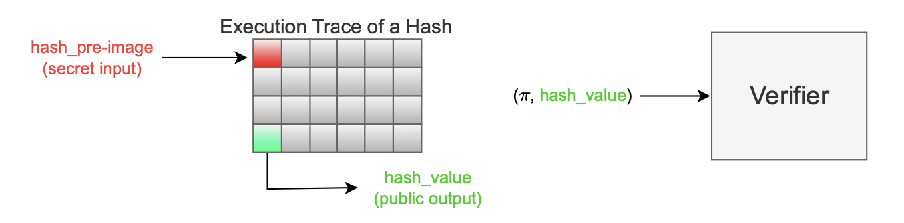

In order to prove correctness of execution, and enable such proofs to be verifiable, a domain-specific language (DSL) called Polynomial identity language (PIL) is employed. 

The word 'identity' refers to polynomial equations that must be satisfied by values in the execution trace, if all input programs were correctly executed, for the given initial input values.

These polynomial identities are equivalent to equations, called _arithmetic constraints_. that govern correct execution of input programs.

These constraints link the execution trace to the input program it models, in a natural way. The next example illustrates this clearly.

## Example: (Constraints and execution correctness)

Consider again our previous example of a computation, $[(x_0 +x_1)·4]·x_2$, with its corresponding input program:

$$
\big( \texttt{ADD},\ \texttt{TIMES4},\ \texttt{MUL} \big)
$$

For the given initial input values, $x = (x_0, x_1, x_2) = (1, 2, 5)$, the execution trace and its corresponding constraints are given below.

It can be observed that:

- The first two equations check for correct assignment of input values.
- The third and fourth equations test output values of $\texttt{ADD}$ and $\texttt{TIMES4}$, respectively.
- The fifth equation checks for correct assignment of the third input value, $x_2 = 5$.
- The last equation tests the output value of $\texttt{MUL}$      

Given the set of constraints (on the right) it is easy to examine whether the execution trace (on the left) correctly models the input program for the given initial input values.

!!! warning
    
    Throughout this document, concepts of the execution trace and the constraints are didactically explained. That is, explanations involve constructing examples, while gradually adding complexity.

    For this reason, some things like the way the constraints are written is not technically correct, but it will be fixed as we get to the end of the document.

## Interpolating values in execution matrices

Given arithmetic constraints of an execution matrix, its corresponding polynomial identities are derived through a process called _interpolation_.

In simple terms, interpolation means taking 'Cartesian' points expressed as $N$​-tuples, and computing the closest polynomial whose graph passes through the points.

The $N$-tuples are constituted by the values that form each column of the execution matrix. 

The output of an interpolation is therefore polynomials of degree $N$, and $N$ is in fact the number of rows of the execution trace (equivalently, the number of values in a column).

In the particular case of the zkEVM, interpolation is carried out via Fast Fourier Transformations (FFTs) over a specific domain. 

That domain is the subgroup of roots of unity, $H = \{ 1_H, \omega, \omega^2, \dots , \omega^{2^{k-1}} \}$ where $\omega^{2^k} = 1_H$, the group-identity of $H$.

And, for efficiency of FFTs, the value of $N$ is always set to a power of 2 (i.e., $N = 2^k$ for some natural number $k \in \mathbb{N}$).

Details of how arithmetic constraints translate into polynomial identities can be found in the concepts section of the documentation [here](https://docs.polygon.technology/zkEVM/concepts/mfibonacci/mfibonacci-example/).

The polynomial identities uniquely describe the input program modelled by the execution trace.

The zkEVM expresses the polynomial identities in the Polynomial identity language (PIL), and stores them in a file with the `.pil` file-extension. This file is referred to as the _PIL specification_.

## PIL compiler

The polynomial identities need to be compiled into a language that prover can understand.

A special PIL compiler called **pilcom** is translate the PIL specification into `.json` file called _Constraints file_.

The constraints `.json` file contains a list of all the constraints and additional information about the polyomials, and it can be consumed by the prover.

The repository [pilcom-vscode](https://github.com/0xPolygonHermez/pilcom-vscode) contains a PIL syntax highlighter for VSCode.

## Proof generation and verification

The transformation of constraints into polynomial indentities, captured in the PIL specification file, and the compilation of the PIL specification file into the constraints `.json` file happens in the zkEVM's cryptographic backend.

The cryptographic backend receives the outputs of the executor: that is, both the witness and fixed columns, as well as the constraints (uniquely describing the execution matrix that models the input program).

The prover, which is part of this cryptographic backend, is in charge of generating proofs.

The verifier, which is the zkEVM's component responsible for verifying proofs, takes as inputs a proof and its corresponding _publics_. 

The publics, which is short for public values, is a set of values known by both the prover and the verifier.

The verifier uses a specialized verification algorithm to check validity of the proof, for the provided publics. And its output is either an `OK` for an accepted proof, or a `KO` for a rejected proof.

The figure below, is a simplified scheme that outlines the systematic process of generating and verifying proofs.

The current zkEVM setup relies on a backend cryptographic system where the verifier is an algorithm called FFlonk. Further details are covered later in this document.

Since proofs are compact and their verification demands minimal resources, a smart contract can carry out verification of proofs.

In reality, a smart contract in L1 implements the verifier algorithm.

The gas cost for this verification is approximately 200,000 gas units.

## Public and private inputs

Zero-Knowledge technology enables separation between public and private values among the cells of the execution trace.

This provides the capability to designate certain variables for holding private data while others carry public information.

**Example: (Proving knowledge of a pre-image of a digest)**

Consider, for instance, a password protocol of a simplified public-key infrastructure (PKI). 

A user keeps their password as a secret, while they are authenticated by the hash-value of their password (the hash-value acts like a 'public-key').

Proof that one knows the password corresponding to a given hash-value is being able to supply the password that reproduces the hash-value. 

Typically, this is done by internally applying a designated hash function on the supplied password.

$$
\mathtt{hash-value} := \textbf{Hash}(\mathtt{password})
$$

The security of the protocol relies on such a hash function being collision-resistant. 

That is, the probability of producing the same hash-value from a different private-key is extremely small.

This example illustrates the need to distinguish between _publics_ (i.e., the hash-value) and the _private inputs_ (i.e., the password) in order to achieve some privacy.

**Verfier's inputs**

Publicly known values, or _publics_, are not only important in the proving phase, but also in the verification phase.

As seen in the previous figure above, _publics_ form part of the verfier's inputs. And, similar to the above pasword protocol, these _publics_ are uniquely related to the executor's input program.

By default, all values in PIL are considered private. However, any specific value can be made public by using the keyword _public_.

The figure above illustrates a hash pre-image proof, where $\texttt{hash_value}$ is public, while $\texttt{hash_pre-image}$ remains confidential. 

The initial cell of the execution trace (colored `red`) signifies a secret input, which is put through a sequence of instructions (designed to model the hash function $\textbf{Hash}$), and culminates in the production of the hash output.

Subsequently, the cryptographic backend generates a proof $\pi$ and public values, and these inputs to the verifier.

## Next PIL version: PIL2

Currently, we are in the process of developing a new version of PIL, referred to as **PIL2**. 

PIL2 is designed to operate with a more potent cryptographic backend capable of generating an adequate number of subexecution traces to accommodate the whole batch processing without running out of rows. 

Additionally, we are collaborating with other projects within the *zk projects* at Polygon to establish a standardized format for the PIL output file, named pilout.
