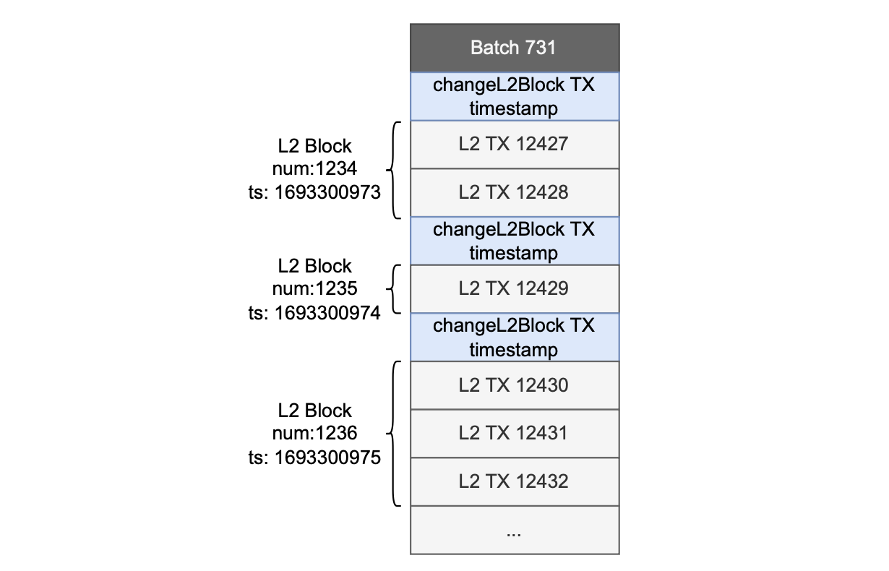
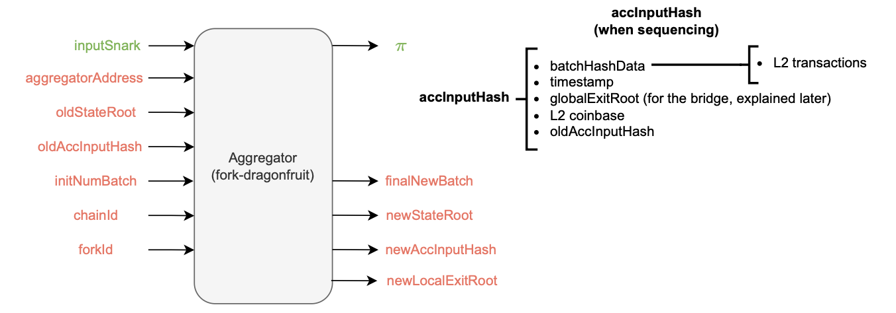
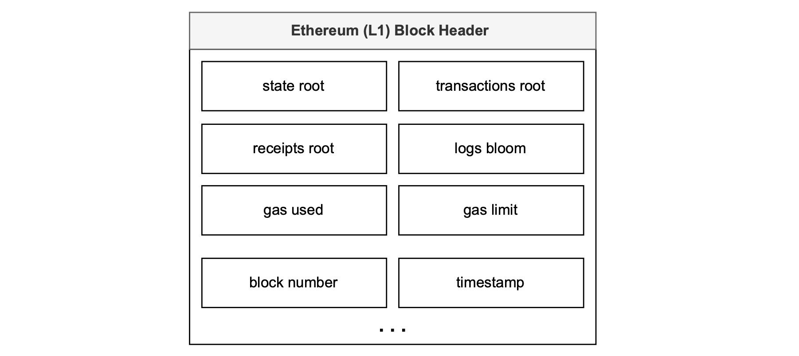
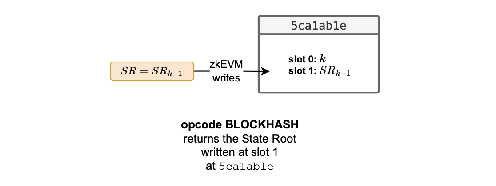
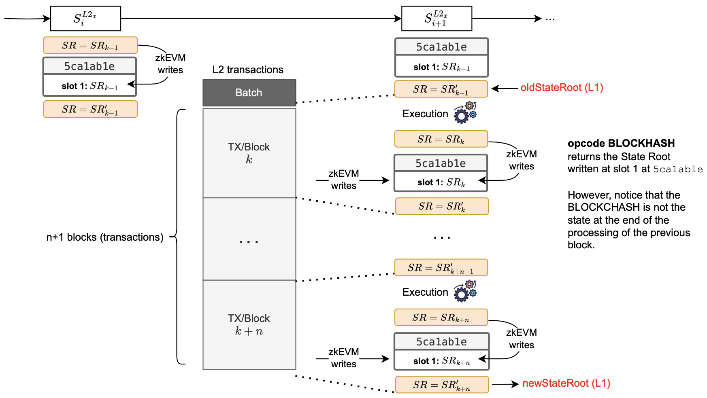
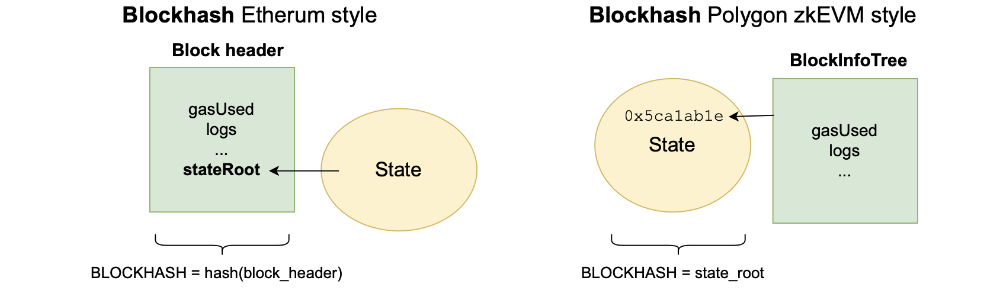
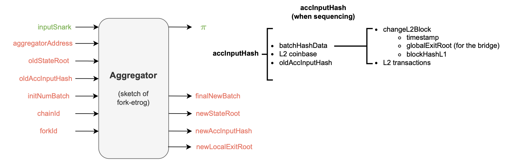
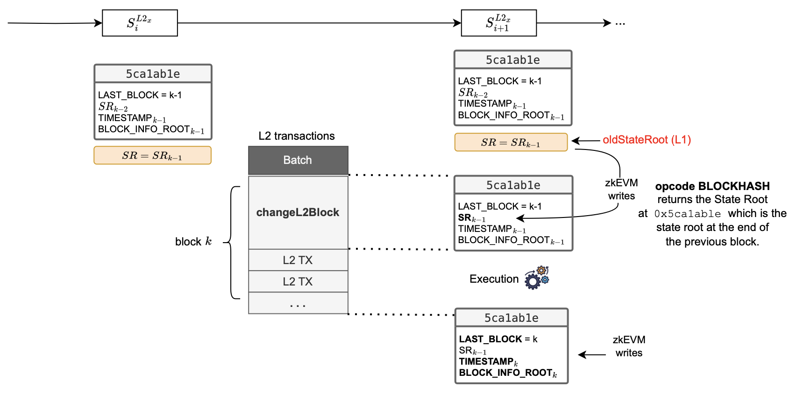
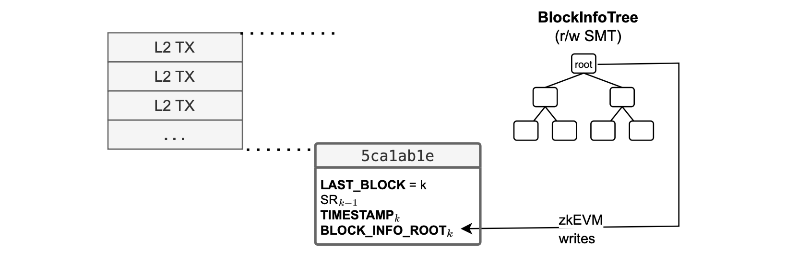
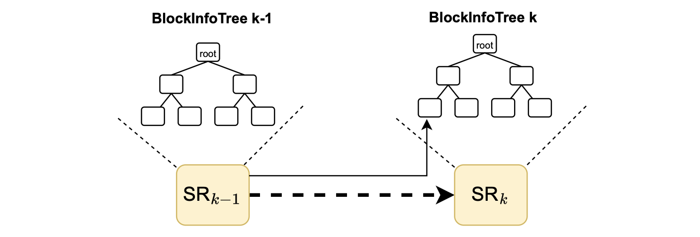

In this document we discuss the differences between the Dragonfruit upgrade, which comes with the executor fork-ID 5, and the [Etrog upgrade](../protocol/etrog-upgrade.md) associated with fork-ID 6.

The key differences between the two Polygon zkEVM upgrades are mainly related to the definition of the L2 block and timestamps.

In the Dragonfruit upgrade, 

- An L2 block is defined to contain only one transaction, resulting in as many blocks per batch as there are transactions.

- Timestamps are not assigned to blocks but to batches, which means each batch typically contains more than one block.

Since the timestamp is part of batch data instead of block data, it is shared among all the blocks within the batch.

Although the Dragonfruit approach minimizes delay, it has the following drawbacks:

- It leads to a bloated database due to the large number of L2 blocks created.
- It causes breaks in dApps that are configured with block-per-timestamp settings, as they rely on timestamps for proper timing of smart contract actions.

The Etrog upgrade addresses these two issues by allowing multiple transactions per block and assigning a unique timestamp to each block rather than to each batch.

It also introduces a timeout of a few seconds or milliseconds, during which the sequencer waits for transactions while creating a block.

To change the timestamp from one block to the next, the sequencer uses a special transaction as a new block marker, called `changeL2Block`. 

The figure below displays the Etrog block structure within a batch.

In this document, we delve into the processing of a block in both Dragonfruit and Etrog upgrades.

## The `0x5ca1ab1e` smart contract

Starting from the proving system's point of view, recall that,

- The aggregator receives several inputs, such as the $\texttt{oldStateRoot}$, $\texttt{initNumBatch}$ and $\texttt{oldAccInputHash}$.

- The accumulated input hash $\texttt{accInputHash}$ is a recursively computed cryptographic representative of several batch data, including the hash of all the L2 transactions within previous batches and the last batch’s sequencing timestamp.

  Also, due to its recursive nature, the $\texttt{accInputHash}$ incorporates the previous accumulated input hash $\texttt{oldAccInputHash}$ as part of its hashed data.

The figure below depicts the Aggregator schema in the Dragonfruit context. 

Pertaining to the figure above, one may ask: How does the prover’s processing system access and secure the block number (which, in the Dragonfruit context, is equivalent to the transaction number).

The answer is: This information is included within the L2 state.

Specifically, the data is held in the storage slot 0 of an L2 system smart contract, which is deployed at the address `0x5ca1ab1e`.

After processing a transaction, the ROM writes the current block number into this specific storage location.

As depicted in the figure below, the L2 system smart contract deployed at address `0x5ca1ab1e` stores the number of the last processed block at slot 0.

Henceforth, during each batch processing, the system records all block numbers it contains.

Since the smart contract deployed at the address `0x5ca1ab1e` is frequently referred to throughout this document, we call it by its address. i.e., We refer to it as the `0x5ca1ab1e` system smart contract.

## The `BLOCKHASH` opcode

In the EVM, the BLOCKHASH Opcode provides the keccak-256 digest of the Ethereum L1 block header, which includes: root of the state trie, root of transactions trie, root of receipt trie, logs, gas used, gas limit, block number, timestamp, etc.

A complete list of all parameters stored in an Ethereum block and block header is given in the [Ethereum organisation documentation](https://ethereum.org/en/developers/docs/blocks/#block-anatomy).

You can use the [Geth library](https://github.com/ethereum/go-ethereum/blob/407f779c8ef6fe662d723e95b2ae1c72756b97b2/core/types/block.go#L65C21-L65C21) to compute an Ethereum block hash.

See the figure below for an example of an Ethereum L1 block header reflecting some of these parameters.

The Polygon zkEVM RPC provides methods for obtaining the L2 $\texttt{BLOCKHASH}$ in the Ethereum-style. 

You can find a list of specific zkEVM endpoints in the [zkEVM node repository](https://github.com/0xPolygonHermez/zkevm-node/blob/develop/jsonrpc/endpoints_zkevm.openrpc.json).

One such method is `zkevm_getFullBlockByHash` which, given its Ethereum-like block hash, retrieves a block with additional information.

## Dragonfruit (ForkID 5)

Following Ethereum’s philosophy, there is a need to keep track of every state change between blocks. 

In the Dragonfruit setting, this is equivalent to tracking state changes per transaction.

For the sake of security, all the state changes must be accounted for.

Polygon zkEVM therefore stores the state root after processing each transaction.

In each case the state root is stored in a designated slot: The slot 1 of the `0x5ca1ab1e` smart contract, as illustrated in the figure below.

With this approach, the state root is stored for each transaction within a batch, allowing for precise monitoring of the entire batch processing at the transaction level.

### L2 BLOCKHASH

In the ForkID 5 context, the L2 BLOCKHASH opcode provides only the state root when executed by smart contracts.

We define this particular output of the L2 BLOCKHASH opcode as the _native block hash_, and provide the state root accessing the `0x5ca1ab1e` smart contract.

L2 system smart contract `0x5ca1ab1e` stores the last state root $SR_{k-1}$, after processing a block, at slot 1.

Up until, and including, the Dragonfruit upgrade, the Polygon zkEVM processing did not store any extra parameters about block execution inside `0x5ca1ab1e`.

### Processing L2 blocks

The question is: When to write the state root in the `0x5ca1ab1e` system smart contract?

Consider the figure below for a schematic diagram of how the new state root is updated and written in the` 0x5ca1ab1e` system smart contract when processing L2 blocks.

Firstly, denote the last block among the completely processed blocks of a batch by $k−1$.

And hence denote the state root at this point by $SR_{k−1}$.

After completing the processing of the last block $k-1$, the zkEVM updates the slot 1 of the `0x5ca1ab1e` smart contract with the current state root.

But since updating a storage slot of an L2 smart contract actually changes the L2 state, it leads to a new state denoted by $SR'_{k−1}$.

At this point, we start processing the new batch.

It is important to note that the state root $SR_{k−1}$ (i.e., the current state before both the storing of the state root $SR_{k−1}$ in the `0x5ca1ab1e` contract and starting to process any new block) and the state root $SR'_{k−1}$ do not match.

Yet, when the new block $k$ is executed, the state root becomes $SR_k$. And, upon writing the state root $SR_k$ to the `0x5ca1ab1e` contract, the state root becomes $SR'_k$.

This pattern continues with subsequent blocks.

Therefore, it can be misleading to rely on the state root stored at slot 1 of the `0x5ca1ab1e` contract as the representative of the L2 state (i.e., The root of the state at the end of the execution of the previous block) because the actual corresponding state root is the state root after updating the contract.

Consequently, in the Dragonfruit upgrade, the value obtained when BLOCKHASH is called is not precisely the same state root obtained just before the execution of the new block begins. 

This mismatch issue is addressed in the Etrog upgrade.

## L2 native vs. L2 RPC Ethereum-like `BLOCKHASH`

In Ethereum, the block header is secure because it is computed and validated by all the nodes within the network.

However, in the Polygon zkEVM, the prover is the only entity responsible for proving that the parameters related to block execution are correct, and these parameters form part of the state.

Ethereum takes the approach that block parameters, providing information about execution of transactions in each block, are hashed to obtain the block hash. 

And, the resulting state root is one of these parameters.

Since the aim is to prove that the block hash computation and its parameters are correct, the native block hash in the Polygon zkEVM context has to be the L2 state root. 

The zkEVM prover is in charge of proving that the changes in the L2 state root are correctly performed.

So, if we want to provide a verifiable proof of the execution parameters of a block (such as `gasUsed`, transaction logs, etc.,) we have to work these parameters into the Polygon zkEVM processing, including them in the L2 state.

Incorporating block execution parameters into the L2 state is facilitated through the `0x5ca1ab1e` smart contract.

Thus, the L2 state root is a hash that contains all the parameters that provide information about block execution.

The figure below depicts the differences.

The L2 native block hash is computed differently from the Ethereum block hash.

Here are some of the differences:

- As part of the block execution, zkEVM-specific parameters like each transaction's [$\texttt{effectivePercentage}$](../../architecture/effective-gas/tx-prioritization-egp.md) is included.
- Poseidon hash function is used instead of Keccak-256.
- Transactions data is hashed with linear Poseidon.

In the RPC, the method [`zkevm_getNativeBlockHashesInRange`](https://github.com/0xPolygonHermez/zkevm-node/blob/develop/jsonrpc/endpoints_zkevm.openrpc.json#L330) returns the list of “native block hashes”. That is, the list of L2 state roots.

## Etrog upgrade (Fork-ID 6)

In the zkEVM Etrog, similar to the Ethereum setting but not identical, additional data related to the L2 block processing is secured via the `0x5ca1ab1e` smart contract.

In particular, the L2 system smart contract `0x5ca1ab1e` stores, in:

- Slot 0: The block number of the last processed block, as in the Dragonfruit upgrade.

- Slots `hash(1|blockNum)`: These slots are encoded as Solidity mappings, to store all state roots indexed per block number.

- Slot 2: The timestamp of the last processed block, because now we have a timestamp for each block.

- Slot 3: The root of a `Read`-`Write` Merkle tree called $\mathtt{BlockInfoTree}$, which contains information about the execution of the last processed block.

The figure below depicts a schematic diagram of the `0x5ca1ab1e` contract storage in the Etrog upgrade.

### BlockInfoTree

Next we describe the $\mathtt{BlockInfoTree}$, together with its contents, keys, and values.

The $\mathtt{BlockInfoTree}$ is a  `Read`-`Write` Merkle tree containing information about the execution of the last processed block.

Observe that the $\mathtt{BlockInfoTree}$ is unique for each block.

#### Contents

The $\mathtt{BlockInfoTree}$ stores the specific data associated with each transaction, simply referred as the _transaction data_, and denoted by $\texttt{txData}$. 

So, $\texttt{txData}$ is an array of data:

$$
\texttt{txData} = \texttt{(nonce,gasPrice, gasLimit, to, value, data, from)}
$$

But each L2 transaction's data is stored as its cryptographic representation as follows:

$$
\texttt{transactionHashL2 = LinearPoseidon(txData)}
$$

The $\texttt{from}$ field is actually computed from the transaction’s signature using ecRecover.

Each executed transaction includes a byte parameter called [$\texttt{effectivePercentage}$](../../architecture/effective-gas/tx-prioritization-egp.md), which is specific for Polygon zkEVM. This parameter is also stored in the $\mathtt{BlockInfoTree}$.

The $\mathtt{BlockInfoTree}$ also stores the following data, coming from L2 transaction execution:

- $\texttt{status}$
- $\texttt{receiptData}$
- $\texttt{cumulativeGasUsed}$
- $\mathtt{linearPoseidon(log\_0\_data)}$
- $\mathtt{linearPoseidon(log\_1\_data)}$
- $\texttt{...}$
- $\mathtt{linearPoseidon(log\_N-1\_data)}$

Among the data stored in the $\mathtt{BlockInfoTree}$, there's information common to all blocks, consisting of the following data:

1. Data stored in or updated from the L2 state, obtained from the `0x5ca1ab1e` smart contract:
    
    – $\texttt{Previous blockhashL2}$ (i.e., The previous L2 state root).

    – $\texttt{blockNumber}$.

2. Data from each L2 block, obtained from L1 as the proof input:
    
    – $\texttt{timestamp}$ from the `changeL2block` transaction.

    – [$\texttt{globalExitRoot}$](../protocol/transaction-life-cycle/transaction-batching.md/#globalexitroot) for the bridge.

    – $\texttt{blockHashL1}$, which is the L1 block hash when the `globalExitRoot` parameter was recorded by the L1 contract [`PolygonZkEVMGlobalExitRoot.sol`](https://github.com/0xPolygonHermez/zkevm-contracts/blob/main/contracts/PolygonZkEVMBridge.sol).

    In Solidity, this is done using: $\texttt{blockhash(block.number - 1)}$.

3. Data from the data of sequenced batches obtained from L1 as the proof input:
    
    – $\texttt{coinbase L2}$.

4. Data computed from the block execution:
    
    – $\texttt{gasUsed}$.

5. Other parameters:
    
    – $\texttt{gasLimit}$. Although infinite, a single transaction is limited to a maximum of 30M gas in the zkEVM.

Below is the schematic diagram of the Aggregator in the Etrog upgrade.

#### Keys and values

How to store all previous block-related and transaction-related data in the $\mathtt{BlockInfoTree}$?

The $\mathtt{BlockInfoTree}$, being unique to each block, operates as a `Read`-`Write` sparse Merkle tree and functions similar to the [`L2StateTree`](../../architecture/proving-system/l2-state-tree.md) key-value structure.

It’s also constructed using the Poseidon hash function.

The keys utilized to position each data piece within the tree are also derived by applying the [Poseidon hash function](../proving-system/l2statetree-keys-and-values.md/#poseidon-inputs-and-outputs).

The output of the Poseidon hash function is given by:

$$
\begin{aligned}
&\mathtt{\big(out[0], out[1], out[2], out[3]\big)\ } \\
&\mathtt{\ = Poseidon\big(c[0], c[1], c[2], c[3]; in[0], in[1], in[2], in[3], · · · , in[7]\big)} \) 
\end{aligned}
$$

where for $i \in \{0, 1, 2, 3\}$, each $\mathtt{c[i]}$ is a capacity element, and $\mathtt{in[i]}$ is an input element. Also, each Poseidon parameter is a field element in the Goldilocks field $\mathbb{F}_p$ where $p = 2^{64} − 2^{32} + 1$.

##### Block-related data

When computing keys of block-related data, the Poseidon function is used as follows:

$$
\mathtt{ outputs = Poseidon(0; INDEX\_BLOCK\_HEADER, 0, 0, 0, 0, 0, SMT\_KEY, 0) }
$$

where $\mathtt{SMT\_KEY}$ is fixed to the value $7$ (i.e., $\mathtt{SMT\_KEY} := 7$) and $\mathtt{INDEX\_BLOCK\_HEADER}$ is used to distinguish different block-related data as listed below:

-  $\mathtt{INDEX\_BLOCK\_HEADER} = 0$, for the previous block hash.
-  $\mathtt{INDEX\_BLOCK\_HEADER} = 1$, for the coinbase address.
-  $\mathtt{INDEX\_BLOCK\_HEADER} = 2$, for the block number.
-  $\mathtt{INDEX\_BLOCK\_HEADER} = 3$, for the gas limit.
-  $\mathtt{INDEX\_BLOCK\_HEADER} = 4$, for the block timestamp.
-  $\mathtt{INDEX\_BLOCK\_HEADER} = 5$, for the Global Exit Root.
-  $\mathtt{INDEX\_BLOCK\_HEADER} = 6$, for the L1 block hash.
-  $\mathtt{INDEX\_BLOCK\_HEADER} = 7$, for the gas used.

##### Transaction-related data

When computing keys of transaction-related data, the Poseidon function is used as follows:

$$
\mathtt{leafKey = Poseidon(0; txIndex[0], txIndex[1], · · · , txIndex[4], 0, SMT_KEY, 0)}
$$

where the transaction index is hashed within the block, and $\mathtt{SMT\_KEY}$ takes any of the following values:

- $\mathtt{SMT\_KEY} = 8$, for the transaction data hash.
- $\mathtt{SMT\_KEY} = 9$, for the transaction status.
- $\mathtt{SMT\_KEY} = 10$, for the transaction cumulative gas used.
- $\mathtt{SMT\_KEY} = 11$, for the transaction logs.
- $\mathtt{SMT\_KEY} = 12$, for the transaction's effective percentage. 

Finally, given multiple logs per transaction, the key for logs is computed as follows:

$$
\mathtt{leafKey = Poseidon(logIndex; txIndex[0], txIndex[1], · · · , txIndex[4], 0, SMT_KEY, 0)}
$$

where the index of the log is hashed within the transaction.

### Processing L2 blocks

How are L2 blocks processed in the Etrog upgrade?

The diagram below is useful in explaining the process.

At the end of block execution, the zkEVM writes the last block number, the timestamp and the block info root, but does not write the state root.

So, as shown in the figure above, at the end of executing block $k−1$, the `0x5ca1ab1e` smart contract stores four parameters:

$$
\begin{aligned}
&\mathtt{LAST\ BLOCK} = k−1 \\
&\mathtt{SR = SR_{k−2}} \\ 
&\mathtt{TIMESTAMP_{k−1}} \\
&\mathtt{BLOCK\ INFO\ ROOT_{k−1}} \\
\end{aligned}
$$

with the state root $\mathtt{SR}$ still reflecting the root corresponding to block $k-2$.

Next, the system starts processing a new block, which starts with the `changeL2Block` transaction, as the first transaction to be processed in a block.

The proving system provides the $\mathtt{oldStateRoot = SR_{k−1}}$, and the initial step of processing a block in the ROM is to record it in the `0x5ca1ab1e` smart contract.

Subsequently, and in contrast to what happened in Dragonfruit upgrade, every transaction containing the BLOCKHASH opcode now provides the correct state root, $\mathtt{SR_{k−1}}$.

As shown in the figure below, while transactions within the block are processed, the zkEVM not only updates the L2 state but also adds the information to the $\mathtt{BlockInfoTree}$.

Upon completing the execution of the block, the root of this tree is written into `0x5ca1ab1e`. 

When executing all transactions within the block, the `0x5ca1ab1e` contract is updated again.

And the whole process is repeated.

The $\mathtt{BlockInfoTree}$ is built while processing each transaction within the block.

It is important to mention that the state roots of the block info trees are linked, as depicted in the figure below.

They are linked by storing the state root of the $\mathtt{BlockInfoTree}_{k−1}$ in the next one, $\mathtt{BlockInfoTree}_k$.

This way, the whole history is always captured in the current $\mathtt{BlockInfoTree}$.

And it therefore enables proving any previous data by recursively using Merkle proofs.

