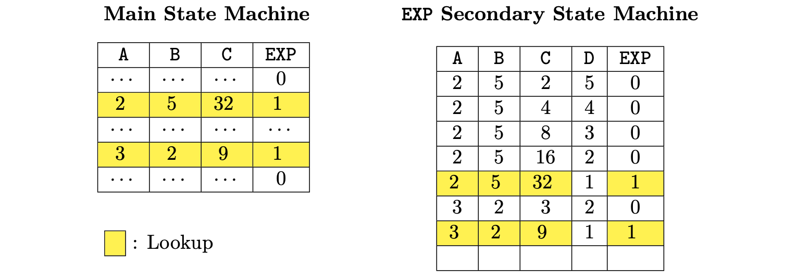
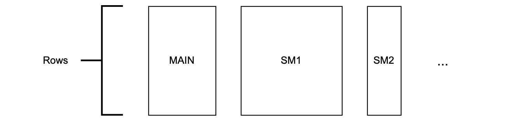

Let's assume that the cryptographic backend only allows defining constraints with additions and multiplications.

Consider implementing an exponentiation operation, denoted by EXP. 

This can be implemented by performing a few multiplications. 

An execution trace can be set to only 3 columns A, B and C, each defined by the following constraints:

1. Column A represents the base, and it is defined by $a' = a$.
2. Column B stores the decreasing exponent, so $b' = b − 1$.
3. Column C stores the intermediate results. That is, $c' = c \cdot a$, 

For instance, a portion of the execution trace (that implements the operation $2^5 = 32$​) is shown in table below:

The above execution trace models the exponentiation operation $2^5$. The blue cells represent the input values, and the green cell contains the output of the computation.

When implementing this operation in the main execution trace, it’s important to know that each EXP operation will require multiple rows.

In fact, the exact number of rows required for EXP depends on the exponent.

This approach easily leads to a complicated set of constraints, together with a huge number of used up by the operation.

One way to solve to this problem is to utilize secondary execution traces tailor-made for specific computations like the EXP.

Such an approach assumes existence of the so-called _main execution trace_, to which a few specialist secondary execution traces are linked.

The cryptographic backend utilizes a mechanism called _lookup argument_ to link these execution traces. 

The lookup argument, in particular, provides the constraints required to check whether certain cells of a row match some cells in a row of another execution matrix.

## Linking execution traces via lookup arguments

Let us now explore how the above-mentioned approach, regarding having the main execution trace which is linked to secondary execution traces, actually works.

We continue with the EXP example, where only two execution traces are considered: 

- The main execution trace and 
- A secondary execution trace especially created for the EXP operation.

**The main execution trace**

In the main execution trace, shown in the table below, each EXP operation will occupy just one row. 

For the first EXP operation, the input values $2$ and $5$ yields the result $32$.

$$
\begin{aligned}
	\begin{array}{|c|c|c|c|c|c|}\hline
		\bf{\texttt{ A }} & \bf{\texttt{ B }} & \bf{\texttt{ C }} & \bf{\texttt{EXP}} \\ \hline
		\cdots & \cdots & \cdots & 0 \\ \hline
		2 & 5 & 32 & 1 \\ \hline
		\cdots & \cdots & \cdots & 0 \\ \hline
		\cdots & \cdots & \cdots & 0 \\ \hline
		\cdots & \cdots & \cdots & 0 \\ \hline
		\cdots & \cdots & \cdots & 0 \\ \hline
		3 & 2 & 9 & 1 \\ \hline
		\cdots & \cdots & \cdots & 0 \\ \hline
		\cdots & \cdots & \cdots & 0 \\ \hline
		\text{} & \text{} & \text{} & \text{} \\ \hline
	\end{array}
\end{aligned}
$$

In the main execution trace depicted above, we observe that the value $1$ in the EXP column flags when an EXP operation is performed.

A value $1$ in the EXP column indicates when (i.e., in which row,) to check whether the value of C can be derived by exponentiating the value in column A to the power of the value in column B.

The correctness of the result will be validated in a _secondary execution matrix_.

**Remark** 

An execution trace can be viewed as a set of states (in some state machine), where each row represents a state. For this reason, the terms _execution trace_ and _state machine_ are used interchangeably.

**A secondary state machine**

The secondary state machine operates in the same manner described for the $2^5$ EXP example.

 In this case, the columns are described as follows:

1. Column A represents the base.
    
    Observe that this column is allowed to contain several values as we may check several EXP operations in the same state machine for as long as we do not consume more rows than the fixed maximum.

2. Column B stores the exponent.

3. Column C stores the intermediate results.

4. Column D stores a decreasing counter. In each EXP operation, it starts with the same value as the exponent and keeps decreasing until arriving 1, meaning that the current operation has been finished.

5. The EXP column flags when the operation is actually finished. Rows with EXP equal to 1 are the ones where we can state consistency of EXP operations of the main state sachine via a lookup argument.

The connection between the two state machines is established through a lookup argument. 

Whenever EXP's selector value in the main state machine is $1$​, a search is made (looked up) in the secondary state machine for a row with the same values in the columns A, B and C.

Only rows with the value $1$ in the EXP selector column are searched.

The presence of a row with the exact same values in the secondary state machine as in the main state machine proofs that the EXP operation was correctly performed.

Otherwise, the prover would have cheated.

The linkage between the main state machine and the EXP secondary state machine is done by checking equality between yellow rows of both state machines.

**The zkEVM's Main state machine**

In the Main SM, we just put the inputs/outputs, that we call *free*, in a single row.

Recall that there is a PIL compiler that reads a PIL specification file and compiles it to an output file with a list of constraints and a format that can be consumed by the prover to generate a proof.

In the PIL language, the state machines, that is, the different sub-execution matrices linked together via lookup arguments, are called namespaces. 

In the [zkevm-proverjs](https://github.com/0xPolygonHermez/zkevm-proverjs) repository, you can find the PIL specification of the whole zkEVM.

There are several files, one for each state machine, such that `binary.pil`, that is responsible for constraining **binary operations** (such that additions of 256 numbers represented in base 2 and equality/inequality comparators), or `mem.pil`, which is responsible for managing **memory-related opcodes**.

The Main State Machine is constrained in the main.pil, which serves as the main entrypoint for the whole PIL of the zkEVM.

## Final remarks and future improvements

The columns of each state machine are defined by the design of its corresponding execution trace. 

Due to constraints in our existing cryptographic backend, it is mandatory that all state machines share the same number of rows.

The computation of an L2 batch can have branches and loops and hence, each L2 batch execution can use a different number of operations in the zkEVM. 

Consequently, the number of rows utilized by each state machine depends on the specific operations carried out during batch execution. 

Since the number of rows is fixed (and the same for all state machines) we can have unused rows. 

But, what is more important is that obviously, the size of the computation being proved must fit in the execution trace matrices available

Due to the specific cryptographic backend used in the prover, all the same state machines should have the same fixed amount of rows.
