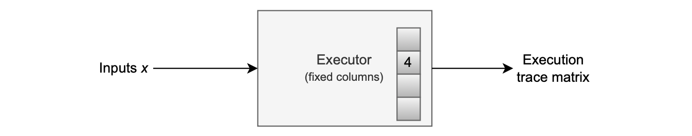
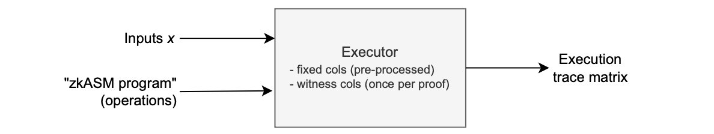
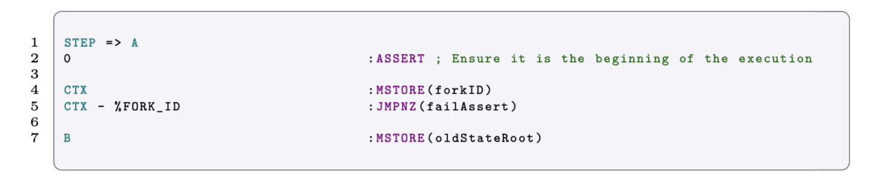

The executor is responsible for generating a correct execution trace from a given set of inputs.

As shown in the figure below, the executor takes some inputs and generates an execution trace.

There are two approaches in which the executor component can be implemented, depending on whether we prefer:

- A single-computation executor that only runs a specific program, or 
- A general purpose executor which runs several computations.

## Single-computation executor

A single-computation executor is tailor-made for a particular computation. This means any change in the computation will require the executor to be modified.

Although this type of executors are computationally faster, they are not easy to change, test, or audit. A single-computation executor is also called a **native executor**.

An electronic analogy to a native executor is an Application Specific Integrated Circuit (ASIC). An ASIC is a circuit specifically designed to run a single computation efficiently.

Since a native executor always performs the same operation with different sets of inputs, the fixed column of the execution trace can be ''hardcoded" or pre-processed.

A native executor for computing $[(x_0 +x_1)·4]·x_2$, as in our previous example, can be depicted as in the figure below.

## General-computation executor

A general-computation executor can run a wide variety of programs.

In this approach, the executor component not only reads inputs, as in the previous approach, but also interprets each program.

A program therefore, is like a set of instructions that guides the executor on how to compute the execution trace for a specific computation.

In the general-computation executor case, we therefore add programs written in the zero-knowledge Assembly (zkASM[^1]) language, as inputs to the Executor.

A general-computation executor takes as inputs:

- Input values: For instance, $x := (x_0, x_1, x_2)$ 
- An ordered set of instructions: For instance, $\big( \texttt{ADD},\ \texttt{TIMES4},\ \texttt{MUL} \big)$.

This means the executor corresponding to the above example, where the computation $[(x_0 + x_1) · 4] · x_2$ was executed, is in fact a general-computation executor.

## Example (Same executor, different program)

Note that the same executor, used in the above example, can be used to execute any other program that involves the available instructions: $\texttt{ADD},\ \texttt{TIMES4},\ \texttt{MUL}$​.

Consider the following computation:

$$
(x_0 \cdot 16)·x_1
$$

which translates to the following program, given as an ordered set of instructions:

$$
\big( \texttt{TIMES4},\ \texttt{TIMES4},\ \texttt{MUL} \big)
$$

Since this program involves available instructions, the same executor of the previous example can be used to execute this program.

The corresponding execution trace, for when the input value $x := (2,3,\_)$, is given below:

## Comparing the two executor types

Each executor type has its own pros and cons.

Single-computation executors do not need to read instructions from programs as they always perform the same operations. They are fast as they do not have to read or compile assembly codes.

This type of executors are therefore efficient in generating execution traces.

The main drawback of single-computation executors is their inflexibility, making them difficult to modify, test, or audit.

In contrast, general-computation executors are much slower than their counterparts as they need to read and compile input programs written in zkASM.

The biggest advantage with general-computation executors is flexibility. It is more efficient to keep modifying the assembly code than the whole executor.

The pros and cons of the two executor types is summarised in the table below.

|    Executor type    |     Pros      |     Cons      |
| :-----------------: | :-----------: | :-----------: |
| Single-computation  |    Faster     | Less flexible |
| General-computation | More flexible |    Slower     |

## Programs written in zkASM

As mentioned earlier, the executor takes as inputs programs that are written in the zero-knowledge Assembly (zkASM) language.

zkASM is a language developed by the Polygon Hermez team, and it is used to write instructions for the general-computation executor.

You can find a syntax highlighter, for VS Code, in the [$\texttt{zkasmcom-vscode}$](https://github.com/0xPolygonHermez/zkasmcom-vscode) repository.

Below is a zkASM code snippet, which is taken from the zkEVM project.

zkASM comes with a compiler called $\texttt{zkasmcom}$. 

This $\texttt{zkasmcom}$ compiler,

- First reads a program written in zkASM, which is a `.zkasm` specification file.
- Then compiles and outputs an instruction file, which is a `.json` file containing a list of steps and instructions the executor must follow when creating the execution trace.

 

The general-computation executor approach suits the zkEVM context best, because both the EVM and the zkEVM evolve. Also, it is more efficient to keep modifying the assembly code than the whole executor. 

The zkASM program that processes EVM transactions is called **zkEVM ROM** (as in "Read Only Memory") or simply the ROM. 

By changing the ROM, we can make the L2 zkEVM more and more closer to the L1 EVM. 

Henceforth, we have different versions of the zkEVM ROM. Each of these versions will be denoted with a unique identifier called **forkID**. 

It is worth mentioning that another advantage of using a ROM-based approach is that we can test small parts of the assembly program in isolation. 

Since each approach to executor design serves a different purpose, the zkEVM utilizes both approaches. 

However, the single-computation executor is still work in progress.

[^1]: "zkASM" is read as 'zk-assembly'
