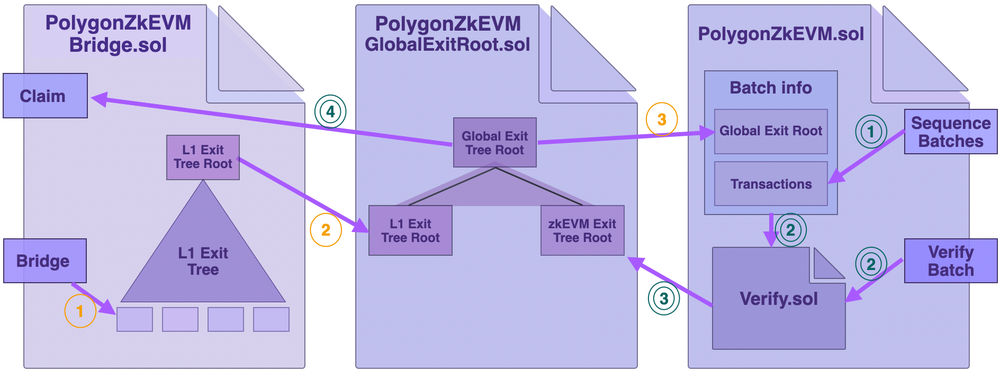
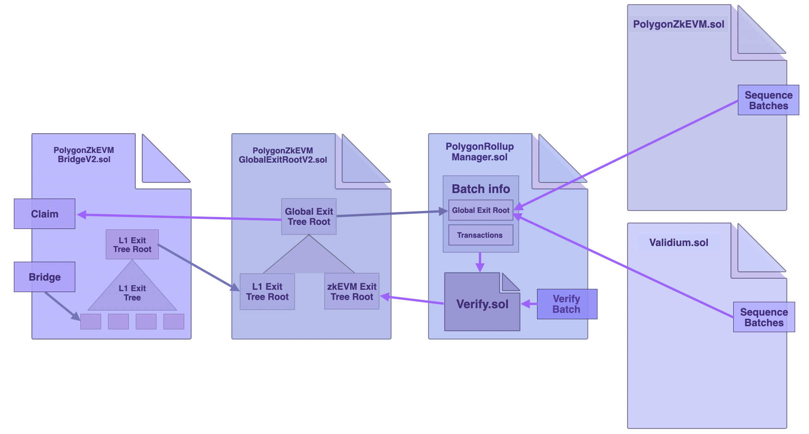
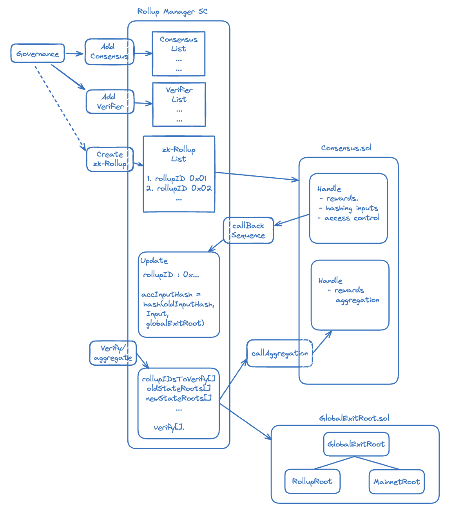

The LxLy bridge is an interoperability solution aimed at enabling cross-chain communication among networks. It facilitates interaction between two L2 chains or between an L2 chain and Ethereum as the L1.

The LxLy bridge SC (or [PolygonZkEVMBridgeV2](https://github.com/0xPolygonHermez/zkevm-contracts/blob/feature/v2ForkID5/contracts/v2/PolygonZkEVMBridgeV2.sol)) is an improved and a more robust version of the [zkEVM bridge](https://github.com/0xPolygonHermez/zkevm-contracts/blob/feature/v2ForkID5/contracts/PolygonZkEVMBridge.sol) deployed in the Polygon zkEVM mainnet_beta version_.

Its modular design capacitates projects to deploy their own rollups and connect them to the Polygon ecosystem.

## Ideal attributes

The LxLy bridge is deployed in the Polygon ecosystem to enable the following features and functionalities:

- **Accessibility**: Projects can request creation of a rollup and connect it to the Polygon ecosystem.
- **Unified liquidity**: All rollups can connect through the same bridge, enabling L2 to L2 bridges.
- **Polygon CDK**: All the rollups can use the same stack.
- **Rollup-project oriented**: Every project can have its own rollup.
- **Cross-rollup communication**: All the rollups connect and communicate using the LxLy bridge, enabling seamless L2 to L2 bridging.
- **Rollup upgradability**: All the deployed rollups should be upgradeable in accordance with its own governance mechanism.

These functionalities are accomplished by modifying a few key components in the architecture of the zkEVM bridge version-1.

## zkEVM bridge version-1

Here is a brief review of the zkEVM bridge's architecture.

Version-1 consists mainly of three (3) smart contracts:

- The bridge contract ([PolygonZkEVMBridge.sol](https://github.com/0xPolygonHermez/zkevm-contracts/blob/feature/v2ForkID5/contracts/PolygonZkEVMBridge.sol)), which handles transfer of assets and messages between networks.
- The global exit root manager contract ([PolygonZkEVMGlobalExitRoot.sol](https://github.com/0xPolygonHermez/zkevm-contracts/blob/feature/v2ForkID5/contracts/PolygonZkEVMGlobalExitRoot.sol)), which facilitates synchronization of state-info between the L2 and the L1.
- The Polygon zkEVM consensus contract ([PolygonZkEVMEtrog.sol](https://github.com/0xPolygonHermez/zkevm-contracts/blob/1ad7089d04910c319a257ff4f3674ffd6fc6e64e/contracts/v2/consensus/zkEVM/PolygonZkEVMEtrog.sol)), which handles the sequencing and verification of transactions in the form of batches.

### Global exit trees review

Critical to the design of the LxLy bridge are exit trees and the global exit tree.

Each chain has a Merkle tree called an _exit tree_, to which a leaf containing data of each asset-transfer is appended. Since such a leaf records data of the asset exiting the chain, it is called an _Exit Leaf_.

Another Merkle tree whose leaves are roots of the various exit trees is formed, and it is called the _global exit tree_.

The root of the global exit tree is the single source of state-truth communicated between rollups.

It is the global exit root manager contract's responsibility to update the global exit tree root and acts as a custodian for the global exit tree's history.

A complete transfer of assets in version-1 involves invoking three smart contracts; `PolygonZkEVMEtrog.sol`, `PolygonZkEVMBridge.sol` and `PolygonZkEVMGlobalExitRoot.sol`.

The below figure depicts a _bridge_ of assets and a _claim_ of assets;



Observe, in the above figure, that the consensus contract (`PolygonZkEVMEtrog.sol`) is able to:

- Retrieve the global exit root from the mainnet, and make it available in L2
- Update the exit tree root in the global exit tree root manager.

## LxLy bridge version-2 design

Multiple ZK rollups such as zkEVMs, zk-Validiums or zk-VMs, can be created and connected through the same LxLy bridge.

Thanks to the introduction of an additional smart contract called the [_rollup manager_](https://github.com/0xPolygonHermez/zkevm-contracts/blob/feature/v2ForkID5/contracts/v2/PolygonRollupManager.sol).

Although the logic for _bridging_ or _claiming_ assets from one network to another remains the same, individual L2 consensus contracts no longer handle verification of their own network's sequenced batches.

In the context of the LxLy bridge, the _rollup manager_ contract verifies sequenced batches from various networks.

In addition to verification of sequenced batches, the _rollup manager_ contract also creates consensus contracts for networks connecting via the LxLy bridge.

### What remains unchanged from version-1?

The strategy to separate the _bridge logic_ from the _global exit root logic_ remains intact. This is key to achieving interoperability.

Consensus contracts of each connected network handle the sequencing of their own batches, but send the batch data to the _rollup manager_ contract for verification.

The _rollup manager_ contract stores the information of the sequenced batches in the form of an _accumulated input hash_, as in the version-1 of the zkEVM bridge.

Once sequenced batches have been verified, the _global exit tree_ gets updated, in an approach similar to the zkEVM bridge version-1.



### Rollup manager's role

The rollup manager is in charge of the following lists of availability:

- Rollup consensus mechanisms: The list may consist of consensus contracts such as `PolygonZkEVMEtrog.sol` or `zkValidium.sol`.
- Verifier contracts: For example, the `PolygonZkEVMEtrog.sol` uses the `Verifier.sol` contract for verification of batches.

The governance contract oversees consensus mechanisms and verifiers that can be added to the respective lists.

The [rollup manager contract](https://github.com/0xPolygonHermez/zkevm-contracts/blob/feature/v2ForkID5/contracts/v2/PolygonRollupManager.sol) has the relevant function for adding a new rollup:

```bash
function createNewRollup(
    uint32 rollupTypeID,
    uint64 chainID,
    address admin,
    address sequencer,
    address gasTokenAddress,
    uint32 gasTokenNetwork,
    string memory sequencerURL,
    string memory networkName
) external onlyRole(_CREATE_ROLLUP_ROLE) {
    // Check that rollup type exists
    if (rollupTypeID == 0 || rollupTypeID > rollupTypeCount) {
        revert RollupTypeDoesNotExist();
    }
```

- To create and connect a rollup to the LxLy bridge,

  - The developer selects the consensus and verifier for the required rollup amongst those available in the rollup manager's lists,
  - Requests creation of a rollup with the selected specifications,
  - Governance contract invokes the rollup manager's `addNewRollupType()` function,
  - Once a rollup is created, the transfer of assets can be processed in the usual manner.

### Overall flow of events

The following diagram captures the following flow of events, most of which are handled by the rollup manager contract:

- Updating rollup manager's lists.
- Creating rollups.
- Sequencing of batches.
- Aggregation or proving of batches.
- Verification of batches.
- Updating the global exit root.



## Conclusion

Although the LxLy bridge is still in development, it is a central component to the AggLayer which offers multi-chain interoperability.

The LxLy bridge currently works with the Polygon zkEVM as the L2 and the Ethereum network as L1.

The next step is to enable developers wishing to create a zk-rollup to choose between a zkEVM and a zkValidium rollup.

The idea of handling verification of several networks in a single contract, is a pre-cursor to the ultimate and envisaged _interop layer_ for the Polygon ecosystem.

The code for the LxLy bridge version-2 can be found [here](https://github.com/0xPolygonHermez/zkevm-contracts/tree/feature/v2ForkID5/contracts/v2).
