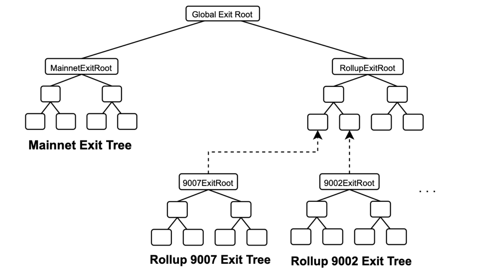
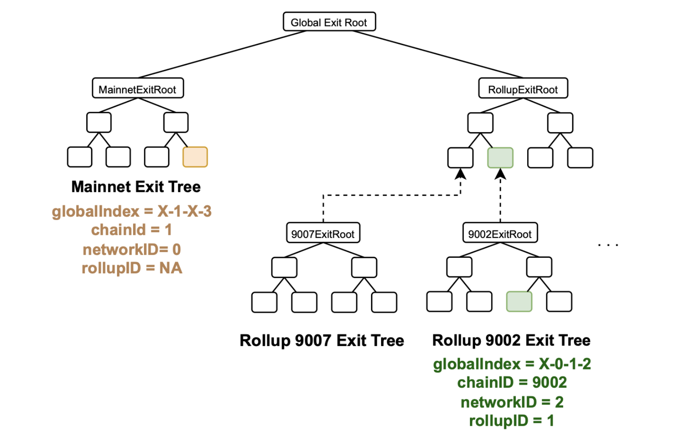

This section provides details of how the mainnet global exit tree and the rollups' global exit trees are constructed.

## New global exit tree

Due to the presence of multiple layers in the uLxLy bridge, it becomes necessary to adjust the global exit tree so as to accommodate exits across all these layers.

The mainnet has a local exit tree built as an append-only tree of 32 levels.

Each rollup has a local exit tree which is also built as an append-only tree of 32 levels.

All the rollups are grouped together in a tree of rollups called the **rollup exit tree**, which is again built as an append-only tree of 32 levels.

The figure below illustrates how the global exit tree has been modified in order to introduce more than one rollup.

The design of the updated global exit tree has two main branches:

- One containing the root of the mainnet exit tree, and
- The other branch containing the root of the **rollup exit tree**, which summarizes exit trees of all the rollups. The rollup exit tree has as its leaves all the local exit roots of the different rollups.

## Rollup identifiers

Every rollup has a set of distinct identifiers that are essential for its functioning and interaction within the larger network ecosystem.

- The $\texttt{chainID}$ is a unique identifier that distinguishes a rollup from other chains in the Ethereum ecosystem, and it is crucial for preventing replay attacks. See the list of chain IDs of different networks [here](https://chainlist.org/).
- A $\texttt{networkID}$ identifier defines a rollup in the Polygon ecosystem, allowing network participants to uniquely identify and interact with the rollup. The Ethereum mainnet is identified by  $\texttt{networkID = 0}$, while the $\texttt{networkID = 1}$ is reserved for the Polygon zkEVM, and so on.
- The $\texttt{rollupIndex}$ is an identifier used to identify a rollup within the rollup tree. The first rollup, being the Polygon zkEVM, has $\texttt{rollupIndex = 0}$. And in general, $\texttt{rollupIndex = networkID - 1}$.

## Global index

When creating and verifying proofs, an index called $\texttt{globalIndex}$ is used to uniquely locate a leaf in the new global exit tree.

A $\texttt{globalIndex}$​​​ is a 256-bit string composed of unused bits, mainnet flag, rollup index bits, and local root index bits.

$$
\texttt{globalIndex} = \texttt{(unused bits)_} \texttt{(mainnet flag)_} \texttt{(rollupIndex)_} \texttt{(local root index)}
$$

Starting from the most significant bit, a $\texttt{globalIndex}$ consists of the following bits:

- $191$ bits of unused bits: These bits are unused, and can be filled with any value. The best option is to fill them with zeros because zeros are cheaper.
- $1$ bit of mainnet flag: This single bit serves as a flag indicating whether an exit pertains to a rollup (represented by $0$) or the mainnet (indicated by $1$).
- $32$ bit of the rollup Index: These bits indicate the specific rollup being pointed at, within the rollup exit tree. These bits are therefore only used whenever mainnet flag is $0$.
- $32$ bits of the local root index: These bits indicate the specific index being pointed at, within each rollup's local exit tree.

The figure below depicts how the $\texttt{globalIndex}$ is interpreted:

- The mainnet exit tree has the $\texttt{globalIndex = X_1_X_3}$, where 
  - the $\texttt{mainnet flag}$ equals $\texttt{1}$ to indicates that it's the mainnet, and 
  - the $\texttt{local root index}$ being $\texttt{3}$ points at the fourth leaf in the mainnet exit tree.
- The rollup 9002's exit tree has the $\texttt{globalIndex = X_0_1_2}$, where 
  - the $\texttt{mainnet flag}$ is $\texttt{0}$ indicating that it's a rollup, 
  - the $\texttt{rollupIndex = 1}$ means the rollup is the second in the rollup exit tree, and 
  - the $\texttt{local root index = 3}$, pointing at the fourth leaf in the rollup 9002's exit tree.

