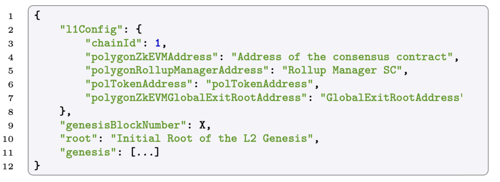
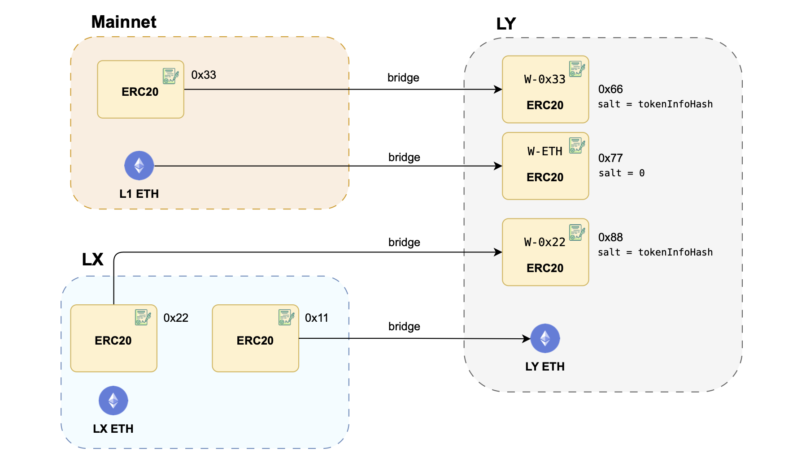

This covers node configuration parameters, interchange of tokens among chains, and the mention of an issue with CREATE2. 

### Node configuration

The node configuration for a rollup (or validium) network typically involves specifying various parameters and addresses that are crucial for its operation.

The figure below provides a detailed breakdown of network parameters, which are given here as a snippet of node configuration within a TOML file.

The $\texttt{chainId}$ is the chain identifier of the base layer (i.e., The Ethereum mainnet in this case).

The $\texttt{genesisBlockNumber}$ is the L1 block number in which the rollup or validium is created.

## Gas tokens and inter-layer exchanges

The native currency for paying gas at a certain layer can be:

- Any ERC-20 token instance on any other layer, or
- L1 ETH.

If a token is used for paying gas in a network, it is referred to as the **gas token** for the layer.

If we are using a gas token at a layer, it is still possible to send **L1 ETH** to the layer.

In this case, the ETH gets accounted for in an ERC-20 contract called wrapped ETH (or W-ETH), which is just another ERC-20 instance.

Note that W-ETH is different from the contract W-ETH (a contract for converting ETH into an ERC-20 token that runs on L1 at this address $\text{0xC02aaA39b223FE8D0A0e5C4F27eAD9083C756Cc2}$.)

Regarding the creation of the ERC-20 tokens with CREATE2:

- Use $\texttt{salt = 0}$ to create the W-ETH contract.
- Use $\texttt{salt = tokenInfoHash}$ for the rest of the wrapped tokens of the layer with tokenInfoHash defined as the following hash:

$$
\texttt{tokenInfoHash = keccak256(originNetwork, originTokenAddress)}
$$

As a final remark, note that L1 ETH is the only native currency that can be used as a native currency in another layer.

The figure below, illustrates various scenarios of inter-layer exchanges that can occur within the system.

With focus on **LY** as a layer of interest, the diagram depicts several scenarios, such as 

- Bridging an ERC-20 token from mainnet to LY
- Bridging L1 ETH to LY gas token, or 
- Bridging a wrapped ERC-20 token living on LX to LY ETH.

## Upgradable CREATE2 factory issue

Note that the bridge contract is a factory of ERC-20 token instances created with $\texttt{CREATE2}$. 

Recall that $\texttt{CREATE2}$ uses the following formula to compute the address of the instances:

$$
\mathtt{instance\_address} = \mathtt{hash(0xFF, sender, salt, creationBytecode, [args])}
$$

Recall also that in the bridge contract, the mapping $\texttt{tokenInfoToWrappedToken}$ stores the addresses of all the wrapped ERC-20 tokens of the layer. 

The problem is that if we change the $\texttt{creationBytecode}$ of the ERC-20 token contract, this will change all the addresses of the contract instances and breaks the data of the mapping.

The $\texttt{creationBytecode}$ will change with high probability if we compile the factory (in our case the bridge) with another version of the Solidity compiler. In this case, we had two options:

(a) Freeze the Solidity compiler version for the development of the whole bridge contract. 

(b) Freeze the $\texttt{creationBytecode}$ of the ERC20 token contract.

We opted for the second solution because the ERC20 code is not prone to change so much, while freezing the compiler (and the language) for the whole bridge could constrain its future development. Taking this approach, in the $\mathtt{BASE\_INIT\_BYTECODE\_WRAPPED\_TOKEN}$ variable of the bridge contract you can find the pre-compiled $\texttt{creationBytecode}$ of our ERC20 token contract.
