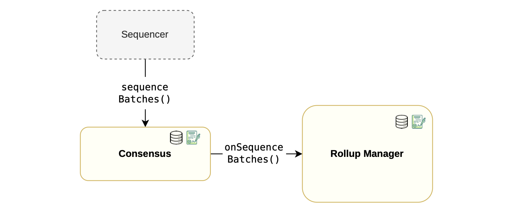
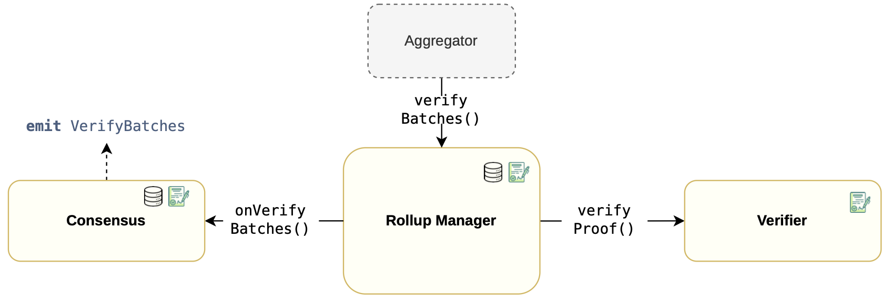

This section entails the flows for sequencing and verification of proofs.

### Sequencing flow

The sequencing flow starts with the sequencer invoking the $\texttt{sequenceBatches()}$ function, which is within the consensus contract, to send batches that are to be sequenced.

Since state information must be stored within the $\texttt{RollupManager}$ contract, a callback function called $\texttt{onSequenceBatches()}$ is triggered to store this data in the corresponding $\texttt{RollupData}$ struct.

The figure below depicts a simplified sequencing flow within the rollup manager component:

- It starts when the sequencer calls the $\texttt{sequenceBatches()}$ function,
- Which in turn invokes a callback function $\texttt{onSequenceBatches()}$, 
- Followed by the rollup manager storing the sequence data in the $\texttt{RollupData}$ struct.

### Verification flow

Recall that the aggregator is responsible for constructing proofs that validate correct processing of batches.

Once a proof is constructed, the Aggregator transmits it to the $\texttt{RollupManager}$ for verification, by invoking the $\texttt{verifyBatches()}$ function. 

The $\texttt{RollupManager}$ calls the $\texttt{verifyProof()}$ function in the verifier contract, which either validates the proof or reverts if the proof is invalid.

If verification of the proof is successful, a callback function $\texttt{onVerifyBatches()}$ in the consensus contract is called.

The $\texttt{onVerifyBatches()}$ function emits the $\texttt{VerifyBatches}$ event, containing important details of the processed batches, such as the last verified batch. 

The figure below depicts the verification flow within the rollup manager component:

- It starts when the aggregator calls $\texttt{verifyBatches()}$ function.
- Then the rollup manager invokes the $\texttt{verifyProof()}$ function, which involves a secondary stateless $\texttt{Verifier}$ contract.
- Successful verification of a proof is followed by a call to the $\texttt{onVerifyBatches()}$ function.
- At the end of the process, the consensus contract emits the $\texttt{verifyBatches}$ event.

