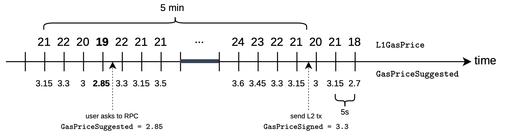
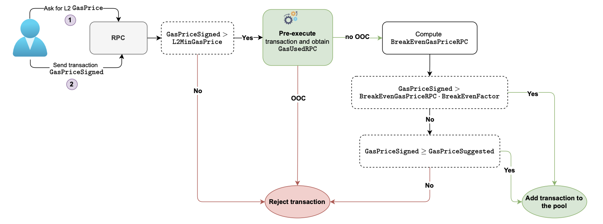
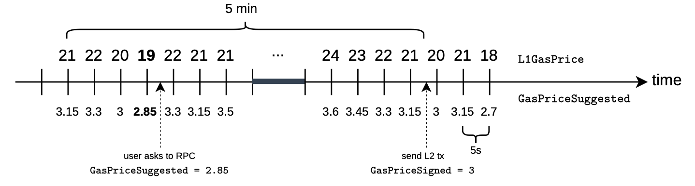
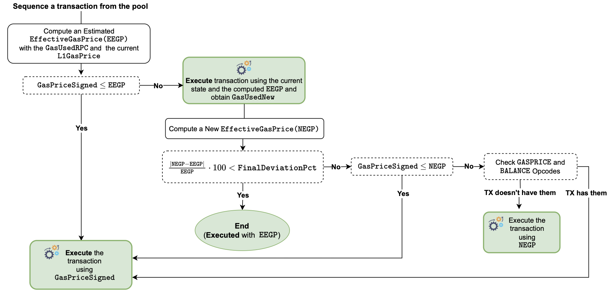
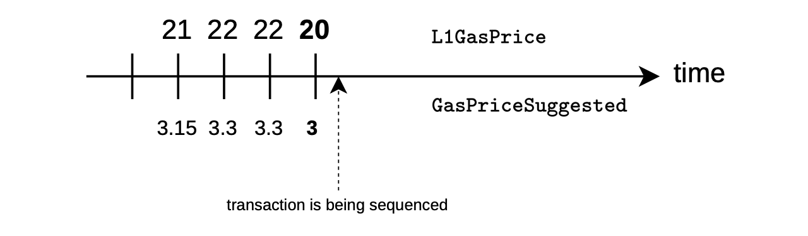

The aim with this document is to describe the Effective Gas Price (EGP), a mechanism by which the Polygon zkEVM network charges gas fees in a more fair and accurate manner. These fees cover L1 data-availability and L2 execution costs. It is meant to help users set the $\texttt{gasPrice}$ such that there's little chance for a transaction revert or failure.

## Basic Ethereum fee schema

Let's make a quick recollection of the basic fee schema used in Ethereum.

Firstly, gas is a unit that accounts for resources used when processing a transaction. At the time of sending a transaction, the user can decide two parameters; $\texttt{gasLimit}$ and $\texttt{gasPrice}$:

- $\texttt{gasLimit}$ is the maximum amount of gas units that a user is willing to buy in order to complete a transaction.

- $\texttt{gasPrice}$ refers to the amount of wei a user is willing to pay for $1$ gas unit.

Note that transactions with higher $\texttt{gasPrice}$ receive faster confirmation. So, if a user wants their transactions to be prioritized, then they would have to set a high $\texttt{gasPrice}$ for their transactions.

At the start of the transaction processing, the following amount of Wei is subtracted from the source account balance:

$$
\texttt{gasLimit} \cdot \texttt{gasPrice}
$$

If $\texttt{gasUsed}$ is greater than $\texttt{gasLimit}$, the transaction is reverted because the transaction cost is higher than what the user is willing to pay.

But, if the $\texttt{gasUsed}$ is less than or equal to $\texttt{gasLimit}$, the transaction gets processed and the unused amount of Wei is refunded.

The refunded amount of Wei is added back to the source account, and it is calculated as follows:

$$
\texttt{gasLimit} · \texttt{gasPrice} - \texttt{gasUsed} \cdot \texttt{gasPrice}
$$

It is important to observe that while the transaction is being processed, the balance of the source account may differ from its state at the time of sending the transaction. 

More specifically, if the `BALANCE` opcode is invoked during the transaction processing, the output will be:

$$
\texttt{initialBalance} − \texttt{gasLimit} \cdot \texttt{gasPrice}
$$

where $\texttt{initialBalance}$ represents the balance of the source account before the execution of the transaction. 

## Generic gas fee strategy for L2s

What about setting $\texttt{gasPrice}$ in L2 networks?

L2 user's $\texttt{gasPrice}$ estimation needs to include two factors; the L2 transaction costs, as well as the cost for availing transaction data in L1.

In general, L2 solutions charge an L2 gas price that is a percentage of the L1 $\texttt{gasPrice}$:

$$
\texttt{L2GasPrice} = \texttt{L1GasPrice} \cdot \texttt{L1GasPriceFactor}
$$

**Example**.

For an L1 gas price of $20$ Gwei, a 4% factor can be set for a particular L2 solution. The L2 gas price is obtained as follows:

$$
\texttt{L2GasPrice} = 20 \text{ Gwei} \cdot 0.04 = 0.8 \text{ Gwei}
$$

Current L2 fees can be looked at here https://l2fees.info.

However, setting an L2 gas fee is not as simple as choosing a factor to multiply with the L1 gas price. There are other aspects to be considered.

Let's think about the following aspects:

1. The $\texttt{gasPrice}$ in L1 fluctuates with time. 
2. High $\texttt{gasPrice}$ values work as incentives for prioritization of transactions in L1.
3. The L1 $\texttt{gas/gasPrice}$ schema may not be aligned with the actual resources spent by the L2 solution.

Their corresponding pertinent questions are:

- How does the zkEVM's transaction processing mechanism mitigate against L1 $\texttt{gasPrice}$ fluctuations?

- How do L2 solutions effectively manage these prioritizations?

- How do L2 solutions address and reconcile any discrepancies between the L1 gas schema and the real resource utilization on L2?

### Time-related variations

So, how can the fact that the L1 $\texttt{gasPrice}$ varies with time be taken into account?

In order to obtain L1 gas prices, we can poll for it every 5 seconds. As shown in the timeline below, gas prices vary with time.

## Gas price suggester

Let's take a quick view of the initial phase of the process, which involves the RPC component of zkEVM.

Pre-execution of a transaction involves the following stages:

- Estimation of the $\texttt{gasPrice}$, adding it to a transaction, and submitting the transaction to L2.
- Checking user's signed $\texttt{gasPrice}$ against the expected $\texttt{L2GasPrice}$, then either discarding or storing the transaction in the Pool.
- Sequencer forms batches with transactions from the pool, preparing batches for execution.

See the the picture below for an overview of the pre-execution process.

### Naïve approach

Let's look at this in two parts; gasPrice suggestion, and transaction sending.

In the first step, the user asks via an RPC call for a suggested gas price to sign with. The suggested price $\texttt{L2GasPrice}$ is computed as:

$$
\texttt{L2GasPrice} = \texttt{L1GasPrice} \cdot \texttt{L1GasPriceFactor}
$$

to sign a transaction with.

After receiving the suggested gas price, the user sends the desired L2 transaction with gas price of their choice. Call it **signed gas price**, denoted by $\texttt{GasPriceSigned}$.

Observe that the user's chosen gas price can be equal to, greater than, or lower than the suggested price, each resulting in one of the two scenarios: either transaction accepted or transaction rejected. See the below figure.

If $\texttt{GasPriceSigned}$ provided by the user is less than the current $\texttt{L2GasPrice}$, the transaction is automatically rejected[^a] and not included into the pool (error $\texttt{ErrGasPrice}$).

[^a]: Recall that the transaction can be rejected due to other checks explained before.

### Decision interval approach

However, this previous scenario does not offer good UX.

There is an unbounded interval of time between when the user requests for a suggested $\texttt{gasPrice}$ and when a transaction with the signed gas price can be sent to L2.

During the time when the user receives the suggested $\texttt{gasPrice}$, includes it in the transaction, and finally submits the transaction to L2, the actual $\texttt{L2GasPrice}$ could have increased substantially.

As depicted in the figure below, the $\texttt{L2GasPrice}$ could be refreshed in the interim, causing the transaction to be rejected.

The above scenario is undesirable. And thus needs to be remedied.

One solution to the above situation is to, instead of comparing the user's $\texttt{GasPriceSigned}$ with the current $\texttt{L2GasPrice}$, rather compare it with the minimum $\texttt{L2GasPrice}$ among the suggested gas prices in the given time interval.

That is, allow transactions from users that have signed any $\texttt{SignedGasPrice}$ above the minimum L2 gas price recorded during a given time interval. 

Call it the $\texttt{MinAllowedPriceInterval}$. And denote the minimum L2 gas price by $\texttt{L2MinGasPrice}$.

So then, given the $\texttt{MinAllowedPriceInterval}$, transaction are rejected only if the $\texttt{SignedGasPrice}$ does not exceed $\texttt{L2MinGasPrice}$. That is, checking the following condition:

$$
\texttt{SignedGasPrice} > \texttt{L2MinGasPrice}
$$

**Example** 

The figure below shows the case where $\texttt{MinAllowedPriceInterval} = 5 \texttt{\ minutes}$ and the lowest suggested $\texttt{L2GasPrice} = 18$. 

So, if the user signed with $\texttt{SignedGasPrice} = 18$, then the transaction gets rejected because it will not cover costs as it is not above the $\texttt{L2MinGasPrice}$.

Whereas, if the user signs with only $\texttt{SignedGasPrice} = 19$, then the transaction would be accepted (though the risk of revert is not totally ruled out).

These parameters can be configured in the Polygon zkEVM node:

- $\texttt{DefaultMinGasPriceAllowed}$ which is the default minimum gas price to suggest.
- $\texttt{MinAllowedGasPriceInterval}$, as explained above, is the interval within which to find the lowest suggested gas price and compare it with the user's gas price in the transaction.
- $\texttt{PollMinAllowedGasPriceInterval}$ is the interval to poll L1 in order to find the suggested L2 minimum gas price.
- $\texttt{IntervalToRefreshGasPrices}$ is the interval to refresh L2 gas prices.

More specifically, these are configured in the $\texttt{[Pool]}$ section of the configuration file found [here](https://github.com/0xPolygonHermez/zkevm-node/blob/b938572f138ba6cc40ef6736153c469afeb11c96/config/default.go#L37)

### Final approach

However, in the previous design, the zkEVM endpoint responsible for offering a gas price suggestion to the user, known as the **L2 Gas Price Suggester**, faces a significant problem design.

The price of posting transactional data to L1 is charged to the zkEVM network at a **full L1 price**.

Therefore, if we propose a gas price using $\texttt{L1GasPriceFactor}$, representing the measure of computational reduction in L2, there is a risk of running out of Wei reserves for posting data to L1.

**Solution**

In order to solve the previous situation, we will recommend a slightly higher percentage of the gas price to the user, employing a $\texttt{SuggesterFactor of 0.15 ≈ 4 · L1GasPriceFactor}$ such that:

$$
\texttt{GasPriceSuggested = L1GasPrice · SuggestedFactor}
$$

### Numerical example: $\texttt{L2MinGasPrice}$

In the figure below, we observe that when the user queries the suggested gas price through the RPC, the network responds with the current suggested gas price computed as:

$$
0.15 · 19 = 2.85
$$

where $19$ is the current L1 gas price, updated every $5$ seconds.

We observe that, with the naïve approach, the user should have signed with a gas price that's higher than

$$
0.15 \cdot 21 = 3.15
$$

because the L1 gas price at the moment of sending the transaction is $21$.

However, using the final approach, at the time of sending the transaction, the RPC will accept the transaction as long as $\texttt{GasPriceSigned}$ is higher than the minimum suggested gas price from the $5$ minutes interval (as shown in the figure), which in this instance is:

$$
19·0.15 = 2.85
$$

In order to get his transaction accepted, the user must set the gas price of the transaction to:

$$
\texttt{GasPriceSigned} = 3.3 > 2.85 = \texttt{L2MinGasPrice} 
$$

The user has signed with gas price that is higher than the suggested gas price to ensure that the transaction is executed and maybe get prioritizes among other transactions.

## L1/L2 cost discrepancies

As mentioned above, gas in Ethereum is used to account for the resources used by a transaction.

It takes two elements into account:

- **data availability**, which is measured in the transaction bytes.
- **processing resources**, such as CPU, Memory and Storage.

A notable challenge arises when certain operations consume low gas in L1, but represent a major cost in L2.

In other words, the reduction factor expressed in the L1-L2 gas price relationship:

$$
\texttt{L2GasPrice} = \texttt{L1GasPrice} · \texttt{L1GasPriceFactor}
$$

may not be constant among all the computational resources, introducing a problem.

L2 execution costs are variable, depending on the state of the transaction and typically offer a smaller cost per gas. 

However, the costs associated with data availability are fixed once the transaction is known, and they are directly proportional to L1 data availability costs. 

Consequently, in the zkEVM pricing schema, L2 transactions with high data availability costs and small execution costs are a significant challenge. This presents another pricing misalignment issue we need to face.

### Possible solutions

Recall that the Ethereum fees in L1 are computed as:

$$
\texttt{gasUsed} \cdot \texttt{gasPrice}
$$

giving us two ways of solving the misalignment problem between costs in L1 and L2:

**Option A**: Increasing the $\texttt{gasUsed}$, which is the approach taken by Arbitrum.

This approach involves modifying the gas schema to elevate the gas costs associated with data availability. While this strategy is relatively straightforward to implement and comprehend, it comes with a notable implication: **it changes the Ethereum protocol**. 

An L1 Ethereum transaction may execute different when compared to the same transaction executed in L2.

**Option B**: Increasing the $\texttt{gasPrice}$ to what is herein referred to as the **Effective Gas Price Approach**.

If we aim to avoid modifying the gas model, the alternative is to increase the gas price to cover the costs. 

Unlike the Option A approach, this doesn’t alter the Ethereum specifications.

However, determining a fair gas price becomes a complex task. Moreover, we have to take into account the need for L2 user to add incentive for their transactions to be prioritized, which further increases gas price.

This is the approach taken by the zkEVM team.

### Effective gas price approach

We will now develop how the **Effective Gas Price Approach** works.

First, the user signs a relatively high gas price at the time of sending the L2 transaction. Later on, by pre-executing the sent transaction, the sequencer establishes a fair gas price according to the amount of resources to be used.

To do so, the sequencer provides an $\texttt{EffectivePercentage}$, which represents the portion of the total charged to the user.

In other words, this percentage will be used to compute the factor of the signed transaction’s gas price which should be refunded to the user.

In order to calculate the $\texttt{EffectivePercentage}$, one option is to consider the pricing resources based on the number of consumed counters within our proving system.

However, understanding this metric can be challenging for users because stating the efficiency through counters is not intuitive at the time of prioritizing their transactions.

For the sake of a positive user experience, a better alternative is to consider a formula where gas is used, as it is more user-friendly.

So, the primary objective is to compute $\texttt{EffectivePercentage}$ exclusively using gas, while allowing users to prioritize their transactions through the use of gas price, without the need for intricate counter-based considerations.

The effective percentage is computed as follows:

$$
\texttt{EffectivePercentage} = \frac{ \texttt{GasPriceFinal}}{ \texttt{GasPriceSigned}}
$$

where $\texttt{GasPriceFinal}$ is the gas price charged at the end of the entire processing by the sequencer. 

Observe that, by modifying $\texttt{GasPriceFinal}$, the amount of Wei that the user is charged for processing their sent transactions can be adjusted.

This $\texttt{EffectivePercentage}$ is provided by the sequencer as a single byte:

$$
\texttt{EffectivePercentageByte} \in \{ 0, 1, . . . , 255 \}
$$

which is computed from the $\texttt{EffectivePercentage}$:

$$
\texttt{EffectivePercentageByte} = (\texttt{EffectivePercentage} · 256) − 1
$$

Since having $\texttt{EffectivePercentage}$ implies having $\texttt{EffectivePercentageByte}$ and vice versa, the two terms can be used interchangeably. So, the $\texttt{EffectivePercentageByte}$ is often referred to as just $\texttt{EffectivePercentage}$.

**Example**

Setting an $\texttt{EffectivePercentageByte}$ of $255\ (= \texttt{0xFF})$ means the $\texttt{EffectivePercentage} = 1$. 

In which case the user would pay the totality of the gas price they signed with, when sending the transaction. That is:

$$
\texttt{GasPriceFinal} = \texttt{GasPriceSigned}
$$

In contrast, setting $\texttt{EffectivePercentageByte}$ to $127$ means:

$$
\texttt{EffectivePercentage} = 0.5
$$

so, only a half of the gas price the user signed with gets charged as the transaction cost:

$$
\texttt{GasPriceFinal} = \frac{\texttt{GasPriceSigned}}{2}
$$

The user therefore gets a refund which is half of the price he initially signed with.

Observe that users must trust the sequencer in this schema.

## Introducing $\texttt{BreakEvenGasPrice}$

The aim here is for the Polygon zkEVM network to avoid accepting transactions that result in financial losses.

In order to achieve this objective, the $\texttt{BreakEvenGasPrice}$ is set to the lowest gas price at which the Polygon zkEVM network incurs no losses.

As explained before, the computation is split in two; costs associated with data availability, and costs associated with the use of resources when transactions are processed.

### Costs associated with data availability

The cost associated with data availability is computed as,

$$
\texttt{DataCost} \cdot \texttt{L1GasPrice}
$$

where $\texttt{DataCost}$ is the cost in gas for data stored in L1.

The cost of data in Ethereum varies according to whether it involves zero bytes or non-zero bytes. In particular, non-zero bytes cost $16$ gas units, while zero bytes cost $4$ gas unints. 

Also, recall that the computation of the cost for _non-zero bytes_ must take into account the constant data which always appear in a transaction but not included in the RLP:

- The signature, which consists of $65$ bytes.
- The previously defined $\texttt{EffectivePercentageByte}$, which consists in a single byte. 

This results in a total of $66$ constantly present bytes.

Taking all in consideration, $\texttt{DataCost}$ can be computed as:

$$
\texttt{DataCost} = (\texttt{TxConstBytes} + \texttt{TxNonZeroBytes}) \cdot \texttt{NonZeroByteGasCost} \\
+\ \texttt{TxZeroBytes} \cdot \texttt{ZeroByteGasCost}
$$

where $\texttt{TxNonZeroBytes}$ represents the count of non-zero bytes in a raw transaction, and similarly $\texttt{TxZeroBytes}$ represents the count of zero bytes in a raw transaction sent by the user.

### Computational costs

Computational cost is calculated with the following formula:

$$
\texttt{GasUsed} \cdot \texttt{L2GasPrice}
$$

where $\texttt{L2GasPrice}$ is obtained by multiplying $\texttt{L1GasPrice}$ by a chosen factor less than $1$,

$$
\texttt{L2GasPrice} = \texttt{L1GasPrice} \cdot \texttt{L1GasPriceFactor}
$$

In particular, we choose a factor of $0.04$.

In contrast to costs for data availability, calculating computational costs necessecitates transactions to be executed.

### Total price of a transaction

The total transaction cost is simply the sum of data availability and computational costs:

$$
\texttt{TotalTxPrice} = \big( \texttt{DataCost} \cdot \texttt{L1GasPrice} \big) + \big(\texttt{GasUsed} \cdot \texttt{L1GasPrice} \cdot \texttt{L1GasPriceFactor} \big)
$$

In order to establish the gas price at which the total transaction cost is covered, we can compute $\texttt{BreakEvenGasPrice}$ as the following ratio:

$$
\texttt{BreakEvenGasPrice} = \frac{\texttt{TotalTxPrice}}{\texttt{GasUsed}}
$$

Additionally, we incorporate a factor $\texttt{NetProfit ≥ 1}$ that allows us to achieve a slight profit margin:

$$
\texttt{BreakEvenGasPrice} = \frac{\texttt{TotalTxPrice}}{\texttt{GasUsed}} \cdot \texttt{NetProfit}
$$

We then conclude that it is financially safe to accept the transaction if

$$
\texttt{SignedGasPrice} > \texttt{BreakEvenGasPrice}.
$$

However, a  problem arises:

In the RPC component, we’re only pre-executing the transaction, meaning we’re using an incorrect state root. Consequently, the $\texttt{GasUsed}$ is only an approximation.

This implies that we need to multiply the result by a chosen factor before comparing it to the signed price.

This ensures that the costs are covered in case more gas is ultimately required to execute the transaction. This factor is named $\texttt{BreakEvenFactor}$.

Now we can conclude that if
$$
\texttt{SignedGasPrice} > \texttt{BreakEvenGasPrice} \cdot \texttt{BreakEvenFactor}
$$

then it is safe to accept the transaction.

Observe that we still need to introduce gas price prioritization, which will be covered later on.

### Numerical example: Computing $\texttt{BreakEvenGasPrice}$

Recall the example proposed before, where the $\texttt{GasPriceSuggested}$ provided by RPC was $2.85$ gwei per gas, but the user ended up setting $\texttt{GasPriceSigned}$ to $3.3$.

The figure below depicts the current situation.

Suppose the user sends a transaction that has $200$ non-zero bytes, including the constant ones and $100$ zero bytes. 

Moreover, at the time of pre-executing the transaction, which is done without getting an out-of-counters (OOC) error, $60,000$ gas units are consumed.

Recall that, since we are using a "wrong" state root, this gas is only an estimation. 

Hence, using the previously explained formulas, the total transaction cost is:

$$
\texttt{TotalTxPrice} = \texttt{DataCost} \cdot \texttt{L1GasPrice} + \texttt{GasUsed} \cdot \texttt{L1GasPrice} \cdot \texttt{L1GasPriceFactor}\\ \implies  \texttt{TotalTxPrice} = (200 · 16 + 100 · 4) · 21 + 60, 000 · 21 · 0.04 = 126, 000\ \texttt{GWei}
$$

Observe that the $21$ appearing in the substitution is the $\texttt{L1GasPrice}$ at the time of sending the transaction.

Now, we are able to compute the $\texttt{BreakEvenGasPrice}$ as:

$$
\texttt{BreakEvenGasPrice} = \frac{\texttt{TotalTxPrice}}{\texttt{GasUsed}} = \frac{126,000\ \texttt{GWei}}{60,000\ \texttt{Gas}} \cdot 1, 2  =  2.52\ \texttt{ GWei/Gas}
$$

We have introduced a $\texttt{NetProfit}$ value of $1.2$, indicating a target of a $20\%$ gain in this process. 

At a first glance, we might conclude acceptance since:

$$
 \texttt{GasPriceSigned} = 3.3 > 2.52
$$

but, recall that this is only an estimation, the gas consumed with the correct state root can differ.

To avoid this, we introduce a $\texttt{BreakEvenFactor}$ of $30\%$ to account for estimation uncertainties:

$$
\texttt{GasPriceSigned} = 3.3 > 3.276 = 2.52 · 1.3 = \texttt{BreakEvenGasPrice} \cdot \texttt{BreakEvenFactor}
$$

Consequently, we decide to accept the transaction.

### Numerical example (Importance of BreakEvenFactor)

Suppose we disable the $\texttt{BreakEvenFactor}$ by setting it to $1$. 

Our original transaction’s pre-execution consumed $60,000$ gas:

$$
\texttt{GasUsedRPC} = 60, 000
$$

However, let's assume the correct execution at the time of sequencing consumes $35,000$ gas.

If we recompute $\texttt{BreakEvenGasPrice}$ using this updated used gas, we get $3.6\ \texttt{GWei/Gas}$, which is way higher than the original one. 

That means we should have charged the user a higher gas price in order to cover the whole transaction cost, standing at $105,000\ \texttt{GWei}$.

But, since we are accepting all the transactions that sign more than $2.85$ of gas price, we do not have any margin to increase more. 

In the worst case we are losing:

$$
105, 000 − 35, 000 · 2.85 = 5,250\ \texttt{GWei}
$$

By introducing $\texttt{BreakEvenFactor}$, we are limiting the accepted transactions to the ones with,

$$
\texttt{GasPriceSigned} ≥ 3.27
$$

in order to compensate for such losses.

In this case, we have the flexibility to avoid losses and adjust both the user's and Polygon zkEVM network's benefits since:

$$
105, 000 − 35, 000 · 3.27 < 0
$$

**Final Note**: In the example, even though we assumed that the decrease in $\texttt{BreakEvenGasPrice}$ is a result of executing with a correct state root, it can also decrease significantly due to a substantial reduction in $\texttt{L1GasPrice}$.

##  $\texttt{EffectiveGasPrice}$: Introducing Priority

Prioritization of transactions in Ethereum is determined by $\texttt{GasPriceSigned}$ and transactions signed at a higher price are given priority.

In order to implement this, suppose users are only aware of two gas price values:

- The current $\texttt{GasPriceSuggested}$, which is the one provided to the RPC.
- The one signed with the transaction, called $\texttt{GasPriceSigned}$.

It is important to note that this part of the process is not computed in the RPC but in the sequencer.

So it is possible for the suggested gas price at this moment to be different from the one suggested when the transaction was sent.

When transactions are sequenced, we need to prioritize some over the others, depending on both $\texttt{GasPriceSigned}$ and current $\texttt{GasPriceSuggested}$.

In the case where $\texttt{GasPriceSigned} > \texttt{GasPriceSuggested}$, we establish a priority ratio as follows:

$$
\texttt{PriorityRatio} = \frac{\texttt{GasPriceSigned}}{\texttt{GasPriceSuggested}} − 1. 
$$

If $\texttt{GasPriceSigned} ≤ \texttt{GasPriceSuggested}$, it means the user has chosen not to have their transactions prioritized, and the transaction maybe rejected due to low gas price. In this case, we establish a priority ratio to be $0$.

Finally, the $\texttt{EffectiveGasPrice}$ will be computed as:

$$
\texttt{EffectiveGasPrice} = \texttt{BreakEvenGasPrice} \cdot (1 + \texttt{PriorityRatio})
$$

### Numerical example (Priority)

Recall that, in the previous example, we were signing a gas price of $3.3$ at the time of sending the transaction.

Suppose that, at the time of sequencing a transaction, the suggested gas price is $3$:

$$
\texttt{GasPriceSigned} = 3.3,\ \ \texttt{GasPriceSuggested} = 3
$$

The difference between the two values is taken into account in the priority ratio:

$$
\texttt{PriorityRatio} = \frac{3.3}{3} − 1 = 0.1
$$

Henceforth, the estimated $\texttt{EffectiveGasPrice}$ (that is, the one using the RPC gas usage estimations) is:

$$
\texttt{EffectiveGasPrice} = 2.52 · (1 + 0.1) = 2.772 \texttt{ GWei/Gas}
$$

## User fees flows

In this section, we delve into the economic process that starts when a user wants to send some transaction to the L2 network. 

Our discussion is split into two parts: 

- Firstly, the transaction flow done by the RPC until it is dispatched by the user, and concluding when it is stored in the Pool.
- Secondly, we examine the sequence transaction flow managed by the sequencer, ending in some execution.

### RPC flow

In a high level, the RPC is the zkEVM component that handles the acceptance or rejection of incoming transactions, and saves the approved transactions in the Pool.

The figure below shows the progression of a transaction within the RPC component,

-  Starting from when a user sends a transaction to the network.
-  Up until the transaction is either stored in the Pool or rejected.

Let’s examine the above figure in detail:

1. Users ask the RPC for the current $\texttt{GasPriceSuggested}$, which is a factor of the current L1 $\texttt{GasPrice}$. More concretely,
    
    $$
    \texttt{GasPriceSuggested} = \texttt{L1GasPrice} \cdot \texttt{SuggestedFactor}
    $$

    where the $\texttt{SuggestedFactor}$ (which is currently of $0.15$) satisfies the condition:

    $$
    \texttt{SuggestedFactor} > \texttt{L1GasPriceFactor}
    $$

    in order to be able to cover data availability costs.

    Observe that the suggested gas price varies over time as $\texttt{L1GasPrice}$ also does.

2. The user selects the gas price to sign the transaction with, $\texttt{GasPriceSigned}$, then sends the transaction.
    
    Observe that there is a time interval between when the user asks for a suggested gas price and when they send the transaction,during which the L1 gas price could have increased.

    And hence, if $\texttt{GasPriceSigned} < \texttt{GasPriceSuggested}$, then the transaction gets rejected. Resulting in a bad UX.

    Alternatively, the user is given a margin of $5$ minutes, which is controlled by the $\texttt{MinAllowedGasPriceInterval}$ parameter.

    If the signed gas price does not exceed the minimum gas price among those suggested within the particular $5$ minutes interval, $\texttt{L2MinGasPrice}$,

    $$
    \texttt{GasPriceSigned} \not> \texttt{L2MinGasPrice}
    $$

    the transaction is automatically rejected, since it will not be possible to cover costs.

3. If the transaction was accepted in the previous step, the RPC uses a cloud executor to pre-execute the transaction.
    
    Note that this pre-execution is only an estimated execution, the used state root is not the correct one as the transaction has not been sequenced.

    Recall that once a transaction is added to the Pool, it is mandatory that it is eventually sequenced.

    The purpose for the pre-execution step is therefore to filter transactions accordingly and estimate a fair gas price as early as possible, to avoid future losses.

    The aim of pre-execution is to obtain and estimate the amount of used gas, which is dubbed $\texttt{GasUsedRPC}$.

    Also, if we run out of counters in the pre-execution stage, the transaction is immediately rejected.

4. If the transaction was not reverted due to an OOC error, we compute the current breakeven gas price, which we will call $\texttt{BreakEvenGasPriceRPC}$.
    
    Recall that we need the current $\texttt{L1GasPrice}$, the transaction size, the $\texttt{GasUsed}$ RPC and the $\texttt{NetProfit}$ parameter that is present, in order to include the network’s profit for the whole transaction’s processing.

5. Now, we have two different paths:
    
    - If the gas price signed by the user at the time of sending the transaction is higher than the $\texttt{BreakEvenGasPriceRPC}$, increased by a factor $\texttt{BreakEvenFactor} ≥ 1$ (which is currently set at $1.3$ for the purpose of protecting the network against bad gas usage estimations in the RPC),

    $$
    \texttt{GasPriceSigned} > \texttt{BreakEvenGasPriceRPC} \cdot \texttt{BreakEvenFactor}
    $$

    then the transaction is immediately _accepted_ and stored in the pool.

    - Otherwise, if

    $$
    \texttt{GasPriceSigned} \leq \texttt{BreakEvenGasPriceRPC} \cdot \texttt{BreakEvenFactor}
    $$

    we are in dangerous zone, because we may be facing losses due either high data availability costs or fluctuations in future computations.

    So we should _reject_ the transaction. However, we are currently not directly rejecting transactions at this stage.

6. In the later stage, we check if the gas price signed with the transaction exceeds the current suggested gas price:
    
    $$
    \texttt{GasPriceSigned} ≥ \texttt{GasPriceSuggested}
    $$

    In this case, we take the risk of possible losses, sponsoring the difference if necessary, and so we introduce the transaction into the Pool.

    However, if $\texttt{GasPriceSigned} < \texttt{GasPriceSuggested}$ we assume that is highly probable that we face a loss and we immediately reject the transaction.

**Final Considerations**

It is important to remark that, as afore-mentioned, once a transaction is included into the pool, we should actually sequence it. That is, we should include it in a block.

Hence, if something goes bad in later steps, and the gas consumption deviates significantly from the initial estimate, we risk incurring losses with no means of rectifying the situation.

On the contrary, if the process goes as estimated and the consumed gas is similar to the estimated one, we can reward the user by modifying the previously introduced $\texttt{effectivePercentage}$.

It's important to observe that, among all the transactions stored in the Pool, those that are prioritized at the time of sequencing are the ones with higher $\texttt{effectiveGasPrice}$, due to the prioritization introduced with $\texttt{ratioPriority}$.

Observe that $\texttt{effectiveGasPrice}$ is not computed in the RPC but in the sequencer. So, it is possible that the suggested gas price at this moment, differs from the one suggested when the user sent the transaction.

### Numerical example: RPC flow

Let's continue with the numerical example started earlier in this whole document.

In figure below, we indicate the current $\texttt{L1GasPrice}$ at the top of the timeline, while the associated $\texttt{GasPriceSuggested} = 0.15 \cdot \texttt{L1GasPrice}$ is shown at the bottom.

1. In the above timeline, the time marked with the arrow on the left, is when the user queries the RPC for the suggested gas price. And that's when $\texttt{L1GasPrice}$ is $19$. In response, the user receives the value of $2.85 \texttt{GWei/Gas}$, obtained as shown here:
    
    $$
    \texttt{GasPriceSuggested} = 0.15 \cdot 19 = 2.85\ \texttt{GWei/Gas}
    $$

2. Let's suppose that the user sends a transaction signed with a gas price of $3$:
    
    $$
    \texttt{GasPriceSigned} = 3
    $$

    Observe that the signed gas price is strictly lower than the current suggested gas price, which is $\mathtt{3.15 = 21 \cdot 0.15}$.

    However, recall that at this precise step, we are allowing all the transactions with a signed gas price exceeding the minimum suggested gas price during the 5 minutes before sending the transaction refreshed every $5$ seconds.

    Henceforth, since

    $$
    \texttt{GasPriceSigned} = 3 > 2.85 = \texttt{L2MinGasPrice}
    $$

    we accept the transaction at this point.

3. At this point, the RPC asks for a pre-execution, getting an estimation for the gas used, computed with a state root that differs from the one that will be used when sequencing the transaction.
    
    In this case, we get an estimation of gas used, $\texttt{GasUsedRPC} = 60,000$, without running out of counters.

4. Since we have not run out of counters, we compute $\texttt{BreakEvenGasPriceRPC}$, supposing the same transaction sizes as before, and getting:
    
    $$
    \texttt{BreakEvenGasPriceRPC} = 2.52\ \texttt{GWei/Gas}
    $$

5. Notice that, in this particular scenario, despite having
    
    $$
    \texttt{GasPriceSigned} < \texttt{BreakEvenGasPriceRPC}
    $$

    the introduction of the $\texttt{BreakEvenFactor}$, which acts as a protective measure as previously mentioned, results in the next check for failure:

    $$
    \texttt{GasPriceSigned} < 3.276 = 2.52 \cdot 1.3 = \texttt{BreakEvenGasPrice} \cdot \texttt{BreakEvenFactor}
    $$

6. However, recall that we are currently sponsoring and accepting all transactions as long as 
    
    $$
    \texttt{GasPriceSigned} = 3 ≥ 2.85 = \texttt{GasPriceSuggested}
    $$

    which is the current case.

    Henceforth, we accept the transaction and store it in the Pool, despite the risk of financial loss.

### Sequencer flow

The sequencer is the zkEVM component that is responsible for fetching transactions from the Pool and assembling some of them into a batch. 

It is the sequencer that submits a sequence of batches to the L1, which will then be proved by the Aggregator.

The figure below shows the progress of a transaction within the sequencer component.

It starts from the moment a transaction is fetched from the Pool, until it is executed by the Executor.

Let’s examine the above figure in more detail.

1. The sequencer computes the estimated $\texttt{EffectiveGasPrice}$, or simply $\texttt{EEGP}$, using the $\texttt{GasUsedRPC}$.
    
    Recall that the $\texttt{GasUsedRPC}$ is obtained in the RPC pre-execution using;

    - A previous state root, which has now changed, and 
    - The current $\texttt{L1GasPrice}$, which may also differ from the one used when sending the transaction to the RPC, for all the transactions stored in the Pool, and sequence the one having higher $\texttt{EEGP}$.

    It is important to note that this should be done in this precise order.

    We could have calculated the $\texttt{EEGP}$ just before storing the transactions in the Pool and sorting it by EEGP, but this would not yield the same result because the $\texttt{L1GasPrice}$ at that moment is different from the one at the time of sequencing a transaction, potentially changing the $\texttt{EEGP}$ as well as the prioritization order of transactions.

2. At this point, we have two options:
    
    - If $\texttt{GasPriceSigned} ≤ \texttt{EEGP}$, even with only an estimated effective gas price, there is a significant risk of loss.

    In such cases, we opt not to adjust the gas price any further, so as to reduce the number of executions needed to do so.

    Henceforth, the user is charged the full $\texttt{GasPriceSigned}$, so the Executor will execute the transaction using it, concluding the sequencing process.

    - Conversely, if $\texttt{GasPriceSigned} > \texttt{EEGP}$, there is a room for further adjustment of the gas price that will be charged to the user.

3. In the previous case, it was necessary to compute a more precise effective gas price based on the accurate amount of gas, denoted as $\texttt{GasUsedNew}$, obtained during the transaction’s execution using the correct state root at the time of sequencing transactions (which was not known earlier for straightforward reasons).

    Henceforth, the Executor executes the transaction using $\texttt{EEGP}$, obtaining $\texttt{GasUsedNew}$, which the sequencer utilizes to compute a new effective gas price, referred to as $\texttt{NEGP}$.

4. We have to paths:
    
    - If the percentage deviation between $\texttt{EEGP}$ and $\texttt{NEGP}$ is higher than a fixed deviation parameter $\texttt{FinalDeviationPct}$, which is $10$ in the actual configuration, that is

    $$
    \frac{|\texttt{NEGP} − \texttt{EEGP}|}{\texttt{EEGP}} \cdot 100 < \texttt{FinalDeviationParameter}
    $$

    indicates that there is minimal distinction between charging the user with $\texttt{NEGP}$ compared to $\texttt{EEGP}$.

    Therefore, despite potential losses to the network or the user, though quite small, we end the flow just to avoid re-executions and thus save execution resources.

    So, we charge the user with $\texttt{EEGP}$.

    - On the contrary, if the percentage deviation equals or exceeds the deviation parameter,

    $$
    \frac{|\texttt{NEGP} − \texttt{EEGP}|}{\texttt{EEGP}} \cdot 100 ≥ \texttt{FinalDeviationParameter}
    $$

    there is a big difference between executions and we may better adjust gas price due to potential (and quite big) losses to the network or the user.

5. In the latter case, two options arise:
    
    - If the gas price signed is less or equal than the accurate effective gas price computed with the correct state root

    $$
    \texttt{GasPriceSigned} \leq \texttt{NEGP}
    $$

    the network suffers again a risk of loss.

    Henceforth, the user is charged the full $\texttt{GasPriceSigned}$, so the Executor will execute the transaction using it, concluding the sequencing process.

    - Otherwise, if $\texttt{GasPriceSigned} > \texttt{NEGP}$, then it means we have margin to adjust the gas price that is charged to the user.

    However, in order to save executions, we end the adjustment process in this iteration, so that we conclude the flow using a trick explained in the next point.

6. Again, in the latter subcase, we check if the transaction processing includes the two opcodes that use the gas price:
    
    - The $\texttt{GASPRICE}$ opcode.
    - The $\texttt{BALANCE}$ opcode from the source address.

    We have two cases:

    - If the transaction contains the aforementioned opcodes, we impose a penalty on the user for security reasons.

    In such cases, we simply proceed with executing the transaction using the entire $\texttt{GasPriceSigned}$ to minimize potential losses and conclude the flow, as mentioned earlier. 

    This precaution is employed to mitigate potential vulnerabilities in deployed Smart Contracts, that arise from creating a specific condition based on the gas price, for example, to manipulate execution costs.

    - If the transaction does not make use of the gas price-related opcodes, the Executor executes the transaction with the more adjusted gas price up to this point which is $\texttt{NEGP}$ and end up the sequencing process.

### Numerical Example: Sequencer Flow

Let's continue the numerical example we have been using throughout this document.

The figure below indicates the current $\texttt{L1GasPrice}$ at the top of the timeline, while the associated $\texttt{GasPriceSuggested}$ is below the timeline.

$$
 \texttt{GasPriceSuggested} = 0.15 \cdot \texttt{L1GasPrice} 
$$

at the time of sequencing the transaction.

Recall how we previously ended up computing the $\texttt{BreakEvenGasPriceRPC}$ of $2.52\ \texttt{GWei/Gas}$.

1. Suppose the user signed a gas price of $3.3\ \texttt{GWei/Gas}$. According to the above figure, the network recommends a gas price of $3$ at the time of transaction sequencing, which corresponds to an L1 gas price of $20$. This results in an $\texttt{EEGP}$ of
    $$
    \texttt{EEGP} = 2.722\ \texttt{GWei/Gas}
    $$

    where the $10\%$ increase attributed to prioritization carried out by $\texttt{PriorityRatio}$ set at $0.1$.

2. Since the signed gas price is bigger than the estimated effective gas price,
    
    $$
    \texttt{GasPriceSigned} = 3.3 > 2.772 = \texttt{EEGP}
    $$

    we execute the transaction using the current and correct state and the computed $\texttt{EEGP}$ in order to obtain an accurate measure of the gas used, which we call $\texttt{GasUsedNew}$.

    Suppose that, in this case, we obtain

    $$
    \texttt{GasUsedNew} = 95,000\ \texttt{Gas}
    $$

    which is bigger than the estimated gas of $60,000$ at the **RPC** pre-execution.

3. By using $\texttt{GasUsedNew}$, we can compute and adjusted effective gas price called $\texttt{NEGP}$ as follows:
    
    $$
    \texttt{TxCostNew} = (200 · 16 + 100 · 4) · 20 + 95,000 · 20 · 0.04 = 148,000 \ \texttt{GWei}
    $$

    $$
    \texttt{BreakEvenGasPriceNew} = \frac{148, 000}{95, 000} · 1.2 = 1.869\ \texttt{GWei/Gas}
    $$

    $$
    \texttt{NEGP} = 1.869 · 1.1 = 2.056\ \texttt{GWei/Gas}
    $$

    Observe that the transaction cost is way higher than the estimated one of $126,000$ even when the L1 Gas Price has decreased from 21 to 20 due to a huge increase in Gas.

4. Observe that there is a significative deviation between both effective gas prices:
    
    $$
    \frac{|\texttt{NEGP} − \texttt{EEGP}|}{\texttt{EEGP}}  \cdot 100 = 25.82 > 10
    $$

    This deviation penalizes the user a lot since

    $$
    \texttt{GasPriceSigned}\ = 3.3 > 2.52 =\ \texttt{EEGP} ≫ 2.056 =\ \texttt{NEGP}
    $$

    So we try to charge $\texttt{NEGP}$ to the user to further adjust the gas price.

5. In this case, suppose that the transaction does not have neither $\texttt{GASPRICE}$ nor $\texttt{BALANCE}$ from the source address opcodes, so we execute the transaction with
    
    $$
    \texttt{GasPriceFinal} = \texttt{NEGP} = 2.056\ \texttt{GWei/Gas}
    $$

    Observe that $\texttt{GasUsedFinal}$ should be the same as $\texttt{GasUsedNew} = 95,000$.

    We can now compute $\texttt{EffectivePercentage}$ and $\texttt{EffectivePercentageByte}$ as follows:

    $$
    \texttt{EffectivePercentage} = \frac{\texttt{GasPriceFinal}}{\texttt{GasPriceSigned}} = \frac{2.056}{3.3} = 0.623.
    $$

    $$
    \texttt{EffectivePercentageByte} = \texttt{EffectivePercentage} · 256 − 1 = 148
    $$

    Observe that the user has been charged $62.3\%$ of the gas price they signed at the time of sending the transaction.

    