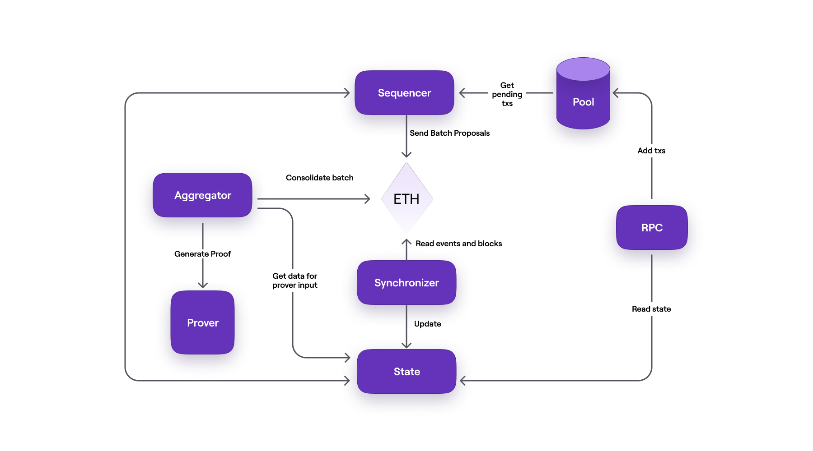

zkNode is the software needed to run a zkEVM node. It is a client that network users require to synchronize and know the state of the Polygon zkEVM.

The main actors influencing the L2 State and its finality are the _trusted Sequencer_ and _trusted Aggregator_.

The zkNode architecture is modular in nature. See the below diagram for more clarity.

Most important to understand, is the primary path taken by transactions; from when users submit the transactions to the zkEVM network up until they are finalized and incorporated in the L1 State.

Polygon zkEVM achieves this by utilizing several actors. Here is a list of the most prominent zkEVM components;

- The **Users**, who connect to the zkEVM network by means of an **RPC** node (e.g., MetaMask), submit their transactions to a database called Pool DB.
- The **Pool DB** is the storage for transactions submitted by Users. These are kept in the pool waiting to be put in a batch by the Sequencer.
- The **Sequencer** is a node responsible for fetching transactions from Pool DB, checking if the transactions are valid, then putting valid ones into a batch. The sequencer submits all batches to the L1 and then sequences the batches. By doing so, the sequenced batches should be included in the L1 State.
- The **Synchronizer** is the component that updates the State DB by fetching data from Ethereum through Etherman.
- The **Etherman** is a low-level component that implements methods for all interactions with the L1 network and smart contracts.
- The **State DB** is a database for permanently storing state data (but not the Merkle trees).
- The **Aggregator** is another node whose role is to produce proofs attesting to the integrity of the Sequencer's proposed state change. These proofs are zero-knowledge proofs (or ZK-proofs) and the Aggregator employs a cryptographic component called the Prover for this purpose.
- The **Prover** is a complex cryptographic tool capable of producing ZK-proofs of hundreds of batches, and aggregating these into a single ZK-proof which is published as the validity proof.

Users can set up their own _local zkNode_ by following this guide [here](../../get-started/setup-nodes/local-node.md), or a production zkNode as detailed [here](../../get-started/setup-nodes/production-node.md).
