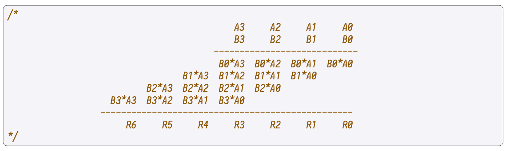

The Arithmetic State Machine is a secondary state machine that also has an executor (the Arithmetic SM Executor) and an internal Arithmetic program (a set of verification rules written in the PIL language). The Arithmetic SM Executor is available in two languages: Javascript and C/C++.

It is one of the six secondary state machines receiving instructions from the Main SM Executor. The main purpose of the Arithmetic SM is to carry out elliptic curve arithmetic operations, such as Point Addition and Point Doubling as well as performing 256-bit operations like addition, product or division.

## Standard elliptic curve arithmetic

Consider an elliptic curve $E$ defined by $y^2 = x^3 + ax + b$ over the finite field $\mathbb{F} = \mathbb{Z}_p$, where $p$ is the prime,

$$
p = 2^{256} - 2^{32} - 2^9 - 2^8 - 2^7 -2^6 - 2^4 - 1.
$$

Set the coefficients $a = 0$ and $b = 7$, so that $E$ reduces to

$$
y^2 = x^3 + 7.
$$

### Point addition

Given two points, $P = (x_1,y_1)$ and  $Q = (x_2,y_2)$, on the curve $E$ with $x_1 \neq x_2$, the point $P+Q = (x_3,y_3)$ is computed as follows,

$$
x_3 = s^2 - x_1 - x_2,\quad \\
y_3 = s (x_1 - x_3) - y_1
$$

### Point doubling

Given a point $P = (x_1,y_1)$ on the curve $E$ such that $P \neq \mathcal{O}$, the point $P+P = 2P =
(x_3,y_3)$ is computed as follows,

$$
x_3 = s^2 - 2x_1, \qquad\quad \\
y_3 = s (x_1 - x_3) - y_1,
$$

where,

$$
s = \dfrac{3x_1^2}{2y_1}.
$$

### Field arithmetic

Several 256-bit operations can be expressed in the following form:

$$
A \cdot B + C = D \cdot 2^{256} + E \tag{\bf{Eqn A}}
$$

where $A, B, C, D$ and $E$ are 256-bit integers.

For instance, if $C = 0$, then $\bf{Eqn\ A}$ states that the result of multiplying $A$ and $B$ is $E$ with a carry of $D$. That is, $D$ is the chunk that exceeds 256 bits.

Or, if $B = 1$,  $\bf{Eqn\ A}$ states that the result of adding $A$ and $C$ is the same as before: $E$ with a carry of $D$. Similarly, division and modular reductions can also be expressed as derivatives of $\bf{Eqn\ A}$.

These operations are performed in the Arithmetic State Machine, with registers satisfying the following PIL relation,

$$
\text{EQ}_0 \colon \quad x_1 \cdot y_1 + x_2 - y_2 \cdot 2^{256} - y_3 = 0
$$

#### Remark

Since the above Elliptic Curve operations are implemented in the PIL language, it is more convenient to express them in terms of the constraints they must satisfy. These constraints are:

$$
\begin{aligned}
\text{EQ}_0 \colon \quad &x_1 \cdot y_1 + x_2 - y_2 \cdot 2^{256} - y_3
= 0, \\
\text{EQ}_1 \colon \quad &s \cdot x_2 - s \cdot x_1 -y_2 + y_1 + q_0
\cdot p = 0, \\
\text{EQ}_2 \colon \quad & 2 \cdot s \cdot y_1 - 3 \cdot x_1 \cdot x_1 +
q_0 \cdot p = 0, \\
\text{EQ}_3 \colon \quad & s \cdot s - x_1 - x_2 - x_3 + q_1 \cdot p = 0, \\
\text{EQ}_4 \colon \quad & s \cdot x_1 - s \cdot x_3 - y_1 - y_3 + q_2
\cdot p = 0,
\end{aligned}
$$

where $q_0,q_1,q_2 \in \mathbb{Z}$, implying that these equations hold true over the integers.

This approach is taken because of the need to compute divisions by $p$. Note that only three possible computation scenarios can arise:

1. $\text{EQ}_0$ is activated while the rest are deactivated,
2. $\text{EQ}_1$, $\text{EQ}_3$ and $\text{EQ}_4$ are activated but $\text{EQ}_0$ and $\text{EQ}_2$ are deactivated,
3. $\text{EQ}_2$, $\text{EQ}_3$ and $\text{EQ}_4$ are activated and $\text{EQ}_0$ and $\text{EQ}_1$ are deactivated.

Since at most, one of $\text{EQ}_1$ and $\text{EQ}_2$ are activated in any scenario, we can afford "sharing'' the same $q_0$ for both.

Motivated by the implemented operations, the Arithmetic SM is composed of 6 registers, each of which is composed of 16 sub-registers of 16-bit (2 byte) capacity, adding up to a total of 256 bits per register.

$$
\begin{aligned}
x_1,\ y_1,\ x_2,\ y_2,\ x_3,\ y_3.
\end{aligned}
$$

There is also a need to provide $s$ and $q_0,q_1,q_2$, which are also 256-bit field elements.

## How operations are performed

Compute the previous operations at 2-byte level. For instance, if one is performing the multiplication of $x_1$ and $y_1$, at the first clock $x_1[0] \cdot y_1[0]$ is computed.

Then, $(x_1[0] \cdot y_1[1]) + (x_1[1] \cdot y_1[0])$ is computed in the second clock, followed by $(x_1[0] \cdot y_1[2]) + (x_1[1] \cdot y_1[1]) + (x_1[2] \cdot y_1[0])$ in the third, and so on.

As depicted in the below figure, this process is completely analogous to the schoolbook multiplication. However, it is performed at 2-byte level, instead of decimal level.

Use the following notation:

$$
\begin{aligned}
\mathbf{eq\ } &= x_1[0] \cdot y_1[0] \\
\mathbf{eq'} &= x_1[0] \cdot y_1[1] + x_1[1] \cdot y_1[0]
\end{aligned}
$$

But then, the carry generated by $\mathbf{eq}$ has to be taken into account by $\mathbf{eq'}$.

Going back to our equations $\text{EQ}_0, \text{EQ}_1, \text{EQ}_2, \text{EQ}_4$; let's see how the operation is performed in $\text{EQ}_0$.

1. Compute $\mathbf{eq}_0 = (x_1[0] \cdot y_1[0]) + x_2[0] - y_3[0]$

2. Compute $\mathbf{eq}_1 = (x_1[0] \cdot y_1[1]) + (x_1[1] \cdot y_1[0]) + x_2[1] - y_3[1]$

3. $\mathbf{eq}_2 = (x_1[0] \cdot y_1[2]) + (x_1[1] \cdot y_1[1]) + (x_1[2] \cdot y_1[0]) + x_2[2] - y_3[2]$

This is continued until one reaches the computation, $\mathbf{eq}_{15} = (x_1[0] \cdot y_1[15]) + (x_1[1] \cdot y_1[14]) + \dots + x_2[15] - y_3[15]$.

At this stage $y_2$ comes into place.

Since the first 256 bits of the result of the operation have been filled (and the result can be made of more than 256-bits), a new register is needed to store the rest of the output. We change the addition of $x_2[i] - y_3[i]$ by $-y_2[i]$.

Therefore, we obtain that:

$$
\begin{aligned}
\mathbf{eq}_{16} &= (x_1[1]
\cdot y_1[15]) + (x_1[2] \cdot y_1[14]) + \dots - y_2[0], \\
\mathbf{eq}_{17} &= (x_1[2] \cdot y_1[15]) + (x_1[3] \cdot y_1[14]) + \dots - y_2[1]
\end{aligned}
$$

and so on.

Continuing until the last two:

$$
\begin{aligned}
\mathbf{eq}_{30} &= (x_1[15] \cdot y_1[15]) - y_2[14], \\
\mathbf{eq}_{31} &= -y_2[15].
\end{aligned}
$$

Now, notice that the carry generated by the $\mathbf{eq}_i$'s is not important for them. That means, if $\mathbf{eq}_i = 10$, then what we really want the result to be is $0$ and save $1$ as a carry for the next operation. To express this fact as a constraint, we say that the following has to be satisfied:

$$
\mathbf{eq} + \text{carry} = \text{carry}' \cdot 2^{16},
$$

where $\text{carry}$ represents the carry taken into account in the actual clock, and $\text{carry}'$ represents the carry generated by the actual operation.

#### Remark

A technicality is that $\text{carry}$ is subdivided into two other $\text{carry}_L$ and $\text{carry}_H$ such that:

$$
\text{carry} = \text{carry}_L + \text{carry}_H \cdot 2^{18}.
$$

## Source code

The Polygon zkEVM repository is available on [GitHub](https://github.com/0xPolygonHermez).

Arithmetic SM Executor: [sm_arith folder](https://github.com/0xPolygonHermez/zkevm-proverjs/tree/main/src/sm/sm_arith)

Arithmetic SM PIL: [arith.pil](https://github.com/0xPolygonHermez/zkevm-proverjs/blob/main/pil/arith.pil)
