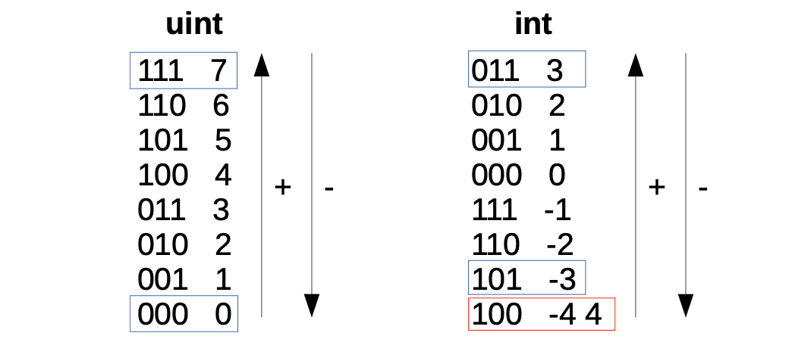
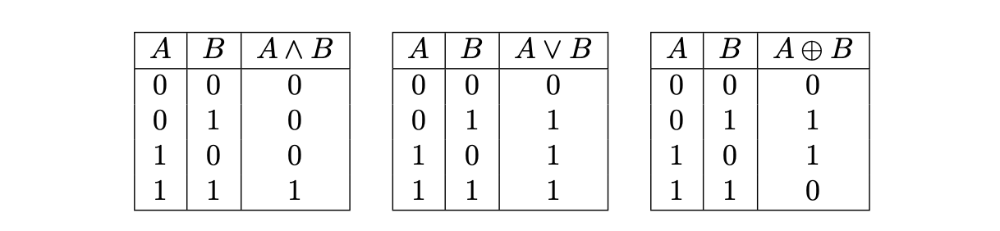

The **Binary State Machine is one of the six secondary state machines receiving instructions from the Main SM Executor**. It is responsible for the execution of all binary operations in the zkProver.

As a secondary state machine, the Binary State Machine has the **executor part (the Binary SM Executor)** and an **internal Binary PIL program**, which is a set of verification rules, written in the PIL language. The Binary SM Executor is written in two languages: Javascript and C/C++.

## Binary operations on 256-bit strings

The zkEVM performs the following binary operations on 256-bit strings:

- The **addition** operation, denoted by $\text{ADD }$ ($+$), adds two 256-bit numbers,
- The **subtraction** operation, denoted by $\text{SUB }$ ($-$), computes the difference between two 256-bit numbers,
- The **less-than** operation, denoted by $\text{LT }$ ($<$), checks if a 256-bit number is smaller than another 256-bit number, without considering the signs the numbers,
- The **signed less-than** operation, denoted by $\text{SLT }$ ($<$), checks if a 256-bit number is smaller than another 256-bit number, but takes into consideration the respective signs of the numbers,
- The **equal** operation, denoted by $\text{EQ }$ ($=$), checks if two 256-bit numbers are equal,
- The **AND** operation, denoted by $\text{AND }$ ($\land$), computes the bit-wise "AND" of two numbers,
- The **OR** operation, denoted by $\text{OR }$ ($\lor$), computes the bit-wise "OR" of two numbers,
- The **XOR** operation, denoted by $\text{XOR }$  ($\oplus$), computes the bit-wise "XOR" of two numbers,
- The **NOT** operation, denoted by $\text{NOT }$ ($\neg$), computes the bit-wise "NOT" of a binary number.

## Addition and subtraction operations

In order to understand how the $\text{ADD}$ and $\text{SUB}$ operations work, one needs to first understand how the zkEVM encodes 256-bit strings to signed and unsigned integers.

Below figure shows these codifications for 3-bit strings but the idea can be easily extended to 256-bit strings.



Adding two strings is performed bit-by-bit using the corresponding carry.

For example, add the 3-bit strings $\mathtt{0b001}$ and $\mathtt{0b101}$, where $\mathtt{0b}$ indicates that the number is binary;

- Start with an initial $carry=0$ and add the least significant bits,

    $1+1+carry=1+1+0=0$, so the next carry becomes $carry'=1$.

- Next, add the second least-significant bits using the previous carry,

    $0+0+carry = 0+0+1 = 1$, this time the next carry is $carry'=0$.

- Finally, add the most significant bits,

    $0+1+carry=0+1+0=1$, with the final carry being $carry'=0$.

- As a result: $\mathtt{0b001}+\mathtt{0b101} = \mathtt{0b110}$ with $carry=0$.

The sum $\mathtt{0b001}+\mathtt{0b101} = \mathtt{0b110}$, for unsigned integers is $1+5=6$, while for signed integers encoded with two's complement, this sum is $1+(-3) =(-2)$. This is in line with Figure 1 above.

In other words, the same binary sum can be done for both signed integers and for unsigned integers.

## Signed and unsigned 'Less Than' operations

The operations $\text{LT}$ and $\text{SLT}$ behave differently from the $\text{ADD}$ and $\text{SUB}$ operations.

When comparing unsigned integers using $\text{LT}$, the natural order for comparisons is applied.

For example, $010 < 110$. That is, $2 < 6$.

But when comparing signed integers using $\text{SLT}$, one must take into account the most significant bit that acts as the sign.

- If the most-significant bits of the two strings being compared is the same, the natural order applies. For example, $101  < 110$. i.e., $-3 < -2$. Compare with Figure 1 above.

- However, if the most significant bits of strings being compared are different, then the order must be flipped (bigger numbers start with 0). For example, $110 < 001$. i.e., $-2  <  1$.

Finally, notice that with unsigned integers, there is a caveat since 4 and -4 have the same codification.

## AND, OR and XOR operations

Consider the bit-wise operations; $\text{AND}$, $\text{OR}$, $\text{XOR}$ and $\text{NOT}$. Bitwise means the operation is carried out bit-by-bit. As a result, there are no carry bits to be concerned about. This simplifies the implementation of the operations.

The below table depicts the truth tables of $\text{AND}$, $\text{OR}$ and $\text{XOR}$ operators, respectively.



Notice that we do not consider the $\text{NOT}$ operation. This is because the $\text{NOT}$ operation can be easily implemented with the $\text{XOR}$ operation, by taking an $\text{XOR}$ of the given 256-bit string and $\texttt{0xff...ff}$.

## The design of Binary SM

The Executor of the Binary SM records the trace of each computation in the state machine, and this computational trace is used to prove correctness of computations.

The execution trace is typically in the form of 256-bit strings. And the polynomial constraints, which every correct execution trace must satisfy, are described in a PIL file (or 'code').

For the Binary SM, these computations refer to the aforementioned binary operations, and use special codes for each of the operations.

### Codes for the binary operations

Each operation that the Binary SM checks has an opcode as shown in the table below.

<div align="center"><b>All Operations Checked by the Binary SM</b></div><center>

| $\textbf{Operation Name}$ | $\textbf{Mnemonic}$ | $\textbf{Symbol}$ | $\textbf{BinOpCode}$ |
| :-----------------------: | :-----------------: | :---------------: | :------------------: |
|     $\text{Addition}$     |   $\mathrm{ADD}$    |        $+$        |         $0$          |
|   $\text{Subtraction}$    |   $\mathrm{SUB}$    |        $-$        |         $1$          |
|    $\text{Less Than}$     |    $\mathrm{LT}$    |        $<$        |         $2$          |
| $\text{Signed Less Than}$ |   $\mathrm{SLT}$    |        $<$        |         $3$          |
|     $\text{Equal To}$     |    $\mathrm{EQ}$    |        $=$        |         $4$          |
|   $\text{Bitwise AND}$    |   $\mathrm{AND}$    |      $\wedge$     |         $5$          |
|    $\text{Bitwise OR}$    |    $\mathrm{OR}$    |       $\vee$      |         $6$          |
|   $\text{Bitwise XOR}$    |   $\mathrm{XOR}$    |     $\oplus$      |         $7$          |
|   $\text{No Operation}$   |   $\mathrm{NOP}$    |  $\mathrm{NOP}$   |       $\star$        |

</center>

In instances where none of the defined binary operations is carried out, the Binary SM's operation is considered to be a $\text{NOP}$ (No Operation), in which case any code not in the defined list of codes can be used.

### Internal byte plookups

The Binary SM is internally designed to use Plookups of bytes for all the binary operations.

It uses Plookups that contain all the possible input bytes and output byte combinations,

$$
\text{byte}_{in_0} \star \text{byte}_{in_1} = \text{byte}_{out},
$$

where $\star$ is one of the possible operations.

When executing a binary operation between the 256-bit input strings, an execution trace is generated in cycles of $32$ steps per operation.

At each step, the corresponding byte-wise operation and any required extra information such as 'carries' or auxiliary values, form part of the computation trace.

Additionally, each $256$-bit string, the two inputs and the output, are expressed using $8$ registers of $32$-bits.

### Connection with the Main SM

The constraint that connects the execution trace of the Main SM with the execution trace of the Binary SM is a Plookup, which is performed at each row of the Binary SM execution trace when the cycle is completed (this is when a register called $\texttt{RESET}$ is 1).

The Plookup checks the operation code, the registries for the input and output 256-bit strings, and the final carry.

## Operating at byte-level

This section provides examples of how the byte-wise operations work.

A $256$-bit integer $\mathbf{a}$ is herein denoted in vector form as $(a_{31}, \dots, a_1, a_0)$ to indicate that,

$$
\mathbf{a} = a_{31}\cdot (2^8)^{31} + a_{30}\cdot (2^8)^{30} + \cdots + a_1\cdot2^8 + a_0   =
\sum_{i = {31}}^{0} a_i \cdot (2^8)^i,
$$

where each $a_i$ is a byte that can take values between $0$ and $2^8 - 1$.

**Example 1**

If $\mathbf{a} = 29967$, its byte decomposition can be written as $\mathbf{a} = (\mathtt{0x75}, \mathtt{0x0F})$, because $\mathbf{a} = 29967 = 117 \cdot 2^8 + 15$, and in hexadecimal, $117 \mapsto \mathtt{0x75}$ and $15 \mapsto \mathtt{0x0F}$.

### Addition

Here is how the addition operation on two $256$-bit numbers is reduced to a byte-by-byte addition, and thus ready to use the byte-wise Plookup table.

Observe that adding two bytes $a$ and $b$ (i.e., $a$ and $b$ are members of the set $[0, 2^8-1]$), may result in a sum $c$ which cannot be expressed as a single byte.

For example, if $a = \mathtt{0xFF}$ and $b = \mathtt{0x01}$, then,

$$
a + b = \mathtt{0xFF} + \mathtt{0x01} = \mathtt{0x100}.
$$

In byte-form, $c=\mathtt{0x00}$ and with $carry'=1$. This carry has to be taken care of when dealing with bytes.

Consider now the process of adding two bytes.

**Example 2.**

Take for instance, $\mathbf{a} = (a_1, a_0) = (\mathtt{0xFF}, \mathtt{0x01})$ and $\mathbf{b} = (b_1, b_0) = (\mathtt{0xF0}, \mathtt{0xFF})$.

- First add the less significant bytes:

    $$
    \begin{aligned}
    a_1 + b_1 &= \mathtt{0x01} + \mathtt{0xFF} = c_1 = \mathtt{0x00}, \\
    carry_1 &= 1.
    \end{aligned}
    $$

- Then, add the next significant byte,

    $$
    \begin{aligned}
    a_2 + b_2 + carry_1 &= \mathtt{0xFF} + \mathtt{0xF0} = c_2 = \mathtt{0xF0}, \\
    carry_2 &= 1.
    \end{aligned}
    $$

The previous scheme depicts several cases that need to be treated separately;

1. If $a_1 + b_1 < 2^8$ and $a_2 + b_2 < 2^8$, then the sum $\mathbf{a} + \mathbf{b}$ is simply,

    $$
    \mathbf{a} + \mathbf{b} = (a_2 + b_2, a_1 + b_1).
    $$

2. If $a_1 + b_1 < 2^8$ but $a_2 + b_2 \geq 2^8$, then $a_2 + b_2$ does not fit in a single byte. Hence, the sum of $a_2$ and $b_2$ has to be written as

    $$
    a_2 + b_2 = 1 \cdot 2^8 + c_2,
    $$

    ​for some byte $c_2$. The addition $\mathbf{a} + \mathbf{b}$ is then computed as follows,

$$
\mathbf{a} + \mathbf{b} = (1, c_2, a_1 + b_1).
$$

3. If $a_1 + b_1 \geq 2^8$, then we have that:

    $$
    a_1 + b_1 = 1 \cdot 2^8 + c_1,
    $$

    for some byte $c_1$. Then we can write

    $$
    \mathbf{a} + \mathbf{b} = (a_2 + b_2 + 1) \cdot 2^8 + c_1.
    $$

Consider the following two scenarios:

1. If $a_2 + b_2 + 1 \geq 2^8$, then the sum will take the form:

    $$
    a_2 + b_2 + 1 = 1 \cdot 2^8 + c_2.
    $$

    Therefore, the byte decomposition of $\mathbf{a} + \mathbf{b}$ is

    $$
    \mathbf{a} + \mathbf{b} = (1, c_2, c_1).
    $$

2. If $a_2 + b_2 + 1 < 2^8$, then the byte decomposition of $\mathbf{a} + \mathbf{b}$ is:

    $$
    \mathbf{a} + \mathbf{b} = (c_2, c_1).
    $$

Observe that addition of $256$-bit numbers can be reduced to additions at byte-level by operating through the previous cases in an iterative manner.

### Subtraction

Reducing Subtraction to byte-level turns out to be trickier than Addition case.

Suppose $\mathbf{a} = \mathtt{0x0101}$ and $\mathbf{b} = \mathtt{0x00FF}$.

Observe that $\mathtt{0xFF}$ cannot be subtracted from $\mathtt{0x01}$ because $\mathtt{0xFF} > \mathtt{0x01}$.

However, we know that the result is $\mathbf{a} - \mathbf{b} = \mathbf{c} = \mathtt{0x0002}$.

In order to get this result, notice that the operation can be described as follows,

$$
\begin{aligned}
\mathbf{a} - \mathbf{b} & = (\mathtt{0x01} - \mathtt{0x00}) \cdot 2^8 + (\mathtt{0x01} - \mathtt{0xFF}) \\
   & = (\mathtt{0x01} - \mathtt{0x00}) \cdot 2^8  - 2^8 + 2^8 + (\mathtt{0x01} - \mathtt{0xFF}) \\
   & = (\mathtt{0x01} - \mathtt{0x00 - 0x01}) \cdot 2^8  + \mathtt{0xFF + 0x01} + \mathtt{0x01} - \mathtt{0xFF} \\
   & = ( \mathtt{0x00} ) \cdot 2^8  + \mathtt{0x02}
\end{aligned}
$$

The output byte decomposition is $\mathbf{a} = (c_1, c_0)  = (\mathtt{0x00}, \mathtt{0x02})$.

Nonetheless, it may be necessary to look at more examples so as to better understand how subtraction works at byte-level in a more general sense.

Consider now a subtraction of numbers with $3$ bytes. Say, $a = \mathtt{0x0001FE}$ and $b = \mathtt{0xFEFFFF}$.

First analyse the first two bytes, as in the previous example,

$$
\begin{aligned}
(\mathtt{0x01} - \mathtt{0xFF}) \cdot 2^8 + (\mathtt{0xFE} - \mathtt{0xFF}) &= (\mathtt{0x01} - \mathtt{0xFF} - \mathtt{0x01} ) \cdot 2^8 + (\mathtt{2^8} + \mathtt{0xFE} - \mathtt{0xFF}) \\
& = (\mathtt{0x01} - \mathtt{0xFF - 0x01}) \cdot 2^8 + \mathtt{0xFF}
\end{aligned}
$$

But now observe that $\mathtt{0x01} - \mathtt{0xFF} - \mathtt{0x01}$ is also a negative value. Hence, there is a need to repeat the strategy and keep a carry to the next byte,

$$
\begin{aligned}
&(\mathtt{0x00} - \mathtt{0xFE}) \cdot 2^{16} + (\mathtt{0x01} - \mathtt{0xFF} - \mathtt{0x01}) \cdot 2^8 + \mathtt{0xFF} = \\
&(\mathtt{0x00} - \mathtt{0xFE} - \mathtt{0x01}) \cdot 2^{16} + (\mathtt{2^8} + \mathtt{0x01} - \mathtt{0xFF} - \mathtt{0x01}) \cdot 2^8 + \mathtt{0xFF} = \\
&(\mathtt{0x00} - \mathtt{0xFE} - \mathtt{0x01}) \cdot 2^{16} + \mathtt{0x01} \cdot 2^8 + \mathtt{0xFF}.
\end{aligned}
$$

Observe that the previous example is included in this case.

In general, let $a = (a_i)_i$ and $b = (b_i)_i$, with $a_i, b_i$ bytes, be the byte representations of $a$ and $b$. Instead of checking if we can perform the subtraction $a_i - b_i$ for some bytes $i$, we are checking if $a_i - b_i - \texttt{carry} \geq 0$. Equivalently, we are checking if $a_i - \texttt{carry} \geq b_i$. The previous case can be recovered by setting $\texttt{carry} = 1$ and the first case corresponds to setting $\mathtt{carry = 0}$.

We have two possible cases,

- If $a_i - \texttt{carry} \geq b_i$, then $a_i - b_i - \texttt{carry}$ provides the corresponding $i$-th byte of the representation of $a - b$.
- If $a_i - \texttt{carry} < b_i$ then we should compute the corresponding $i$-th byte of the representation of $a - b$ as,

$$
2^8 - b_i + a_i - \texttt{carry} = 255 - b_i + a_i - \texttt{carry} + 1.
$$

However, we need to discuss the last step of our example. Observe that we can not perform the operation $\mathtt{0x00} - \mathtt{0xFE} - \mathtt{0x01}$ since it corresponds to a negative value. But as we are working with unsigned integers, we will do the two's complement and set the last byte to,

$$
2^8 - \mathtt{0xFE} + \mathtt{0x00} - \mathtt{0x01} = 255 - \mathtt{0xFE} + \mathtt{0x00} - \mathtt{0x01} + 1 = 255 - b_3 + a_3 - \texttt{carry} + 1.
$$

Observe that this is also included in the case when $a_i - \texttt{carry} < b_i$, so we must not treat the last bit in a different manner. To end up with our example, we get the following byte representation of $a - b$,

$$
c = (\mathtt{0x01}, \mathtt{0x01}, \mathtt{0xFF}) = \mathtt{0x01} \cdot 2^{16} + \mathtt{0x01} \cdot 2^8 + \mathtt{0xFF}.
$$

### Less than

We want to describe the less than comparator byte-wise. For $256$-bits integers, the operation $<$ will output $c = 1$ if $a < b$ and $c = 0$ otherwise. As we are working in the natural integers order, the most significant byte decides and, if they are equal, we should consider the previous one until we can decide. Let us propose the example with $a = \mathtt{0xFF AE 09}$ and $b = \mathtt{0x FF AE 02}$. We know that $a > b$. Why? We should start at the most significant byte. We know that:

$$
a \mathtt{>> 16} = \mathtt{0x FF} = \mathtt{0x FF} = b \mathtt{>> 16}.
$$

Hence, we can not decide with this byte. And the same happens with the second byte, they are both equal to $\mathtt{0x AE}$. Hence, the less significant byte decides,

$$
\mathtt{0x 09} > \mathtt{0x 02}.
$$

However, the problem with our setup is that we must start with the less significant byte and climb up to the most significant byte. The strategy will be to use some kind of a carry in order to "carry" the decisions from previous bytes. Let us do an example step by step, now with $a = \mathtt{0x FF AA 02}$ and $b = \mathtt{0x 01 AA 09}$. First of all, we will compare the less significant bytes. Since:

$$
\mathtt{0x 02} < \mathtt{0x 09},
$$

we will set up $\mathtt{carry} = 1$. We will carry this decision until we finish to process all bytes or, alternatively, we should change to the complementary decision. Therefore, since the next two bytes are equal and we are not at the end, we maintain $\mathtt{carry}$ to $1$. The previous step is the last one. We compare the most significant bytes,

$$
\mathtt{0x FF} \not < \mathtt{0x 01}.
$$

Henceforth, we should output a $0$, independently to the previous carry decision. But, let us suppose now that $b = \mathtt{0x FF AA 09}$. Then, in this last step, we should output a $1$, since $a < b$. The idea is that, in the last step, if both bytes are equal, we should output the decision carry $\mathtt{carry}$. In general, in the step $i$, comparing bytes $a_i$ and $b_i$, we have $3$ cases,

- If $a_i < b_i$, we set $\mathtt{carry}$ to $1$. If we are at the most significant byte, we output $1$.
- If $a_i = b_i$, we let $\mathtt{carry}$ unchanged in order to maintain the previous decision. If we are at the most significant byte, we output $\mathtt{carry}$.
- If $a_i > b_i$, we set $\mathtt{carry}$ to $0$. If we are at the most significant byte, we output $0$.

### Signed less than

In computer science, the most common method of representing signed integers on computers, is called **two's complement**. When the most significant bit is a one, the number is signed as negative. The way to express a negative integer $x$ into two's complement form is chosen so that, among integers of the same sign, the lexicographical order is maintained. That is, if $a < b$ are signed integers of the same sign, then its two's complement representations preserve the same order. This will not be true if the signs are different. For example, it is not surprising that:

$$
000\dots0 > 111\dots1
$$

using the two's complement encoding, because $111\dots1$ is negative and $000\dots0$ is positive. The two's complement form of negative integer $x$ in a $N$-bits system is the binary representation of $2^N - x$. For example, let $x = -1$ and $N = 4$. Then,

$$
10000 - 0001 = 1111.
$$

Hence, $-1 = 1111$ in this representation. It is easy to see that $-2 = 1110$ because:

$$
10000 - 0010 = 1110.
$$

Hence, observe that $-1 > -2$ because $1111 > 1110$ and, conversely, the order is preserved for integers of the same sign.

We will describe a method to compare signed integers byte-wise. First of all, let us analyze the order among all the signed bytes, in order to understand how to compare them. Once we achieve this, the strategy will be very similar to the previous Less Than.

Let $a = (a_{31}, a_{30}, \dots, a_0)$ and $b = (b_{31}, b_{30}, \dots, b_0)$ be the byte-representation of the 256-bits unsigned integers $a$ and $b$. We will define $\texttt{sgn}(a) = a_{31, 7}$, where

$$
a_{31} = \sum_{i = 0}^7 a_{31, i} \cdot 2^i
$$

is the binary representation of $a_{31}$. That is, $\texttt{sgn}(a)$ is the most significant bit of $a$ or, equivalently, the "sign" of $a$. In a similar way, we define $\texttt{sgn}(b)$. Observe that it is easy to compare $a$ and $b$ if $\texttt{sgn}(a) \neq \texttt{sgn}(b)$. For example,

$$
a = \mathtt{0b11111111} = \mathtt{0xFF} < \mathtt{0x00} = \mathtt{0b00000000} = b
$$

because $\texttt{sgn}(a) > \texttt{sgn}(b)$ i.e. $a$ is negative and $b$ is positive. If $\texttt{sgn}(a) \neq \texttt{sgn}(b)$, we can simply compare $a$ and $b$ using the same strategy as before, because the natural lexicographic order is preserved in this case. Then, we have the following cases when comparing $a$ and $b$:

1. If $\texttt{sgn}(a) = 1$ and $\texttt{sgn}(b) = 0$, then $a < b$.
2. If $\texttt{sgn}(a) = 0$ and $\texttt{sgn}(b) = 1$, then $a > b$.
3. If $\texttt{sgn}(a) = \texttt{sgn}(b)$, the order is the usual one and hence, we already know how to compare $a$ and $b$.

Recall that we are processing the bytes of $a$ and $b$ from the less significant bytes to the most significant bytes. Hence, we need to adapt our strategy following this order. The strategy will be almost the same than in the unsigned operation.

1. First of all, we start comparing $a_0$ and $b_0$.

   (a) If $a_0 < b_0$, we set $\texttt{carry} = 1$.

   (b) Otherwise we set $\texttt{carry} = 0$.  

2. For all $0 < i < 31$, we compare $a_i$ and $b_i$.

   (a) If $a_i < b_i$, we set $\texttt{carry} = 1$.

   (b) If $a_i = b_i$, we leave $\texttt{carry}$ unchanged from the previous step.

   (c) Otherwise, we set $\texttt{carry} = 0$.

3. Now, we have to compare the last byte. We follow the described strategy of comparing the signs:

   (a) If $\texttt{sgn}(a) > \texttt{sgn}(b)$, we output a $1$, so $a < b$.

   (b) If $\texttt{sgn}(a) < \texttt{sgn}(b)$, we output a $0$, so $a < b$.

   (c) If $\texttt{sgn}(a) = \texttt{sgn}(b)$, we compare the last bytes $a_{31}$ and $b_{31}$ in the same way we have compared the previous bytes. We output $0$ or $1$ accordingly.

    1. If $a_{31} < b_{31}$, we output a $1$, so $a < b$.

    2. If $a_{31} = b_{31}$, we output the previous $\texttt{carry}$, maintaining the last decision.

    3. Otherwise, we output a $0$, so $a \not < b$.

Let us exemplify the previous procedure setting $a = \mathtt{0xFF FF FF 00}$ and $b = \mathtt{0x00 FF FF FF}$. We know that $a < b$, so we should output a $1$. Observe that the less significant byte of $a$ is leaser than the less significant byte of $b$. Hence, we should put $\texttt{carry}$ equal to $1$. The next two bytes of $a$ and $b$ are both equal to $\mathtt{0xFF FF}$, therefore we maintain $\texttt{carry}$ unchanged equal to $1$. However, since $a$ is negative and $b$ is positive, we should change the decision and output a $1$, independently of the $\texttt{carry}$.

### Equality

We want to describe the equality comparator byte-wise. For unsigned $256$-bits integers, the operation $=$ will output $c = 1$ if $a = b$ and $c = 0$ otherwise. This operation is very simple to describe byte-wise, since $a = b$ if and only if all its bytes coincide.

Let us compare $a = \mathtt{0xFF 00 a0 10}$ and $b = \mathtt{0xFF 00 00 10}$ byte-wise. Observe that the first byte is the same $\mathtt{0x10}$, however the next byte is different $\mathtt{0xa0} \neq \mathtt{0x00}$. Hence, we can finish here and state that $a \neq b$.

We will describe an algorithm in order to proceed processing all the bytes. We will use a carry to mark up when a difference among bytes has $\textbf{not}$ been found (i.e. if $\texttt{carry}$ reach $0$, then $a$ and $b$ should differ). Hence, the algorithm to compare two $32$-bytes integers $a = (a_{31}, a_{30}, \dots, a_{0})$ and $b = (b_{31}, b_{30}, \dots, b_0)$ is the following:

1. First of all, since no differences have been found up to this point, set $\texttt{carry}$ equal to $1$.

2. Now, compare $a_0$ and $b_0$,

   (a)  If $a_0$ and $b_0$ are equal, then leave $\texttt{carry}$ unchanged equal to $1$.

   (b)  If $a_0 \neq b_0$, then set $\texttt{carry}$ equal to $0$, which will imply that $a \neq b$.

3. When comparing bytes $a_i$ and $b_i$ for $0 < i \leq 31$.

   (a)  If $a_i = b_i \textbf{ and } \texttt{carry} = 1$, we should leave $\texttt{carry}$ unchanged and, if $i = 31$, we should output a $1$ because $a = b$. The reason of demanding $\texttt{carry} = 1$ in the enter condition is because we should ensure that, if $\texttt{carry} = 0$ in a previous step, we must never enter to this block and change the non-equality decision. This is because if $a_i \neq b_i$ for some $i$, then $a \neq b$.

   (b)  Hence, if $a_i \neq b_i$, we should set $\texttt{carry} = 0$ and output a $0$ if $i = 31$.

### Bitwise operations

We will describe all bitwise operations at once because they are the easiest ones, since we do not need to introduce carries.

Now, the idea is to extend this operation bitwise. That is, if we have the following binary representations of $a = (a_{31}, a_{30}, \dots, a_{0})$ and $a = (b_{31}, b_{30}, \dots, b_{0})$ where $a_i, b_i \in \{0, 1\}$, then we define,

$$
a \star b = (a_i \star b_i)_i = (a_{31} \star b_{31}, a_{30} \star b_{30}, \dots, a_0 \star b_0)
$$

for $\star$ being $\land, \lor$ or $\oplus$.

For example, if $a = \mathtt{0xCB} = \mathtt{0b11001011}$ and $b = \mathtt{0xEA} = \mathtt{0b11101010}$ then,

$$
\begin{aligned}
a \land b &= \mathtt{0b11001010} = \mathtt{0xCA},\\
a \lor b &= \mathtt{0b11101011} = \mathtt{0xEB},\\
a \oplus b &= \mathtt{0b00100001} = \mathtt{0x21}.
\end{aligned}
$$

## The Binary SM in summary

The Binary SM has 8 registries, each with a 32-bit Input/Output capacity. i.e., a total of 256 bits.

It carries out binary computations in accordance with instructions from the Main SM Executor.

The binary operations it executes, together with their specific opcodes, are:

1. The common operations; the No-Operation `NOP`, Addition `ADD` and Subtraction `SUB`. Their corresponding special opcodes are; `0`, `1` and `2`, respectively.

2. The Boolean operations; $\text{Less Than }$ `LT`, $\text{Greater Than }$ `GT`, $\text{Signed Less Than }$ `SLT`, $\text{Signed Greater Than }$ `SGT`, $\text{Equal }$ `EQ`  and  $\text{Is-Zero }$ `ISZERO`. Their special opcodes are, `3`, `4`, `5`, `6` and `7`, respectively.

3. The logical operations; `AND`, `OR`,  `XOR` and `NOT`, each with its special opcode; `9` ,`10`, `11` and `12`, respectively.

**Firstly,** the Binary SM Executor translates the Binary Actions into the PIL language.

**Secondly,** it executes the Binary Actions.

**And thirdly,** it uses the [Binary PIL program](https://github.com/0xPolygonHermez/zkevm-proverjs/blob/main/pil/binary.pil), to check correct execution of the Binary Actions using Plookup.

#### Translation to PIL language

It builds the constant polynomials, which are generated once-off at the beginning. These are;

- the 4 bits long operation code `P_OPCODE`,
- the 1-bit Carry-in  `P_CIN`,
- the Last-byte `P_LAST`,
- the 1 byte input polynomials `P_A` and `P_B`,
- the 16-bit output polynomial `P_C`,
- the 1-bit Carry-out `P_COUT`.

It also creates constants required in the Binary PIL program;

- `RESET` is used to reset registry values every time the state machine completes a cycle of state transitions,
- `FACTOR`, which is an array of size 8, is used for correct placement of output registry values.

### Execution of Binary actions

The crux of the Binary SM Executor is in the `lines 371 to 636` of [sm_binary.js](https://github.com/0xPolygonHermez/zkevm-proverjs/blob/main/src/sm/sm_binary.js). This is where it executes Binary Actions.

1. It takes the committed polynomials A, B and C, and breaks them into bytes (in little-endian form).

2. It sequentially pushes each triplet of bytes (`freeInA`, `freeInB`, `freeInC`) into their corresponding registries (`ai`, `bi`, `ci`).

   It runs one for-loop for all committed polynomials (A, B, C), over all the bytes of the 8 registries, which are altogether 32 bytes per committed polynomial.

   Recall that `LATCH_SIZE = REGISTERS_NUM * BYTES_PER_REGISTER` = 8 registries * 4 bytes. It hence amounts to 32 bytes for each committed polynomial.

3. Once the 256-bit LATCH is built, it checks the opcodes and then computes the required binary operations in accordance with the instructions of the Main SM.

4. It also generates the final registries.

### The Binary PIL (program)

There are two types of inputs to the Binary PIL program: the constant polynomials and the committed polynomials.

The program operates byte-wise to carry out 256-bit Plookup operations.

Each row of the lookup table is a vector of the form; \{ `P_LAST`, `P_OPCODE`, `P_A`, `P_B`, `P_CIN`, `P_C`, `P_COUT` \},  consisting of the constant polynomials created by the Binary SM Executor. As seen above,

- `P_LAST` is the Last-byte,
- `P_OPCODE` is the 4-bit operation code,
- `P_A` and `P_B`, are the 1-byte input polynomials,
- `P_CIN` is the 1-bit Carry-in,

- `P_C` is the 16-bit output polynomial,
- `P_COUT` is the 1-bit Carry-out.

The Binary PIL program takes in byte-size inputs, as in the Binary SM Executor, each 256-bit input committed polynomial is first broken into 32 bytes.

For each of the 32 triplets `freeInA`, `freeInB` and `freeInC`, tallying with the three 256-bit committed polynomials  A,B and C, the Binary PIL program,

1. Prepares a Plookup input vector of the form;  \{`last`, `opcode`, `freeInA`, `freeInB`, `cIn`, `freeInC`, `cOut`\}, where each element is a byte.
2. Runs Plookup,

```
{last,opcode,freeInA,freeInB,cIn,freeInC,cOut} in {P_LAST,P_OPCODE,P_A,P_B,P_CIN,P_C,P_COUT};
```

3. Resets registry values at the end of the 32 cycles using `RESET`, and utilising `FACTOR` for correct placement of values. For e.g., `a0' = a0 * (1 - RESET) + freeInA * FACTOR[0];`

   Special variables, `useCarry` and `c0Temp`, are used for managing updates and assignments of values, particularly for Boolean operations, where the output `c0` registry value is either `TRUE = 1` or `FALSE = 0`. Hence the Lines 104 and 105 of code;

   Line 104.    `c0Temp' = c0Temp * (1 - RESET) + freeInC * FACTOR[0];`

   Line 105.    `c0' = useCarry * (cOut - c0Temp ) + c0Temp;`

   For all non-Boolean operations; the default value for `useCarry` is zero, making `c0' = c0Temp`. The value of `c0'` is therefore of the same form as other `ci'` update values.

4. The output of the Binary PIL program is therefore a report of either `pass` or `fail`.

## Source code

The Polygon zkEVM repository is available on [GitHub](https://github.com/0xPolygonHermez).

**Binary SM Executor**: [sm_binary.js](https://github.com/0xPolygonHermez/zkevm-proverjs/blob/main/src/sm/sm_binary.js)

**Binary SM PIL**: [binary.pil](https://github.com/0xPolygonHermez/zkevm-proverjs/blob/main/pil/binary.pil)

**Test Vectors**: [binary_test.js](https://github.com/0xPolygonHermez/zkevm-proverjs/blob/main/test/sm/sm_binary_test.js)
