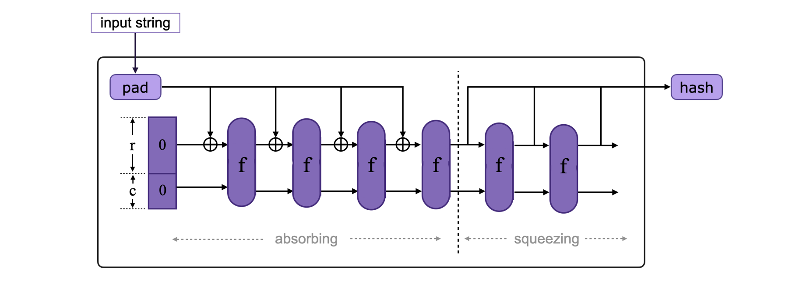

For hashing, the zkEVM utilizes two state machines: the Keccak state machine and the Poseidon state machine. The Keccak-256 hash function is used for seamless EVM compatibility, whereas [Poseidon](https://eprint.iacr.org/2019/458.pdf) is best suited for the zkProver context because it is a [STARK-friendly hash (SFH)](https://eips.ethereum.org/assets/eip-5988/papers/report_security_stark_friendly_hash.pdf) function.

## The sponge construction

By design, Keccak and Poseidon are both sponge constructions. A generic sponge construction is a simple iterated construction for building a function:

$$
F: \mathbb{Z}^* \to \mathbb{Z}^l
$$

with an input of variable-length and arbitrary output length based on a fixed-length permutation:

$$
f: \mathbb{Z}^b \to \mathbb{Z}^b
$$

operating on a fixed number $b$ of bits.

The array of $b$ bits that $f$ keeps transforming is called the _state_, and $b$ is called the _width_ of the state.

The state array is split into two chunks, one with $r$ bits and the other with $c$ bits. The width $b = r + c$, where $r$ is called the _bitrate_ (or simply _rate_) and $c$ is called the _capacity_.

## Sponge construction phases

The elements that completely describe a single instance of a sponge construction are: the fixed-length permutation $f$, the padding rule _pad_, the bitrate value $r$, and the capacity $c$.

A schema of the sponge construction is shown in the below figure.

### Initializing phase

The input string is either padded to reach the $r$-bit length (if it was shorter than $r$ bits) or split into $r$-bit long chunks, with the last one padded to reach the $r$-bit length (if it was longer than $r$ bits). A hash function-specific reversible _padding rule_ is used.

The state of the hash function is initialized to a $b$-bit vector (or array) of zeros.

### Absorbing phase

During this phase, the $r$-bit input blocks are XOR-ed sequentially with the first $r$ bits of the state, intermixed with permutation function $f$ applications. This process is repeated until all input blocks have been XOR-ed with the state.

Take note that the last $c$ bits, which correspond to the capacity value, do not absorb any external input.

### Squeezing phase

The first $r$ bits of the state are returned as output blocks in this phase, intermixed with applications of the function $f$. The number of output blocks is entirely up to the user.

Keep in mind that the last $c$ bits, which correspond to the capacity value, are never output during this phase. Actually, if the output is longer than the specified length, it is truncated to the required size.
