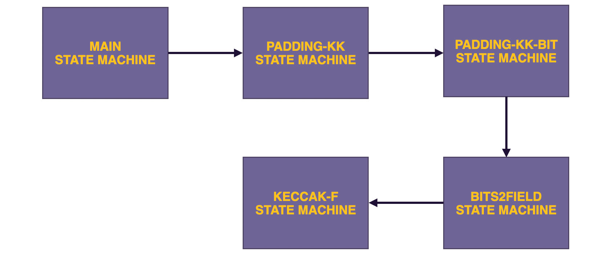

The zkEVM, as an L2 zk-Rollup for Ethereum, employs the Keccak hash function to achieve seamless compatibility with the Ethereum blockchain at Layer 1. However, **rather than implementing the Keccak-256 hash function as a single state machine, the zkEVM does so in a framework of four state machines**. They are as follows:

1. **The Padding-KK SM** is used for padding purposes, as well as validation of hash-related computations pertaining to the Main SM's queries. As depicted in the below figure, the **Padding-KK SM is Main SM's gateway to the Keccak hashing state machines**.

   

2. The **Padding-KK-Bit SM** converts between two string formats, the bytes of the Padding-KK SM to the bits of the Keccak-F Hashing SM, and vice-versa.

3. The **Bits2Field SM** is used specifically for parallelizing Keccak-F SM implementation. It acts as a multiplexer between the Padding-KK-Bit SM and the Keccak-F SM. **This state machine is called Bits2Field because it ensures correct packing of bits from $44$ different blocks of the Padding-KK-Bit SM into a single field element**. In other words, **it is a $44$-bits-to-$1$-field-element multiplexer**.

4. The **Keccak-F SM** computes string hashes at the request of the Main SM. Although the Keccak-F SM is a binary circuit, it operates on a **44bits-by-44bits** basis rather than a bit-by-bit basis. This equates to running four $44$ hashing circuits in parallel.

### Source Code

- [Padding-KK State Machine](https://github.com/0xPolygonHermez/zkevm-prover/blob/main/src/sm/padding_kk/padding_kk_executor.cpp)
- [Padding-KK-Bit SM](https://github.com/0xPolygonHermez/zkevm-prover/blob/main/src/sm/padding_kkbit/padding_kkbit_executor.cpp)
- [Bits2Field SM](https://github.com/0xPolygonHermez/zkevm-prover/blob/main/src/sm/bits2field/bits2field_executor.cpp)
- [Keccak-F SM](https://github.com/0xPolygonHermez/zkevm-prover/blob/main/src/sm/keccak_f/keccak_f_executor.cpp)
