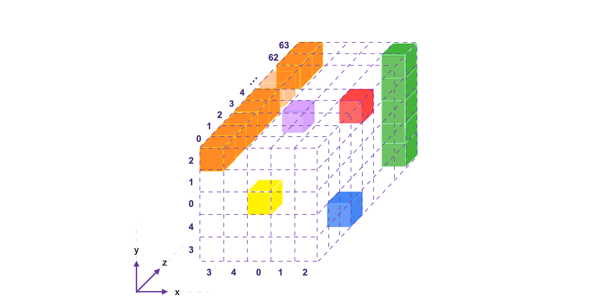
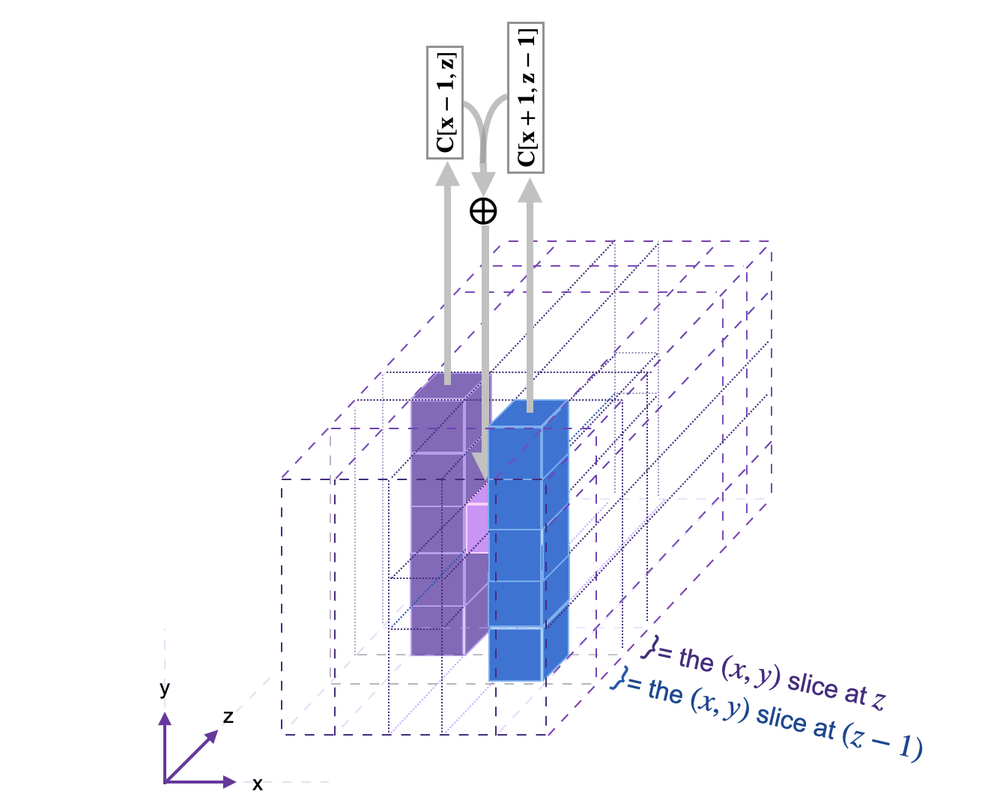
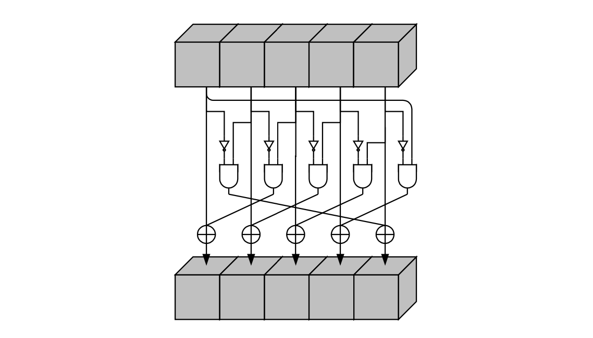
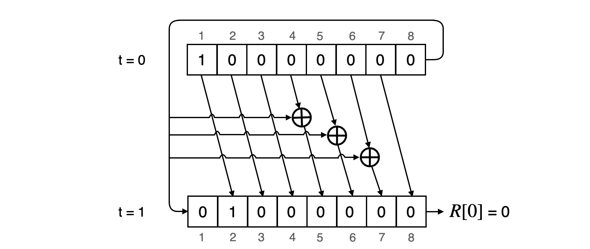
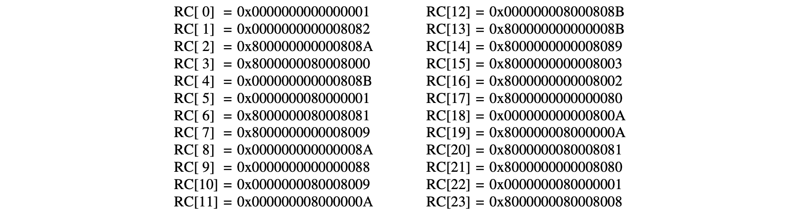

The Keccak-F state machine is one of the secondary zkProver state machines. It computes message string hashes and validates the accuracy of those computations upon the request of Main SM.

Although the architecture of the original Keccak hash function is simple, the Keccak-F SM is not just a state machine or a simple automated version of the cryptographic hash function.

First, a gates state machine is used to implement the Keccak-F SM. A binary circuit that operates on a bit-by-bit basis.

Second, with regard to the Main SM, the Padding-KK SM, the Padding-KK-Bit SM, and the Bits2Field SM together provide a framework within which the Keccak-F SM is realized.

Thirdly, the Keccak-F circuit is constructed in such a way that executing it once is effectively equivalent to operating forty-four ($44$) hashing circuits simultaneously, particularly in the first version of the zkEVM public testnet. For further information on how this parallelism technique is applied, see the [Bits2Field SM](bits2field-sm.md).

The Keccak-F circuit is briefly described in this article, along with a thorough explanation of the widely used Keccak-256 hash function and its specific parameters as they apply to the Polygon zkEVM implementation.

## Keccak-F circuit

The Keccak-F circuit has two types of gates, types $\mathtt{0}$ and $\mathtt{1}$, corresponding to the two binary operations it performs, the $\mathtt{XOR}$ and $\mathtt{ANDP}$.

The Keccak-F executor builds the constant polynomials, $\mathtt{ConnA}$, $\mathtt{ConnB}$ and $\mathtt{ConnC}$, and these are to be tested if they match their corresponding polynomials, $\mathtt{kA}$, $\mathtt{kB}$ and $\mathtt{kC}$.

Also, for any $\texttt{op} \in \{ \mathtt{XOR}, \mathtt{ANDP} \}$ we have,

$$
\texttt{op} \big( \mathtt{ConnA}, \mathtt{ConnB}\big) = \mathtt{ConnC} \\
\texttt{op} \big( \mathtt{kA}, \mathtt{kB} \big) = \mathtt{kC}
$$

The $44$ bits are loaded into the state machine as $11$-bit chunks.

In `keccakf.pil`, each committed polynomial $\texttt{a[4]}$ is expressed in terms of 4 chunks, where each is $11$ bits long. The corresponding a $44$-bit array can be expressed as,

$$
\texttt{a44} = \texttt{a}[3] \cdot 2^{33} + \texttt{a}[2] \cdot 2^{22} + \texttt{a}[1] \cdot 2^{11} + \texttt{a}[0]
$$

where $\texttt{a}[i]$ for each $i \in \{ 0, 1, 2, 3 \}$.  

The verification involves a copy constraint

$$
\mathtt{ \{a44, b44, c44\}}\ \texttt{connect}\ \mathtt{\{ConnA, ConnB, ConnC\}};
$$

and a Plookup as,

$$
\mathtt{ \{GateType, a[i], b[i], c[i]\}}\ \texttt{in} \ \mathtt{\{kGateType, kA, kB, kC\}};
$$

for each $i \in \{ 0, 1, 2, 3 \}$.

This covers the Keccak-F circuit in a nutshell together with its PIL code. See the codes of [sm_keccakf.js](https://github.com/0xPolygonHermez/zkevm-proverjs/blob/main/src/sm/sm_keccakf/sm_keccakf.js) and [keccakf.pil](https://github.com/0xPolygonHermez/zkevm-proverjs/blob/main/pil/keccakf.pil) on GitHub.

## Keccak-256 hash function

There are seven Keccak-F permutation functions, each indicated by $\texttt{Keccak}$-$f[b]$, where $b = 5\times 5\times 2^l$ is the size of the internal state of the hash function, for $0 \leq l \leq w$.

The zkProver's Keccak state machine is a verifiable automisation of a Keccak-F permutation function, which amounts to an irreversible scrambling of bits of a string $\mathbf{s} \in \mathbb{Z}_2^b$, where $b = 5\times 5\times 2^6 = 1600$.

The EVM utilises the Keccak-256 hash function, which is a sponge construction with capacity $c = 512$ bits, and denoted by Keccak$[512]$. That is, the Keccak-256 notation puts emphasis on the $256$-bit security level, while the Keccak$[512]$ notation seeks to depict the actual capacity of $512$ bits.

### Bitrate and capacity

Although the internal state is $\mathtt{1600}$ bits, Keccak-F intakes a fixed number of bits as input, called the $\texttt{bitrate}$ (or simply, $\texttt{rate}$) and it is denoted by $\texttt{r}$. In our specific case, the bitrate $\texttt{r} = 1088$, whilst the capacity, $\texttt{c} = 512$.

The size of a single output is  $\texttt{r} = 1088$ bits. However, users can choose their required length by truncating the output, which is of length $\texttt{d}$, where $\texttt{d} = 1088*k$, for some positive integer $k$.

The Keccak-F permutation used in Keccak $[c]$ is Keccak-$p[1600, 24]$ (see [NIST SHA-3 Standard](https://csrc.nist.gov/publications/detail/fips/202/final)).

Thus, given an input bit string $\mathtt{M}$ and a output length $\mathtt{d}$, Keccak $[c](M, d)$ outputs a $d$-bit string following the previous sponge construction description.

### Keccak-F padding rule

The Keccak-F permutation operates on a state of width $b = 1600$ bits (or $200$ bytes) and a bitrate

$$
\mathtt{r = b - c = 1600 - 512 = 1088}\ \texttt{bits } \mathtt{= 136}\ \texttt{bytes}
$$

But not every input string comes with this tailored bit-length.

Therefore, every input string is split into $\mathtt{1088}$-bit chunks, where padding is applied to the tail-end chunk with $\mathtt{1088}$ bits or lesser.

The last ingredient we need to define in order to completely specify the hash function is the padding rule.

In Keccak $[c]$, the padding $\texttt{pad10*1}$ is used. If we define $\mathtt{j = (-m-2) \mod{r}}$, where $\mathtt{m}$ is the length of the input in bits, then the padding we have to append to the original input message is,

$$
\mathtt{P = 1 \mid\mid 0^{1088+j} \mid\mid 1}.
$$

It should be noted that **our construction does not follow the FIPS-202 based standard (a.k.a SHA-3)**. According to the NIST specification, the SHA3 padding has been changed to

$$
\mathtt{\text{SHA3-256}(M) = \text{Keccak}[512](M \mid\mid 01, 256)}.
$$

The difference is the additional $\mathtt{01}$ bits being appended to the original message, which were not present in the original Keccak specification.

## Keccak-F's internal state

The $\mathtt{1088}$-bit (post-padding) chunks are provided sequentially, and one chunk at a time, into the Keccak-F permutation function, to be $\texttt{XOR}$-ed with a given initialization vector $\texttt{IV}$ or intermediate states. The capacity bits are typically initialised to zero bits and are not affected by any external bits.

However, instead of a plain bit-string of length $\mathtt{1600}$ bits, a state $\mathbf{s}$ in the Keccak SM is best visualised in 3D form as follows;

- Each bit is imagined as a cube,
- The entire $\mathtt{1600}$-bit state is thought of as a 3D array of cubes (bits): $\text{A}[5][5][64]$. That is, sixty-four ($5 \text{-bit}\times 5\text{-bit}$)-blocks of bits (cubes).

See the below figure for a $\mathtt{1600}$-bit state array, displaying;

1. The 64-bit lane $\{[3,2,z]\}$ shown in orange, consisting of $64$ bits, $\mathtt{Bit}[3,2,0]$ to $\mathtt{Bit}[3,2,63]$, and

2. The 5-bit column $\{[2,y,63]\}$ shown in green, consisting of $5$ bits, $\mathtt{Bit}[2,0,63]$ to $\mathtt{Bit}[2,4,63]$.

A bit in the state $\mathbf{s}$ can be denoted by $\texttt{Bit}[x][y][z]$ as an element of the 3D-array state, but as $\texttt{Bit}[x,y,z]$ to indicate its location in position $(x,y,z)$ with respect to the Cartesian coordinate system.

The mapping between the bits of the state $\mathbf{s}$, when written as a linear array of $\mathtt{1600}$ bits, and the bits when $\mathbf{s}$ is expressed as a 3D array, is given by,

$$
\mathbf{s}[64(5y + x) + z] \mapsto \mathtt{Bit}[x,y,z]
$$

So then, the bit $\mathtt{a} = \mathtt{Bit}[2,3,3]$ at coordinate $(2,3,3)$ is in fact the one-thousand-and-ninety-second bit of $\mathbf{s}$, because $64(5\cdot 3 + 2) + 3 = 64(17) + 3 = 1091$. This bit, $\mathtt{a} = \mathtt{Bit}[2,3,3]$, is represented in the above figure by the blue cube. See more examples of this correspondence in the table provided below.

$$
\small
\begin{array}{|l|c|c|c|c|c|}
\hline
\textbf{x} & \textbf{y} & \textbf{z} & \textbf{s[ 64x + 320y + z]} & \textbf{Bit}\textbf{[x,y,z]} & \textbf{Cube Colour in Fig.1.} \\ \hline
\mathtt{0} & \mathtt{0} & \mathtt{0} & \mathtt{s[64\cdot 0 + 320\cdot 0 + 0]} = \mathtt{s[0]\ }\ \ \ \text{ }\text{ }   & \mathtt{Bit[0,0,0]}\text{ }\text{ } & \texttt{Yellow} \\ \hline
\mathtt{2} & \mathtt{2} & \mathtt{4} &  \mathtt{s[64\cdot 2 + 320\cdot 2 + 4]} = \mathtt{s[772]}\ \text{ } & \mathtt{Bit[2,2,4]}\text{ }\text{ } & \texttt{Red} \\ \hline
\mathtt{2} & \mathtt{3} & \mathtt{3} & \text{ } \mathtt{s[64\cdot 2 + 320\cdot 3 + 3]} = \mathtt{s[1091]}\text{ } & \mathtt{Bit[2,3,3]}\text{ }\text{ } & \texttt{Blue} \\ \hline
\mathtt{0} & \mathtt{2} & \mathtt{3} & \mathtt{s[64\cdot 0 + 320\cdot 2 + 3]} = \mathtt{s[643]}\text{ }\text{ }  & \mathtt{Bit[0,2,3]}\text{ }\text{ } & \texttt{Purple} \\ \hline
\mathtt{2} & \mathtt{2} & \mathtt{63} & \text{ } \mathtt{s[64\cdot 2 + 320\cdot 2 + 63]} = \mathtt{s[831]}\text{ } & \mathtt{Bit[2,2,63]} & \texttt{Green} \\ \hline
\mathtt{2} & \mathtt{1} & \mathtt{63} & \text{ } \mathtt{s[64\cdot 2 + 320\cdot 1 + 63]} = \mathtt{s[511]}\text{ } & \mathtt{Bit[2,1,63]}  & \texttt{Green} \\ \hline
\mathtt{2} & \mathtt{0} & \mathtt{63} & \text{ } \mathtt{s[64\cdot 2 + 320\cdot 0 + 63]} = \mathtt{s[191]} \text{ } & \mathtt{Bit[2,0,63]} & \texttt{Green} \\ \hline
\mathtt{2} & \mathtt{4} & \mathtt{63} & \text{ }\text{ } \mathtt{s[64\cdot 2 + 320\cdot 4 + 63]} = \mathtt{s[1471]} & \mathtt{Bit[2,4,63]} & \texttt{Green} \\ \hline
\mathtt{2} & \mathtt{3} & \mathtt{63} & \text{ }\text{ } \mathtt{s[64\cdot 2 + 320\cdot 3 + 63]} = \mathtt{s[1151]} & \mathtt{Bit[2,3,63]} & \texttt{Green} \\ \hline
\end{array}
$$

Consider computing the $\texttt{XOR}$ of all the 5 bits in the column $\{[2,y,63]\}$. If its bits are as given below,

$$
\mathtt{Bit[2,2,63]} = 1,\ \mathtt{Bit[2,1,63]} = 1,\ \mathtt{Bit[2,0,63]} = 0,\ \mathtt{Bit[2,4,63]} = 0\ \text{ and }\ \mathtt{Bit[2,3,63]} = 1
$$

then the $\texttt{XOR}$ of the column bits, denoted by $C[2,63]$, is $C[2,63] = 1 \oplus 1 \oplus 0 \oplus 0 \oplus 1 = 1$.

In our notation, a column is identified by the fixed $x$- and $z$- values. Hence the $\texttt{XOR}$ of all the 5 bits in a column is denoted by $\mathtt{C[x,z]}$. That is,

$$
\mathtt{C[x,z]} = \mathtt{Bit[x,0,z]} \oplus \mathtt{Bit[x,1,z]} \oplus \mathtt{Bit[x,2,z]}  \oplus \mathtt{Bit[x,3,z]}  \oplus \mathtt{Bit[x,4,z]}
$$

## Keccak-F rounds

The Keccak-F state machine runs 24 rounds, each of which is a composition of five step mappings; $\mathtt{\theta}$, $\mathtt{\rho}$, $\mathtt{\pi}$, $\mathtt{\chi}$, and $\mathtt{\iota}$, denoted by

$$
\texttt{Rnd(A, ir)} = ι( χ( π( ρ( θ(A) ) ) ), \mathtt{ir})
$$

where $\texttt{ir}$ is the round index, and in our case, $0 \leq \texttt{ir} \leq 23$.

These step mappings are individually described in the subsections below. The following table illustrates how the output state of each step mapping is relayed to the next step mapping as its input state.

$$
\small
\begin{array}{|l|c|c|c|c|c|}
\hline
\textbf{Pseudo-code of the Composition} & \textbf{The keccak\_f.cpp Code}\\ \hline
\text{Run a *for-loop* over bits in a 25-bit slice of the state } \texttt{S} & \texttt{for} \mathtt{(uint64\_t\ \ ir=0; ir<24; ir++ )}\\ \hline
\text{ } &\{ \text{ }\text{ }\text{ }\text{ }\text{ }\text{ }\text{ }\text{ }\text{ }\text{ }\text{ }\text{ }\text{ }\text{ }\text{ }\text{ }\text{ }\text{ }\text{ }\text{ }\text{ }\text{ }\text{ }\text{ }\text{ }\text{ }\text{ }\text{ }\text{ }\text{ }\text{ }\text{ }\text{ }\text{ }\text{ }\text{ }\text{ }\text{ }\text{ }\text{ }\text{ }\text{ }\text{ }\text{ }\text{ }\text{ }\text{ }\text{ }\text{ }\text{ }\text{ }\text{ }\text{ }\text{ }\text{ }\text{ }\text{ }\text{ }\text{ }\text{ }\\ \hline
\text{Apply step mapping } \theta \text{ on current state}\texttt{ S} &\text{ } \mathtt{KeccakTheta(S, ir);} \text{ }\text{ }\text{ }\text{ }\text{ }\text{ }\text{ }\text{ }\text{ }\text{ }\text{ }\text{ }\text{ }\text{ }\text{ }\text{ }\text{ } \\ \hline
\text{Copy output of } \theta \text{ and set it as an input state of  } \rho  & \text{ } \mathtt{S.copySoutRefsToSinRefs();} \\ \hline
\text{Apply step mapping } \rho \text{ to the input state. } & \text{ } \mathtt{KeccakRho(S);} \text{ }\text{ }\text{ }\text{ }\text{ }\text{ }\text{ }\text{ }\text{ }\text{ }\text{ }\text{ }\text{ }\text{ }\text{ }\text{ }\text{ }\text{ }\text{ }\text{ }\text{ }\text{ }\text{ }\text{ }\text{ }\text{ }\text{ }\text{ } \\ \hline
\text{Copy output of } \rho \text{ and set it as an input state of  } \pi & \text{ } \mathtt{S.copySoutRefsToSinRefs();} \\ \hline
\text{Apply step mapping } \pi \text{ to the input state.} & \text{ } \mathtt{KeccakPi(S);} \text{ }\text{ }\text{ }\text{ }\text{ }\text{ }\text{ }\text{ }\text{ }\text{ }\text{ }\text{ }\text{ }\text{ }\text{ }\text{ }\text{ }\text{ }\text{ }\text{ }\text{ }\text{ }\text{ }\text{ }\text{ }\text{ }\text{ }\text{ }\text{ }\text{ } \\ \hline
\text{Copy output of } \pi \text{ and set it as an input state of  } \chi  & \text{ } \mathtt{S.copySoutRefsToSinRefs();} \\ \hline
\text{Apply step mapping } \chi \text{ to the input state.} & \text{ } \mathtt{KeccakChi(S);} \text{ }\text{ }\text{ }\text{ }\text{ }\text{ }\text{ }\text{ }\text{ }\text{ }\text{ }\text{ }\text{ }\text{ }\text{ }\text{ }\text{ }\text{ }\text{ }\text{ }\text{ }\text{ }\text{ }\text{ }\text{ }\text{ }\text{ }\text{ } \\ \hline
\text{Copy output of } \chi \text{ and set it as an input state of  } \iota  & \text{ } \mathtt{S.copySoutRefsToSinRefs();} \\ \hline
\text{Apply step mapping } \iota \text{ to the input state.} & \text{ } \mathtt{KeccakIota(S);} \text{ }\text{ }\text{ }\text{ }\text{ }\text{ }\text{ }\text{ }\text{ }\text{ }\text{ }\text{ }\text{ }\text{ }\text{ }\text{ }\text{ }\text{ }\text{ }\text{ }\text{ }\text{ }\text{ }\text{ }\text{ }\text{ } \\ \hline
\text{Set output of } \iota \text{ as new state, and reset to } 0 \text{ for next round } & \text{ } \mathtt{S.copySoutRefsToSinRefs();} \\ \hline
\text{ } &\} \text{ }\text{ }\text{ }\text{ }\text{ }\text{ }\text{ }\text{ }\text{ }\text{ }\text{ }\text{ }\text{ }\text{ }\text{ }\text{ }\text{ }\text{ }\text{ }\text{ }\text{ }\text{ }\text{ }\text{ }\text{ }\text{ }\text{ }\text{ }\text{ }\text{ }\text{ }\text{ }\text{ }\text{ }\text{ }\text{ }\text{ }\text{ }\text{ }\text{ }\text{ }\text{ }\text{ }\text{ }\text{ }\text{ }\text{ }\text{ }\text{ }\text{ }\text{ }\text{ }\text{ }\text{ }\text{ }\text{ }\text{ }\text{ }\text{ }\text{ }\\ \hline
\end{array}
$$

Therefore, given a state value, the next value of the bit $\text{A}[x,y,z]$ is denoted by $\text{A}'[x,y,z]$. The code shown on the right side of the table is [keccakf.cpp](https://github.com/0xPolygonHermez/zkevm-prover/blob/main/tools/sm/keccak_f/keccak_f.cpp).

### Mapping Theta

The first step mapping, $\mathtt{\theta}$, referred to as $\texttt{KeccakTheta()}$ in [keccak_f.cpp](https://github.com/0xPolygonHermez/zkevm-prover/blob/main/tools/sm/keccak_f/keccak_f.cpp), can be described in three sub-steps;

1. Compute the $\mathtt{XOR}$ of the bits in the $[(x-1)\text{ mod }5, z]$-column,

$$
\begin{aligned}
\mathtt{C[(x-1)\text{ mod }5, z]  = } \text{  } \mathtt{Bit[(x-1)\text{ mod }5,0,z]} \oplus\\ \mathtt{Bit[(x-1)\text{ mod }5,1,z]} \oplus\\
\mathtt{Bit[(x-1)\text{ mod }5,2,z]} \oplus\\
\mathtt{Bit[(x-1)\text{ mod }5,3,z]} \oplus\\
\mathtt{Bit[(x-1)\text{ mod }5,0,z]}\text{ }\text{ }\text{ }  
\end{aligned}
$$

and the $\mathtt{XOR}$ of the bits in the $[(x+1)\text{ mod }5, (z-1)\text{ mod }64]$-column,

$$
\begin{aligned}
\mathtt{C[(x+1)\text{ mod }5, (z-1)\text{ mod } 64] =\text{ }}
\mathtt{Bit[(x+1)\text{ mod }5,0,(z-1)\text{ mod } 64]} \oplus \\
\mathtt{Bit[(x+1)\text{ mod }5,1,(z-1)\text{ mod } 64]}\text{ }\oplus\\
\mathtt{Bit[(x+1)\text{ mod }5,2,(z-1)\text{ mod } 64]}\text{ } \oplus\\
\mathtt{Bit[(x+1)\text{ mod }5,3,(z-1)\text{ mod } 64]}\text{ }\oplus\\
\mathtt{Bit[(x+1)\text{ mod }5,0,(z-1)\text{ mod } 64]}\quad
\end{aligned}
$$

2. Calculate the $\mathtt{XOR}$ of the two column $\mathtt{XOR}$s;

$$
\mathtt{D[x,z]\text{ } =}\text{ } \mathtt{C[(x-1)\text{ mod }5, z]\text{ } \oplus\text{ } {C}[(x+1)\text{ mod }5, (z-1)\text{ mod } 64]}
$$

3. Compute the $\mathtt{XOR}$ of $\mathtt{D[x,z]}$ and the bit $\mathtt{A[x,y,z]}$ of the current state value;

$$
\mathtt{A'[x,y,z] = {A}[x,y,z] \oplus {D}[x,z]}
$$

See the below figure, for an illustration of the $\theta$ step mapping applied on one bit. The diagram is taken from [Keccak Reference 3.0](https://keccak.team/files/Keccak-reference-3.0.pdf) guide.

The code of the $\theta$ step mapping is found here: [keccak_theta.cpp](https://github.com/0xPolygonHermez/zkevm-prover/blob/main/tools/sm/keccak_f/keccak_theta.cpp)

### Mapping Rho

The step mapping $\rho$ does not change the value of the input bit, but simply moves it to another position along the $z$-axis. Since all operations along the $z$-axis are worked out **modulo 64**, the mapping $\rho$ is therefore cyclic, and amounts to rotating each of the 64 bits in the same lane along the $z$-axis. It does this in three sub-steps;

1. Set $\mathtt{(x,y) = (0,1)}$,
2. For $t$ ranging from $0$ to $23$, set $\mathtt{{A}'[x,y,z] = {A}\big[x,y,\big(z-(t+1)(t+2)/2 \big)\text{mod }64\big]}$,
3. Set $\mathtt{(x,y) = (y,(2x + 3y)\text{mod }5)}$.

Basically, $\rho$ modifies the $z$ coordinate of each bit, $\mathtt{Bit}[x,y,z]$, by subtracting a specific offset constant **$\mathbf{K}$ modulo 64**, where $\mathbf{K} = (t+1)(t+2)/2$. See the below table for these offset constants used for rotation.

$$
\begin{array}{|l|c|c|c|c|c|c|}
\hline
\mathbf{t} & \mathbf{K} & \mathbf{K} \textbf{ mod } \mathbf{64} & \text{} & \mathbf{t} & \mathbf{K} & \mathbf{K} \textbf{ mod } \mathbf{64} \\ \hline
0 & 1 & 1 & \text{} & 12 & 91 & 27 \\ \hline
1 & 3 & 3 & \text{} & 13 & 105 & 41 \\ \hline
2 & 6 & 6 & \text{} & 14 & 120 & 56 \\ \hline
3 & 10 & 10 & \text{} & 15 & 136 & 8 \\ \hline
4 & 15 & 15 & \text{} & 16 & 153 & 25 \\ \hline
5 & 21 & 21 & \text{} & 17 & 171 & 43 \\ \hline
6 & 28 & 28 & \text{} & 18 & 190 & 62 \\ \hline
7 & 36 & 36 & \text{} & 19 & 210 & 18 \\ \hline
8 & 45 & 45 & \text{} & 20 & 231 & 39 \\ \hline
9 & 55 & 55 & \text{} & 21 & 253 & 61 \\ \hline
10 & 66 & 2 & \text{} & 22 & 276 & 20 \\ \hline
11 & 78 & 14 & \text{} & 23 & 300 & 44 \\ \hline
\end{array}
$$

The 24 constants in the above table are first permuted and then set as fixed offsets corresponding to each bit of the 3D state array.

$$
\begin{array}{|l|c|c|c|c|c|c|}
\hline
\texttt{y}\ big{\\} \texttt{x} & 3 & 4 & 0 & 1 & 2\\ \hline
2 & 25 & 39 & 3 & 10 & 43\\ \hline
1 & 55 & 20 & 36 & 44 & 6\\ \hline
0 & 28 & 27 & 0 & 1 & 62\\ \hline
4 & 56 & 14 & 18 & 2 & 61\\ \hline
3 & 21 & 8 & 41 & 45 & 15\\ \hline
\end{array}
$$

Note that all bits $\mathtt{Bit[x,y,z]}$ such that $\mathtt{x = 0}$ and $\mathtt{y = 0}$ correspond to a zero offset constant. Consequently, the origin $\mathtt{Bit}[0,0,0]$ and all the other 63 bits along the $\{\mathtt{Bit[0,0,z]}\}$ lane remain unmoved by $\rho$.

Although the effect of $\rho$ is a rotation of bits along the $z$-axis, it actually operates on each 25-bit $(x,y)$-slice of the state 3D-array. Hence the 25 offset constants (and not 64), including the zero offset of the origin lane $\{\mathtt{Bit[0,0,z]}\}$.

#### Example

Here's an example of how $\rho$ maps two different lanes.

1. For all $z$, where $0\leq z\leq63$, the bits $\{\mathtt{Bit}[2,4,z]\}$ are always off-set by $61$ and mapped as follows,

    $$
    \rho\big(\mathtt{Bit}[2,4,z]\big) \mapsto \mathtt{Bit}[4,1,(z-61)\text{mod }64]
    $$

2. Similarly, the bits $\{\mathtt{Bit}[4,1,z]\}$ are always off-set by $20$ and mapped as follows,
    $$
    \rho\big(\mathtt{Bit}[4,1,z]\big) \mapsto \mathtt{Bit}[1,1,(z-20)\text{mod }64]
    $$

The code of the $\rho$ step mapping is found here: [keccak_rho.cpp](https://github.com/0xPolygonHermez/zkevm-prover/blob/main/tools/sm/keccak_f/keccak_rho.cpp)

### Mapping Pi

The step mapping $\pi$ is literally a shuffle of the 25 bits in each $(x,y)$-slice. For each $z$, where $0\leq z\leq63$, it is defined as the mapping,

$$
\pi\big(\mathtt{Bit}[x,y,z]\big) \mapsto \mathtt{Bit}[(x+3y)\text{mod }5,x,z]
$$

Note that $\pi$ fixes each of the bits $\{\mathtt{Bit}[0,0,z]\}$, including the bit at the origin, $\mathtt{Bit}[0,0,0]$. Also, for all bits in the 3D-array, $\pi$ does not change the $z$-component. That is, all bits remain in their original $(x,y)$-slice. To this extend, it suffices to describe $\pi$ in terms of the images of the $(x,y)$ pairs alone, as in the table below.

$$
\begin{array}{|l|c|c|c|c|c|c|c|c|c|c|c|}
\hline
\mathbf{(x,y)} & \mathbf{x+3y} & \mathbf{(x+3y)}\textbf{mod }\mathbf{5} & \mathbf{\pi(x,y)} & \text{} & \mathbf{(x,y)} & \mathbf{x+3y} & \mathbf{(x+3y)}\textbf{mod }\mathbf{5} & \mathbf{\pi(x,y)}\\ \hline
(2,2) & 8 & 3 & (3,2) & \text{} & (3,4) & 15 & 0 & (0,3) \\ \hline
(1,1) & 4 & 4 & (4,1) & \text{} & (1,3) & 10 & 0 & (0,1) \\ \hline
(4,4) & 16 & 1 & (1,4) & \text{}  & (4,2) & 10 & 0 & (0,4) \\ \hline
(3,3) & 12 & 2 & (2,3) & \text{} & (2,1) & 5 & 0 & (0,2) \\ \hline
(3,0) & 3 & 3 & (3,3) & \text{} & (1,2) & 7 & 2 & (2,1) \\ \hline
(4,0) & 4 & 4 & (4,4) & \text{} & (2,4) & 14 & 4 & (4,2)  \\ \hline
(1,0) & 1 & 1 & (1,1) & \text{} & (3,1) & 6 & 1 & (1,3) \\ \hline
(2,0) & 2 & 2 & (2,2) & \text{} & (4,3) & 13 & 3 & (3,4) \\ \hline
(0,2) & 6 & 1 & (1,2) & \text{} & (3,2) & 9 & 4 & (4,3) \\ \hline
(0,1) & 3 & 3 & (3,0) & \text{} & (4,1) & 7 & 2 & (2,4) \\ \hline
(0,4) & 12 & 2 & (2,0) & \text{} & (1,4) & 13 & 3 & (3,1) \\ \hline
(0,3) & 9 & 4 & (4,0) & \text{} & (2,3) & 11 & 1 & (1,2) \\ \hline
\end{array}
$$

Below diagram, showing the $(x,y)$-slices, depicts the shuffling of the bits in accordance with the above table. This figure is in fact the mapping displayed in Figure 2.3 of the [Keccak Reference 3.0 [Page 20; 2011]](https://keccak.team/files/Keccak-reference-3.0.pdf).

The code of the $\pi$ step mapping is found here: [keccak_pi.cpp](https://github.com/0xPolygonHermez/zkevm-prover/blob/main/tools/sm/keccak_f/keccak_pi.cpp)

### Mapping Chi

The $\chi$ step mapping is the non-linear layer of Keccak-F, and it can be thought of as a parallel application of $320 = 5*64$ S-boxes operating on $5$-bit rows.

#### How $\chi$ operates on rows

For a fixed $y = b$ and $z = c$, the $\chi$ step mapping takes as its input the $5$-bit row,

$$
\mathbf{Row}[b,c] = \Big(\mathtt{Bit}[3,b,c],\mathtt{Bit}[4,b,c],\mathtt{Bit}[0,b,c],\mathtt{Bit}[1,b,c],\mathtt{Bit}[2,b,c]\Big)
$$

It then computes a non-linear combination of each bit $\mathtt{Bit}[x,b,c]$ in $\mathbf{Row}[b,c]$, with the next two consecutive bits $\mathtt{Bit}[(x+1)\text{mod }5,b,c]$ and $\mathtt{Bit}[(x+2)\text{mod }5,b,c]$ also in $\mathbf{Row}[b,c]$. In order to change the bit, $\mathtt{Bit}[x,b,c]$,

1. $\chi$ takes $\mathtt{Bit}[(x+1)\text{mod }5,b,c]$ as input to a $\texttt{NOT}$-gate.

2. Then takes the output, $\texttt{NOT}\big(\mathtt{Bit}[(x+1)\text{mod }5,b,c]\big)$, together with $\mathtt{Bit}[(x+2)\text{mod }5,b,c]$, as inputs to an $\texttt{AND}$-gate.

3. Finally, it XOR-es the output of the $\texttt{AND}$-gate with the bit being changed, $\mathtt{Bit}[x,b,c]$.

That is, for each 5-bit row, $\mathbf{Row}[b,c]$, $\chi$ can be summarized as the mapping of each bit, $\mathtt{Bit}[x,b,c]$, as;

$$
\chi : \mathtt{Bit}[x,b,c] \mapsto \Big(\big(\texttt{NOT}\big(\mathtt{Bit}[(x+1)\text{mod }5,b,c]\big) \big) \texttt{ AND }\big(\mathtt{Bit}[(x+2)\text{mod }5]\big)\Big)\ \oplus\ \mathtt{Bit}[x,b,c]
$$

where  $x \in \{3,4,0,1,2\}$.  

Overall, the $\chi$ step mapping can be depicted as a "circuit" of gates as in the below diagram, taken from [FIPS PUB 202, August 2015 (Figure 6, Page 15)](https://csrc.nist.gov/publications/detail/fips/202/final).

The code of the $\chi$ step mapping is found here: [keccak_chi.cpp](https://github.com/0xPolygonHermez/zkevm-prover/blob/main/tools/sm/keccak_f/keccak_chi.cpp)

### Mapping Iota

The $\large{\iota}$ step mapping adds 64-bit round-constants, $RC[ir]$, so as to disrupt any symmetry in the computation of the round outputs. Note that $ir$ is the round index, $0\leq ir \leq 23$. Hence, 24 distinct round-constants are required, and are denoted in array notation as,

$$
\{RC[ir][z]\ |\ 0\leq ir \leq 23 \text{ and } 0\leq z \leq 63 \}
$$

The round-constants are XOR-ed only to a single lane of the state, in particular, the origin lane (i.e., the 64 bits $\{\mathtt{Bit}[0,0,z]\}$ where $0\leq z \leq 63$).

#### Here's how $\large{\iota}$ operates on the origin lane, $\{\mathtt{Bit}[0,0,z]\ |\ 0\leq z \leq 63\}$

Firstly, the derivation of the round-constants $RC[ir]$. As shown in the algorithm of $\large{\iota}$, the round-constant $RC$ is initialized to $0^{w}$ at the beginning of each round of $\large{\iota}$. After which, 7 specific bit-places $\{2^j – 1\ |\ 0 \leq j \leq 6 \}$ of the round-constant are set to the bits $\{rc[j + 7 ir]\ |\ 0 \leq j \leq 6 \}$. Meanwhile, the rest of the bits remain as zeros.

$$
\begin{array}{|l|c|c|c|c|c|c|}
\hline
\mathtt{j} & \mathtt{2^j - 1} & \mathtt{j + 7ir}\\ \hline
0 & 0 & 0 + 7\mathtt{ir}\\ \hline
1 & 1 & 1 + 7\mathtt{ir}\\ \hline
2 & 3 & 2 + 7\mathtt{ir}\\ \hline
3 & 7 & 3 + 7\mathtt{ir}\\ \hline
4 & 15 & 4 + 7\mathtt{ir}\\ \hline
5 & 31 & 5 + 7\mathtt{ir}\\ \hline
6 & 63 & 6 + 7\mathtt{ir}\\ \hline
\end{array}
$$

The derivation of the 7 bits, $\{rc[j + 7 ir]\}$, is explained below.

Secondly, each round of $\large{\iota}$ simply XOR-es the corresponding 64-bit round-constant to the 64-bit lane, $\{\mathtt{Bit}[0,0,z]\ |\ 0\leq z \leq 63 \}$. Since only 7 bits of the round-constant are set, each round of $\large{\iota}$ therefore alters at most 7 bits of origin lane.

$$
\textbf{Algorithm: Keccak-F Iota Mapping}
\text{} \\
\textbf{Input: }\text{ state array }\mathbf{ A }\text{, round index } ir \text{ }\text{ }\text{ }\text{ }\text{ }\text{ }\text{ }\text{ }\text{ }\text{ }\text{ }\text{ }\text{ }\text{ }\text{ }\text{ }\text{ }\text{ }\text{ }\text{ }\text{ }\text{ }\text{ }\text{ }\text{ }\text{ }\text{ }\text{ }\text{ }\text{ } \\
\textbf{Output:}\text{ state array }\mathbf{ A'}\text{ }\text{ }\text{ }\text{ }\text{ }\text{ }\text{ }\text{ }\text{ }\text{ }\text{ }\text{ }\text{ }\text{ }\text{ }\text{ }\text{ }\text{ }\text{ }\text{ }\text{ }\text{ }\text{ }\text{ }\text{ }\text{ }\text{ }\text{ }\text{ }\text{ }\text{ }\text{ }\text{ }\text{ }\text{ }\text{ }\text{ }\text{ }\text{ }\text{ }\text{ }\text{ }\text{ }\text{ }\text{ }\text{ }\text{ }\text{ }\text{ }\text{ }\text{ }\text{ }\text{ }\text{ }\text{} \\
\text{Steps:}\text{ }\text{ }\text{ }\text{ }\text{ }\text{ }\text{ }\text{ }\text{ }\text{ }\text{ }\text{ }\text{ }\text{ }\text{ }\text{ }\text{ }\text{ }\text{ }\text{ }\text{ }\text{ }\text{ }\text{ }\text{ }\text{ }\text{ }\text{ }\text{ }\text{ }\text{ }\text{ }\text{ }\text{ }\text{ }\text{ }\text{ }\text{ }\text{ }\text{ }\text{ }\text{ }\text{ }\text{ }\text{ }\text{ }\text{ }\text{ }\text{ }\text{ }\text{ }\text{ }\text{ }\text{ }\text{ }\text{ }\text{ }\text{ }\text{ }\text{ }\text{ }\text{ }\text{ }\text{ }\text{ }\text{ }\text{ }\text{ }\text{ }\text{ }\text{ }\text{ }\text{ }\text{ }\text{ }\text{ }\text{ }\text{ }\text{ }\text{ } \\
\text{ 1. For all triples } (x, y, z) \text{ such that } 0 ≤ x <5, 0 ≤ y < 5,\\
\text{ and } 0 ≤ z < w, \text{ let } \mathbf{A'}[x, y, z] = \mathbf{A}[x, y, z]\text{ }\text{ }\text{ }\text{ }\text{ }\text{ }\text{ }\text{ }\text{ }\text{ }\text{ }\text{ }\text{ }\text{ }\text{ }\\
\text{2. Let } RC = 0^w. \text{ } \ \text{ }\text{ }\text{ }\text{ }\text{ }\text{ }\text{ }\text{ }\text{ }\text{ }\text{ }\text{ }\text{ }\text{ }\text{ }\text{ }\text{ }\text{ }\text{ }\text{ }\text{ }\text{ }\text{ }\text{ }\text{ }\text{ }\text{ }\text{ }\text{ }\text{ }\text{ }\text{ }\text{ }\text{ }\text{ }\text{ }\text{ }\text{ }\text{ }\text{ }\text{ }\text{ }\text{ }\text{ }\text{ }\text{ }\text{ }\text{ }\text{ }\text{ }\text{ }\text{ }\text{ }\text{ }\text{ }\text{ }\text{ }\text{ }\text{ }\text{ }\text{ }\text{ }\text{ }\text{ }\\
\text{3. For } j \text{ from } 0 \text{ to } l, \text{ let } RC[2^j – 1] = rc[j + 7 ir]. \text{ }\text{ }\text{ }\text{ }\text{ }\text{ }\text{ }\text{ }\text{ }\text{ }\text{ }\text{ }\text{ }\text{ }\\
\text{4. For all } z \text{ such that } 0 ≤ z <w,\text{ }\text{ }\text{ }\text{ }\text{ }\text{ }\text{ }\text{ }\text{ }\text{ }\text{ }\text{ }\text{ }\text{ }\text{ }\text{ }\text{ }\text{ }\text{ }\text{ }\text{ }\text{ }\text{ }\text{ }\text{ }\text{ }\text{ }\text{ }\text{ }\text{ }\text{ }\text{ }\text{ }\text{ }\text{ }\text{ }\text{ }\text{ }\text{ }\text{ } \\
\text{ let } \mathbf{A'} [0, 0, z] = \mathbf{A'}[0, 0, z] \bigoplus RC[z].\text{ }\text{ }\text{ }\text{ }\text{ }\text{ }\text{ }\text{ }\text{ }\text{ }\text{ }\text{ }\text{ }\text{ }\text{ }\text{ }\text{ }\text{ }\text{ }\text{ }\text{ }\text{ }\text{ }\text{ }\text{ } \\
\text{5. Return } A' \text{ }\text{ }\text{ }\text{ }\text{ }\text{ }\text{ }\text{ }\text{ }\text{ }\text{ }\text{ }\text{ }\text{ }\text{ }\text{ }\text{ }\text{ }\text{ }\text{ }\text{ }\text{ }\text{ }\text{ }\text{ }\text{ }\text{ }\text{ }\text{ }\text{ }\text{ }\text{ }\text{ }\text{ }\text{ }\text{ }\text{ }\text{ }\text{ }\text{ }\text{ }\text{ }\text{ }\text{ }\text{ }\text{ }\text{ }\text{ }\text{ }\text{ }\text{ }\text{ }\text{ }\text{ }\text{ }\text{ }\text{ }\text{ }\text{ }\text{ }\text{ }\text{ }\text{ }\text{ }\text{ }\text{ }\text{ }\text{ }\text{ }\text{ }\text{ }\text{ }\text{ }\text{ }
$$

In our implementation $l = 6$, and thus $w = 2^6 = 64$.

The code of the $\large{\iota}$ step mapping is found here: [keccak_iota.cpp](https://github.com/0xPolygonHermez/zkevm-prover/blob/main/tools/sm/keccak_f/keccak_iota.cpp)

### Generation of 7 bits for round-constants

In order to ensure that these round-constants differ from round-to-round, a linear feedback shift register (LFSR) of maximal length is used to generate them. The algorithm for generating these round-constants is given below.

The LFSR can run for 255 clocks before resetting to $0$, and has 8 registers; $R[0],R[1],R[2],R[3],R[4],R[5],R[6],R[7]$.

At $t = 0$, it is initialised to $\mathtt{10000000 = 0x80}$. A state transition (or a shift) consists of;

1. A push of a bit $0$ into the first register $R[0]$ while shifting the bit in register $R[i]$ to $R[(i+1)\text{ mod }8]$ for each $i$ , where $0 \leq i \leq 7$.

2. XOR of the bit from register $R[8]$ with register $R[0]$.

3. XOR of the bit from register $R[8]$ with register $R[4]$.

4. XOR of the bit from register $R[8]$ with register $R[5]$.

5. XOR of the bit from register $R[8]$ with register $R[6]$.

6. Output the bit in the first register $R[0]$ as $rc[j+7ir]$.

After every 7 consecutive state transitions, the LFSR produces enough bits to form the corresponding round-constant $RC[ir]$. The 7 bits map to their bit places in $RC[ir]$ according to the above shown table.

#### Example

Since the LFSR is initialised to $\mathtt{10000000 = 0x80}$ at $t = 0$, its state at the end of 7 state transitions is $|0|0|0|0|0|0|0|1|$. So $rc[7] = 0$. After the 8-th state transition the state of the LFSR is $|1|0|0|0|1|1|1|0|$, and thus $rc[8] = 1$. The next table displays generation of the 7 bits needed to construct the second round-constant, $RC[1]$. That is, the LFSR's state transitions for $t = 7$ to $t = 13$.

$$
\small
\begin{array}{|l|c|c|c|c|c|c|c|c|c|c|c|}
\hline
\text{ }\texttt{t} & \texttt{R[0]} & \texttt{R[1]} & \texttt{R[2]} & \texttt{R[3]} & \texttt{R[4]} & \texttt{R[5]} & \texttt{R[6]}  & \texttt{R[7]} & \text{} & \texttt{j} & \texttt{rc[j+7]} & \mathtt{2^j-1} & \mathtt{RC[1][2^j-1]} \\ \hline
\text{ }7 & 0 & 0 & 0 & 0 & 0 & 0 & 0 & 1 & \text{} & 0 & 0 & 0 & 0 \\ \hline
\text{ }8 & 1 & 0 & 0 & 0 & 1 & 1 & 1 & 0 & \text{} & 1 & 1 & 1 & 1 \\ \hline
\text{ }9 & 0 & 1 & 0 & 0 & 0 & 1 & 1 & 1 & \text{} & 2 & 0 & 3 & 0 \\ \hline
10 & 1 & 0 & 1 & 0 & 1 & 1 & 0 & 1 & \text{} & 3 & 1 & 7 & 1 \\ \hline
11 & 1 & 1 & 0 & 1 & 1 & 0 & 0 & 0 & \text{} & 4 & 1 & 15 & 1 \\ \hline
12 & 0 & 1 & 1 & 0 & 1 & 1 & 0 & 0 & \text{} & 5 & 0 & 31 & 0 \\ \hline
13 & 0 & 0 & 1 & 1 & 0 & 1 & 1 & 0 & \text{} & 6 & 0 & 63 & 0 \\ \hline
\end{array}
$$

It can be observed, on the right-hand side of the above table, that the $\mathtt{rc[j+7]}$ and $\mathtt{RC[1][2^j - 1]}$ are the same. That is,

$$
\begin{aligned}
RC[1][63] = 0 = rc[13],\text{ } RC[1][31] = 0 = rc[12],\text{ } RC[1][15] = 1 = rc[11],\\
RC[1][7] = 1 = rc[10], \text{ } RC[1][3] = 0 = rc[9], \text{ } RC[1][1] = 1 = rc[8],\qquad \\
RC[1][0] = 0 = rc[7] \text{ and }\
RC[1][l] = 0\ \text{ for all }\ l \notin \{ 0, 1, 3, 7, 15, 31, 63 \}\text{ }\\
\end{aligned}
$$

This results in the round-constant,

$$
\begin{aligned}
RC[1] = RC[1][63]\ RC[1][62]\ RC[1][61]\ \dots\ RC[1][3]\ RC[1][2]\ RC[1][1]\ RC[1][0]\\
RC[1] = 0b0000 0000\ 0000 0000\ \dots\ 1000 0000\ 1000 1010 \qquad\qquad\qquad\qquad\quad\quad\text{ }\text{ } \\
RC[1] = \mathtt{0x0000000000008082} \qquad\qquad\qquad\qquad\qquad\qquad\qquad\qquad\qquad\qquad\text{ }\text{ }
\end{aligned}
$$

All 24 round constants $RC[i]$, where each is $64$ bits long, are given in their hexadecimal format below.

The C++ code for the LFSR can be found in the zkEVM Prover repository here: [keccak_rc.cpp](https://github.com/0xPolygonHermez/zkevm-prover/blob/main/tools/sm/keccak_f/keccak_rc.cpp)

All these step mappings are consolidated in the [keccakf.cpp](https://github.com/0xPolygonHermez/zkevm-prover/blob/main/tools/sm/keccak_f/keccak_f.cpp) code, which calls them as functions.
