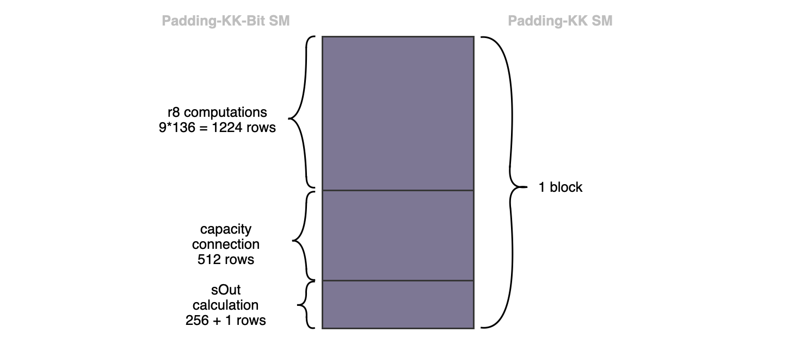
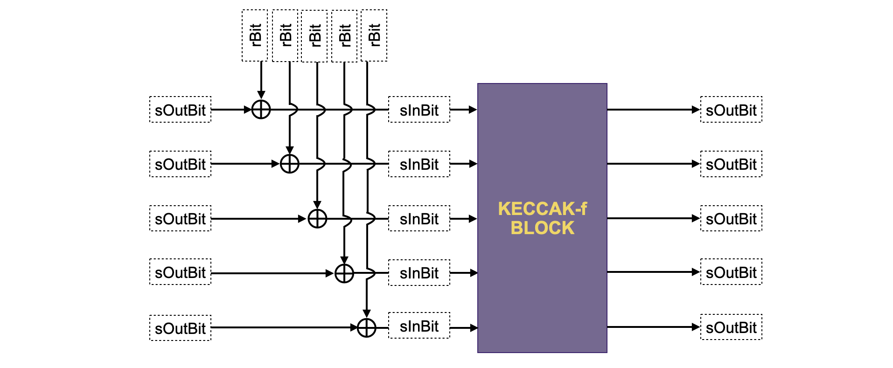

**The 136-byte output of the Padding-KK SM must first be translated to bits before it can be used as the Keccak-F SM's input**. This is where the Padding-KK-Bit state machine comes into picture. **One of the functions of the Padding-KK-Bit SM is to convert bytes to bits in both directions**. And serves as a bridge between the **bit-wise operating Keccak-F SM** and the **byte-wise operating Padding-KK SM**.

The Padding-KK-Bit SM is in charge of validating each action connected to the inputs and outputs of the Keccak-F permutation blocks in addition to being a two-way bytes-to-bits converter.

## Design strategy

Here's how this state machine facilitates operations between the Padding-KK SM and the Keccak-F SM.

A block of 136 rows of bytes in the Padding-KK SM corresponds to $\mathtt{1993}$ rows in the Padding-KK-Bit SM. The picture below, displays the correspondence, also shows three subdivisions of the $\mathtt{1993}$ rows (corresponding to $\mathtt{1224+512+256+1}$).

**First subdivision &rarr;** It consists of $\mathtt{9*136 = 1224}$ rows, where each of the $\mathtt{136}$ byte-rows has been expanded into $\mathtt{9}$ rows (i.e., $\mathtt{8}$ rows for the $\mathtt{8}$ bits plus $\mathtt{1}$ row for the byte that represents the $\mathtt{8}$ bits). The decomposition of the bytes into the 8 bits (with an extra row, just for the byte), is done for easy implementation in PIL. This subdivision of $\mathtt{1224}$ rows represents the bitrate of the KECCAK-F permutation. Therefore, a strategy to ensure that the bits are accurately and correctly provided, as input to the KECCAK-F SM, needs to be derived.

**Second subdivision &rarr;** This consists of the $\mathtt{512}$ rows, and represents the capacity input-bits in the $\mathtt{1600}$-bit state of the KECCAK-F SM. Within the KECCAK-F state machine, unlike the bits in the first subdivision of $\mathtt{1224}$ rows, the capacity bits are not affected by any exterior bits.

**Third subdivision &rarr;** It consists of $\mathtt{256 + 1}$ rows represents the 256 bits of the intermediate hash value produced by the KECCAK-F permutation. At the end of hashing each 1088 bits (136-byte) string, this intermediate hash value actually coincides with the final hash of the KECCAK-256 hash function. Each hash value, the final digest, is packed into eight 32-bit registers at the final row of this subdivision.

### Bytes to bits correspondence

This section elaborates how the Padding-KK-Bit SM handles the correspondence of bytes between state machines, and correct positioning of bits with respect to the powers of 2.

Starting with the first subdivision, the $\mathtt{1224}$ rows related with the bit decomposition of each byte, the following registers are utilised:

- The Padding-KK-Bit state machine has a column named $\texttt{rBit}$, which **records all the bits associated with the decomposition of each of the bytes of the Padding-KK SM**.

- In order to relate the byte to its bit decomposition between the two states machines, a register called $\texttt{r8Id}$ is added in both state machines as a **bit-to-parent-byte** identifier.

- Also, another register called $\texttt{r8}$, is added for the sole purpose of **sequentially constructing each byte from the bits**.

- A factor register $\texttt{Fr8}$ is used to **correctly place each bit in the parent**, with respect to the powers of 2.

- Therefore, **each complete byte is recorded at the last row of such a 9-row byte block** of the $\texttt{r8}$ register. This row is flagged with a "1" in the same row of another register called $\texttt{latchR8}$. **This ensures that $\texttt{latchR8}$ is 0 in all rows except the last row of a 9-row byte block**.

#### Example: Representation of two bytes

Here's an example of how two bytes, $\mathtt{0xa1}$ and $\mathtt{0xfe}$, from the Padding-KK SM look like in the Padding-KK-Bit SM. The horizontal lines mark the end of a byte block.

$$
\begin{array}{|l|c|} \hline
\texttt{aFreeIn} & \texttt{r8Id}\\ \hline
\mathtt{0xa1} & 1\\ \hline
\mathtt{0xfe} & 2\\ \hline
\end{array}
\implies
\begin{array}{|l|c|c|c|c|c|c|c|c|}
\hline
\texttt{rBit} & \texttt{r8Id} &\texttt{r8} & \texttt{Fr8} & \texttt{latchR8}\\ \hline
1 & 1 & 0 & 1 & 0\\
0 & 1 & \mathtt{0b1} & 2 & 0\\
0 & 1 & \mathtt{0b01} & 2^2 & 0\\
0 & 1 & \mathtt{0b001} & 2^3 & 0\\
0 & 1 & \mathtt{0b0001} & 2^4 & 0\\
1 & 1 & \mathtt{0b00001} & 2^5 & 0\\
0 & 1 & \mathtt{0b100001} & 2^6 & 0\\
1 & 1 & \mathtt{0b0100001} & 2^7 & 0\\
\texttt{X} & 1 & \mathtt{0b10100001} & 0 & 1\\ \hline
0 & 2 & 0 & 1 & 0\\
1 & 2 & \mathtt{0b0} & 2 & 0\\
1 & 2 & \mathtt{0b10} & 2^2 & 0\\
1 & 2 & \mathtt{0b110} & 2^3 & 0\\
1 & 2 & \mathtt{0b1110} & 2^4 & 0\\
1 & 2 & \mathtt{0b11110} & 2^5 & 0\\
1 & 2 & \mathtt{0b111110} & 2^6 & 0\\
1 & 2 & \mathtt{0b1111110} & 2^7 & 0\\
\texttt{X} & 1 & \mathtt{0b11111110} & 0 & 1\\ \hline
\end{array}
$$

Note that $\texttt{latchR8}$ is equal to 1 in the last row of each byte block, and this is the same row where the corresponding complete byte is found in the $\texttt{r8}$ column.

The following constraint applies to the $\texttt{r8}$ column,

$$
\mathtt{r8'} \mathtt{ = r8\cdot(1−latchR8)+rBit·Fr8}
$$

It is very important for $\mathtt{Fr8}$ to be "$0$" when $\mathtt{latchR8}$ is "$1$". If this is not the case, then there is no guarantee that the $\mathtt{r8}$ register will reset to $0$ in the next block.

It is also necessary to ensure that $\mathtt{rBit}$ is binary, by using the next constraint,

$$
\mathtt{rBit \cdot (1−rBit) = 0}
$$

### Validating transitions of bits

The challenge of breaking down bytes into bits has been the main focus up to this point. Here, it is intended to verify the bit transitions following the KECCAK-F operation, which is carried out for each block of 136 bytes. For this, a few columns are introduced.

- $\mathtt{sInBit}$: This register stores the input bit of the current KECCAK-F permutation block.

- $\mathtt{sOutBit}$: This register stores the output bit of the current KECCAK-F permutation block.

- $\mathtt{connected}$: The same idea as in the Padding-KK state machine applies here. The $\mathtt{connected}$ register is constant within a block, and reflects that the output of the previous permutation KECCAK-F is connected to the current one. That is, it indicates that the previous 136-byte block belongs to the same string as the current block.

- $\mathtt{latchSOut}$: This register records "$1$" in the very last row of each of the $\mathtt{1993}$-row block corresponding to a 136-byte block of the Padding-KK SM, and $0$ everywhere else.

Below figure depicts a schema of how to relate the above columns with the KECCAK-F sponge construction.

#### Constraints for bit transitions

These constraints are needed to ensure correct transition between rows.

There is a need to make sure the $\mathtt{connected}$ register is constant in each block. Hence, the following constraint should be added,

$$
\mathtt{connected′ \cdot (1 − latchSOut) = connected · (1 − latchSOut)}
$$

It is also mandatory to test whether $\mathtt{connected}$ and $\mathtt{sOutBit}$ are binary. For these two checks, the following equations are used,

$$
\mathtt{connected \cdot (1 − connected) = 0},\\
\mathtt{sOutBit \cdot (1 − sOutBit) = 0}\qquad\text{ }
$$

The register $\mathtt{sInBit}$ is actually computed from $\mathtt{sOutBit}$, $\mathtt{connected}$ and $\mathtt{rBit}$ columns. Recall that, at the first block of the sponge function, the input bits to the KECCAK-F permutation actually coincide with $\mathtt{rBit}$. However, after the first block, an $\text{XOR}$ of $\mathtt{sOutBit}$ and $\mathtt{rBit}$ must be performed, as seen in the above figure.

Therefore, $\mathtt{sInBit}$ is computed using an auxiliary register $\mathtt{aux\_sInBit}$ as follows,

$$
\mathtt{aux\_sInBit = sOutBit − 2 \cdot sOutBit \cdot rBit,}\text{ }\text{ } \\
\mathtt{sInBit = connected \cdot aux\_sInBit + rBit }\qquad
$$

A quick analysis of $\mathbf{Eqn. 6}$ shows the following,

1. If $\mathtt{connected}$ is $0$, then $\mathtt{sInBit}$ equals $\texttt{rBit}$, which is precisely what needs to happen in the first KECCAK-F permutation block.

2. But if $\mathtt{connected}$ is $1$, then $\mathtt{sInBit}$ equals $\mathtt{sOutBit − 2 \cdot sOutBit \cdot rBit + rBit}$, which is actually the $\text{XOR}$ of $\mathtt{sOutBit}$ and $\mathtt{rBit}$.

Below table shows all the cases of the above computation.

$$
\begin{array}{|l|c|c|c|c|c|c|c|c|}
\hline
\texttt{connected} & \texttt{sOutBit} &\texttt{rBit} & \texttt{sInBit} \\ \hline
\text{}\text{}\qquad 0 & 0 & 0 & 0\\
\text{}\text{}\qquad 0 & 0 & 1 & 1\\
\text{}\text{}\qquad 0 & 1 & 0 & 0\\
\text{}\text{}\qquad 0 & 1 & 1 & 1\\
\text{}\text{}\qquad 1 & 0 & 0 & 0\\
\text{}\text{}\qquad 1 & 0 & 1 & 1\\
\text{}\text{}\qquad 1 & 1 & 0 & 1\\
\text{}\text{}\qquad 1 & 1 & 1 & 0\\
\hline
\end{array}
$$

### Capacity connection in the 512 rows

The second subdivision of the Padding-KK-Bit SM's $\mathtt{1993}$-row block consists of the $\mathtt{512}$ rows, corresponding to KECCAK-F SM's capacity bits. It is mandatory to ensure these capacity bits (the middle subdivision of each $\mathtt{1993}$-row block) are not affected by any exterior bit.

First, a new register called $\mathtt{rBitValid}$ is added, and it is defined such that it records $1$ in each of the rows corresponding to the capacity bits, and $0$ everywhere else. Hence, the following relationship is added.

$$
\mathtt{(1 − rBitValid) \cdot rBit = 0}
$$

This ensures that in each $1993$-row block, $\mathtt{rBit}$ is $0$ everywhere in the rows corresponding to the capacity bits. This results in XOR-ing $\mathtt{sOutBit}$ with a $0$. And thus, for the rows corresponding to the capacity bits, computing $\mathtt{sInBit = sOutBit \bigoplus rBit}$, amounts to $\mathtt{sInBit = sOutBit}$. Therefore, $\mathbf{Eqn. 8}$ guarantees that the capacity bits are not modified by any exterior bits.

### Output calculations in the (256 + 1) rows

Now, the last part of the Padding-KK-Bit SM is to keep track of the last subdivision of each $1993$-row block. Recall that this third subdivision consists of $256 + 1$ rows, and it is in charge of storing each bit of the intermediate hashes of the KECCAK-F permutation blocks. The $256$ bits of the KECCAK-F permutation output are sequentially and cumulatively stored in eight 32-bit registers $\{\mathtt{sOut_i}|\ 0 \leq i \leq 7 \}$. In a similar method used for the read operations in the Padding-KK SM, eight (8) factor columns $\{\mathtt{FSOut_i} |\ 0 \leq i \leq 7\}$ are used to ensure correct positioning (of each of the $32$ bits in $\mathtt{sOut_i}$) with respect to powers of $2$.

#### Example: Storing 256-bit intermediate hash outputs

Consider the 256 bits, $\mathtt{0b|10110011\dots1010|\dots|11\dots11|01\dots10101101|}$, where "$|$" separates every set of 32 bits. The table below displays how the $256 + 1$ rows of a $1993$-block are stored in the registers $\{\mathtt{sOut_i}|\ 0 \leq i \leq 7 \}$.

$$
    \begin{array}{|l|c|c|c|c|c|c|c|c|c|c|c|}
    \hline
    \texttt{sOutBit} & \mathtt{sOut_0} & \mathtt{sOut_1} & \mathtt{\dots} & \mathtt{sOut_7} & \mathtt{FSOut_0} & \mathtt{FSOut_1} & \mathtt{\dots}  & \mathtt{FSOut_7} & \mathtt{latchSOut}\\ \hline
    \text{ }\text{ }\text{ }\text{ } \dots & \dots  & \dots & \dots & \dots & \dots & \dots & \dots & \dots & \dots\\ \hline
    \quad\text{ }\text{ } 1 & \mathtt{0b1} & \mathtt{0b0} & \dots & \mathtt{0b0} & 1 & 0& \dots & 0 & 0\\
    \quad\text{ }\text{ }0 & \mathtt{0b01} & \mathtt{0b0} & \dots & \mathtt{0b0} & 2 & 0& \dots & 0 & 0 \\
    \quad\text{ }\text{ }1 & \mathtt{0b101} & \mathtt{0b0} & \dots & \mathtt{0b0} & 2^2 & 0&  \dots & 0 & 0\\
    \quad\text{ }\text{ }1 & \mathtt{0b1101} & \mathtt{0b0} & \dots & \mathtt{0b0} & 2^3 & 0& \dots & 0 & 0\\
    \quad\text{ }\text{ }0 & \mathtt{0b01101} & \mathtt{0b0} & \dots & \mathtt{0b0} & 2^4 & 0& \dots & 0 & 0\\
    \quad\text{ }\text{ }1 & \mathtt{0b101101} & \mathtt{0b0} & \dots & \mathtt{0b0} & 2^5 & 0& \dots & 0 & 0\\
    \quad\text{ }\text{ }0 & \mathtt{0b0101101} & \mathtt{0b0} & \dots & \mathtt{0b0} & 2^6 & 0& \dots & 0 & 0\\
    \quad\text{ }\text{ }1 & \mathtt{0b10101101} & \mathtt{0b0} & \dots & \mathtt{0b0} & 2^7 & 0& \dots & 0 & 0\\
    \text{ }\text{ }\text{ }\text{ } \dots & \dots & \dots &  \dots & \dots & \dots & \dots & \dots & \dots & \dots\\
    \quad\text{ }\text{ }1 & \mathtt{0b1\dots10101101} & \mathtt{0b0} & \dots & \mathtt{0b0} & 2^{30} & 0 & \dots & 0 & 0\\
    \quad\text{ }\text{ }0 & \mathtt{0b01\dots10101101} & \mathtt{0b0} & \dots & \mathtt{0b0} & 2^{31} & 0 & \dots & 0 & 0\\
    \hline
    \quad\text{ }\text{ }1 & \mathtt{0b01\dots10101101} & \mathtt{0b1} & \dots & \mathtt{0b0} & 0 & 1 & \dots & 0 & 0 \\
    \quad\text{ }\text{ }1 & \mathtt{0b01\dots10101101} & \mathtt{0b11} & \dots & \mathtt{0b0} & 0 & 2 & \dots & 0 & 0 \\
    \text{ }\text{ }\text{ }\text{ } \dots & \dots & \dots & \dots& \dots & \dots & \dots & \dots & \dots & \dots \\
    \quad\text{ }\text{ }1 & \mathtt{0b01\dots10101101} & \mathtt{0b1\dots 11} & \dots & \mathtt{0b0} & 0 & 2^{30} & \dots & 0 & 0\\
    \quad\text{ }\text{ }1 & \mathtt{0b01\dots10101101} & \mathtt{0b11\dots 11} & \dots & \mathtt{0b0} & 0 & 2^{31} & \dots & 0 & 0\\
    \hline
    \text{ }\text{ }\text{ }\text{ } \dots & \dots & \dots & \dots & \dots & \dots & \dots & \dots & \dots & \dots\\
    \text{ }\text{ }\text{ }\text{ } \dots & \dots & \dots & \dots & \dots & \dots & \dots & \dots & \dots & \dots\\
    \hline
    \quad\text{ }\text{ }0 & \mathtt{0b01\dots10101101} & \mathtt{0b11\dots 11} & \dots & \mathtt{0b0} & 0 & 0 & \dots & 1 & 0\\
    \quad\text{ }\text{ }1 & \mathtt{0b01\dots10101101} & \mathtt{0b11\dots 11} & \dots & \mathtt{0b10} & 0 & 0 & \dots & 2 & 0\\
    \quad\text{ }\text{ }0 & \mathtt{0b01\dots10101101} & \mathtt{0b11\dots 11} & \dots & \mathtt{0b010} & 0 & 0 &  \dots & 2^2 & 0\\
    \quad\text{ }\text{ }1 & \mathtt{0b01\dots10101101} & \mathtt{0b11\dots 11} & \dots & \mathtt{0b1010} & 0 & 0 &   \dots & 2^3 & 0\\
    \text{ }\text{ }\text{ }\text{ } \dots & \dots & \dots & \dots & \dots & \dots & \dots & \dots & \dots & \dots\\
    \quad\text{ }\text{ }0 & \mathtt{0b01\dots10101101} & \mathtt{0b11\dots 11} & \dots & \mathtt{0b0110011\dots 1010} & 0 & 0 & \dots & 2^{30} & 0\\
    \quad\text{ }\text{ }1 & \mathtt{0b01\dots10101101} & \mathtt{0b11\dots 11} & \dots & \mathtt{0b10110011\dots 1010} & 0 & 0 & \dots & 2^{31} & 1\\ \hline
    \end{array}
$$

Observe how factors $\{\mathtt{FSOut_i} |\ 0 \leq i \leq 7\}$, in the above table, are used to construct the $32$-bit registers $\{\mathtt{sOut_i}|\ 0 \leq \mathtt{i} \leq 7 \}$. Note that the last row contains the complete set of the $256$ bits. These columns fulfil the following relations,

$$
\mathtt{sOut_i' = sOut_i \cdot (1 − latchSOut) + sOutBit \cdot FSOut_i }
$$

where $0\leq \mathtt{i} \leq 7$.

The $\mathtt{latchSOut}$ register ensures that $\mathtt{sOutBit}$ is not constrained at the very beginning of each $1993$-block, but only until the third subdivision is reached, where the $\mathtt{FSOut_i}$ begin to attain non-zero values.

This concludes our design for creating the Padding-KK-Bit SM. What is left to be done is to connect both states machines and check the validity of the last hash.

## Padding-KK SM and Padding-KK-Bit SM connection

This section describes how these two state machines, the Padding-KK SM and the Padding-KK-Bit SM, connect **via Plookup**.

First of all, observe that there's a need to check whether the bytes received in one state machine are the same as those in the other. Also, corresponding sequential order of these bytes should be checked. The identifier register $\mathtt{r8Id}$ is added in both states machines for the very reason. In addition, each byte should have the same value in $\mathtt{connected}$ register. Hence, **the following Plookup is added in the Padding-KK state machine**,

$$
\begin{aligned}
\mathtt{r8valid} & \text{ } \{ & \text{} \\
\text{ } &\texttt{aFreeIn} ,\\
&\texttt{r8Id} ,\\
&\texttt{connected}\\
\}\\
\text{ } \mathtt{in}\text{ }
\text{ }\\
\{  \\
&\mathtt{PaddingKKBit.r8,} \\
&\mathtt{PaddingKKBit.r8Id,}\\
&\mathtt{PaddingKKBit.connected}\\
 \text{ }\text{ }
\};\text{ }\\
\end{aligned}
$$

The Padding-KK state machine has the $\{\mathtt{hash_i}\}$ registers while the Padding-KK-Bit state machine has the $\{\mathtt{sOut_i}\}$ registers, which must be related at some point during the execution. Yet, up this point, the order of the hashes has not been checked in any way. Hence, as previously done, an $\mathtt{sOutId}$ register is added in both machines in order to identify each of these hashes.

In particular, $\mathtt{sOutId}$ is an increasing sequence of integers which increases by one at each processed block. That is, in the Padding-KK state machine, $\mathtt{sOutId}$ increases by one in each block of $136$ rows, whilst in the Padding-KK-Bit state machine, it increases by one in each block of $1993$ rows. This is because a single block of $136$ rows in the Padding-KK SM corresponds to a single block of $1993$ rows in the Padding-KK-Bit SM.

Hence, the following Plookup is added:

$$
\begin{aligned}
\mathtt{lastHashLatch} & \text{ } \{ & \text{} \\
\text{} &\texttt{hash0,
hash1, hash2,
hash3, } \\
&\texttt{hash4,
hash5, hash6,
hash7,
\quad } \\
&\texttt{sOutId}\\
\} \\
\text{ } \mathtt{in}\text{ }
\text{ }\\
\{  \\
&\mathtt{PaddingKKBit.sOut0, PaddingKKBit.sOut1,} \\
&\mathtt{PaddingKKBit.sOut2, PaddingKKBit.sOut3,}\\
&\mathtt{PaddingKKBit.sOut4, PaddingKKBit.sOut5,}\\
&\mathtt{PaddingKKBit.sOut6, PaddingKKBit.sOut7,}\\
&\mathtt{ PaddingKKBit.sOutId}\\
 \text{ }\text{ }
\};\quad\text{}\text{}\\
\end{aligned}
$$
