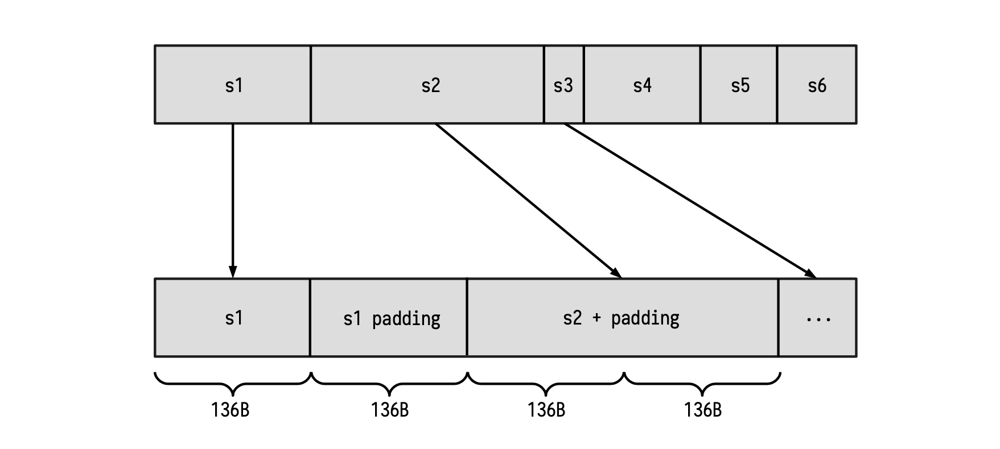

All Keccak-related state machines are accessed through the Padding-KK state machine. It is therefore responsible for handling queries from the Main state machine. The common queries are requests for digests of messages, together with validation of these digests.

In this document, the workings of the Padding-KK SM are described. How it validates the validity of hash values, input string lengths, and input string reading to ensure that padding requirements are followed.

First, keep in mind that the Padding-KK SM's operations are byte-based, whereas the Keccak-F SM's actions are bit-based. This discrepancy in string formats is handled by the Padding-KK-Bit SM.

## Padding and the Keccak-F SM

Although the hashing of messages is carried out by the Keccak-F SM, the padding happens in the Padding-KK SM. Messages are presented to the Padding-KK SM as byte-strings in hexadecimal form. But the Padding-KK-Bit SM ensures that these are presented as bit-strings to the Keccak-F SM.

Even though Keccak-F SM receives strings of any length as inputs, each input-message to the Keccak-F SM is first split into blocks of 1088 bits (i.e., 136 bytes), called the bit rate (or rate). If the tail-end of the splits is shorter than 136 bytes, or if the original message is shorter than 136 bytes, a specific string is appended to it in order to form a full 136-byte string. The appended bits (or bytes) are referred to as the **padding**.

Keccak's first padding-rule is to append the string $\mathtt{100^*1}$ of the appropriate length. That is, the padding always consists of two 1's and a string of 0's between them.

The second padding rule: If the input-message is exactly 136 bytes long, or a multiple of 136 bytes, then a block of 136 bytes consisting of just the padding $\mathtt{100^*1}$, must be appended.

It is crucial to emphasise that the Polygon zkEVM follows the Keccak construction used in the Ethereum. So then the Padding-KK SM does not append any other 'fixed' bits to the padding, such as appending "$\mathtt{01}$" as it is done in the FIPS's SHA-3. Therefore, as far as the Keccak-F hash function is concerned, the Polygon zkEVM does not follow the FIPS.202 Standard.

## Input strings and padding

Consider the strings $\mathtt{s_1, s_2, \dots , s_n}$ that need to be hashed.

Note that the bits (or bytes) of these strings cannot be simply combined and presented as one stream of bits (or bytes) as though they belong to one long string. But each string $\mathtt{s_i}$ need to be treated as an individual string, and thus must first be separately padded in line with the above-mentioned padding rules. Only thereafter, depending on the SM involved, can the bytes or the bits be fed into the relevant SM.

The idea here is to map each string to one or several blocks of 136 bytes (1088 bits), and include the proper padding at the tail-end part.

Observe that, as shown in the first string in the Figure above; Whenever the length of a certain string is a multiple of the block length of 136 bytes, a new block containing only the padding must be appended. Once this is done, the new resulting string can be provided to the Keccak-F SM for hashing.

## Dealing with Main SM queries

The Padding-KK SM is in charge of validating that the padding rule is correctly performed, as well as validating each of the prescribed operations;

1. Validate the lengths of given strings $\{\mathtt{s_i}\}$. (i.e., **length check**),
2. Validate the hashes of certain strings $\{\mathtt{s_i}\}$. (i.e., **digest check**),
3. Validate reads from 1 to 32 bytes of string $\{\mathtt{s_i}\}$. (i.e., **read check**).

Next is to prepare the machinery that will enable the Padding-KK SM achieve these three checks.

### Setting up columns for verification purposes

We now design a series of columns that will enable us to completely verify correctness of every state transitions.

- $\texttt{freeIn}$: This register will store every byte of the padded input (as commented before), one byte per row.
- $\texttt{address}$: This register will store an increasing sequence of integers starting from 0, changing its value at the beginning of a new string. Of course, an address completely determines the corresponding string of a certain byte.

- $\texttt{connected}$: This register represents the connection between two blocks. If $\texttt{connected}$ is 1, the actual block is in the same string with the previous block. Otherwise, the last block is in the previous string.

- $\texttt{lastBlock}$: This register flags the last row of every block. If $\texttt{lastBlock}$ is 1, the next block will start in the next row of the table.

- $\texttt{rem}$: For each string, this register is a decreasing sequence of signed integers. Starting at the length of the current string and it keeps decreasing until the last block of the string is reached. Observe that this value can be negative since a padding may be present in the string. ($\texttt{rem}$ is short for 'remaining'.)

- $\texttt{len}$: For each string, this register stores original length (i.e., the length of the string before padding was appended). Therefore, this register remains constant for all rows of each string. Observe that, at the first row of each string, $\texttt{len}$ coincides with $\texttt{rem}$.

- $\texttt{remIsZero}$: A computed register which is 1 whenever $\texttt{rem}$ is zero, and 0 otherwise.

- $\texttt{spare}$: The $\texttt{spare}$ register is 1 just after the byte $\texttt{0x01}$, corresponding to the appearance of padding bits. Observe that it can happen that $\texttt{spare}$ is constantly 0 among a full string. This is because we can have the situation where the padding only consists of the byte $\texttt{0x81}$.

- $\texttt{lastHash}$: This register is actually computed from the registers $\texttt{spare}$, $\texttt{remIsZero}$ and $\texttt{lastBlock}$ as follows,

$$
\mathtt{lastHash = lastBlock \cdot (spare + remIsZero)} \tag{Eqn.1}
$$

  This means $\texttt{lastHash}$ will be 1 whenever two things hold true. First, if $\texttt{lastBlock} = 1$, and secondly, if the next block to be processed is contained in the next string.

  Observe that $\texttt{spare}$ and $\texttt{remIsZero}$ cannot simultaneously be "1" (i.e., not in the same row). Moreover, it is very important to include $\texttt{remIsZero}$ in this computation because $\texttt{spare}$ alone cannot help detect that padding has occurred. For instance, if $\mathtt{pad = 0x81}$, then $\texttt{spare}$ would remain constant, continuing to record 0's as if no padding took place.

#### Example: Padding check using columns

Let us illustrate this design with a table, using the columns defined above. Suppose the following strings have been padded and are ready for hashing:

$$
\mathtt{s_0 = 8000\dots 00016f6c6c6568}\text{ } \text{ } \text{ } \text{ }\text{ }\text{ }\text{ } \\
\mathtt{s_1 = 8000012f\dots 11|616c\dots 6966}
$$

where "|" indicates the end of a 136-byte block. In the below table, these 136-byte splits between blocks are indicated with a horizontal line.

$$
\begin{array}{|l|c|c|c|c|c|}
\hline
\texttt{freeIn} & \texttt{addr} & \texttt{connected} & \texttt{lastBlock} & \texttt{rem} & \texttt{len} & \texttt{remIsZero} & \texttt{spare} & \texttt{lastHash} \\ \hline
\mathtt{0x68} & 0 & 0 & 0 & 5 & 5 & 0 & 0 & 0 \\
\mathtt{0x65} & 0 & 0 & 0 & 4 & 5 & 0 & 0 & 0 \\
\mathtt{0x6c} & 0 & 0 & 0 & 3 & 5 & 0 & 0 & 0 \\
\mathtt{0x6c} & 0 & 0 & 0 & 2 & 5 & 0 & 0 & 0 \\
\mathtt{0x6f} & 0 & 0 & 0 & 1 & 5 & 0 & 0 & 0 \\
\mathtt{0x01} & 0 & 0 & 0 & 0 & 5 & 1 & 0 & 0 \\
\mathtt{0x00} & 0 & 0 & 0 & -1 & 5 & 0 & 1 & 0 \\
\cdots & \cdots & \cdots & \cdots & \cdots & \cdots & \cdots & \cdots & \cdots \\
\mathtt{0x00} & 0 & 0 & 0 & -129 & 5 & 0 & 1 & 0 \\
\mathtt{0x80} & 0 & 0 & 1 & -130 & 5 & 0 & 1 & 1 \\
\hline
\mathtt{0x66} & 1 & 0 & 0 & 269 & 269 & 0 & 0 & 0 \\
\mathtt{0x69} & 1 & 0 & 0 & 268 & 269 & 0 & 0 & 0 \\
\cdots & \cdots & \cdots & \cdots & \cdots & \cdots & \cdots & \cdots & \cdots \\
\mathtt{0x6c} & 1 & 0 & 0 & 135 & 269 & 0 & 0 & 0 \\
\mathtt{0x61} & 1 & 0 & 1 & 134 & 269 & 0 & 0 & 0 \\
\hline
\mathtt{0x11} & 1 & 1 & 0 & 133 & 269 & 0 & 0 & 0 \\
\cdots & \cdots & \cdots & \cdots & \cdots & \cdots & \cdots & \cdots & \cdots \\
\mathtt{0x2f} & 1 & 1 & 0 & 1 & 269 & 0 & 0 & 0 \\
\mathtt{0x01} & 1 & 1 & 0 & 0 & 269 & 1 & 0 & 0 \\
\mathtt{0x00} & 1 & 1 & 0 & -1 & 269 & 0 & 1 & 0 \\
\mathtt{0x80} & 1 & 1 & 1 & -2 & 269 & 0 & 1 & 1 \\ \hline
\end{array}
$$

The above table illustrates how the columns can be used to record the executional trace of the Padding-KK State Machine. As it is our general approach, a strategy towards achieving verifiable computations, the next task is to describe the state transitions of the Padding-KK SM in terms of polynomials.

### Description of state transitions in PIL

By capturing the relationships between and among the columns (registers defined above) in terms of equations, amounts to translating the execution of the padding into a verification code written in PIL.

  1. In order to guarantee that the value recorded in the $\texttt{rem}$ register decreases until $\texttt{lastHash}$ is 1 (that is, the end of the string), use the relation,

    $$
    \mathtt{rem}'\cdot \mathtt{(1 - lastHash)\ = (rem - 1)(1 - lastHash)} \quad \tag{Eqn.2}
    $$

  2. How can we validate the fact that $\texttt{spare}$ was constructed as expected?

    First observe that $\texttt{spare}$ changes to 1 immediately after a 1 was recorded in the $\texttt{remIsZero}$ register. (i.e., immediately when the padding starts, and when $\mathtt{pad} \not= 0x81$.)

    Secondly, notice that after this point, $\texttt{spare}$ remains 1 until (and including when) $\texttt{lastHash}$ equals 1. After which, $\texttt{spare}$ becomes 0.

    Hence, these behaviour can be captured as,
    $$
    \texttt{spare}' \mathtt{ = (spare + remIsZero)\cdot (1 - lastHash)} \tag{Eqn.3}
    $$

  3. Verifying correctness of the $\texttt{connected}$ register requires two constraints;

    &rarr; Checking that $\texttt{connected}$ is constant in each block

    $$
    \mathtt{connected'}\cdot \mathtt{(1 - lastBlock) = connected \cdot (1 - lastBlock)} \tag{Eqn.4}
    $$

    &rarr; Checking two specific situations,

    - When $\mathtt{lastBlock}$ is 1 and $\mathtt{lastHash}$ is 0 : in this case, the next value of $\texttt{connected}$ should be 0, because of the block change but within the same string.

    - When both $\mathtt{lastBlock}$ and $\mathtt{lastHash}$ are 1 : in this case, the next value of $\texttt{connected}$ should be 0, due to the string change.

    These two scenarios are verified with the following constraint,

    $$
    \mathtt{connected' \cdot lastBlock = ( 1 - lastHash) \cdot lastBlock} \tag{Eqn.5}
    $$

4. The $\mathtt{len}$ register is constant within each string. It must therefore satisfy this relationship,

    $$
    \mathtt{ len'\cdot firstHash = len\cdot (1 - lastHash)} \tag{Eqn.6}
    $$

5. Checking that $\mathtt{len}$ and $\mathtt{rem}$ coincide at the first state of each string, use the constraint,

    $$
    \mathtt{len \cdot firstHash = rem\cdot firstHash} \tag{Eqn.7}
    $$

    where $\mathtt{firstHash}$ is a committed column and it is such that $\mathtt{firstHash' = lastHash}$.

    In fact, $\mathtt{firstHash}$ is a shifted version of $\mathtt{lastHash}$, which is used to ensure that, when starting a string (and therefore, $\mathtt{firstHash = 1}$), then $\mathtt{len = rem}$.

    $$
    \begin{array}{|l|c|c|c|c|c|}
    \hline
      \texttt{lastHash} & \texttt{firstHash}\\ \hline
      \text{ }\text{ } \text{ }\text{ }\text{ }\text{ }\text{ } 0 & 0 \\
      \text{ }\text{ }\text{ }\text{ }\text{ }\cdots & \cdots\\
      \text{ }\text{ }\text{ }\text{ }\text{ }\text{ }\text{ }0 & 0 \\ \hline
      \text{ }\text{ }\text{ }\text{ }\text{ }\text{ }\text{ }0 & 0 \\
      \text{ }\text{ }\text{ }\text{ }\text{ }\cdots & \cdots\\
      \text{ }\text{ }\text{ }\text{ }\text{ }\text{ }\text{ }1 & 0 \\ \hline
      \text{ }\text{ }\text{ }\text{ }\text{ }\text{ }\text{ }0 & 1 \\
      \text{  }\text{ }\text{ }\text{  }\text{ }\text{} \cdots & \cdots\\ \hline
    \end{array}
    $$

6. Let us now specify the relations that satisfy the $\mathtt{addr}$ register. As commented on before, $\mathtt{addr}$ is constant within each string. Hence, $\mathtt{(addr' - addr) = 0}$ if and only if $\mathtt{1 - lastHash \not= 0}$.

    The constraint for the $\mathtt{addr}$ register is therefore,

    $$
    \mathtt{(addr' - addr) \cdot (1 - lastHash)  = 0}\tag{Eqn.8}
    $$

    Note that going from one string to the next, the values of the $\mathtt{addr}$ register form an increasing sequence (increasing by steps of 1 from one string to the next).

    However, since the polynomials utilized in this scheme are all cyclic (due to evaluations on roots of unity), there is a need to ensure that the $\mathtt{addr}$ register resets to $0$ whenever the reading returns to the first row.

    For this purpose, a register called $\mathtt{lastBlockLatch}$ is added. And $\mathtt{lastBlockLatch}$ is 1, if $\mathtt{lastBlock}$ is 1 and the string, that the last block belongs to, is not the last one.

    Similarly, another register called $\mathtt{lastHashLatch}$ is added, and it is defined such that

    $$
    \mathtt{ lastHashLatch = lastBlockLatch \cdot (spare + remIsZero) } \tag{Eqn.9}
    $$

    See below table for a comparison between the $\texttt{latch}$ and non-$\mathtt{latch}$ registers.

    $$
    \begin{array}{|l|c|c|c|c|c|}
    \hline
      \texttt{lastBlock} & \texttt{lastBlockLatch} & \texttt{lastHash} & \texttt{lastHashLatch}\\ \hline
      \text{ }\text{ } \text{ }\text{ }\text{ }\text{ }\text{ } 0 & 0 & 0 & 0 \\
      \text{ }\text{ }\text{ }\text{ }\text{ }\cdots & \cdots & \cdots & \cdots\\
      \text{ }\text{ }\text{ }\text{ }\text{ }\text{ }\text{ } 1 & 1 & 0 & 0 \\ \hline
      \text{ }\text{ }\text{ }\text{ }\text{ }\text{ }\text{ } 0 & 0 & 0 & 0 \\
      \text{ }\text{ }\text{ }\text{ }\text{ }\cdots & \cdots & \cdots & \cdots\\
      \text{ }\text{ }\text{ }\text{ }\text{ }\text{ }\text{ } 1 & 1 & 1 & 1 \\ \hline
      \text{ }\text{ }\text{ }\text{ }\text{ }\text{ }\text{ } 0 & 0 & 0 & 0  \\
      \text{  }\text{ }\text{ }\text{  }\text{ }\text{} \cdots & \cdots & \cdots & \cdots\\
      \text{  }\text{ }\text{ }\text{  }\text{ }\text{} \cdots & \cdots & \cdots & \cdots \\
      \text{ }\text{ }\text{ }\text{ }\text{ }\text{ }\text{ } 1 & 0 & 1 & 0  \\\hline
      \end{array}
    $$

7. In order to grapple with the increasing but cyclic sequence of $\mathtt{addr}$, the following constraint is used,

    $$
    \mathtt{ ( addr' - 1 - addr)\cdot lastHashLatch = 0} \tag{Eqn.10}
    $$

8. Now, checking whether $\mathtt{remIsZero}$ is 1 if and only if $\mathtt{rem}$ is 0, is done reversely by first committing the column $\mathtt{remInv}$, the inverse of $\mathtt{rem}$, and computing $\mathtt{remIsZero}$ as:
    $$
    \mathtt{remIsZero = 1 − rem · remInv} \tag{Eqn.11}
    $$

    And then, as usual, check the relation, $\mathtt{remIsZero \cdot rem = 0}$.

9. Next is the $\mathtt{aFreeIn}$ register which stores the input byte if and only if the current row does not corresponding to the padding. $\mathtt{aFreeIn}$ is computed from the $\mathtt{remIsZero}$, $\mathtt{spare}$ and $\mathtt{lastHash}$ registers. This ensures loading the padding bytes at their correct positions.

    In fact, this register will be used in the Plookup of the next state machine.

    Observe that $\mathtt{aFreeIn}$ can be computed as

    $$
    \mathtt{aFreeIn = (1 − (remIsZero + spare)) \cdot freeIn + remIsZero + lastHash \cdot 0x80} \tag{Eqn.12}
    $$

    Let us carefully analyze this equation:

    - If $\texttt{remIsZero}$, $\texttt{spare}$ and $\texttt{lastHash}$ are all $0$, then $\texttt{aFreeIn}$ equals $\texttt{freeIn}$. As mentioned above, at the non-padding rows, we just store $\texttt{freeIn}$.
    - If $\texttt{remIsZero}$ is 1, $\texttt{spare}$ is 0 and $\texttt{lastHash}$ is 0, then $\texttt{aFreeIn}$ equals $\texttt{0x01}$, which is the first byte of the padding.
    - If $\texttt{remIsZero}$ is 0, $\texttt{spare}$ is 1 and $\texttt{lastHash}$ is 0, then $\texttt{aFreeIn}$ equals $\texttt{0x00}$, which are the intermediate bytes of the padding.
    - If $\texttt{remIsZero}$ is 0, $\texttt{spare}$ is 1 and $\texttt{lastHash}$ is 1, then $\texttt{aFreeIn}$ equals $\texttt{0x80}$, which is the last byte of the padding.
    - Lastly, we should consider the special case where the padding is only the byte $\texttt{0x81}$. In this case, $\texttt{spare}$ is 0 at the last row meanwhile $\texttt{lastHash}$ and $\texttt{remIsZero}$ are both 1. Therefore, $\texttt{aFreeIn}$ equals $\texttt{0x81}$, as we wanted.

    See below table for all the above cases when computing $\texttt{aFreeIn}$.

$$
\begin{array}{|l|c|c|c|c|c|}
\hline
    \texttt{remIsZero} & \texttt{spare} & \texttt{lastHash} & \texttt{aFreeIn} \\ \hline
    \text{ }\text{ }\text{ }\text{ }\text{ }\text{ }\text{ } 0 & 0 & 0 & \texttt{freeIn} \\ \hline
    \text{ }\text{ }\text{ }\text{ }\text{ }\text{ }\text{ } 1 & 0 & 0 & \texttt{0x01} \\ \hline
    \text{ }\text{ }\text{ }\text{ }\text{ }\text{ }\text{ } 0 & 1 & 0 & \texttt{0x00} \\ \hline
    \text{ }\text{ }\text{ }\text{ }\text{ }\text{ }\text{ } 0 & 1 & 1 & \texttt{0x80} \\ \hline
    \text{ }\text{ }\text{ }\text{ }\text{ }\text{ }\text{ } 1 & 0 & 1 & \texttt{0x81} \\ \hline
\end{array}
$$

### Hash output check

We have thus far only dealt with correct inputs of the padding. Now, we will introduce several columns to deal with the hash itself.

Since KECCAK-256's output is 256 bits long, we use eight (8) registers each of 32 bits to store the result of the hash function. Denote these registers by  $\{ \mathtt{hash}_\mathtt{i}\ |\ \mathtt{i} \in \{0, 1, 2, \dots , 7\} \}$.

As columns, these $\{\mathtt{hash}_\mathtt{i}\}$ registers will remain constant within a single string, because they represent the hash of a given string. The following constraints are therefore added,

$$
\mathtt{(hash ′ −hash )·(1−lastHash) = 0} \tag{Eqn.13}
$$

A combination of other KECCAK-related state machines will be used to verify correctness of the output hash. The reason for this is that, for compatibility with the KECCAK-256 hash function, we first need to describe all inputs in terms of bits.

### Length and read check operations

In this section we give a description of the design that will allow us to verify the lengths of input strings and the read operations.

#### Length check

The length check is almost trivial because the $\mathtt{len}$ register has already been introduced.

Suppose one is given a length $l$ and an address $a$. And the aim is to check if the string corresponding to the address $a$ has length $l$.

The strategy is to use Plookup to verify that the given table contains a row with $\mathtt{len} = l$ and an address $\mathtt{addr} = a$ in the last row of the string (i.e., when $\mathtt{lastHash} = 1$). That is to say, the table of columns; $\mathtt{len}$, $\mathtt{addr}$ and $\mathtt{lastHash}$; is as displayed in the table provided below.

$$
\begin{array}{|l|c|c|c|c|c|}
\hline
\texttt{lastHash} & \texttt{ addr } & \texttt{ len }\\ \hline
\text{ }\text{ }\text{ }\text{ }\text{ }\text{ }\text{ } 0 & 0 & \cdots \\
\text{ }\text{ }\text{ }\text{ }\text{ } \cdots & \cdots & \cdots \\
\text{ }\text{ }\text{ }\text{ }\text{ }\text{ }\text{ } 1 & 0 & \cdots \\ \hline
\text{ }\text{ }\text{ }\text{ }\text{ }\text{ }\text{ } 0 & 1 & \cdots \\
\text{ }\text{ }\text{ }\text{ }\text{ } \cdots & \cdots & \cdots \\
\text{ }\text{ }\text{ }\text{ }\text{ }\text{ }\text{ } 1 & 1 & \cdots \\ \hline
\text{ }\text{ }\text{ }\text{ }\text{ }\text{ }\text{ } 0 & \cdots & \cdots \\
\text{ }\text{ }\text{ }\text{ }\text{ } \cdots & \cdots & \cdots \\
\text{ }\text{ }\text{ }\text{ }\text{ }\text{ }\text{ } 1 & \cdots & \cdots \\ \hline
\text{ }\text{ }\text{ }\text{ }\text{ }\text{ }\text{ } 0 & a & l  \\
\text{ }\text{ }\text{ }\text{ }\text{ } \cdots & \cdots & \cdots \\
\text{ }\text{ }\text{ }\text{ }\text{ }\text{ }\text{ } 0 & a & l \\
\text{ }\text{ }\text{ }\text{ }\text{ }\text{ }\text{ } 1 & a & l \\ \hline
\text{ }\text{ }\text{ }\text{ }\text{ }\text{ }\text{ } 0 & a+1 & \cdots\\
\text{ }\text{ }\text{ }\text{ }\text{ } \cdots & \cdots & \cdots \\
\hline
\end{array}
$$

The PIL code for this Plookup looks like this:

$$
\mathtt{ hashKLen \{\ addr,\ op0}\ \}\quad \texttt{in} \quad
\mathtt{ PaddingKK.lastHashLatch \{\ PaddingKK.addr ,\ PaddingKK.len\ }\ \}\quad
$$

where $\texttt{hashKLen}$ flags whenever the operation is checked and the length is stored in $\mathtt{op0}$.

#### Read check

Checking reads requires more columns to be introduced. **Recall that, given given three parameters; the address $a$ of a string, the position $p$ of the starting byte of the string, and  $l$  the total number of bytes that we want to read; the intention is to read the bytes of the string from the first to thirty second**.

It takes 8 registers, each of 32-bits, to store the output of the read operation. Let us denote these registers by:

$$
\{\ \mathtt{crV_i}\ |\ \mathtt{i} \in \{ 0, 1, 2, \dots , 7 \} \}
$$

Further 8 factor polynomials $\{ \mathtt{crF_j} |\ \mathtt{j} \in \{ 0, 1, 2, \dots , 7 \} \}$ are needed so as to correctly place the input bytes with respect to their right power of 2.

Before looking into the roles of the $\{\mathtt{crV_i}\}$ registers and $\{\mathtt{crF_i}\}$ factor polynomials, three more columns are necessary for describing the verification of the read operations. These registers are; $\texttt{crLen}$, $\texttt{crOffset}$ and $\texttt{crLatch}$; and are defined as follows.

- $\mathtt{crLen}$: A register that specifies the number bytes to be read. It is a number register, containing numbers between 1 and 32, and it remains constant in each of the readings we want to perform.

- $\mathtt{crOffset}$: A decreasing sequence of values, starting from *the length value of the read* minus 1 (i.e., $\mathtt{crLen - 1}$ ) and ends at 0, for each read. This is important for positioning each byte at the correct power of 2.

- $\mathtt{crLatch}$: This is a computed column, using the same inverse technique as before. It records instances when the $\mathtt{crOffset}$ register is 0. First, the register $\mathtt{crOffsetInv}$ is committed, allowing  $\mathtt{crLatch}$ to be expressed as
  $$
  \mathtt{crLatch = 1 − crOffset \cdot crOffsetInv} \tag{Eqn.14}
  $$
   which satisfies the constraint, $\mathtt{crOffsetInv \cdot crLatch = 0}$.

#### Example: Read check using columns

Suppose we want to read the first 10 bytes of the address 6, and once finished, read the next two bytes of the same address thereafter. Here is the correct way of constructing the polynomials; $\texttt{crLen}$, $\texttt{crOffset}$ and $\texttt{crLatch}$. Consider the string, $\mathtt{s = 0x...7355ff00111a6e6e1f02ef10}$.

$$
\begin{array}{|l|c|c|c|c|c|}
\hline
\texttt{aFreeIn} & \texttt{ addr } & \texttt{ crLen } & \texttt{crOffset} & \texttt{crLatch}\\ \hline
\text{ }\text{ }\text{ }\mathtt{0x10} & 6 & 10 & 9 & 0 \\
\text{ }\text{ }\text{ }\mathtt{0xef} & 6 & 10 & 8 & 0\\
\text{ }\text{ }\text{ }\mathtt{0x02} & 6 & 10 & 7 & 0\\
\text{ }\text{ }\text{ }\mathtt{0x1f} & 6 & 10 & 6 & 0\\
\text{ }\text{ }\text{ }\mathtt{0x6e} & 6 & 10 & 5 & 0\\
\text{ }\text{ }\text{ }\mathtt{0x6e} & 6 & 10 & 4 & 0\\
\text{ }\text{ }\text{ }\mathtt{0x1a} & 6 & 10 & 3 & 0\\
\text{ }\text{ }\text{ }\mathtt{0x11} & 6 & 10 & 2 & 0\\ \hline
\text{ }\text{ }\text{ }\mathtt{0x00} & 6 & 10 & 1 & 0\\
\text{ }\text{ }\text{ }\mathtt{0xff} & 6 & 10 & 0 & 1\\
\text{ }\text{ }\text{ }\mathtt{0x55} & 6 & 2 & 1 & 0\\
\text{ }\text{ }\text{ }\mathtt{0x73} & 6 & 2 & 0 & 1\\
\text{ }\text{ }\text{ }\text{ } \cdots & \cdots & \cdots & \cdots & \cdots \\ \hline
\end{array}
$$

Note that the horizontal line is used to separate every 8 bytes, which are the exact number of bytes stored in a $\mathtt{crV_i}$ register. We will later on see why this is important.

**Several observations**

Firstly, note that $\mathtt{crLatch}$ is 1 *if and only if* $\mathtt{crOffset}$ is 0.

Secondly, if we want to express the two read values as an array, the output will be
$$
\mathtt{[0xff00111a6e6e1f02ef10, 0x7355]}
$$
where the first element of the array has 10 bytes, whilst the second has 2 bytes. This coincides with each of the $\mathtt{crLen}$ defined values.

Thirdly, observe the relationships that these registers; $\texttt{crLen}$, $\texttt{crOffset}$ and $\texttt{crLatch}$ ; have to satisfy.

$\bf{(a)}$ The $\texttt{crOffset}$ register decreases in every read, so we can express this as
$$
\mathtt{crOffset′ \cdot (1 − crLatch) = (crOffset − 1) \cdot (1 − crLatch)} \tag{Eqn.15}
$$
$\bf{(b)}$ The $\texttt{crLen}$ register remains constant during each read operation, hence the following constraint applies,
$$
\mathtt{crLen′ \cdot (1 − crLatch) = crLen \cdot (1 − crLatch)} \tag{Eqn.16}
$$
$\bf{(c)}$ The first $\texttt{crOffset}$ of every read is $\texttt{crLen − 1}$. Hence, we need to specify the following relationship
$$
\mathtt{crLatch \cdot crOffset' = crLatch \cdot (crLen′ − 1)} \tag{Eqn.17}
$$
$\bf{(d)}$ In addition, we need to ensure that the address resets immediately after a string ends. Otherwise, we will read from a different string. For this reason, we need to introduce the following constraint
$$
\mathtt{(1 − crLatch) \cdot lastHash} \tag{Eqn.18}
$$
which, when combined with the previous constraints enforces the desired results.

**The registers $\{\mathtt{crV_i}\}$ and polynomial factors $\{\mathtt{crF_i}\}$**

Let us now turn to the registers $\mathtt{crV_i}$ and polynomial factors $\mathtt{crF_i}$.

Consider the previous example, where the first element of the 'output' array is
$$
\mathtt{0xff00111a6e6e1f02ef10}
$$
 Obviously, this element does not fit in a 32-bit register. So it needs to be split over three registers; $\mathtt{crV_0}$, $\mathtt{crV_1}$ and $\mathtt{crV_2}$; respectively as,
$$
\mathtt{0x1f02ef10, 0x111a6e6e} \text{ and } \mathtt{0xff00}
$$
Moreover, each byte has a corresponding weight $(2^8)^j$, for some $j \in \{0, 1, 2, 3\}$, such that,

$$
\begin{aligned}
\mathtt{0x1f02ef10=0x10 \cdot 2^0 +0xef\cdot 2^8 +0x02\cdot 2^{16} + 0x1f\cdot2^{24}}\\
\mathtt{0x111a6e6e=0x6e\cdot2^0 +0x6e\cdot2^8 +0x1a\cdot2^{16} +0x11\cdot2^{24}}\\
\mathtt{0xff00=0x00\cdot2^0 +0xff\cdot2^8}\quad\quad\quad\qquad\quad\quad\quad \text{ }\text{}
\end{aligned}
$$

Henceforth, we should reflect this in our state machine using the columns $\mathtt{crF_i}$ and $\mathtt{crV_i}$ for our previous example.

$$
\begin{array}{|l|c|c|c|c|c|c|}
\hline
\texttt{aFreeIn} & \texttt{crLatch} & \mathtt{crV_0} & \mathtt{crV_1} & \mathtt{crV_2} & \mathtt{ crF_0 } & \mathtt{ crF_1 } & \mathtt{ crF_2 }\\ \hline
\text{ }\text{ }\text{ }\mathtt{0x10} & 0 & \mathtt{0x10} & \mathtt{0x00} & \mathtt{0x00} & 1 & 0 & 0 \\
\text{ }\text{ }\text{ }\mathtt{0xef} & 0 & \mathtt{0xef10} & \mathtt{0x00} & \mathtt{0x00} & 2^8 & 0 & 0\\
\text{ }\text{ }\text{ }\mathtt{0x02} & 0 & \mathtt{0x02ef10} & \mathtt{0x00} & \mathtt{0x00} & 2^{16} & 0 & 0 \\
\text{ }\text{ }\text{ }\mathtt{0x1f} & 0 & \mathtt{0x1f02ef10} & \mathtt{0x00} & \mathtt{0x00} & 2^{24} & 0 & 0 \\
\text{ }\text{ }\text{ }\mathtt{0x6e} & 0 & \mathtt{0x1f02ef10} & \mathtt{0x6e} & \mathtt{0x00} & 0 & 1 & 0 \\
\text{ }\text{ }\text{ }\mathtt{0x6e} & 0 & \mathtt{0x1f02ef10} & \mathtt{0x6e6e} & \mathtt{0x00} & 0 & 2^8 & 0 \\
\text{ }\text{ }\text{ }\mathtt{0x1a} & 0 & \mathtt{0x1f02ef10} & \mathtt{0x1a6e6e} & \mathtt{0x00} & 0 & 2^{16} & 0\\
\text{ }\text{ }\text{ }\mathtt{0x11} & 0 & \mathtt{0x1f02ef10} & \mathtt{0x111a6e6e} & \mathtt{0x00} & 0 & 2^{24} & 0\\ \hline
\text{ }\text{ }\text{ }\mathtt{0x00} & 0 & \mathtt{0x1f02ef10} & \mathtt{0x111a6e6e} & \mathtt{0x00} & 0 & 0 & 1\\
\text{ }\text{ }\text{ }\mathtt{0xff} & 1 & \mathtt{0x1f02ef10} & \mathtt{0x111a6e6e} & \mathtt{0xff00} & 0 & 0 & 2^8\\
\text{ }\text{ }\text{ }\mathtt{0x55} & 0 & \mathtt{0x55} & \mathtt{0x00} & \mathtt{0x00} & 1 & 0 & 0 \\
\text{ }\text{ }\text{ }\mathtt{0x73} & 1 & \mathtt{0x7355} & \mathtt{0x00} & \mathtt{0x00} & 2^8 & 0 & 0 \\
\text{ }\text{ }\text{ }\text{ } \cdots & \cdots & \cdots & \cdots & \cdots & \cdots & \cdots & \cdots \\ \hline
\end{array}
$$

Observe that registers $\{\mathtt{crV_i}\}$ are actually cumulative up to the register's maximal capacity of 4 bytes is reached, in which case the next reads are stored in the next $\mathtt{crV_{i+1}}$ register.

The registers $\{\mathtt{crF_i}\}$ are responsible for correct positioning of each byte with respect to powers $(2^8)^j$, for $j \in \{0, 1, 2, 3\}$, providing the decomposition stated above.

Lastly, observe that the rows corresponding to $\mathtt{crLatch = 1}$, store the complete result of the read in the registers $\{\mathtt{crV_i}\}$. These are the rows where validity of the read operation is checked via a Plookup.

**Constraints pertaining to $\{\mathtt{crV_i}\}$ and $\{\mathtt{crF_i}\}$**

The idea here is to compute a column  $\mathtt{crVC_i}$ defined by,

$$
\mathtt{crVC_i = crV_i + crF_i \cdot aFreeIn} \tag{Eqn.19}
$$

and then verify that the next state $\mathtt{crV'_i}$ coincides with $\mathtt{crVC_i}$ whenever $\mathtt{crLatch}$ is not equal to 1. This will confirm that the $\{\mathtt{crV_i}\}$ registers are not only sequentially read, but are also correctly computed from the previous states. Hence, the following constraint needs to be added;

$$
\mathtt{crV' = crVC \cdot (1 − crLatch)}  \tag{Eqn.20}
$$

So far so good.

Now observe that the tuple $(\mathtt{crOffset, crF0, crF1, . . . , crF7})$ is not totally arbitrary. In fact, it needs to be checked whether $\mathtt{crOffset \in \{1,\dots,32\}}$ and $\mathtt{crFi \in \{1,2^8,2^{16},2^{24}\}}$. This is done via a Plookup. That is, checking if the row corresponding to $\mathtt{crLatch = 1}$ is contained among the previously computed table of constants having all possible combinations of the previous columns.

$$
\begin{aligned}
\{ \quad \text{ }\text{ }\text{ }  &  \text{ }\qquad\qquad\qquad\qquad\qquad\qquad\qquad\qquad\qquad\qquad\qquad\qquad\qquad\qquad\qquad\qquad \\
& \mathtt{crOffset,}\\
& \mathtt{crF0,}\\
& \mathtt{crF1,}\\
& \mathtt{crF2,}\\
& \mathtt{crF3,}\\
& \mathtt{crF4,}\\
& \mathtt{crF5,}\\
& \mathtt{crF6,}\\
& \mathtt{crF7}\\
\quad \}\text{ }\text{ } \mathtt{in}\\
\{ \quad \text{ }\text{ }\text{} \\
& \mathtt{k\_crOffset,}\\
& \mathtt{k\_crF0,}\\
& \mathtt{k\_crF1,}\\
& \mathtt{k\_crF2,}\\
& \mathtt{k\_crF3,}\\
& \mathtt{k\_crF4,}\\
& \mathtt{k\_crF5,}\\
& \mathtt{k\_crF6,}\\
& \mathtt{k\_crF7}\\
\};\quad \text{ }\text{ }\text{} \\
\end{aligned}
$$

### Read operation and Main state machine

There are a few subtle details concerning the connection between the Read operation and the Main SM to be taken into account.

For instance, in order to avoid problems, reading from the last (probably smaller) block is not allowed. A constant column $\mathtt{r8Valid}$ is therefore created specifically for checking if a read is done at the last block. So, $\mathtt{r8Valid}$ will be 1 *if and only if* the current state is not at the last block. Hence, the Plookup in the Main SM's PIL code ([main.pil code; lines 663 to 676](https://github.com/0xPolygonHermez/zkevm-proverjs/blob/main/pil/main.pil#L663-L676)):

$$
\begin{aligned}
\mathtt{hashK + hashK1}\text{ } \{ & \text{} \\
&\texttt{addr,}\\
&\texttt{HASHPOS,}\\
&\texttt{D0 * hashK + hashK1,} \\
&\texttt{op0, op1, op2, op3,}\\
&\texttt{op4, op5, op6, op7}\\
\}\text{ } \mathtt{in}\quad\text{ } \\
&\mathtt{PaddingKK.crLatch * PaddingKK.r8Valid}\text{ } \{  \\
&\qquad\mathtt{PaddingKK.addr,} \\
&\qquad\mathtt{PaddingKK.len - PaddingKK.rem - PaddingKK.crLen + 1,}\\
&\qquad\mathtt{PaddingKK.crLen,}\\
&\qquad\mathtt{PaddingKK.crV0C,\ PaddingKK.crV1C,\ PaddingKK.crV2C,\ PaddingKK.crV3C,}\\
&\qquad\mathtt{PaddingKK.crV4C,\ PaddingKK.crV5C,\ PaddingKK.crV6C,\ PaddingKK.crV7C}\\
\};\qquad\text{ }\text{ }\\
\end{aligned}
$$

Please note that these quoted code lines will differ with different versions. They should only be taken as examples for a particular code version.

Note that $\texttt{HASHPOS}$ is marking the position in the string of the byte where the reading starts. The Plookup shown above, maps the  committed polynomial $\texttt{HASHPOS}$ in the Main SM to the linear combination of the committed polynomials; $\mathtt{len}$, $\mathtt{rem}$ and $\mathtt{crLen}$; of the Padding-KK SM as,

$$
\mathtt{len−rem−crLen+1} \tag{Eqn.20}
$$

Let us make use of the following example to clearly see why this linear combination works.

#### Example: Main SM and Padding-KK connection

Suppose we want to read bytes 2, 3 and 4 of the string $\mathtt{0x7766554433221100}$. The table of the reading, reflecting only the relevant columns, is as follows.

$$
\begin{array}{|l|c|c|c|c|c|}
\hline
\texttt{} &\texttt{aFreeIn} & \texttt{len} &\texttt{rem} &\texttt{crLen} &\texttt{len - rem - crLen + 1} & \mathtt{crV_1} \\ \hline
\texttt{line 0} &\mathtt{0x00} & 8 & 8 & 0 & 1 & \mathtt{0x00} \\ \hline
\texttt{line 1} &\mathtt{0x11} & 8 & 7 & 0 & 2 & \mathtt{0x00} \\ \hline
\texttt{line 2} &\mathtt{0x22} & 8 & 6 & 3 & 0 & \mathtt{0x22} \\ \hline
\texttt{line 3} &\mathtt{0x33} & 8 & 5 & 3 & 1 & \mathtt{0x3322} \\ \hline
\texttt{line 4} &\mathtt{0x44} & 8 & 4 & 3 & 2 & \mathtt{0x443322} \\ \hline
\texttt{line 5} &\mathtt{0x55} & 8 & 3 & 0 & 6 & \mathtt{0x00} \\ \hline
\texttt{line 6} &\mathtt{0x66} & 8 & 2 & 0 & 7 & \mathtt{0x00} \\ \hline
\texttt{line 7} &\mathtt{0x77} & 8 & 1 & 0 & 8 & \mathtt{0x00} \\ \hline
\end{array}
$$

Observe that, among the rows with $\mathtt{crLen = 3}$ (the ones where the reading happens), only the row in $\texttt{line 6}$ contains the complete read-result, $\mathtt{0x443322}$, in the $\mathtt{crV_i}$ column. That is, although $\texttt{HASHPOS = 2}$, meaning the reading starts with byte 2 which is in $\texttt{line 2}$, the reading is only complete in $\texttt{line 6}$. And that's the exact row where the linear combination works out to be

$$
\mathtt{\big(len−rem−crLen+1\big) = 2 = HASHPOS}
$$
