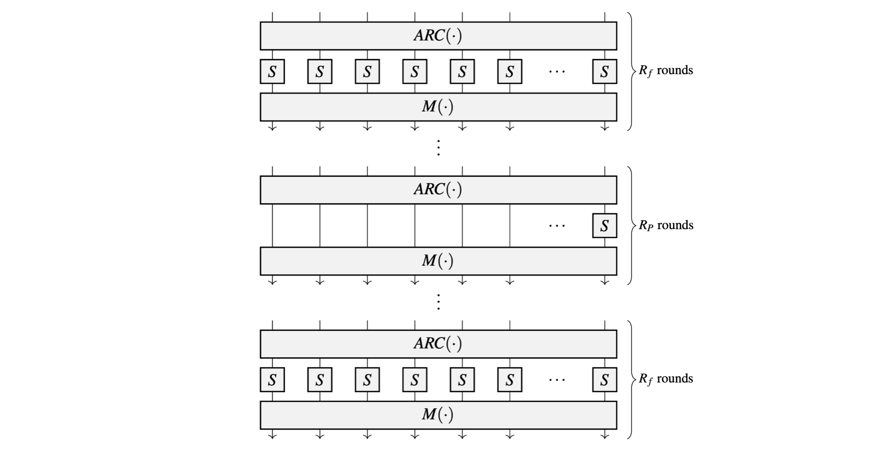
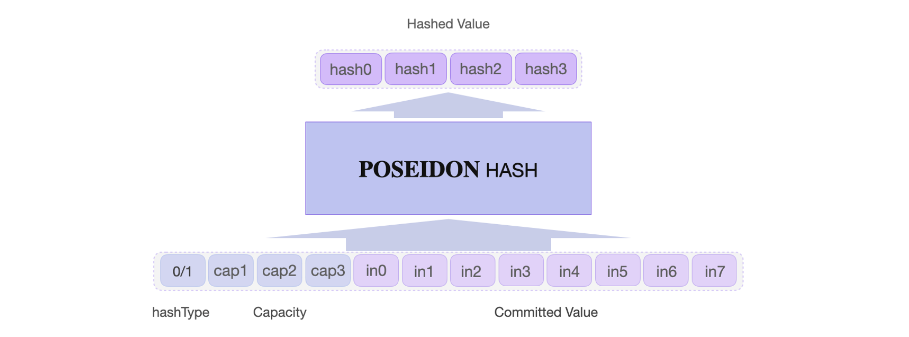

The **Poseidon state machine** is one of the zkProver's 14 state machines. It **is a secondary state machine that receives instructions from the Main State Machine of the zkProver**.

It uses the [Poseidon](https://eprint.iacr.org/2019/458.pdf) hash function to generate hash values in response to requests from the Storage SM and instructions from the Main SM Executor. **Poseidon Actions** are the directives that the Poseidon SM receives from one of the two SMs. **It performs the Poseidon Actions as a secondary SM and also verifies that the output hash values were accurately calculated**.

The Poseidon State Machine therefore consists of an **executor component (the Poseidon SM executor)** and an internal **Poseidon PIL (program)**, which is a collection of verification rules written in the PIL language. The Poseidon SM Executor is written in two languages; Javascript and C/C++.

## Poseidon hash function

The Poseidon Hash, as used in the zkEVM, is defined over the Goldilocks-like field $\mathbb{F}_p$ where the prime $p = 2^{64} - 2^{32} + 1$. It operates on $\mathtt{64}$-bit field elements. The state width of the Poseidon permutation is $8$ field elements, which amounts to $\mathtt{512}$ bits, while the capacity is $\mathtt{4}$ field elements.

As a sponge construction, $\text{POSEIDON}^{\pi}$ has internal states each of  $t$ cells (words), and iterates execution of the **round function** for as many times as it is regarded safe against round-dependent attacks such as **Differential or Linear Cryptanalytic attacks**.

A typical **round function** consists of three operations; an addition of a round-key ($ARC$), a non-linear function $S$ (i.e., a substitution box or S-box), and a linear function $L$ which is often an affine transformation (in particular, an MDS matrix $M$).

Some rounds are **partial rounds** because they use only one S-box instead of the full number of $t$ S-boxes. For the specific construction given in [[GKR+20](https://eprint.iacr.org/2019/458.pdf)], a **full round** means the round function utilizes $t$ instances of the same S-box. For security purposes against certain cryptanalytic attacks, outer rounds are **full rounds**, while the inner rounds are **partial rounds**.

Denote the number of rounds by $\mathtt{R = R_F + R_P}$ where  $\mathtt{R_F}$  is the number of full rounds and $\mathtt{R_P}$ is the number of partial rounds. Also, let $\mathbf{M}(\cdot)$ denote the linear diffusion layer.

[The figure](https://eprint.iacr.org/2019/458.pdf) below, depicts a HADES-based $\text{POSEIDON}^{\pi}$ permutation.



The **Poseidon S-box**, $S$, is defined over a finite field as the power map $x\mapsto x^d$, where $d\geq 3$  is chosen as the smallest integer that guarantees invertibility and provides non-linearity.

The commonly used S-box is the cubic, $f(x) = x^3$. However, for fields where the cubic is not bijective, either $f(x) = x^5$ or $f(x) = x^{-1}$ is used as an alternative permutation.

The Poseidon S-box layer used in the zkProver is specified as:

$$
f(x) = x^7.
$$

**Maximum distance separable (MDS)** matrices are used as the **Linear Diffusion Layer** in Poseidon, where an MDS matrix $\mathbf{M} \in \mathbb{F}^{t \times t}$ is characterised by the following known result;

$$
\text{A matrix } \mathbf{M} \text{ is an MDS matrix } \text{ iff } \text{ every submatrix of } \mathbf{M} \text{ is non-singular. }
$$

There are various ways to construct an MDS matrix. Some are secure while some are not so secure. However, [algorithms exist](https://eprint.iacr.org/2020/500.pdf) that can be used to test whether a given MDS is secure against certain cryptanalytic attacks, such as **Differential Cryptanalysis Attacks**.

The number of full and partial rounds of the permutation, guaranteed to make Poseidon secure, is specified as follows,

$$
\mathtt{R_F = 8 \text{ (number of full rounds)}, \quad R_P = 22 \text{ (number of partial rounds)}}
$$

Only one squeezing iteration is enforced, with an output of the first $4$ field elements of the state (which consists of approximately $256$-bits, but no more than that).

## Description of the Poseidon SM

Poseidon SM is the most straight forward once one understands the internal mechanism of the original Poseidon hash function. The hash function's permutation process translates readily to the Poseidon SM states.

The Poseidon State Machine carries out Poseidon Actions in accordance with instructions from the Main SM Executor and requests from the Storage SM. It computes hashes of messages sent from any of the two SMs, and also checks if the hashes were correctly computed.

The zkProver uses the Goldilocks-like Poseidon defined over the field  $\mathbb{F}_p$, where  $p = 2^{64} - 2^{32} + 1$.

The states of the Poseidon SM coincide with the twelve (12) internal states of the $\text{POSEIDON}^{\pi}$ permutation function. These are; `in0`, `in1`, ... , `in7`, `hashType`, `cap1`, `cap2` and `cap3`.



The parameters of the $\text{POSEIDON}^{\pi}$ permutation are as follows;

- The number of internal states (or cells/words) is $t = 12$. That is, twelve $\mathbb{F}_p$ elements consisting of; the eight (8) input words `in0`, `in1`, ... , `in7`; the hash type `hashType`; and three capacity cells.
- Capacity cells, denoted in the code as `cap1`, `cap2` and `cap3`. That is, $c = 3$.
- S-box used is the mapping, $f(x) = x^7$.
- It has 8 full rounds. A **full round** means applying the same S-box on each of the 12 words.
- It has 22 partial rounds. A **partial round** means the S-box is applied only to the first input word, `in0`.
- The **MDS** matrix used is a $(t\times t)$ Cauchy matrix, with $2t + 1 \leq p$ and where each $(i,j)$-entry is of the form $\dfrac{1}{x_i + y_i}$, where the two pairwise distinct sets $\{ x_i \}$ and $\{ y_i \}$ are defined as `MCIRC` and `MDIAG`, respectively. The linear diffusion layer is defined in lines 104 to 116 of the code [sm_poseidon.js](https://github.com/0xPolygonHermez/zkevm-proverjs/blob/main/src/sm/sm_poseidong.js), and it is explicitly used in lines 99 to 110 of [poseidon.pil](https://github.com/0xPolygonHermez/zkevm-proverjs/blob/main/pil/poseidong.pil) code.

$\text{POSEIDON}^{\pi}$ runs 30 rounds, 3 times. Adding up to a total of 90 rounds. It outputs four hash values; `hash0`, `hash1`, `hash2` and `hash3`.

The Poseidon MDS matrix is constructed as shown below.

```js title="sm_poseidong.js"
// definition of the MDS in sm_poseidong.js

const MCIRC = [17n, 15n, 41n, 16n, 2n, 28n, 13n, 13n, 39n, 18n, 34n, 20n];
const MDIAG = [8n, 0n, 0n, 0n, 0n, 0n, 0n, 0n, 0n, 0n, 0n, 0n];

const M = [];
for (let i = 0; i < 12; i++) {
    M[i] = [];
    for (let j = 0; j < 12; j++) {
        M[i][j] = F.e(MCIRC[(-i + j + 12) % 12]);
        if (i === j) M[i][j] = F.add(M[i][j], MDIAG[i]);
    }
}
```

## In a nutshell

Firstly, the Poseidon SM Executor translates the Poseidon Actions into the PIL language.

Secondly, it executes the Poseidon Actions (i.e., hashing).

And thirdly, it uses the Poseidon PIL (program) [poseidon.pil](https://github.com/0xPolygonHermez/zkevm-proverjs/blob/main/pil/poseidong.pil), to check execution correctness of the Poseidon Actions.

### Translation to PIL

It builds the constant polynomials, which are generated once-off at the beginning. These are;

- Three (3) arrays of Add-Round Constants (ARCs), each an array of size 12, denoted by  `C[12]`.
- The `LAST` constant polynomial, can either be `0` or `1`. It is used for resetting register values to `0`.
- The `LATCH` constant polynomial, can either be `0` or `1`.
- The `LASTBLOCK` constant polynomial, can either be `0` or `1`. It is used for resetting hash values.
- The `PARTIAL` constant polynomial, can either be `0` or `1`. It is used to set a round to either `PARTIAL` or `FULL` round.

### Execution of Poseidon Actions

The main part of the Poseidon SM Executor is found in the `lines 138 to 256` of [sm_poseidong.js](https://github.com/0xPolygonHermez/zkevm-proverjs/blob/main/src/sm/sm_poseidong.js). This is where it executes Poseidon Actions.

It computes all the committed polynomials;

1. The input words; `in0`, `in1`, ... , `in7`
2. The type of the hash used and the values representing the capacity; `hashType`, `cap1`, `cap2` and `cap3`
3. The four hash values; `hash0`, `hash1`, `hash2` and `hash3`, which are the outputs of the $\text{POSEIDON}^{\pi}$ permutation

It also exports all these committed polynomials for verification (checking the hash values `hash0`, `hash1`, `hash2`, and `hash3`), carried out by the [poseidon.pil](https://github.com/0xPolygonHermez/zkevm-proverjs/blob/main/pil/poseidong.pil) program.

### Poseidon PIL program

The inputs to the Poseidon PIL program are; the constant polynomials and all the committed polynomials.

Here, the input vector (`in0`, `in1`, ... , `in7`, `hashType`, `cap1`, `cap2`, `cap3`) is taken through the various stages of the $\text{POSEIDON}^{\pi}$ permutation;

1. The round constants are added to each element of this input vector.
2. The S-box function is applied to each element (i.e., to the result of the addition of the round constant), where the first four rounds and the last four of the 30 rounds are full rounds, while the other 22 rounds are partial rounds.
3. The MDS matrix is applied to the intermediate vector, whose elements are the results of Step 2 above.
4. The final results are checked against the hash values given as input polynomial commitments; `hash0`, `hash1`, `hash2`, and `hash3`.

## GitHub source

The Polygon zkEVM Repository is available here: [Polygon zkEVM on GitHub](https://github.com/0xPolygonHermez)

**Poseidon SM Executor**: [sm_poseidong.js](https://github.com/0xPolygonHermez/zkevm-proverjs/blob/main/src/sm/sm_poseidong.js)

**Poseidon SM PIL**:  [poseidong.pil](https://github.com/0xPolygonHermez/zkevm-proverjs/blob/main/pil/poseidong.pil)

**Test Vectors**: [poseidong_test.js](https://github.com/0xPolygonHermez/zkevm-testvectors/tree/main/test/poseidon)
