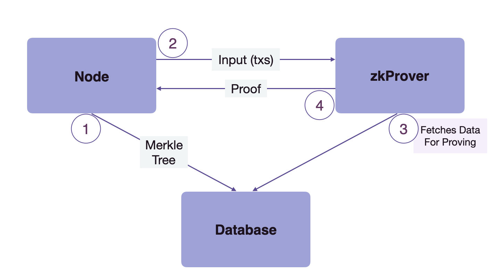
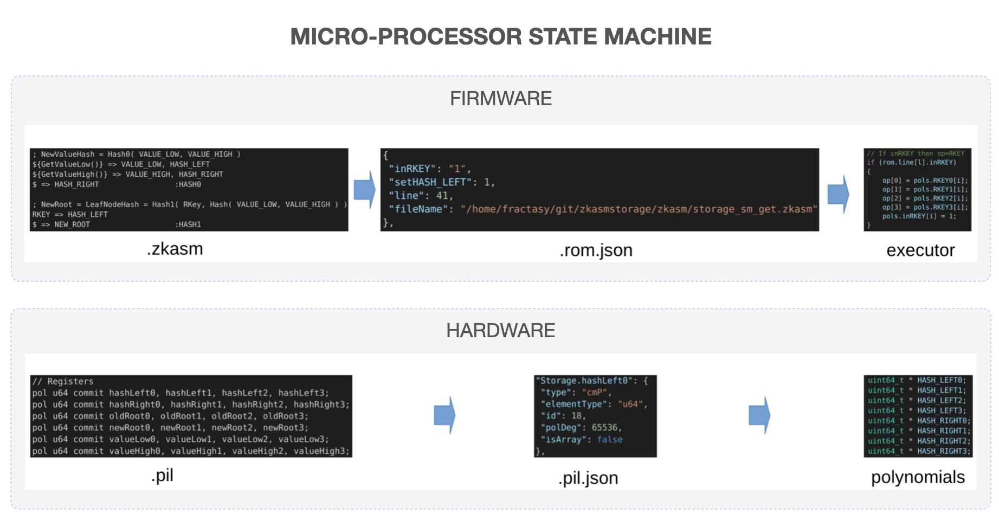
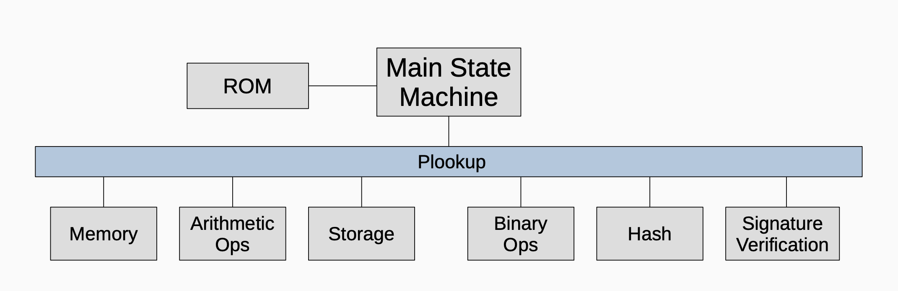
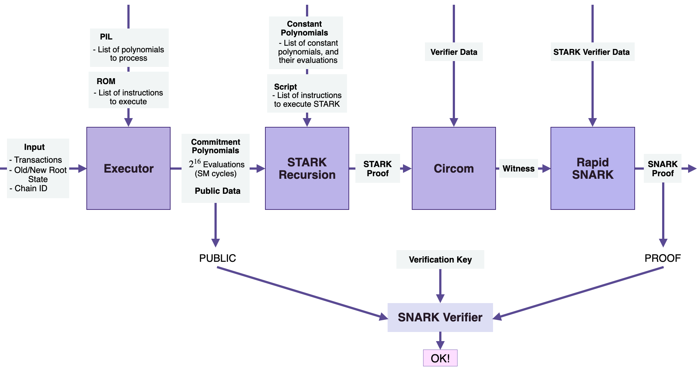

The design paradigm at Polygon has shifted to developing a zero-knowledge virtual machine that emulates the Ethereum Virtual Machine (EVM).

Proving and verification of transactions in Polygon zkEVM are all handled by a zero-knowledge prover component called the zkProver. All the rules for a transaction to be valid are implemented and enforced in the zkProver.

The zkProver performs complex mathematical computations in the form of polynomials and assembly language which are later verified on a smart contract. Those rules could be seen as constraints that a transaction must follow in order to be able to modify the state tree or the exit tree.

!!!info
    zkProver is a component of the Polygon zkEVM which is solely responsible for Proving.

## Interaction with node and database

The zkProver mainly interacts with two components, i.e. the Node and the database (DB). Hence, before diving deeper into other components, we must understand the flow of control between zkProver, the Node, and database. Here is a diagram to explain the process clearly.

As depicted in the flow diagram above, the whole interaction works out in 4 steps.

1. The node sends the content of Merkle trees to the database to be stored there.

2. The node then sends the input transactions to the zkProver.

3. The zkProver accesses the database and fetches the info needed to produce verifiable proofs of the transactions sent by the Node. This information consists of the Merkle roots, the keys and hashes of relevant siblings, and more.

4. The zkProver then generates the proofs of transactions, and sends these proofs back to the Node.

However, this is really the tip of the iceberg in terms of what the zkProver does. There is a lot more detail involved in how the zkProver actually creates these verifiable proofs of transactions. It will be revealed while we dig deeper into state machines below.

## State machines

The zkProver follows modularity of design to the extent that, except for a few components, it is mainly a cluster of state machines. It has a total of thirteen (13) state machines;

1. The Main state machine.

2. Secondary state machines; Binary SM, Storage SM, Memory SM, Arithmetic SM, Keccak Function SM, PoseidonG SM.

3. Auxiliary state machines; Padding-PG SM, Padding-KK SM, Bits2Field SM, Memory Align SM, Byte4 SM, ROM SM.

Due to the modular design of zkProver, the Main state machine can delegate as many of tasks as possible to other specialist state machines. This heavily improves the efficiency of Main SM.

### Secondary state machines

The Main SM executor directly instructs each of the secondary state machines by sending appropriate instructions called _Actions_, depicted in the below diagram.

The grey boxes are not state machines but indicate _Actions_, which are specific instructions from the Main state machine to the relevant Secondary state machine. These instructions dictate how a state should transition in a state machine. However, every Action, whether from the generic Main SM or the specific SM, must be supported with a proof that it was correctly executed.

There are some natural dependencies between;

1. The Storage state machine which uses merkle Trees and the Poseidon state machine, which is needed for computing hash values of all nodes in the Storage's Merkle Trees.

2. Each of the hashing state machines, Keccak Function SM and the PoseidonG SM, and their respective padding state machines, i.e. the Padding-KK SM and the Padding-PG SM.

## Two novel languages for zkProver

The zkProver is the most complex module of zkEVM. It required development of two new programming languages to implement the needed elements; The Zero-Knowledge Assembly language and the Polynomial Identity Language.

It is not surprising that the zkProver uses a language specifically created for the firmware and another for the hardware because adopting the state machines paradigm requires moving from high-level programming to low-level programming.

These two languages, zkASM and PIL, were designed mindful of prospects for broader adoption outside Polygon zkEVM.

### Zero-knowledge assembly

As an Assembly language, the Zero-Knowledge Assembly (or zkASM) language is specially designed to map instructions from the zkProver's Main state machine to other state machines. In case of the state machines with firmware, zkASM is the Interpreter for the firmware.

Prescriptive assembly codes are generated by zkASM codes using instructions from the Main state machine to specify how a given SM Executor must carry out calculations. The Executor's strict adherence to the zkASM codes' logic and conventions makes computation verification simple.

### Polynomial identity language

The _Polynomial identity language_ (or PIL) is especially designed for the zkProver. Almost all state machines express computations in terms of polynomials. Therefore, state transitions in state machines must satisfy computation-specific polynomial identities.

Polygon zkEVM is creating the most effective solution to solve the blockchain trilemma of privacy, security, and scalability. And its context is an efficient zero-knowledge commitment scheme. The most reliable and effective commitment schemes till-date are the Polynomial Commitment Schemes.

Hence, it was convenient to transform calculations into some polynomial language, where verification essentially comes down to verifying whether execution fulfils specific polynomial identities. All PIL codes, in the zkProver's state machines, therefore form the very DNA of the verifier code.

## Microprocessor state machines

There are two microprocessor-type state machines; the Main SM and the Storage SM. These two state machines have the Firmware and the Hardware part. It is worth noting that each of these Microprocessor SM has its own ROM.

The Firmware part runs the zkASM language to set up the logic and rules, which are expressed in JSON format and stored in a ROM. The JSON-file is then parsed to the specific SM Executor, which executes Storage _Actions_ in compliance with the rules and logic in the JSON-file.

The Hardware component, which uses the Polynomial Identity Language (PIL), defines constraints (or polynomial identities), expresses them in JSON format, and stores them in the accompanying JSON-file. These constraints are parsed to the specific SM Executor, because all computations must be executed in conformance to the polynomial identities.

!!!info
    Although the Main SM and the Storage SM have the same look and feel, they differ considerably.

    For example, the Storage SM specialises with execution of Storage _Actions_ (also called SMT _Actions_), whilst the Main SM is responsible for a wider range of _Actions_. Nevertheless, the Main SM delegates most of these _Actions_ to specialist state machines. Also, the Storage SM remains secondary as it receives instructions from the Main SM, and not conversely.

## Hashing in the zkProver

There are two secondary state machines specialising with Hashing ; The Keccak state machine, and the Poseidon state machine. Each of them is an "automised" version of its standard cryptographic hash function.

### Keccak state machine

The Keccak SM is a gates state machine. It has a set of logic gates (the hardware) and a set of connections between the gates (the logic). It's a secondary state machine composed of the Keccak SM Hash Generator and the Keccak PIL code, where the latter is for validation purposes.

### Poseidon state machine

The POSEIDON hash function has been publicised as a zk-STARK-friendly hash function. It is newer than the Keccak hash and thus still under the scrutiny of cryptanalysts. As such, it is best-suited for the zkProver context.

The Poseidon SM is very straight-forward if someone is familiar with the internal mechanism of the original Poseidon hash function.

The hash function's permutation process translates readily to the state transitions of the POSEIDON state machine. The hash function's twelve (12) input elements, the non-linear substitution layers (the S-boxes) and the linear diffusion layers (the MDS matrices), are directly implemented in the state machine.

Although a secondary state machine, the POSEIDON SM receives instructions from both the Main SM and the Storage SM. It has both the executor part and an internal PIL code (a set of verification rules), written in the PIL language.

## Proving execution-correctness

The zkProver's state machines are designed to execute programs, as well as to guarantee that these programs are correctly executed.

Each secondary state machine therefore consists of its own executor and a PIL program that can be used to check correct execution of all the instructions coming from the Main SM Executor.

Here is a step-by-step outline of how the system achieves proof / verification of transactions:

- Represent a given computation as a state machine (SM).
- Express the state changes of the SM as polynomials.
- Capture traces of state changes, called execution traces, as rows of a lookup table.
- Form polynomial identities and/or constraints that these state transitions satisfy.
- Prover uses a specific polynomial commitment scheme to commit and prove knowledge of the committed polynomials.
- [Plookup](https://eprint.iacr.org/2020/315.pdf) is one of the ways to check if the Prover's committed polynomials produce correct traces.

While the polynomial constraints are written in the PIL language, the instructions are initially written in zkASM but subsequently expressed and stored in JSON format. Although not all verification involves a Plookup, the diagram below, briefly illustrates the wide role Plookup plays in the zkProver.

## Components of zkProver

For the sake of simplicity, one can think of the zkProver as being composed of the following four components;

- The Executor or the Main state machine executor.

- The STARK Recursion Component.

- The CIRCOM library.

- The zk-SNARK Prover.

In the nutshell, the zkProver uses these four components to generates verifiable proofs. As a result, the constraints that each proposed batch must meet are polynomial constraints or polynomial identities. All valid batches must satisfy specific polynomial constraints.

### The executor

The Executor or Main state machine Executor handles the execution of the zkEVM. This is where EVM Bytecodes are interpreted using a new zero-knowledge Assembly language (or zkASM), specially developed by the Polygon zkEVM team.

It takes as inputs; the transactions, the old and the new states, the ChainID of the Sequencer, to mention a few. The executor also needs;

1. The PIL, which is the list of polynomials, the list of the registers.
2. The ROM, which stores the list of instructions pertaining to execution.

The Executor sets up the polynomial constraints that every valid batch of transactions must satisfy. Another language, specially developed by the team, called Polynomial Identity Language (or PIL), is used to encode all the polynomial constraints.

The Executor executes all instructions on top of the PIL hardware and generates the committed polynomials; which are the state machine cycles, or a list of all the states. It also generates some public data, which forms part of the input to the zk-SNARK verifier.

### STARK recursion component

Once the Main state machine Executor has converted transactions and related data to committed polynomials, the STARK Recursion component takes the following inputs;

1. The committed polynomials.
2. The constant polynomials.
3. Scripts, which are lists of instructions.

These are taken in order to generate a zk-STARK proof. In an effort to facilitate fast zk-STARK proving, the STARK Recursion Component utilises [Fast Reed-Solomon Interactive Oracle Proofs of Proximity (RS-IOPP)](https://drops.dagstuhl.de/opus/volltexte/2018/9018/pdf/LIPIcs-ICALP-2018-14.pdf), also referred to as FRI, for each zk-proof.

The component is referred to as the STARK Recursion, because;

- It actually produces several zk-STARK proofs.

- Collates them into bundles of a few zk-STARK proofs.

- Produces a further zk-STARK proof for each bundle.

- The resulting zk-STARK proofs of the bundles are also collated and proved with only one zk-STARK proof.

This way, hundreds of zk-STARK proofs are represented and proved with only one zk-STARK proof.

### CIRCOM library

The single zk-STARK proof produced by the STARK Recursion Component is the input to a CIRCOM component.

The original CIRCOM [paper](https://www.techrxiv.org/articles/preprint/CIRCOM_A_Robust_and_Scalable_Language_for_Building_Complex_Zero-Knowledge_Circuits/19374986/1) describes it as both a circuits programming language to define Arithmetic circuits, and a compiler that generates two things;

1. A file containing a set of Rank-1 Constraints System (or R1CS) constraints associated with an Arithmetic circuit.
2. A program (written either in C++ or WebAssembly) for computing a valid assignment to all wires of the Arithmetic circuit, called a witness.

As implemented in the zkProver, CIRCOM takes as input a zk-STARK proof in order to perform two tasks;

- Defining and creating an Arithmetic circuit corresponding to the input zk-STARK proof. This Arithmetic circuit is expressed in terms of its equivalent R1CS.
- Generating the witness, which is in fact a set of valid input, intermediate and output values of the circuit wires satisfying the above R1CS.

### zk-SNARK prover

The last component of the zkProver is the zk-SNARK Prover, in particular, Rapid SNARK.

Rapid SNARK is a zk-SNARK proof generator, written in C++ and Intel Assembly, which is very fast in generating proofs of CIRCOM's outputs. With regards to the zkProver, the Rapid SNARK takes as inputs

1. The witness from CIRCOM.
2. The STARK verifier data, which dictates how the Rapid SNARK must process the data, and then generate a zk-SNARK proof.

## Strategy to achieving succinctness

zk-STARK proofs are used because of their speed, and they require no trusted setup. They are however much larger compared to zk-SNARK proofs. It is for this reason, and the succinctness of the zk-SNARKs, that the zkProver uses a zk-SNARK to attest to the correctness of the zk-STARK proofs. zk-SNARKs are therefore published as the validity proofs to state changes. This strategy has huge benefits as it results in gas costs reducing from 5M to 350K.
