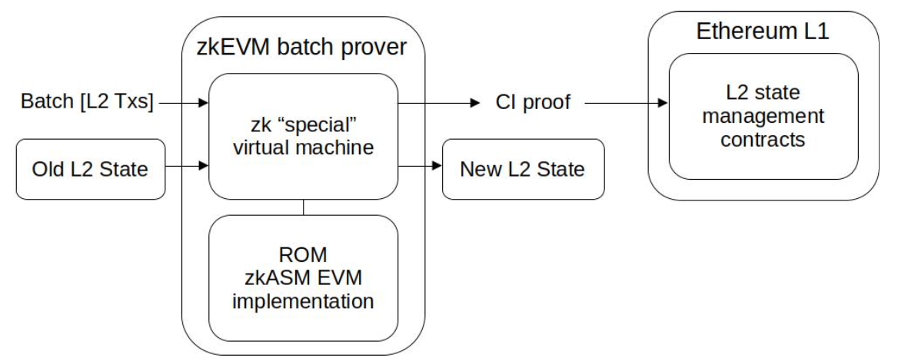
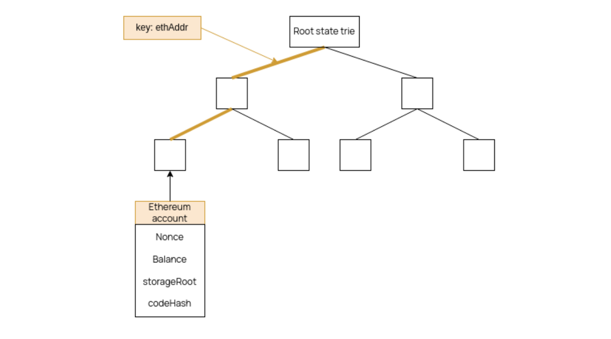
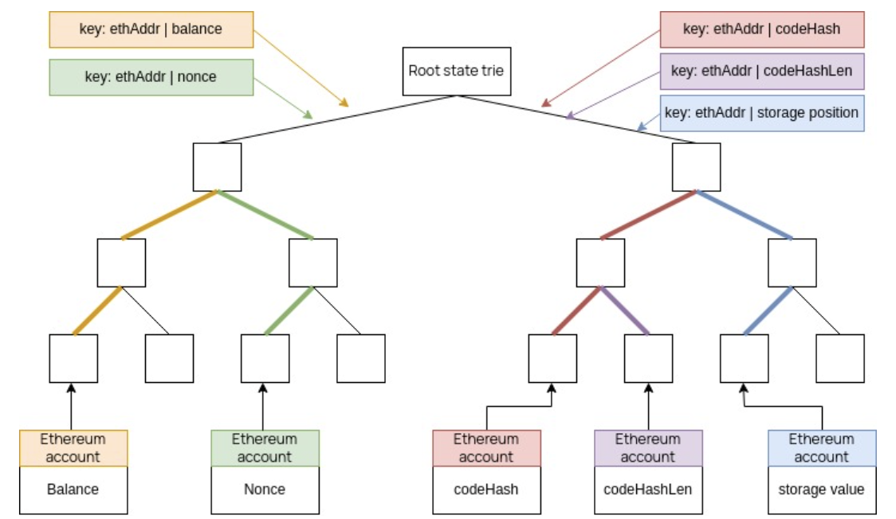
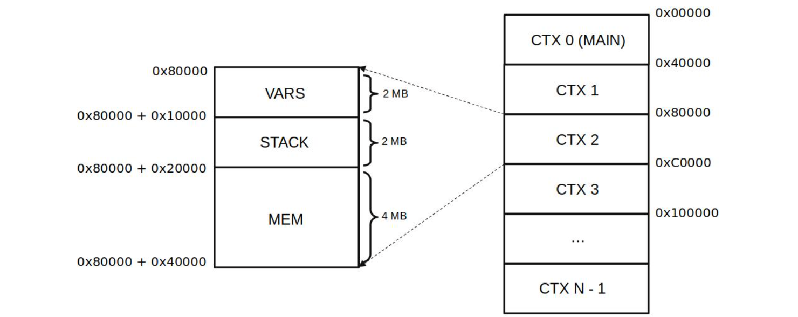
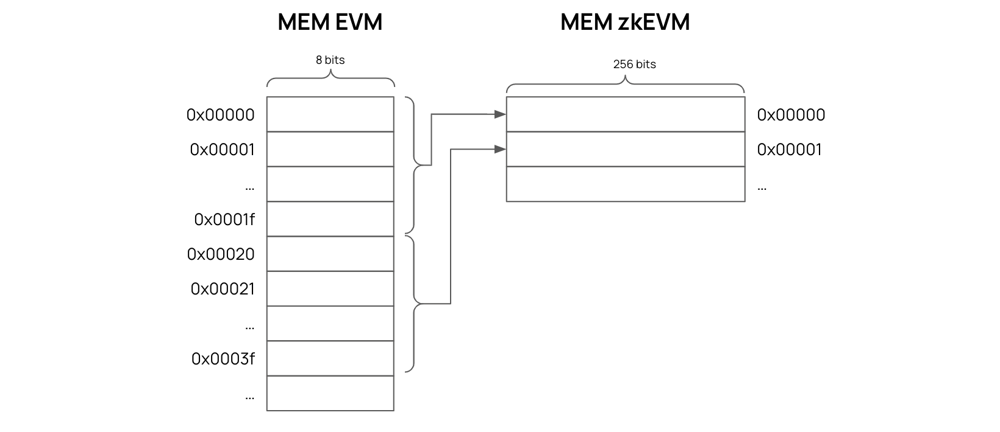
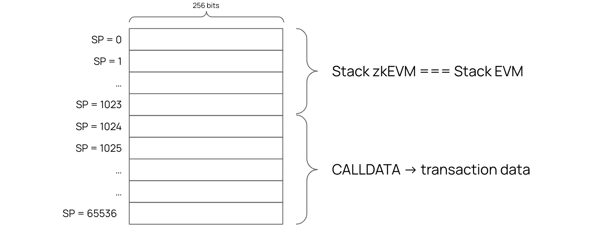

Main State Machine is a component of the zkProver that can be instantiated with various computations pertaining to transactions submitted by users to the Polygon zkEVM network.

In addition to carrying out these computations, the Main SM also generates fixed-length, easy-to-verify cryptographic proofs of Computational Integrity (CI). These proofs can be verified by spending only a minimal amount of computational resources.

It achieves this by using cutting-edge zero-knowledge technology. In particular, these proofs are STARK proofs that are recursively aggregated into one STARK proof, which is in turn proved with a SNARK proof. This last SNARK proof is published as the validity proof. You can read a summary of the STARK proofs recursion [here](index.md), and its complete documentation [here](../stark-recursion/index.md).

## The ROM

The ROM is a program written in zero-knowledge Assembly (zkASM) and contains all the instructions the Main SM must execute. It is to the Polygon zkEVM what the EVM Interpreter is to Ethereum. Since the ROM is in fact analogous to computer memory, it is named with a well-known acronym that stands for **Read-Only Memory**.

The Main SM can be viewed as a processor capable of interpreting a set of instructions, and the ROM as the memory containing the firmware. The term firmware here refers to a piece of low-level software that is infrequently subjected to changes.

It is a piece of software, composed of a set of instructions, which implements a special EVM interpreter for Polygon zkEVM's L2 architecture.

All EVM opcodes are interpreted in the ROM, as well as interpretation of batches and the execution logic of transactions. The ROM is therefore the interpreter of all opcodes to the Polygon zkEVM, allowing the Main SM to execute Polygon zkEVM's L2 state transitions with Computational Integrity (CI).

!!!info
    In order to avoid any misunderstandings in the future, it is helpful to distinguish between the set of ROM instructions and EVM opcodes:

    **ROM Instructions** &rarr; Set of instructions created and developed by Polygon to target a ”special” zero-knowledge virtual machine (Main SM) that can execute computations with probable Computational Integrity (CI).

    **EVM opcodes** &rarr; Set of instructions designed to target the EVM, used to define smart contract’s computations.

Although zkASM instructions and EVM opcodes are different types of instructions, the Polygon zkEVM's ROM contains a piece of code written in zkASM instructions to implement each EVM opcode.

## Public Parameters

Polygon zkEVM's proofs of Computational Integrity (CI) are zero-knowledge proofs. That is, the proofs do not reveal any information about the executed computations to effect the state transition.

**How then is the L1 verifier smart contract enabled to verify the proofs?**

The proofs are made verifiable by disclosing certain parameters pertaining to the executed computations. These are **public parameters** because they are in fact publicly disclosed. Since the proof is derived from the actual execution of the computations being specified, verification of the proofs will not succeed if falsified parameters are used.

These public parameters form part of the **data availability** of L2 batches, which is provided by the L1 contracts.

Here is a complete list of the public parameters;

- `oldStateRoot`: the root of **old state** refers to the root of the Merkle tree representing the L2 State before the state transition was executed.

- `newAccInputHash`: the new accumulating input hash is a unique cryptographic identifier of the batch whose execution is currently being proved and verified. And it is computed as the **Keccak256** digest of the quintuple;

    $$
    \texttt{oldAccInputHash},\ \texttt{batchHashData},\ \texttt{globalExitRoot},\ \texttt{timestamp},\ \texttt{msg.sender}.
    $$
  
- `oldAccInputHash`: the old accumulating input hash is the Keccak-$256$ digest of the previous batch in a sequence of batches. It is a unique cryptographic identifier of the previous batch in the batch chain (i.e., the batch whose execution led to the old L2 state before the state transition).

- `oldBatchNum`: the old Batch Number is a unique batch index of the previous batch (i.e., the batch whose execution led to the L2 state that existed before the state transition currently being proved and verified).

- `newStateRoot`: the new state root is the root of the newly amended Merkle tree (representing the new L2 State) due to the state transition being proved and verified.

- `newBatchNum`: the new Batch Number is a unique batch index of the batch whose execution is currently being proved and verified.

- `localExitRoot`: the local Exit Root is the root of the L2 Bridge contract’s Exit Merkle Tree, at the end of the batch execution.

- `chainID`: the chain ID is a unique chain ID of the Polygon zkEVM network, ensures that the computation can only be proven for a specific network.

- `forkID`: the fork ID is a unique identifier of the version of the ROM that is currently being used. It ensures that computations can only be proved and verified for a specific version of the ROM code.

## State Trie

The state of a Blockchain is typically recorded in the form of a Merkle Tree. Both the EVM and the Polygon zkEVM store their states in their respective especially modified Merkle Trees.

### EVM State Trie

An Ethereum state is stored in the form of a **Modified Patricia Merkle Tree**.

At each level, a branch node is an array of $17$ items composed of $1$ node value and $16$ child-nodes.

The user key is the Keccak-256 digest of the user's Ethereum address,

$$
\texttt{Key = keccak256(ethereumAddress)}
$$

The value in a leaf is the Keccak-256 digest of the RLP-encoding of an Ethereum account,

$$
\texttt{Value = keccak256(RLP(ethereumAccount))}
$$

where the Ethereum Account is composed of; the Nonce, Balance, Storage Root, and Code hash.

The Storage Root is basically all the storage of the State that a smart contract has, and is coded into another Modified Patricia Merkle Tree.

Here is how the tree in the EVM looks like:

### zkEVM State Trie

There are some differences between the zkEVM Merkle tree and EVM Merkle tree.

A zkEVM State is stored in the form of a Sparse Merkle Tree (SMT), which is a binary tree. Instead of **Keccak-256**, the `POSEIDON` Hash Function is used to build the SMTs, mainly due to its STARK-friendliness.

It is important to note that unlike the EVM tree, the zkEVM SMT does not add all the parameters in one leaf of the Merkle tree.

For convenience and achieving faster computations, each of the parameters (the Nonce, Balance, Storage Root and Code hash) is stored in its respective leaf.

An additional parameter called `codeHashLen` is used to store the length of the Code hash. A fifth leaf-type is used for this zkEVM-specific parameter.

Also, each value in a leaf is an array of eight values, $[\texttt{V0}, \texttt{V1}, \texttt{V2}, \dots , \texttt{V7}]$, where each $\texttt{Vi}$ is a $32$-bit element. That field is the Goldilocks prime field $\mathbb{F}_p$ where $p = 2^{64} - 2^{32} + 1$.

The $32$-bit field elements are $8$ in number, so as to be compatible with the $256$-bit EVM words.

So although in the EVM context computation work with $256$-bit words, internally the zkEVM uses $8$ times $32$-bit field elements.

Each of the values; $\texttt{V0}, \texttt{V1}, \texttt{V2}, \dots , \texttt{V7}$; is composed of the $32$ less significant bits of the $63.99$-bit Goldilocks prime field elements.

The figure below depicts the 5 leaf-types together with the corresponding keys:

## Memory Regions

Memory is a volatile Read-Write data storage that exists only during the execution of a ROM instruction.

In Ethereum, whenever a call is made, a new **Context** together with its new Stack and new Memory is created. Each created **Context** is referred to as volatile because it is temporarily available for the call being executed.

### zkEVM Memory map

The Polygon zkEVM uses Context-based Memory. And, by **Context** we refer to an environment of every Ethereum call.

As in Ethereum, when a transactions begins, a new Context is created for that transaction:

$$
\texttt{msg.sender},\ \texttt{msg.value},\ \texttt{stack},\ \texttt{memory},\ \texttt{the\ smart\ contract\ to\ call},\ \texttt{and}\ \texttt{gas}.
$$

The `Stack` and `Memory` are each filled with relevant values in accordance with the call that has been made. Similar to how the EVM uses the Stack, zkEVM operations can be performed by pushing and popping values on and off the Stack.

`Memory` is divided into different Contexts of $\mathtt{0x40000}$ words.

Each word is $256$ bits in length, so each Context is $8$ Megabytes (MB) in size.

#### Contexts in Memory

There can be several Contexts within one transaction. Specific registers are used to handle any necessary switching between Contexts as pertaining to the made call.

As depicted in the figure below, each Context is divided into three word-blocks. And these are:

- `VARS`: contains the local Context's variables which are pre-defined in the language.

  It has a relative offset of `0x00000` and a height of `0x10000` words (taking $2$ MB of the $8$ MB allocated for a Context).

  The list of all Context variables can be found in the [`vars.zkasm`](https://github.com/0xPolygonHermez/zkevm-rom/blob/main/main/vars.zkasm) file.

- `STACK`: contains the stack of the EVM. So, a `STACK` is defined per Context.

  It has a relative offset of `0x10000`, a height of `0x10000` words and takes $2$MB of the $8$MB allocated for a Context.

- `MEM`: contains the free memory that can be freely used.

  It has a relative offset of `0x20000`, a height of `0x20000` words and takes $4$ MB of the $8$ MB allocated for a Context.

  `MEM`, like `STACK`, is also defined per Context.

For a given slot in memory, its pointer is computed as:

$$
\texttt{memoryAddress} \mathtt{ = 0x40000 \cdot CTX + isStack \cdot (0x10000 + SP) + isMem · (0x20000 + offset)}
$$

where,

- `CTX`: an integer variable indicating to the Context being accessed in the EVM’s memory.
- `isStack`: a Boolean value indicating whether the Memory operation being performed is related to the EVM’s Stack or not.
- `SP`: a variable referring to the current position of the Stack Pointer in the EVM’s stack. The Stack Pointer keeps track of the top of the Stack.
- `isMem`: a Boolean value indicating whether the Memory operation being performed is related to the EVM’s memory. Observe that `isStack` and `isMem` cannot be $1$ at the same time.
- `offset`: a set `addr` in Memory to which the `zkPC` jumps to within the currently accessed Context.

### Memory Alignment

There is a major difference between the EVM Memory and the zkEVM Memory.

That difference is the EVM Memory is created in the form of slots where each slot has $8$-bit capacity, while each Memory slot in the zkEVM can store $256$ bits of data.

It was therefore necessary to align the EVM's $8$-bit slots with the zkEVM's $256$-bit slots.

A mapping to synchronize the two Memories comes in the form a special state machine called the [**Mem-Align State Machine**](../mem-align-sm.md). It is a specialized SM solely dealing with the alignment of the EVM Memory with the zkEVM Memory.

### zkEVM Stack

The zkEVM Stack is exactly the same as the EVM Stack except for the number of steps. It has $65536$ steps instead of $1024$.

Note that the EVM works with $256$-bit words, and thus the elements of the EVM Stack are also $256$-bit.

The zkEVM Stack therefore, with its $8 \times 32$-bits representation of values, naturally mimics the $256$-bit architecture of the EVM Stack.

But since there are more steps in the zkEVM Stack than the $1024$ slots of the EVM Stack, only the first $1024$ slots of the zkEVM Stack are used for the EVM Stack.

The rest of the zkEVM Stack slots are used to store `CALLDATA` and its interpretation.

The figure below displays a schematic representation of the zkEVM Stack and the EVM Stack:

## TLDR

&rarr; The ROM is a program written in zkASM. It contains the instructions that the zkProver must execute in order to produce verifiable Computational Integrity proofs. The ROM contains the rules and logic that form the firmware of the zkProver. Its code can be found [here](https://github.com/0xPolygonHermez/zkevm-rom) in the GitHub repository.

&rarr; The zkEVM uses SMT with five different leaf types.

&rarr; Memory alignment between the EVM and the zkEVM is handled by a specialist state machine, the [**Mem-Align State Machine**](../mem-align-sm.md).

&rarr; The two Stacks are exactly the same except that the zkEVM has many more slots compared to the EVM.
