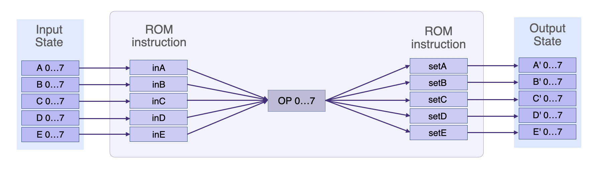
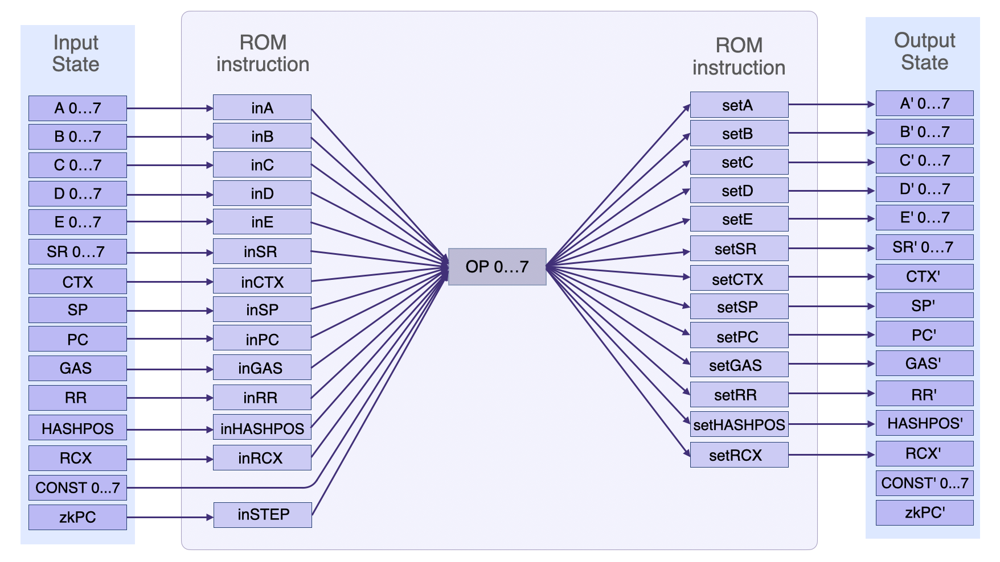
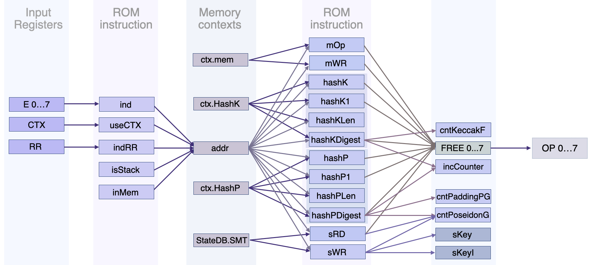

As a microprocessor-type state machine, the Main SM is a typical example of a **Generic State Machine**.

It is a state machine that behaves like an Algebraic processor. It receives instructions in the form of programs written in the zero-knowledge Assembly (zkASM) language, and makes state transitions in accordance with these instructions.

As a Generic SM, it can be thought of as being composed of two parts:

1. The **firmware** part which is concerned with interpreting program instructions and correctly generating the execution trace. The ROM, which is a computer program written in zkASM, contains the set of all the zkProver's instructions. It is to the Polygon zkEVM what the EVM Interpreter is to Ethereum.

2. The **hardware** part is responsible for setting up polynomial identities that every correctly-generated execution trace must satisfy. These polynomial identities (which are obtained via an interpolation process), are described in a novel language developed by the Polygon zkEVM team, called the Polynomial Identity Language.

## Specialist State Machines

Instead of executing all the various computations on its own, the Main SM achieves efficiency by delegating verification of complex computations to specialized secondary state machines. These are:

- [Storage SM](../storage-state-machine/index.md) which handles all storage-related computations (e.g., Create, Read, Update and Delete).
- [Arithmetic SM](../arithmetic-sm.md) which carries out elliptic curve arithmetic operations related to ECDSA.
- [Binary SM](../binary-sm.md) which is responsible for performing all binary operations as the Executor requires.
- [Memory SM](../memory-sm.md) which in the zkEVM plays the same role the EVM Memory plays in Ethereum.
- [Keccak SM](../hashing-state-machines/keccakf-sm.md) which is a binary circuit that computes hash values of strings as instructed by the Main SM. And, it is implemented within a special framework, detailed [here](../hashing-state-machines/keccak-framework.md).
- [Poseidon SM](../hashing-state-machines/poseidon-sm.md) which specialises with computing hash values required in building Sparse Merkle Trees as per the Main SM instructions.

There are other *auxiliary* state machines used in the zkProver; the [Padding-KK](../hashing-state-machines/paddingkk-sm.md), the [Padding-KK-Bit](../hashing-state-machines/paddingkk-bit-sm.md), the Padding-PG SM, the [Memory Align SM](../mem-align-sm.md), the [Bits2Field SM](../hashing-state-machines/bits2field-sm.md) and the ROM SM ([sm_rom.js](https://github.com/0xPolygonHermez/zkevm-proverjs/blob/main/src/sm/sm_rom.js)).

## Algebraic Processor

The Polygon zkEVM is a microprocessor that takes an input state, executes computations in line with ROM instructions, and outputs a new state.

Every computation, whether executed by the Main SM or any of the specialist state machines, is limited to an execution trace of size $2^{23}$. That is, $2^{23}$ steps of the computation.

### Generic Registers

In order to emulate the EVM opcodes, the Polygon zkEVM introduces five state-related generic registers, namely; $\texttt{A}$, $\texttt{B}$, $\texttt{C}$, $\texttt{D}$ and $\texttt{E}$. Each is equivalent to $256$-bit EVM words.

However, since the Main SM operates over a finite field of almost, but less than $64$ bits, each register is split into $8$ subcomponents of $32$ bits each:

$$
    \begin{aligned}
    \mathtt{A_0,...,A_7} \\
    \mathtt{B_0,...,B_7} \\
    \mathtt{C_0,...,C_7} \\
    \mathtt{D_0,...,D_7} \\
    \mathtt{E_0,...,E_7}
    \end{aligned}
$$

with $\mathtt{A_i}$, $\mathtt{B_i}$, $\mathtt{C_i}$, $\mathtt{D_i}$, $\mathtt{E_i}$ $\mathtt{ \in  \{ 0,  \dots , 2^{32 − 1}\}}$.

When storing a value in a register, the least significant bits are placed in the lowest subcomponent. That is,

- if a $32$-bit value is allocated to register $\texttt{A}$, then only $\mathtt{A_0}$ gets filled with the value.
- if a $64$-bit value allocated to register $\texttt{A}$, then both $\mathtt{A_0}$ and $\mathtt{A_1}$ get filled with the value.

#### Example

If the value $\mathtt{0x12345678}$ needs to be stored in register $\texttt{A}$, the least significant byte $\mathtt{0x78}$ would be placed in $\mathtt{A_0}$ and the most significant byte $\mathtt{0x12}$ in $\mathtt{A_3}$.

### OP Register

The `OP` register acts as an intermediate carrier of the computation being executed.

It is expressible as a linear combination of the input values stored in the generic registers as follows,

$$
\texttt{op} = \mathtt{A} * \mathtt{inA} + \texttt{B} * \texttt{inB} + \texttt{C} * \texttt{inC} + \texttt{D}*\texttt{inD} + \texttt{E}*\texttt{inE};
$$

where $\mathtt{inA}$, $\mathtt{inB}$, $\mathtt{inC}$, $\mathtt{inD}$ and $\mathtt{inE}$ are the respective selector polynomials of the generic registers.

The figure below displays the Main SM's state transition, showing the generic registers, the selector registers, setter registers and the `OP` register.



The output value of each register is given by:

$$
\texttt{A}' = (\mathtt{op - A}) * \mathtt{setA} + \texttt{A}, \\
\texttt{B}' = (\mathtt{op - B}) * \mathtt{setB} + \texttt{B}, \\
\texttt{C}' = (\mathtt{op - C}) * \mathtt{setC} + \texttt{C}, \\
\texttt{D}' = (\mathtt{op - D}) * \mathtt{setD} + \texttt{D}, \\
\texttt{E}' = (\mathtt{op - E}) * \mathtt{setE} + \texttt{E},
$$

so that,

- if the setter $\texttt{setX} = 0$ then the output $\texttt{X}' \texttt{ = X}$. That is, the $\texttt{X}$ register value remains unchanged.
- if the setter $\texttt{setX} = 1$ then the output $\texttt{X}'\ \mathtt{=}\ (\mathtt{op - X}) * \mathtt{setX} + \texttt{A} \ \mathtt{=}\ (\mathtt{op - A}) + \texttt{A} \ \mathtt{=}\ \texttt{op}$. That is, the $\texttt{X}$ register value changes to the new value of the $\mathtt{op}$.  

#### Example

Suppose the executed operation is a $\texttt{move}$ of the value in register $\texttt{A}$ to register $\texttt{B}$,

$$
\texttt{A} => \texttt{B} ;
$$

In this case, $\mathtt{inA} \ \mathtt{=}\ 1$ and $\mathtt{setB}\ \mathtt{=}\ 1$, while the rest of the selectors and setters are set to $0$. Hence,

$$
\texttt{op} \ \mathtt{=}\ \mathtt{A} * \mathtt{inA} + \texttt{B} * \texttt{inB} + \texttt{C} * \texttt{inC} + \texttt{D}*\texttt{inD} + \texttt{E}*\texttt{inE} \\
\ \mathtt{=}\ \mathtt{A} * 1 + \texttt{B} * 0 + \texttt{C} * 0 + \texttt{D}*0 + \texttt{E}*0 \ \mathtt{=}\ \mathtt{A}. \quad\text{ }\text{ }\text{ }
$$

So then,

$$
\texttt{B}' \ \mathtt{=}\ (\mathtt{op - B}) * \mathtt{setB} + \texttt{B} \\
\phantom{\texttt{B}'} \ \mathtt{=}\ (\mathtt{A - B}) * 1 + \texttt{B} = \texttt{A}
$$

That is,  $\texttt{B}' = \texttt{A}$.

This is read as follows, "the next value stored in register $\texttt{B}$ is $\texttt{A}$".

#### Main Execution Routine

Each ROM instruction stipulates which registers should be included in computing `OP`, as well as where the resulting output values should be stored.

For each register `X`, the Executor therefore checks whether `inX` is zero or not. It selects the register `X` if $\texttt{inX} \ \mathtt{\not=}\  0$. Similarly, the Executor only stores an output value in the register `Y`, only if `setY` = 1.

The main loop of the Executor looks like this:

```c
for (i=0; i<N; i++)
{
 ...
    if (rom.line[zkPC].inA != 0)
    {
        op = op + rom.line[zkPC].inA*pols.A[i];
        pols.inA[i] = rom.line[zkPC].inA;
    }
    ...

    if (rom.line[zkPC].setA == 1)
    {
        pols.A[nexti] = op;
        pols.setA[i] = rom.line[zkPC].setA;
    }
    ...
}
```

Note that `rom.line[zkPC]` is the line in the ROM indicating the position of the program to be executed. And, `zkPC` denotes the zkEVM Program Counter.

The for loop runs from $i = 0$ to $\texttt{N} = 2^{23}-1$ because the maximum number of execution steps is set at $2^{23}$. Due to the **cyclic nature** of state machines, the iterations must loop back to zero.

At $i = 2^{23}$, the evaluations are such that,

$$
\mathtt{pols.setA[2^{23}]} = \mathtt{pols.setA[0]}.
$$

### Additional Registers

Apart from the generic registers related to the zkEVM State, there are additional registers in Main SM used for various purposes.

Here are the descriptions of each of these registers;

- $\texttt{SR}$: The **State Register** is used to indicate the processor's current state. It might, for example, indicate whether an Arithmetic operation resulted in a $\texttt{carry}$ or an $\texttt{overflow}$, or flag that an instruction encountered an $\texttt{error}$.

- $\texttt{CTX}$: The **Context Register** is used to store the context of the current execution environment. It might, for example, store information about the smart contract or transaction currently being executed.

- $\texttt{SP}$: The **Stack Pointer Register** is used to point to the top of the stack. Every time a number is pushed onto the stack or removed from it, $\texttt{SP}$ is either increased or decreased.

- $\texttt{PC}$: The EVM **Program Counter Register** encodes which instruction, stored in the code, is next to be executed.

    It is usually incremented by one byte, to point to the following instruction, though exceptions may occur.

    For instance, the $\texttt{PUSHx}$ instruction forces the $\texttt{PC}$ to exceed its *one byte* parameter to pushing $\texttt{x}$ bytes, one after the other, before moving to the next instruction.

    Another example is the $\texttt{JUMP}$ instruction which, instead of incrementing the $\texttt{PC}$’s value by one byte, modifies the $\texttt{PC}$ to a location determined by the top of the $\text{Stack}$.

- $\texttt{GAS}$: The **Gas Register** is used to store the remaining amount of gas for the current transaction. $\texttt{GAS}$ is a unit of measure used to quantify the amount of computational effort required to execute specific operations on the Ethereum network.

- $\texttt{RR}$: The **Return Register** is used to store the address to return to, after a function $\texttt{call}$ or a $\texttt{JUMP}$.

- $\texttt{zkPC}$: The **zkEVM Program Counter** register. Similar to the $\texttt{PC}$ register, the $\texttt{zkPC}$ encodes which instruction of the zkEVM is being executed. This register is crucial in ensuring that the program being executed matches the program that needs to be proved.

The figure below depicts the Main SM's simplified state transition in accordance with ROM instructions.



- $\texttt{STEP}$: The **Step Register** is used to store the number of instructions executed so far in the current transaction.

- $\texttt{MAXMEM}$: The **Maximum Memory** register is used to store the maximum amount of memory allocated for the current transaction.

- $\texttt{HASHPOS}$: The **Hash Position Register** contains the index of the next position of the input bytes-array of the hash, that starts the fill.

- $\mathtt{ROTL\_C}$: The **Rotate** **$\texttt{C}$** **to-the-Left** register is read-only, and it is used to flag a left-rotation of the $\texttt{C}$ register by $4$ bytes. This has the effect of moving the $4$ most significant bytes of the $\texttt{C}$ register to the $4$ least significant bytes, and moving the $28$ least significant bytes to the $28$ most significant bytes. Later on, the rotated value in the $\texttt{C}$ register can be assigned elsewhere.

- $\texttt{RCX}$: The **Repeat Count Register** is used in the $\texttt{repeat}$ instruction. The $\texttt{repeat}$ instruction allows for certain instructions to be executed multiple times, based on the value stored in the $\texttt{RCX}$ register.

    The $\texttt{RCX}$ register is decremented by $1$ each time the instruction is executed, until it reaches $0$.

    The use of the $\texttt{RCX}$ register in the $\texttt{repeat}$ instruction allows for efficient execution of repetitive tasks, as it avoids the need for explicit loops in the code.

### Auxiliary Registers

The Main SM utilizes other Context-specific registers in order to effectively execute ROM instructions and facilitate expensive computations.

#### Address In Memory

The **Address** register, $\texttt{addr}$, is used to indicate a position in memory. It is however used internally to an instruction that needs an address, like the $\texttt{call}$ function or any instruction that has something to do with memory.

All $\texttt{JMP}$ instructions (read "jump instructions") for example, require the $\texttt{addr}$ register.

The value in the $\texttt{addr}$ register can come from a variety of sources, such as the following registers; $\texttt{ind}$, $\texttt{indRR}$,  $\texttt{offset}$, $\texttt{isStack}$, $\texttt{useCTX}$ and $\texttt{isMem}$.

Similar to the $\texttt{OP}$ register, the value to be stored in the $\texttt{addr}$ depends on the ROM instruction being executed.

For any ROM instruction $\texttt{inX} \in \{ \texttt{ind}, \texttt{indRR}, \texttt{offset}, \texttt{isStack}, \texttt{useCTX}, \texttt{isMem} \}$, the Executor checks whether $\texttt{inX}$ is $0$ or $1$, and then change the value stored in the $\texttt{X}$ register accordingly.

See the code example below, which is purely for illustration purposes.

```c
for (i=0; i<N; i++)
{
 ...
    if (rom.line[zkPC].ind     != 0) addr = pols.E0[i];
    if (rom.line[zkPC].indRR   != 0) addr = pols.RR[i];
    if (rom.line[zkPC].offset  != 0) addr += rom.line[zkPC].offset;
    if (rom.line[zkPC].isStack == 1) addr += pols.SP[i];
    if (rom.line[zkPC].useCTX  == 1) addr += pols.CTX[i]*CTX_OFFSET;    // CTX_OFFSET=0x40000
    if (rom.line[zkPC].isStack == 1) addr += STACK_OFFSET;              // STACK_OFFSET=0x10000
    if (rom.line[zkPC].isMem   == 1) addr += MEM_OFFSET;                // MEM_OFFSET=0x20000
    ...
}
```

The $\texttt{addr}$ register plays a crucial role during the execution of the Main SM, more especially when the Main SM delegates expensive operations to secondary state machines; like Memory operations, Storage operations, Mem-align operations, Binary operations, and the more expensive Keccak and Poseidon operations.

That is, the $\texttt{addr}$ register comes handy when the Main SM delegates execution and verification of computations to secondary state machines.

Special opcodes are used for each of the delegated SM. For example, $\texttt{binOpcode}$ for the Binary operations or $\texttt{mOp}$ for Memory operations.

The figure below depicts registers contributing to the $\texttt{addr}$ register and its use in secondary state machines such as the Memory SM, KeccakF SM, PoseidonG SM and the Storage SM.



Many of these instructions generate some data and this data is injected into $\texttt{OP}$ via the $\texttt{FREE}\ \texttt{0...7}$ register, where $\texttt{FREE}$ means a free input.

So any data that comes from a calculation or a $\texttt{READ}$ from a database goes into $\texttt{FREE}\ \texttt{0...7}$, and it is in turn injected into $\texttt{OP}$.

#### Example

Suppose a particular instruction requires the value of a Memory position to be read and placed in the $\texttt{D}\ \texttt{0...7}$ register.

1. The $\texttt{mWR}$ register is set to $0$, for the Memory position to be read.

2. The position is then copied into $\texttt{FREE}\ \texttt{0...7}$, and from $\texttt{FREE}\ \texttt{0...7}$ it is injected into $\texttt{OP}$.

3. In order to store the output value, the $\texttt{setD}$ register is set to $1$, allowing the $\texttt{OP}$ value to be copied into $\texttt{D}\ \texttt{0...7}$.

This completes the instruction to read a Memory position and place it in the $\texttt{D}\ \texttt{0...7}$ register.

Once this is done, the value will be used in the next instruction because all output values of one computation are always copied from one step to the next one.

In the same way a value can be read from Memory and be stored in the $\texttt{D}\ \texttt{0...7}$ register, another value can be read from Storage and be stored in the $\texttt{E}\ \texttt{0...7}$ register. And thereafter, an instruction that uses D and E is called.

All-in-all, output values of one evaluation get copied to the next evaluation via the $\texttt{OP}$ register.

#### Counters

Counters are registers mainly used for complex operations in order to limit the number of steps that can be taken to process a transaction.

Here are the counters and their respective state machines;

- $\texttt{cntArith}$ for the Arithmetic SM,
- $\texttt{cntMemAlign}$ for the Mem-Align SM,
- $\texttt{cntBinary}$ for the Binary SM,
- $\texttt{cntKeccakF}$ for the KeccakF SM,
- $\texttt{cntPoseidonG}$ for the PoseidonG SM, and
- $\texttt{cntPaddingPG}$ for the PaddingPG SM.

Every complex operation, which the Main SM delegates to a secondary SM, has a maximum number of execution steps that can be proved.

In the current implementation of the Polygon zkEVM, the maximum number of evaluations in every state machine is set at $\mathtt{N = 2^{23}}$.

A fixed minimum number of steps required to complete the processing of a transaction

```
CONST %MIN_STEPS_FINISH_BATCH = 200
```

The values assigned to these counters are typically derived through a combination of design considerations and empirical testing:

- Design considerations may include factors such as the expected input rate or the maximum number of cycles the system can handle before failure.
- Empirical testing may involve running simulations or testing the system in a real-world environment to determine appropriate counter values.

The maximum limits placed on each counter, with respect to a secondary state machine, are as follows;

```
CONST %MAX_CNT_ARITH = %TOTAL_STEPS / 32 
CONST %MAX_CNT_BINARY = %TOTAL_STEPS / 16 
CONST %MAX_CNT_MEM_ALIGN = %TOTAL_STEPS / 32 
CONST %MAX_CNT_KECCAK_F = (%TOTAL_STEPS / 155286) * 44 
CONST %MAX_CNT_PADDING_PG = (%TOTAL_STEPS  / 56) 
CONST %MAX_CNT_POSEIDON_G = (%TOTAL_STEPS / 30)
```

All counters start at $0$ and every time a complex operation is performed, the corresponding counter is incremented by $1$.

#### Example

If for example, an Arithmetic operation is going to be executed, the current value of the Arithmetic counter, denoted by $\texttt{cntArith[0]}$, is incremented by $1$.

And, the counter is further incremented by $1$ in every subsequent iteration,

$$
\mathtt{cntArith[i]}\ \mathtt{=}\ (\texttt{cntArith[i-1]})\ \mathtt{ +\ 1}.
$$

After every increment, the new value $\texttt{cntArith[i]}$ is stored into the next iteration as shown below.

$$
\mathtt{pols.cntArith[nexti]}\ \mathtt{=}\ \texttt{pols.cntArith[i] + 1;}
$$

The counter $\texttt{cntArith[i]}$ will increase until execution ends.

Since there is a maximum limit to the number of execution steps for every state machine, the Executor should throw an `Out-Of-Counter` error if this limit has been exceeded.

In the Arithmetic SM case, the `Out-Of-Counter` error or `OOC` error is denoted by $\mathtt{ZKR\_SM\_MAIN\_OOC\_ARITH}$, while the maximum limit is denoted by $\mathtt{rom.MAX\_CNT\_ARITH\_LIMIT}$.

The actual `OOC` error check in code looks like this:

```c
...
if (pols.cntArith[0] > rom.MAX_CNT_ARITH_LIMIT)
{
    proverRequest.result = ZKR_SM_MAIN_OOC_ARITH;
}
...
```

Counters are the essence of the rollup solution. They are mainly used for monitoring whether the executing SM has sufficient counters to complete the operation.

After processing a batch, the counters are compared against their maximum limits. Execution fails if any of the counters has been exceeded. In which case the proof cannot be generated.

### Memory Instructions

The register for the Memory operation is $\texttt{mOp}$. It is set to $1$ (i.e., $\mathtt{mOp = 1}$) if a Memory instruction is to be executed, or set to zero (i.e., $\mathtt{mOp = 0}$) otherwise.

Another Memory register, denoted by $\texttt{mWR}$, indicates a WRITE to Memory if $\texttt{mWR = 1}$, or a READ from Memory if $\texttt{mWR = 0}$.

These operations use the Context region of Memory, denoted by `ctx.mem`, which acts like a map taking an address ($\texttt{addr}$) as key, and an array of $8$ field elements as value.

- If $\texttt{mWR = 1}$, the value in the $\texttt{OP}$ register is written to `ctx.mem` at a specified address. The WRITE code looks like this:

    ```c
    if ( rom.line[zkPC].mOp==1 && rom.line[zkPC].mWR==1 )   // Memory write
    {
        ctx.mem[addr] = op;
    }
    ```

- If $\texttt{mWR = 0}$, the value at a specified address in `ctx.mem` is read and copied to the $\texttt{OP}$ register. The READ code looks like this:

    ```c
    if ( rom.line[zkPC].mOp==1 && rom.line[zkPC].mWR==0 )   // Memory read
    {
        op = pols.FREE[i] = ctx.mem[addr];
    }
    ```

This means values stored in any of the registers; $\texttt{A}\ \texttt{0...7}$,  $\texttt{B}\ \texttt{0...7}$ and $\texttt{C}\ \texttt{0...7}$; can be stored and read from `ctx.mem` at $\texttt{addr}$.

### Binary Instructions

Any Binary instruction, which the Main SM delegates to the Binary SM, is an operation between two values. These two input values are always taken from the $256$-bit registers $\texttt{A}\ \texttt{0...7}$ and $\texttt{B}\ \texttt{0...7}$.

It is important to fill the $\texttt{A}\ \texttt{0...7}$ and $\texttt{B}\ \texttt{0...7}$ registers with proper data when executing preceding instructions.

Binary SM executes and verifies the following operations - Addition $\texttt{ADD}$, Subtraction $\texttt{SUB}$, Less-than $\texttt{LT}$, Signed less-than $\texttt{SLT}$, Equals $\texttt{EQ}$, $\texttt{AND}$, $\texttt{OR}$, $\texttt{XOR}$ and $\texttt{NOT}$.

The details on what these operations are, have been documented [here](../binary-sm.md).

#### Example

For instance, when the ROM instruction is to add two values, the Binary SM reads as input values whatever values stored in the $\texttt{A}\ \texttt{0...7}$ and $\texttt{B}\ \texttt{0...7}$ registers.

If the **resulting sum fits** in the allocated $256$ bits for the Binary output, it gets stored in the $\texttt{FREE}\ \texttt{0...7}$ and then injected to the $\texttt{OP}$ register.

But if the **resulting sum exceeds** the allocated $256$ bits, the Binary operation not only updates the $\texttt{OP}$ register but also the $\texttt{cntArith}$ register and the $\texttt{carry}$ register, setting $\texttt{carry}$ to $1$. Subsequently, a conditional jump then gets used.

Here's how the code for the Binary instruction looks like,

```c
for (i=0; i<N; i++)
{
 ...
    // Binary free in
    if (rom.line[zkPC].bin == 1)
    {
        Pols.bin[i] = 1;
        if (rom.line[zkPC].binOpcode == 0)      // ADD
        {
            pols.binOpcode[i] = 0;
            pols.FREE[i] = (pols.A[i] + pols.B[i]) & (2^256-1);
        }
  ...
    }
    ...
    pols.carry[i] = (((pols.A[i] + pols.B[i]) >> 256) > 0);
}
```

### Storage Instructions

Storage is managed by calling the $\texttt{StateDB.SMT}$, which essentially refers to Storage operations; $\texttt{StateDB}\ \texttt{Set}$ and $\texttt{StateDB}\ \texttt{Get}$.

As seen in the above figure, the corresponding ROM instructions are denoted by $\texttt{sWR}$ and $\texttt{sRD}$, respectively.

Values can be **read** from the SMT if $\mathtt{sRD == 1}$, or *written* to the SMT if $\mathtt{sWR == 1}$.

- Reading a $\texttt{value}$ from the SMT requires passing the old state root $\texttt{oldRoot}$, the key $\texttt{sKey}$ and the read $\texttt{value}$, through the $\texttt{StateDB}$ service. And the value being read is stored in the $\texttt{FREE}\ \texttt{0...7}$ register.

    The code for executing an $\texttt{sRD}$ looks like this:

    ```c
    for (i=0; i<N; i++)
    {
        ...
        if (rom.line[zkPC].sRD == 1)
        {
            pols.sKeyI[i] = poseidon.hash(pols.C0..7[i],0,0,0,0);
            pols.sKey[i] = poseidon.hash(pols.A0..5[i], pols.B0..1[i], pols.sKeyI[i]);
            oldRoot = pols.SR0..7[i];
            pStateDB->smtGet(oldRoot, pols.sKey[i], value);
            FREE = value;
            pols.cntPoseidonG += 2;
        }
        ...
    }
    ```

- The other way around, writing a value to the SMT also requires passing; the old state root $\texttt{oldRoot}$, the key $\texttt{sKey}$ and the written $\texttt{value}$; through the $\texttt{StateDB}$ service. The written value is taken from the $\texttt{D}\ \texttt{0...7}$ register.

The code for executing an $\texttt{sWR}$ looks like this:

```c
for (i=0; i<N; i++)
{
 ...
    if (rom.line[zkPC].sWR == 1)
    {
        pols.sKeyI[i] = poseidon.hash(pols.C0..7[i],0,0,0,0);
        pols.sKey[i] = poseidon.hash(pols.A0..5[i], pols.B0..1[i], pols.sKeyI[i]);
        oldRoot = pols.SR0..7[i];
        value = pols.D0..7[i];
        pStateDB->smtSet(oldRoot, pols.sKey[i], value);
        pols.cntPoseidonG += 2;
    }
    ...
}
```

In both the READ and the WRITE cases;

1. The input Storage key, $\texttt{sKeyI}$, is computed as the Poseidon digest of the $\texttt{C}\ \texttt{0...7}$ register.

2. And this $\texttt{sKeyI}$ is in turn used to compute the new Storage key $\texttt{sKey}$.

    That is, the Poseidon digest of,

    - $\texttt{A}\ \texttt{0...5}$, the first six registers of $\texttt{A}\ \texttt{0...7}$, which is the address (the account number),

    - $\texttt{B}\ \texttt{0..1[i]}$, the first two registers of $\texttt{B}\ \texttt{0...7}$, which is the account number being written to or read from,

    - $\texttt{sKeyI}$, the input Storage key.

3. The $\texttt{oldRoot}$ is taken from the State Root register, $\texttt{SR}\ \texttt{0...7}$.

4. The old state root $\texttt{oldRoot}$, the key $\texttt{sKey}$ and the $\texttt{value}$ are passed through the $\texttt{StateDB}$ service.

5. The PoseidonG counter, $\texttt{cntPoseidonG}$, gets incremented by $2$ because the Poseidon SM is used twice in each of this operations.

All these computations happen in the $\texttt{StateDB.SMT}$, the SMT class of the $\texttt{StateDB}$.

Then, all the inputs and all the outputs of this operations, go to the Storage SM for proving Computational Integrity (CI) and verification.

## Conclusion

ROM instructions related to other secondary state machines can be described in a similar manner we have done with the Memory, Binary and Storage instructions, yet with their own special registers.

All-in-all, the Main SM is an Algebraic Processor, achieving efficiency through delegation.

It is the major component of the zkEVM's Prover that emulates the EVM in how transactions are processed and smart contracts are deployed.

The major differences are seen in the zkEVM,

- executing and rolling up hundreds of transactions into one batch, and
- producing easy-to-verify proofs of Computational Integrity.
