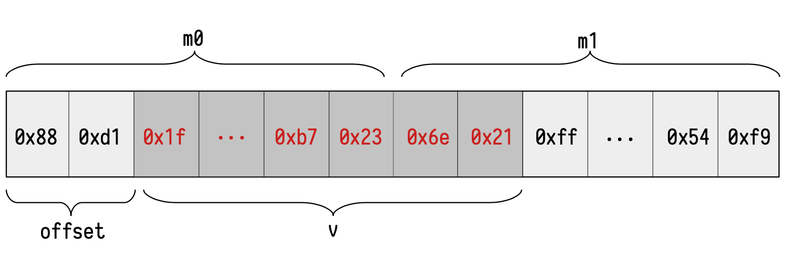
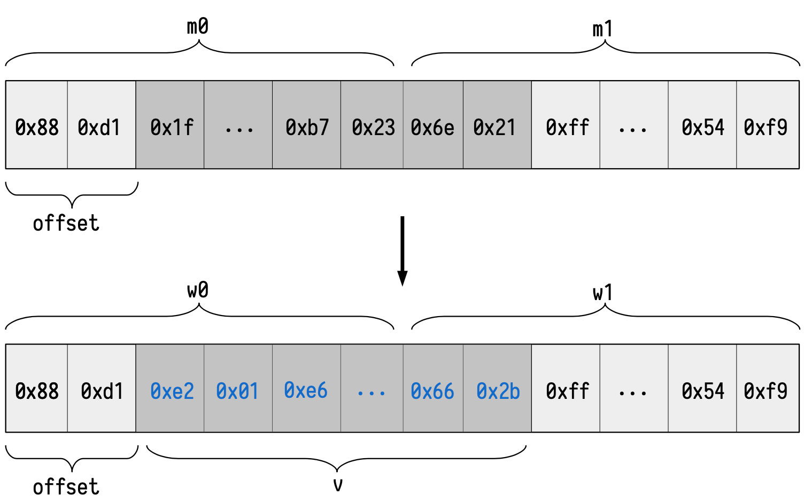

The **Memory Align State Machine** is a secondary state machine that includes **an executor (the Memory Align SM Executor)** and **an internal Memory Align PIL (program) that is a set of verification rules written in the PIL language**.

The Memory Align SM Executor is written in two languages: Javascript and C/C++.

## Overview

**It checks memory reads/writes using a 32-byte word access**, while the EVM can read and write 32-byte words with offsets at a byte level. The table below shows a sample of possible byte-addressed and 32-byte-addressed memory layouts for the same content (three words).

$$
\begin{array}{|c|c|}
\hline
\mathbf{ADDRESS} &\mathbf{BYTE} \\ \hline
\mathtt{0} &\mathtt{0xc4} \\
\mathtt{1} &\mathtt{0x17} \\
\mathtt{\vdots} &\mathtt{\vdots} \\
\mathtt{30} &\mathtt{0x81} \\
\mathtt{31} &\mathtt{0xa7} \\
\mathtt{32} &\mathtt{0x88} \\
\mathtt{33} &\mathtt{0xd1} \\
\mathtt{\vdots} &\mathtt{\vdots} \\
\mathtt{62} &\mathtt{0xb7} \\
\mathtt{63} &\mathtt{0x23} \\
\hline
\end{array}
$$

$$
\begin{array}{|c|c|}
\hline
\textbf{ADDRESS} & \textbf{32-BYTE WORD} \\ \hline
\mathtt{0} &\mathtt{0xc417...81a7} \\
\mathtt{1} &\mathtt{0x88d1...b723} \\
\hline
\end{array}
$$

The relationship between the 32-byte word addressable layout and the byte addressable layout is called **memory alignment** and the **Memory Align SM is the state machine that checks the correctness of this relationship**.

**In more detail, we have to check the following memory operations:**

- $\mathtt{MLOAD}$: It receives an offset and returns the 32 bytes in memory starting at that offset.
- $\mathtt{MSTORE}$: It receives an offset and saves 32 bytes from the offset address of the memory.
- $\mathtt{MSTORE8}$: It receives an offset and saves one byte on that address of the memory.

In general cases, $\mathtt{MLOAD}$ requires reading bytes of two different words.

Given that the memory's contents are represented in the table above and that the EVM is addressed at the byte level, the value we should get if we check a read from the EVM of a word starting at the address $\mathtt{0x22}$ is as follows:

$$
\mathtt{val} = \mathtt{0x1f \cdots b7236e21}.
$$

We denote the content of the words affected by an EVM memory read as $\mathtt{m}_0$ and $\mathtt{m}_1$.

In our example, these words are the following:

$$
\mathtt{m}_0 = \mathtt{0x} \mathtt{88d11f} \cdots \mathtt{b723},
\quad \mathtt{m}_1 = \mathtt{0x} \mathtt{6e21ff} \cdots \mathtt{54f9}.
$$

We define a read block as the string concatenating the content of the words affected by the read: $\mathtt{m}_0 \mid \mathtt{m}_1$.

The below figure shows the affected read words $\mathtt{m}_0$ and $\mathtt{m}_1$ that form the affected read block and the read value $\mathtt{val}$ for a read from the EVM at address $\mathtt{0x22}$ in our example memory.

Let us now introduce the flow at the time of validating a read.

Suppose that we want to validate that if we perform an $\mathtt{MLOAD}$ operation at the address $\mathtt{0x22}$, we get the previous value $\mathtt{0x1f\dotsb7236e21}$. At this point, the Main State Machine will perform several operations.

**First of all,** it will have to query for the values $\mathtt{m}_0$ and $\mathtt{m}_1$. Henceforth, it must call the Memory SM in order to validate the previous queries.

Observe that it is easy to extract the memory positions to query from the address $\mathtt{0x22}$. In fact, if $a$ is the memory position of the $\mathtt{MLOAD}$ operation, then $\mathtt{m}_0$ is always stored at the memory position $\lfloor \frac{a}{32} \rfloor$ and $\mathtt{m}_1$ is stored at the memory position $\lfloor \frac{a}{32} \rfloor + 1$. In our example, $a = \mathtt{0x22} = 34$. Hence, $\mathtt{m}_0$ is stored at the position $\lfloor \frac{32}{34} \rfloor = \mathtt{0x01}$ and $\mathtt{m}_1$ is stored at the position $\lfloor \frac{32}{34} \rfloor + 1= \mathtt{0x02}$.

**Secondly,** we should extract the correct $\mathtt{offset}$. The $\mathtt{offset}$ represents an index between $0$ and $31$ indicating the number of bytes we should offset from the starting of $\mathtt{m}_0$ to correctly place $\mathtt{val}$ in the block. In our case, the $\mathtt{offset}$ is $2$. Similarly as before, it is easy to obtain the offset from $a$. In fact, the it is equal to $a$ $(\mathrm{mod} \ 32)$.

Now, the Main SM will check via a Plookup to the Memory Align State Machine that \val is a correct read given the affected words $\mathtt{m}_0$ and $\mathtt{m}_1$ and the $\mathtt{offset}$. That is, we should check that the value $\mathtt{val}$ can be correctly split into $\mathtt{m}_0$ and $\mathtt{m}_1$ using the provided $\mathtt{offset}$.

Similarly, $\mathtt{MSTORE}$ instruction requires writing bytes in two words.

The idea is very similar, but we are provided with a value \val that we want to write into a specific location of the memory. We will denote by $\mathtt{w}_0$ and $\mathtt{w}_1$ the words that arise from $\mathtt{m}_0$ and $\mathtt{m}_1$ after the corresponding write.

Following our previous example, suppose that we want to write:

$$
\mathtt{val} = \mathtt{0xe201e6\dots662b}
$$

in the address $\mathtt{0x22}$ of the byte-addressed Ethereum memory. We are using the same $\mathtt{m}_0$ and $\mathtt{m}_1$ (and since we are writing into the same address as before) and they will transition into:

$$
\mathtt{w}_0 = \mathtt{0x88d1} \mathtt{e201e6\dots},\quad \mathtt{w}_1 = \mathtt{0x} \mathtt{662b} \mathtt{ff\dots54f9}.
$$

The Main State Machine will need to perform several operations. We will be given an address $\mathtt{addr}$, an offset value $\mathtt{offset}$ and a value to be written $\mathtt{val}$. Identically as before, the Main SM will be in charge of reading the zkEVM memory to find $\mathtt{m}_0$ and $\mathtt{m}_1$ from the given address and offset. Of course, the validity of this query should be performed with a specific Plookup into the Memory SM, just as before.

Now, the Main SM can compute $\mathtt{w}_0$ and $\mathtt{w}_1$ from all the previous values in a uniquely way. The way of validating that we are providing the correct $\mathtt{w}_0$ and $\mathtt{w}_1$ is to perform a Plookup into the Memory Align SM. That is, we will check that the provided values $\mathtt{w}_0$ and $\mathtt{w}_1$ are correctly constructed from the provided $\mathtt{val}$, $\mathtt{m}_0$, $\mathtt{m}_1$ and $\mathtt{offset}$ values.

Finally, the last opcode $\mathtt{MSTOREE}$ works similarly, but it only affects one word $\mathtt{m}_0$. Moreover, we can only write one byte and hence, only the less significant byte of $\mathtt{val}$ will be considered into the write. Observe that, in this opcode, $\mathtt{m}_1$ and $\mathtt{w}_1$ are unconstrained.

## Source code

The Polygon zkEVM repository is available on [GitHub](https://github.com/0xPolygonHermez).

**Memory Align SM Executor**: [sm_mem_align.js](https://github.com/0xPolygonHermez/zkevm-proverjs/tree/main/src/sm/sm_mem_align.js)

**Memory Align SM PIL**: [mem_align.pil](https://github.com/0xPolygonHermez/zkevm-proverjs/blob/main/pil/mem_align.pil)
