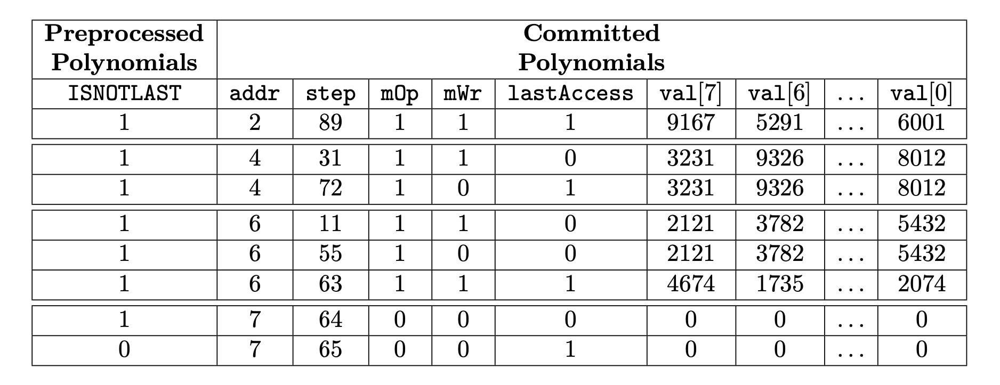
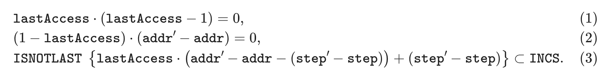
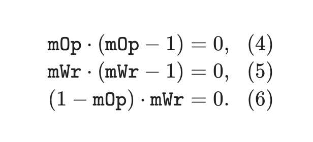

The Memory State Machine is a secondary state machine, therefore it has the executor part (the Memory SM Executor) and an internal Memory PIL program which is a set of verification rules, written in the PIL language.

The Memory SM Executor is written in two languages: Javascript and C/C++.

## EVM memory

The memory of the Ethereum Virtual Machine (EVM) is a volatile read-write memory, and it is therefore used to store temporary data during the execution of transactions when smart contracts are deployed.

That is, data in memory is populated during transaction execution but it does not persist between transactions. The memory is an array of $256$-bit ($32$ bytes) words that can be accessed through **addresses at byte level**, that is to say, each byte in the memory has a different address.

Memory has addresses of $32$ bits, and initially, all memory locations are composed by bytes set to zero.

Now, let's see the layout in memory of the following two words $\texttt{0xc417...81a7}$ and $\texttt{0x88d1...b723}$.

The below table displays this layout. Let's call this Table 1.

| $\mathbf{ADDRESS}$ |  $\mathbf{BYTE}$  |
| :----------------: | :---------------: |
|    $\mathtt{0}$    |  $\mathtt{0xc4}$  |
|    $\mathtt{1}$    |  $\mathtt{0x17}$  |
| $\mathtt{\vdots}$  | $\mathtt{\vdots}$ |
|   $\mathtt{30}$    |  $\mathtt{0x81}$  |
|   $\mathtt{31}$    |  $\mathtt{0xa7}$  |
|   $\mathtt{32}$    |  $\mathtt{0x88}$  |
|   $\mathtt{33}$    |  $\mathtt{0xd1}$  |
| $\mathtt{\vdots}$  | $\mathtt{\vdots}$ |
|   $\mathtt{62}$    |  $\mathtt{0xb7}$  |
|   $\mathtt{63}$    |  $\mathtt{0x23}$  |

Observe that each word has 32 bytes and the words are stored in Big-Endian form. So, the most significant bytes are set in the lower addresses. The EVM provides three opcodes to interact with the memory area. **There is an opcode to read, and an opcode to write 32-byte words providing an offset**:

- $\texttt{MLOAD}$: It receives an offset and returns the 32 bytes in memory starting at that offset
- $\texttt{MSTORE}$: It receives an offset and saves 32 bytes from the offset address of the memory

Considering our previous memory contents, if we perform an $\texttt{MLOAD}$ with an offset of $\texttt{1}$, we would obtain the following word: $\texttt{0x17...a788}$.

On the other hand, if we do an $\texttt{MSTORE}$ with an offset of $\texttt{1}$ with the word $\texttt{0x74f0...ce92}$, we would modify the content of the memory as shown in the below table (or Table 2).

| $\mathbf{ADDRESS}$ |     $\mathbf{BYTE}$      |
| :----------------: | :----------------------: |
|    $\mathtt{0}$    |     $\mathtt{0xc4}$      |
|    $\mathtt{1}$    | $\mathtt{\textbf{0x74}}$ |
|    $\mathtt{2}$    | $\mathtt{\textbf{0xf0}}$ |
| $\mathtt{\vdots}$  |    $\mathtt{\vdots}$     |
|   $\mathtt{30}$    | $\mathtt{\textbf{0xce}}$ |
|   $\mathtt{31}$    | $\mathtt{\textbf{0x92}}$ |
|   $\mathtt{33}$    |     $\mathtt{0xd1}$      |
| $\mathtt{\vdots}$  |    $\mathtt{\vdots}$     |
|   $\mathtt{62}$    |     $\mathtt{0xb7}$      |
|   $\mathtt{63}$    |     $\mathtt{0x23}$      |

When the offset is not a multiple of 32 (or 0x20), as in the previous example, we have to use bytes from two different words when doing $\texttt{MLOAD}$ or $\texttt{MSTORE}$.

Finally, the EVM provides a write memory operation that just writes a byte:

- $\texttt{MSTOREE}$: It receives an offset and saves one byte on that address of the memory. $\texttt{MSTOREE}$ always uses only one word.

## Layout

The Memory SM is in charge of proving the memory operations in the execution trace. As mentioned, read and write operations use addresses at byte level in the EVM. However, doing the proofs byte-by-byte would consume many values in the trace of this state machine. Instead, in this machine, we operate addressing words (32 bytes).

For example, if we have the memory layout from Table 1, then we would have the memory layout of the below provided table with addresses that point to 32-byte words.

| $\textbf{ADDRESS}$ | $\textbf{32-BYTE WORD}$  |
| :----------------: | :----------------------: |
|    $\mathtt{0}$    | $\mathtt{0xc417...81a7}$ |
|    $\mathtt{1}$    | $\mathtt{0x88d1...b723}$ |

The Memory SM uses this latter layout, the 32-byte word access, to check reads and writes. However, as previously mentioned, the EVM can read and write with offsets at a byte level. As a result, we will need to check the relationship between byte access and 32-byte word access. For these checks, we have another state machine called [Memory Align SM](mem-align-sm.md).

## Design

As with any state machine, the Memory SM has an executor to compute the trace that proves the correctness of memory reads and writes and a PIL description that enforces that the trace is correct.

### Execution trace design

The Memory SM defines the design of the trace and the PIL description that checks that memory reads and writes aligned to 32-byte words are correct. The addresses, denoted as $\texttt{addr}$, are represented through $32$ bits ($4$ bytes) and point to 32-byte words. The value of words stored in memory, denoted as $\texttt{val}$, are represented through $8$ registers $\texttt{val[0..7]}$ of $4$ bytes each, making a total of $32$ bytes ($256$ bits).

The below table shows an example with all the memory operations present at an execution trace of the Main SM.

| $\texttt{step}$ | $\texttt{mOp}$ | $\texttt{mWr}$ | $\texttt{addr}$ | $\texttt{val[7]}$ | $\texttt{val[6]}$ | $\dots$ | $\texttt{val[0]}$ |
| :-------------: | :------------: | :------------: | :-------------: | :---------------: | :---------------: | :-----: | :---------------: |
|       11        |       1        |       1        |        6        |       2121        |       3782        | $\dots$ |       5432        |
|       31        |       1        |       1        |        4        |       3231        |       9326        | $\dots$ |       8012        |
|       55        |       1        |       0        |        6        |       2121        |       3782        | $\dots$ |       5432        |
|       63        |       1        |       1        |        6        |       4874        |       1725        | $\dots$ |       2074        |
|       72        |       1        |       0        |        4        |       3231        |       9326        | $\dots$ |       8012        |
|       89        |       1        |       1        |        2        |       9167        |       5291        | $\dots$ |       6001        |

The $\texttt{step}$ is the execution step number at the Main SM and in this case, we are showing only the steps that are performing a memory operation. The instruction to execute a memory operation is indicated by the $\texttt{mOp}$ selector. The $\texttt{mWr}$ is also a selector that shows whether the memory operation is a read or a write. In the previous trace, we can observe that the first memory operation is performed at step 11 and it is the write of the sixth 32-byte word. The eight registers $\texttt{val[0..7]}$ provide the bytes to be written in that word.

It is worth to mention that for a specific word address, the first operation is always a write because it makes no sense to read a position that has not been previously written. Then, in this word address there can be a sequence of reads and writes. In the previous trace, we can observe that for the sixth word, there is a write at step 11, then a read at step $55$ and finally another write at step $63$.

| $\texttt{step}$ | $\texttt{addr}$ | $\texttt{mOp}$ | $\texttt{mWr}$ | $\texttt{val[7]}$ | $\texttt{val[6]}$ | $\dots$ | $\texttt{val[0]}$ |
| :-------------: | :-------------: | :------------: | :------------: | :---------------: | :---------------: | :-----: | :---------------: |
|       89        |        2        |       1        |       1        |       9167        |       5291        | $\dots$ |       6001        |
|       31        |        4        |       1        |       1        |       3231        |       9326        | $\dots$ |       8012        |
|       72        |        4        |       1        |       0        |       3231        |       9326        | $\dots$ |       8012        |
|       11        |        6        |       1        |       1        |       2121        |       3782        | $\dots$ |       5432        |
|       55        |        6        |       1        |       0        |       2121        |       3782        | $\dots$ |       5432        |
|       63        |        6        |       1        |       1        |       4674        |       1725        | $\dots$ |       2074        |

The trace of the Memory SM must check that the writes are done according to their step and that reads provide the correct words according also to their step.

In order to implement these checks, the execution trace of the Memory SM sorts all the memory operations; firstly by $\texttt{addr}$, and secondly by $\texttt{step}$, as shown in the above table. **This ordering is referred to as the topology of the Memory SM**.

Finally, we will need to add a few more columns to ensure that the memory execution trace goes exactly across all the ordered writes and reads of the Main SM, with writes storing the provided values and with reads not changing the previous value of the word.

In particular, we add three more columns. One of these columns is called $\texttt{INCS}$ and it is used to provide an order for the values of the columns. Another column called $\texttt{lastAccess}$ is used to enable an address change when all the memory operations for this address have appeared at the trace. The last column is called $\texttt{ISNOTLAST}$ and it is used to make the checks pass when there are no more memory accesses.

## List of columns

The following columns (polynomials) are used by the Memory SM. We divide them between preprocessed and committed polynomials.

### Preprocessed

- $\texttt{INCS}$: Counter that goes from $1$ up to $N$, where $N$ is the number of rows in the computational trace,

    $$
    \texttt{INCS} = (\underbrace{1, 2, 3, \dots,N-1, N}_{N})
    $$

    It is used to do a range check to prove the incremental order of other columns.

- $\texttt{ISNOTLAST}$: Selector that is $1$ in every row except in the $N$-th row, in which its value is $0$,

    $$
    \texttt{ISNOTLAST} = (\underbrace{1, 1, 1, \dots,1, 0}_{N})
    $$

### Committed

- $\texttt{step}$: Position in which the memory operation was called in the Main SM.
- $\texttt{mOp}$: Selector indicating whether it is being performed a memory operation or not.
- $\texttt{mWr}$: Selector that is $1$ if the memory operation is a write and $0$ if it is a read operation.
- $\texttt{addr}$: A $4$-byte (or $32$ bit) integer indicating the address of a 32-byte word.
- $\texttt{lastAccess}$: Selector indicating whether it has been reached the last memory access for a particular address or not.
- $\texttt{val[0..7]}$: Vector containing $8$ $4$-byte integer indicating the $256$-bit value associated to a given address.

## Complete example

The table below shows the complete Memory SM trace for our example in which the computational trace size $N$ is $2^3$.

There are various important details to remark from the point in which all memory accesses have been completed but the $2^3$-th row has not been reached yet:

- $\texttt{mOp}$ and $\texttt{mWr}$ are set to $0$ until the last row.
- $\texttt{addr}$ is incremented by $1$ to keep the incremental order of the addresses. This value is maintained until the last row.
- $\texttt{lastAccess}$ is also set to $0$ except in the very last row, where it is set back to $1$ to create the ciclycity behavior.
- $\texttt{step}$ is incremented by $1$ in each row so that this column fulfills the constraints describing this state machine.
- $\textbf{Remark}$. Notice that $\texttt{step}$ can take values beyond $N$ and that the value of $\texttt{step}$ after the row of the last address can coincide with a previous value. As we will show in the next section, where we describe the constraints, these facts do not cause any issue.
- $\texttt{val[0..7]}$ are all set to $0$ until the last row.

## Constraints

What constraints does the execution trace have to satisfy? And how is the Memory SM connected with the Main State Machine.

### Topology

Let's start with the set of constraints regarding the topology of the state machine.

Equations (1) and (2) are straightforward. Equation (1) asserts that $\texttt{lastAccess}$ is a selector (i.e., a column whose values lie in the set $\{0,1\}$), while Equation (2) confirms that $\texttt{addr}$ does not change until it is accessed for the last time. Note that Equation (2) implies that addresses are processed one-by-one in the Memory SM, but it does not guarantee that they are ordered incrementally.

Equation (3) is a little bit more tricky. Let's do a case analysis on it.

The curly braces notation in Equation (3) means that the inclusion is only checked at values such that the corresponding selector $\texttt{ISNOTLAST}$ is equal to $1$.

Then, depending on the value of the $\texttt{lastAccess}$ selector we have two cases:

- If $\texttt{lastAccess} = 0$,

    $$
    \texttt{step}' - \texttt{step} \subset \texttt{INCS}.
    $$

- Else,

    $$
    \texttt{addr}' - \texttt{addr} \subset \texttt{INCS}.
    $$

In words, whenever a transition do not change the address in question, verify that $\texttt{step}' > \texttt{step}$; otherwise verify that $\texttt{addr}' > \texttt{addr}$. Therefore, Equation (3) ensures that both $\texttt{step}$ and $\texttt{addr}$ are ordered incrementally (first by $\texttt{addr}$ and then by $\texttt{step}$). A combination of Eqs. (2) and (3) gives the desired topology.

### Operation selectors

Let's continue with the operation selectors: $\texttt{mOp}$ and $\texttt{mWr}$.

Eqs. (4) and (5) ensure that $\texttt{mOp}$ and $\texttt{mWr}$ are, effectively, selectors. Eq. (6) is imposing a restriction to $\texttt{mWr}$ (and binding it with $\texttt{mOp}$) in the following sense: $\texttt{mWr}$ can be set to $1$ only if $\texttt{mOp}$ is also set to $1$. Similarly, if $\texttt{mOp}$ is set to $0$, then $\texttt{mWr}$ should be set to $0$ as well. This restriction comes naturally from the definition of these selectors.

### Updating the value

Finally, we explain the constraints that deal with the value columns $\texttt{val[0..7]}$.

We analyze both Eqs. (7) and (8) at the same time. Notice that we simply discuss the feasible cases:

- $\textbf{Maintain the same value when reading:}$ If $\texttt{mWr}' = 0$ and $\texttt{lastAccess} = 0$, then it should be the case that $\texttt{val[0..7]}' = \texttt{val[0..7]}$, since this means that we will perform a read in the next step. Eq. (7) ensures this case.
- $\textbf{Filling the value with zeros when done:}$ If $\texttt{mOp}' = 1$, $\texttt{mWr}' = 0$ and $\texttt{lastAccess} = 1$, then it should be the case that $\texttt{val[0..7]}' = 0$, i.e., the register $\texttt{val[0..7]}$ is set to $0$ in the forthcoming steps.

More cases are not possible because for an address we always start with a write operation which limits the behavior of these constraints to these cases. For example, it cannot happen that $\texttt{lastAccess = 1}$ and some of $\texttt{mOp}'$ or $\texttt{mWr}'$ is 0; because the first operation that is always performed over a memory address is a write.

However, notice that to be able reset $\texttt{addr}$ to its state in the first row (where it is the case that $\texttt{addr}' < \texttt{addr}$) it should be the case that $\texttt{lastAccess} = 1$ in the last row of the computational case. If $\texttt{lastAccess}$ would have not been set to $1$, then Eq. (2) would not be satisfied.

We obtain this condition by adding the following constraint:

$$
\left(1 - \texttt{lastAccess}\right) \cdot \left(1 - \texttt{ISNOTLAST}\right) = 0.
$$

### Connection with the Main SM

The last constraint that we need to add is to relate the execution trace of the Main SM with the execution trace of the Memory SM.

The constraint has to check that all the rows in the trace of the Main SM that make memory operations (i.e. rows where $\texttt{mOp} == 1$) are a permutation (any permutation) of the rows of the Memory SM where $\texttt{mOp} == 1$.

The key point is that if both vectors would not be a permutation of each other, then that would mean that the Main SM is performing an incorrect memory action.

## Source code

The Polygon zkEVM repository is available on [GitHub](https://github.com/0xPolygonHermez).

**Memory SM Executor**: [sm_mem.js](https://github.com/0xPolygonHermez/zkevm-proverjs/tree/main/src/sm/sm_mem.js)

**Memory SM PIL**: [mem.pil](https://github.com/0xPolygonHermez/zkevm-proverjs/blob/main/pil/mem.pil)
