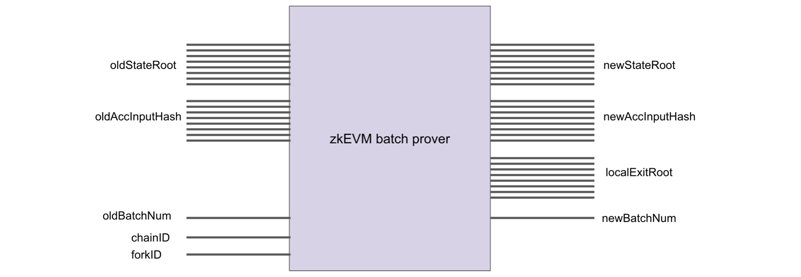
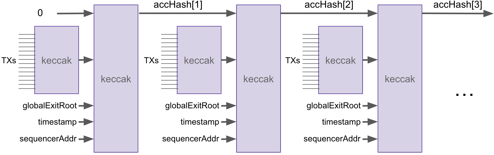
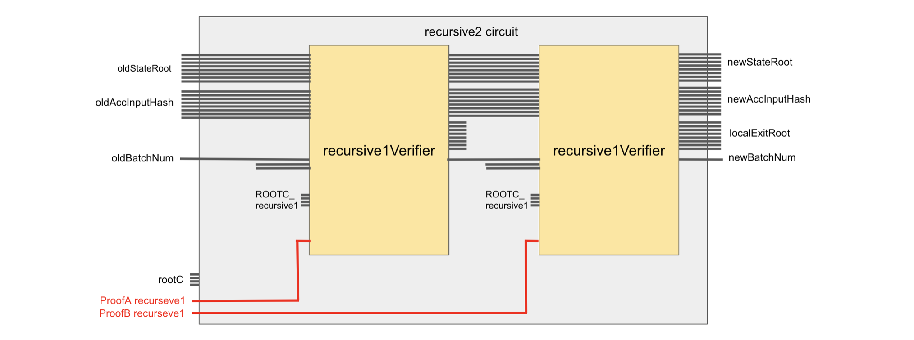

Although CIRCOM is mainly used to convert a STARK proof into its respective Arithmetic circuit, it is implemented in varied ways within the zkProver, specifically during the STARK Recursion process.

!!!info
    This document gives further elaboration on the [Proving Architecture](proving-architecture.md) by focusing on the CIRCOM Arithmetic circuits, while highlighting CIRCOM's pivotal role in the STARK Recursion process.

## zkEVM Batch Prover

The first step in proving Computational Integrity starts with the **zkEVM Batch Prover**.

It is a circuit that proves correctness of the state transition from an `oldStateRoot` to a `newStateRoot`.

The **zkEVM Batch Prover** takes as inputs; the `oldStateRoot`, `oldAccInputHash`, `oldBatchNum`, `chainID` and `forkID`. And its outputs are; the `newStateRoot`, `newAccInputHash`, `localExitRoot` and `newBatchNum`,

The `localExitRoot` is the Merkle root of the `ExitTree` used in the Bridge to transfer information from the L2 to the Ethereum L1.

The `oldBatchNum` indicates which batch is being processed, and in each transition the numbering increments by $1$, such that `newBatchNum = oldBatchNum + 1`.

All transactions being processed are encoded into the batch via the `oldAccInputHash`, read "old accumulated input hash".

Although built in a smart contract, the encoding of transactions resembles a blockchain, where transactions are chained together with the Keccak hash function. See figure below depicting this encoding.

The main idea, when proving validity of a batch, is for the `oldAccInputHash` and its corresponding `newAccInputHash` to match accordingly.

The resultant STARK proof denoted by $\mathtt{\pi_{batch}}$, which involves $\mathtt{669}$ committed polynomials each of degree $\mathtt{2^{23}}$, is $\mathtt{1.9}$ Megabytes big.

Such a validity proof is not ideal in view of its storage-fee implications in Ethereum.

The Polygon zkEVM's strategy to reducing the size of the ultimate validity proof is by implementing a recursive aggregation of hundreds of batch proofs into one.

## CIRCOM Circuits

As outlined in the [Proving Architecture](proving-architecture.md) subsection, the recursive aggregation of many STARK proofs (aimed at reducing the size of the validity proof) is accomplished in five stages;

1. Compression Stage using the `c12a` CIRCOM circuit,
2. Normalization Stage using the $\mathtt{recursive_1}\ \mathtt{Prover}$ CIRCOM template,
3. Aggregation Stage using the $\mathtt{recursive_2}\ \mathtt{Prover}$ CIRCOM template,
4. Final Stage using the $\mathtt{recursive_f}\ \mathtt{Prover}$ CIRCOM template,
5. SNARK Stage using the $\mathtt{final}\ \mathtt{Prover}$ CIRCOM template.

In terms of code, the three CIRCOM templates used in the middle stages (Normalization Stage, Aggregation Stage and Final Stage) are identical except for their public inputs which are; the root constants `RootC` and the respective input proofs.

As previously mentioned,

- The $\mathtt{recursive_1}\ \mathtt{Prover}$ only takes $\mathtt{\pi_{\texttt{c12a}}}$-type proofs as input,
- The $\mathtt{recursive_2}\ \mathtt{Prover}$ only takes any pair of $\mathtt{\pi_{\texttt{rec1}}}$-type or $\mathtt{\pi_{\texttt{rec2}}}$-type proofs as input,
- The $\mathtt{recursive_f}\ \mathtt{Prover}$ only takes a pair of $\mathtt{\pi_{\texttt{rec2}}}$-type proofs as input.

Since the underlying proof scheme is PIL-STARK, in each of these prover circuits there is a built-in $\mathtt{Verifier}$ CIRCOM circuit. Therefore, for any index $\mathtt{x} \in \{1,2,f\}$, the proof $\mathtt{\pi_{x}}$, output by any of the $\mathtt{recursive_x}\ \mathtt{Provers}$, is in fact a verified proof because PIL-STARK automatically verifies it.

A typical $\mathtt{recursive_x}\ \mathtt{Verifier}$ CIRCOM template, for any $\texttt{x} \in \{1, 2, f\}$, looks like the circuit shown below.

## Proof-Size Reductions

The below table displays $\text{4}:\text{1}$ reduction in proof sizes as one progresses from one stage of the STARK recursion to the next.

The numbers presented below were first publicised by the Polygon zkEVM Technical Lead, Jordi Baylina, during the StarkWare Sessions held in February 2023. The video recording can be found [here](https://www.youtube.com/watch?v=ZwG3UI_iDAs).

$$
\begin{array}{|l|c|c|c|c|c|c|}\hline
\bf{Parameter\ Description} & \texttt{zkEVM Prover}& \texttt{c12a Prover}& \mathtt{rec1 / rec2\ \ Prover}& \texttt{recf\ Prover} \\ \hline
\texttt{Committed polynomials} & \texttt{669} & \texttt{12} & \texttt{12} & \texttt{12}  \\ \hline
\texttt{Permutation checks} & \texttt{18} & \texttt{0} & \texttt{0} & \texttt{0}  \\ \hline
\texttt{Plookups} & \texttt{29} & \texttt{0} & \texttt{0} & \texttt{0}  \\ \hline
\texttt{Connection checks (copy constraints)} & \texttt{2} & \texttt{1} & \texttt{1} & \texttt{1}  \\ \hline
\texttt{Total number of columns} & \texttt{1184} & \texttt{65} & \texttt{45} & \texttt{45}  \\ \hline
\texttt{Degree of polynomials (rows)} & \mathtt{n = 2^{23}} & \mathtt{n = 2^{22}} & \mathtt{n = 2^{20}} & \mathtt{n = 2^{19}}  \\ \hline
\texttt{Max degree of the constraint polynomial} & \texttt{3n} & \texttt{5n} & \texttt{9n} & \texttt{9n}  \\ \hline
\texttt{Blowup factor} & \texttt{2} & \texttt{4} & \texttt{16} & \texttt{16}  \\ \hline
\texttt{Proof computation time} & \texttt{129 secs} & \texttt{14 secs} & \texttt{10 secs} & \texttt{17 secs}  \\ \hline
\texttt{Size of the proof} & \texttt{1.9 MB} & \texttt{494 KB} & \approx \texttt{260 KB} & \approx \texttt{505 KB}  \\ \hline
\end{array}
$$
