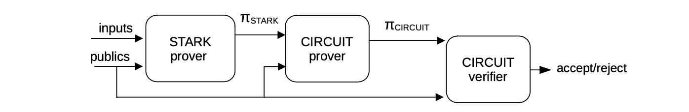
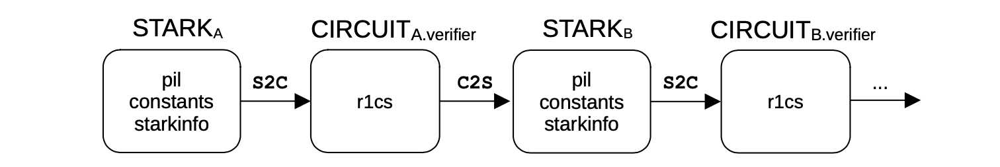
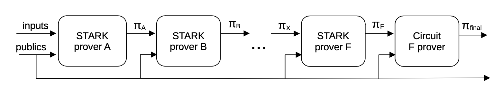
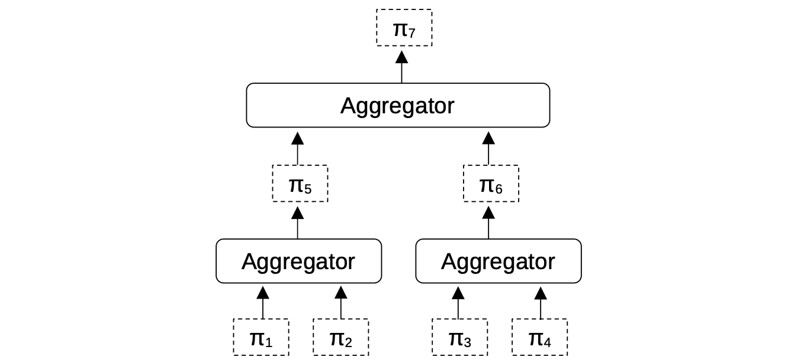

The STARK Recursion, as implemented in the zkEVM, is a specific method for combining multiple STARK proofs into a single proof. It is a process that involves; **Composition**, **Recursion**, and **Aggregation** of Proofs.

## Composition of proofs

Composition of Proofs refers to using different proving systems, one after the other, so as to generate the final validity proof. In the case of zkEVM, **STARK** is used as the first proving system, which produces a **STARK** proof $\pi_{STARK}$ attesting to correctness of a deterministic computation.

The main idea with composition is to delegate verification of the **STARK** proof $\pi_{STARK}$ to a verification circuit $C$.

As described in the PIL-STARK section of [this document](proving-tools.md), the basic verification of a STARK proof $\pi_{STARK}$ is performed by a Verifier entity which takes as inputs; the Proof, the Publics, and some other Verifier parameters.

In this case, if the Prover can provide a proof $\pi_{CIRCUIT}$, of correct execution of the verification circuit, then it should be sufficient for verifying the original **STARK**.

As shown in the figure below, the Verifier entity just verifies the proof $\pi_{CIRCUIT}$ of the **STARK** verification circuit. The main advantage of this composition is that $\pi_{CIRCUIT}$ is smaller and faster to verify than $\pi_{STARK}$.

## Recursion of Proofs

Recursion of Proofs is carried out in two phases; **Setup Phase** and **Proving Phase**.

Setup Phase consists of an alternating set of two sub-processes: converting a STARK proof to a Verifier circuit and converting a Verifier circuit to a STARK proof.

Prover Phase is responsible for the actual recursive generation of STARK proofs. The STARK Prover uses the required inputs to generate a STARK proof, and this STARK proof, along with the requisite public values, is used as input by the next STARK Prover.

### Setup Phase

This phase takes advantage of the fact that Verifiers are much more efficient than Provers.

The design idea is to create a cascade of Verifier circuits, where at each step a lot more efficiently verifiable proof is recursively created. The process therefore consists of an alternating series of two sub-processes; converting a STARK proof into a Verifier circuit, and converting a Verifier circuit into a STARK proof, denoted by **S2C** and **C2S**, respectively.

The overall process, as depicted in the figure above, is composed of an alternating series of sub-processes; **STARK-to-CIRCUIT** and **CIRCUIT-to-STARK**.

Each Verifier circuit is described in terms of its R1CS constraints by using the CIRCOM language. Circuits are used because they are suitable for computations with limited branching, and the Verifier used in the zkEVM is a computation of this type.

#### STARK-to-CIRCUIT or S2C Sub-process

Suppose the first **STARK**, denoted by $\text{STARK}_{\text{A}}$, is described with the parameters; `pil`, `constants` and `starkinfo`.

$\text{STARK}_{\text{A}}$ is automatically translated into its Verifier circuit, denoted by $\texttt{CIRCUIT}_{\texttt{A.verifier}}$.

The translation from a **STARK** to its Verifier circuit, herein dubbed **S2C** as its shorthand, is performed during the Setup phase.

In other words, the R1CS description of the **STARK** Verifier circuit can be preprocessed prior to the computation of **STARK** proof.

CIRCOM is used as an intermediate representation language for the description of circuits. More details on how the CIRCOM is utilized is discussed in the [**Setup S2C**](recursion-sub-process.md) section.

#### CIRCUIT-to-STARK or C2S Sub-process

The circuit definition in the form of R1CS is taken and automatically translated into a new **STARK** definition.

In this **C2S** sub-process, a circuit Verifier is translated into a STARK proof. That is, a new `pil` description, new `constants` and a `starkinfo`.

This translation, is herein referred to as **C2S** (short for **CIRCUIT-to-STARK**).

Following our example, the newly generated **STARK** is denoted as $\text{STARK}_{\text{B}}$ and it is essentially a PlonKish arithmetization of $\text{STARK}_{\text{A}}$ with some custom gates of the verification circuit.

See the [**Setup C2S**](recursion-sub-process.md) section for more details.

#### Concluding The Setup Phase

It is worth mentioning that these recursion steps can be applied as many times as desired, while taking into account the fact that each step will compress the proof, making it more efficient to be verified but at the expense of increased Prover complexity.

Finally, we remark that several artifacts for generating each **STARK** Prover are generated during the Setup Phase. See the **Setup** **S2C** and **Setup** **C2S** subsections for more information about these artifacts.

### Proving Phase

The first proof is generated by providing the first **STARK** Prover with the proper inputs and public values. The output proof is then passed as input to the next **STARK** Prover, together with public inputs. This process is recursively repeated.

In the below figure, it is shown how in essence a chain of recursive **STARK** Provers work.

Notice that the final proof is actually a circuit-based proof, which is in fact a SNARK proof, specified per implementation. More details about the Proving Phase can be found in the **Recursion Step Proof** section.

## Aggregation

In addition to Composition and Recursion, the zkProver architecture also allows for Aggregation while generating the proofs.

Aggregation is a type of proof composition in which multiple valid proofs can be collated and proved to be valid by using one proof, called the **Aggregated Proof**. Validating such an Aggregated Proof is equivalent to validating all the collated proofs.

The below figure shows an example of aggregation with binary aggregators.

