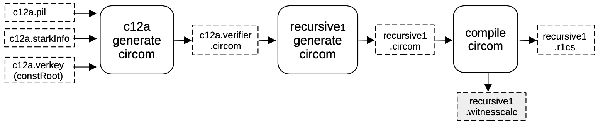
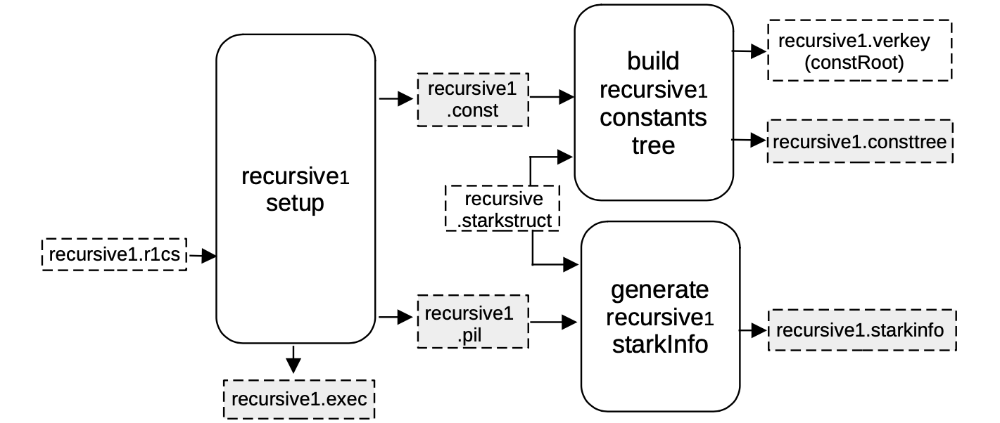
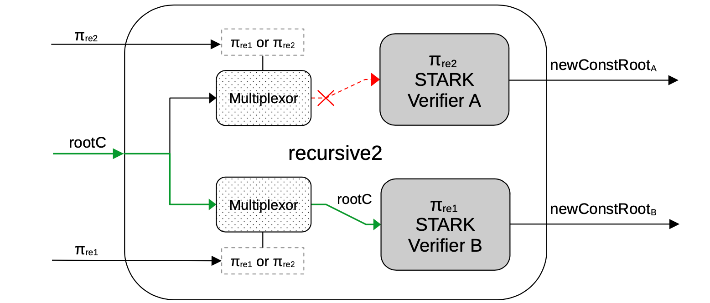
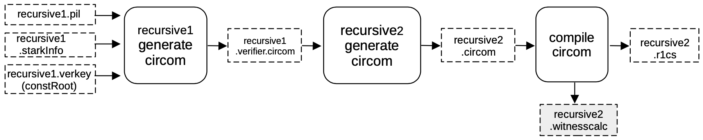
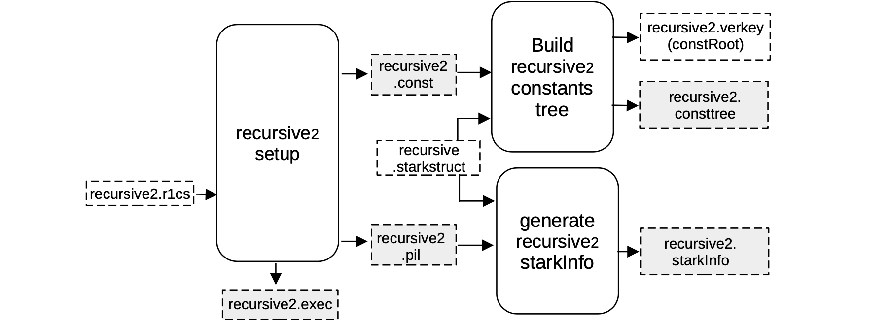

The first step of the proof recursion, where the first STARK proof is verified, is referred to as _recursive1_. All intermediate steps of recursion are referred to as _recursive2_, while the last step is called _recursivef_.

## Setup S2C for recursive1

At this point in the recursion process, the first STARK proof $\pi$ has been validated with a STARK proof $\pi_\texttt{c12a}$.

The idea now is to generate a CIRCOM circuit that verifies $\pi_\texttt{c12a}$, by mimicking the FRI verification procedure.

In order to achieve this, a verifier circuit _c12a.verifier.circom_ is generated from the previously obtained files;
  
- The _c12a.pil_ file,
- The _c12a.starkinfo_ parameters,
- The constant root _c12a.verkey.constRoot_,

by filling the $\mathtt{stark\_} \texttt{verifier.circom.ejs}$ template as before.

In this case, as mentioned in the _Normalization_ stage subsection of the _Recursion_ section, the circuit had to be slightly modified in order to include the constant root as a public input.

This is important especially for the Aggregation stage, where all computation constants dependent on the previous circuit need to be provided as public inputs.

This is done by using the _recursive1.circom_ file, and internally importing the previously generated _c12a.verifier.circom_ circuit as a library.

The verifier circuit is instantiated inside $\mathtt{recursive1.circom}$, connecting all the necessary wires and including the constant root to the set of publics.

The output circom file _recursive1.circom_ is compiled into a R1CS _recursive1.r1cs_ file and a _witness calculator program_, $\mathtt{recursive1.witnesscal}$, which is used for both building and filling the next execution trace.

## Setup C2S for recursive1

As seen previously, a machine-like construction, whose correct execution is equivalent to the validity of the previous circuit, is obtained from the R1CS description of the verification circuit.

In this case, the R1CS description is in the file _recursive1.r1cs_, and the obtained construction is described by _recursive1.pil_.

Again, a binary for all the constant polynomials _recursive1.const_ is generated, together with the helper file _recursive1.exec_, which provides allocation of the witness values into their corresponding positions in the execution trace.

Note that all FRI-related parameters are stored in a _recursive.starkstruct_ file,located in the prover repository, and it is coupled with the following,
  
- The _recursive1.pil_ file as inputs to the $\mathtt{generate\_starkinfo}$ service in order to generate the _recursive1.starkinfo_ file.
- The _recursive1.const_ as inputs to the component that builds the Merkle tree of evaluations of constant polynomials, _recursive1.consttree_, and its root _recursive1.verkey_.

In this case, a blowup factor of $2^4 = 16$ is used, and thus allowing the number of queries to be $32$.

## Setup S2C for recursive2

As before, a CIRCOM circuit is generated that verifies $\mathtt{π_{rec1}}$ by imitating the FRI verification procedure.

In order to do this, a verifier circuit _recursive1.verifier.circom_ is generated from the previously obtained files;

- The _recursive1.pil_ file,
- The _recursive1.starkinfo_ file,
- The constant root _recursive1.verkey.constRoot_,

by filling the verifier $\mathtt{stark\_verifier.} \texttt{circom.ejs}$ template.

Once the verifier is generated using the template, the template is used to create another CIRCOM that aggregates two verifiers.

Note that, in the previous step, the constant root was passed hardcoded from an external file into the circuit.

That's the very reason for having the _Normalization_ stage: enabling the previous circuit and anyone verifying each or both proofs to have the exact same form, and thus allowing iterated recursion.

Henceforth, the _recursive2.circom_ circuit has two verifiers and two multiplexors that are actually deciding the form of each of the verifiers:

- if the proof is $\mathtt{\pi_{rec1}}$-type, the hardcoded constant root is input, but
- if the proof is a $\mathtt{\pi_{rec2}}$-type, the constant root should be connected as an input signal, coming from a previous circuit.

A schema of the _recursive2_ circuit generated is as shown in the below Figure.

Observe that, since the upper proof is of the $\mathtt{\pi_{rec2}}$-type, the multiplexor does not provide the constant root _rootC_ to the _Verifier A_ for hardcoding it, because this verifier should get it through a public input from the previous circuit.

Otherwise, since the lower proof has the $\mathtt{\pi_{rec1}}$-type, the Multiplexor lets it pass through by providing the constant root to the Verifier B, so that it can be hardcoded when the corresponding template is filled.

The output CIRCOM file _recursive2.circom_ , is obtained by running a different script called _genrecursive_ which is compiled into an R1CS _recursive2.r1cs_ file and a witness calculator program _recursive2.witnesscal_ and they are both used, later on, to build and fill the next execution trace.

## Setup C2S for recursive2

As seen before, when executing a _C2S_, a machine-like construction gets obtained from the R1CS description of the verification circuit.

This construction is specifically the one whose execution correctness is equivalent to the validity of the previous circuit. And it is described by a PIL _recursive2.pil_ file.

The R1CS description taken as input to produce this construction is in the file _recursive2.r1cs_.

The other outputs of the _recursive2 setup_ component are;

- A binary for all the constant polynomials _recursive2.const_, and
- The helper file _recursive2.exec_, which provides allocation of the witness values into their corresponding positions in the execution trace.

Note that all the FRI-related parameters are stored in a _recursive.starkstruct_ file, and in the next step, it is paired up with,

- the _recursive1.const_ as inputs to the component that builds the Merkle tree of evaluations of constant polynomials, _recursive2.consttree_ and its root _recursive2.verkey_.
- the _recursive2.pil_ file as inputs to the $\mathtt{generate\_starkinfo}$ service in order to generate the _recursive1.starkinfo_ file.

In this case, we are using the same blowup factor of $2^4 = 16$, allowing the number of queries to be $32$.

