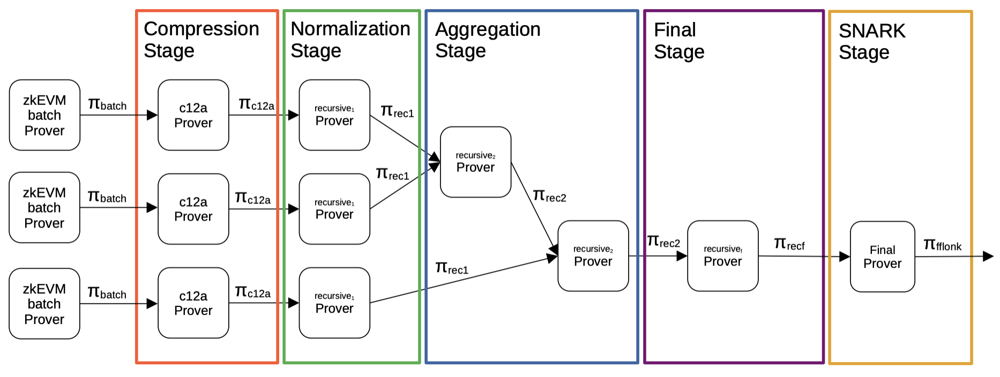

Focusing specifically on the proving phase of the recursion process; it is a process that starts with proofs of batches (these are sequenced batches of transactions) and culminates in a ready-to-be-published validity proof, which is a SNARK proof.

There are five intermediate stages to achieving this; the _Compression stage_, the _Normalization stage_, the _Aggregation stage_, the _Final stage_ and the _SNARK stage_.

An overview of the overall process can be seen in the below figure.

## Compression stage

Recall that the first STARK, in the sequence of Recursive provers seen in the _Proving phase_ subsection of the _Recursion_ section, generates a big proof because of its many polynomials, and its attached FRI uses a low blow-up factor.

Henceforth, in each proof of batches, a compression stage is invoked, aiming at reducing the number of polynomials used. This allows the blow-up factor to be augmented, and thus reduce the proof size.

A component called the $\mathtt{c12a\ prover}$ is utilized in this stage which takes a batch proof $\mathtt{{\pi}_{batch}}$ as input and outputs a 'compressed' proof, denoted by $\mathtt{{\pi}_{\texttt{c12a}}}$ in the above figure.

## Normalization stage

Following completion of the compression stage, is the normalization stage.

Each output of the $\mathtt{c12a\ prover}$ is taken as an input to the $\mathtt{recursive_1}$ $\mathtt{prover}$ circuit. Outputs of this circuit are referred to as $\mathtt{\pi_{rec1}}$-type proofs.

It is in the next stage, called the _Aggregation_ stage, which is in charge of joining several batch proofs into a single proof that validates each of the single input proofs all at once.

The way to proceed is to construct a binary tree of proofs, where a pair of proofs is proved one pair at a time.

However, since the aggregation of two proofs requires the constant root of the previous circuits, through a public input coming from the previous circuit, the _Normalization_ stage is basically created for this very purpose. The stage is in charge of transforming the obtained verifier circuit, that validates the $\pi_{\texttt{c12a}}$ proof, into a circuit that makes the constant root public to the next circuit.

This step allows each aggregator verifier and the normalization verifier to be exactly the same, permitting successful aggregation via recursion.

## Aggregation stage

Once the normalization step has been completed, the next stage is the aggregation of proofs (i.e., normalized proofs).

In this stage, two normalized proofs are joined together by a $\mathtt{recursive_2}$ $\mathtt{prover}$ component.

In order to achieve this, a circuit capable of aggregating two verifiers is created, call it the $\mathtt{recursive_2\ prover}$ circuit. Its outputs are proofs of the $\mathtt{\pi_{rec2}}$-type. This $\mathtt{recursive_2\ prover}$ circuit is repeatedly applied to pairs of proofs until there are no more normalized proofs to be aggregated.

However, as observed in the figure above, the inputs to the $\mathtt{recursive_2}$ $\mathtt{prover}$ can be proofs of either the $\mathtt{\pi_{rec1}}$-type or the $\mathtt{\pi_{rec2}}$-type.

This allows us to aggregate a pair of $\mathtt{\pi_{rec1}}$-type proofs, or a pair of $\mathtt{\pi_{rec2}}$-type proofs, or even a combination of a $\mathtt{\pi_{rec1}}$-type proof and a $\mathtt{\pi_{rec2}}$-type proof.

## Final stage

The final stage is the very last STARK step during the recursion process, and it is in charge of verifying a $\mathtt{{\pi}_{rec2}}$ proof over a completely different finite field, the one defined by the $\text{BN}128$ elliptic curve.

More specifically, the hash used in generating the transcript works over the field of the $\text{BN}128$ elliptic curve. Hence, all the challenges (and so, all polynomials) belong to this new field.

The reason for the change to the $\text{BN}128$ elliptic curve is because a $\texttt{FFLONK}$ SNARK proof, which works over this type of elliptic curves, is to be generated in the next step of the process.

This step is very much similar to the $\mathtt{recursive_2\ prover}$ circuit. It instantiates a verifier circuit for $\mathtt{{\pi}_{rec2}}$ except that, in this case, $2$ constant roots should be provided (a constant for each of the proofs aggregated in the former step).

## SNARK stage

The last step of the whole process is called the SNARK stage, and its purpose is to produce a $\texttt{FFLONK}$ proof $\mathtt{{\pi}_{FFLONK}}$ which validates the previous $\mathtt{{\pi}_{recf}}$ proof.

In fact, $\texttt{FFLONK}$ can be replaced with any other SNARKs. One alternative SNARK which was previously used is $\texttt{Groth16}$, which requires a trusted setup for every new circuit.

A SNARK is chosen to replace a STARK with the aim to reduce both verification complexity and proof size. SNARKs, unlike STARK proofs, have constant complexity.

The $\mathtt{{\pi}_{FFLONK}}$ proof gets published on-chain as the validity proof. The verifier smart contract living on the L1 verifies the validity proof.

## Remark on inputs

All public inputs used throughout the entire recursion procedure get hashed together, and the resulting digest forms the public input to the SNARK circuit.

The set of all public inputs is listed below.

- `oldStateRoot`
- `oldAccInputHash`
- `oldBatchNum`
- `chainId`
- `midStateRoot`
- `midAccInputHash`
- `midBatchNum`
- `newStateRoot`
- `newAccInputHash`
- `localExitRoot`
- `newBatchNum`
