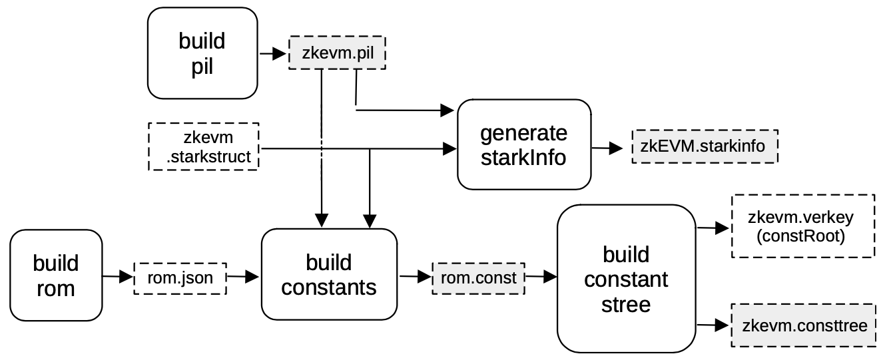
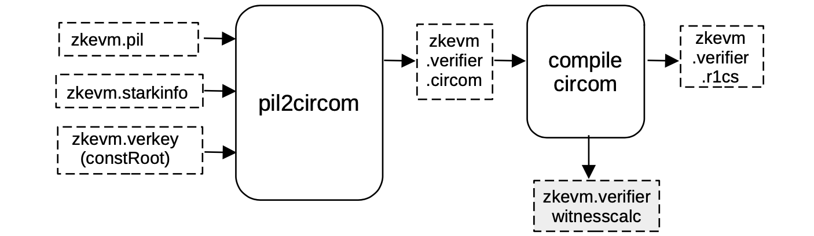

All preprocessing happens in the Setup phase. This means all artifacts needed for generating proofs are created in this phase.

Included among these is the generation of intermediate circuits, which are a finite set of circuits that allow arbitrary combinations of proof recursions and aggregations.

## Building The zkEVM STARK

The first step in building the zkEVM STARK is to build the ROM of the zkEVM state machine, where this ROM is nothing but a program containing instructions for the executor to generate a specified execution trace of the zkEVM. And it is written in JSON as `rom.json`.

The PIL code, `zkevm.pil`, is built for validating the execution trace.

The executor uses both the `rom.json` and `zkevm.pil` to generate all the constant polynomials for the execution trace of the zkEVM, `rom.const`.

Observe that, as previously mentioned, committed polynomials are not needed in the setup phase, so at this stage there is no need to run the executor of the zkEVM in order to generate them.

See the below schema of the process used when building a zkEVM STARK.

Next to be built is the Merkle tree of evaluations of the constant polynomials, `zkevm.consttree`.

The root of this Merkle tree, which is a hash that serves as a cryptographic fingerprint of all the fixed parameters of the computation, is stored as a parameter in a file called `zkevm.verkey`.

The last piece of data that needs to be generated, before building the STARK, is the `starkInfo` necessary for automatically generating the circuit that will verify the zkEVM STARK.

In this case, a blowup factor of $2$ and $128$ queries are used to generate the proof.

The artifacts marked in gray, in the above figure, are those being used in generating the proof.

Further delineation of the proof generation is provided in later sections.

## Setup `S2C` for zkEVM STARK

The next step in the Setup phase is to generate the circuit that will verify the zkEVM STARK (see the below Figure).

The `pil2circom` process fills a CIRCOM `EJS` template, called $\mathtt{stark\_verifier.circom.ejs}$, with all the necessary information needed to validate the zkEVM STARK.

We henceforth need to add the `zkevm.pil` in order to capture

- polynomial names,
- the `zkevm.starkinfo` file which specifies the blowup factor,
- the number of queries,
- the steps of the FRI-verification procedure,
- the constRoot in the `zkevm.verkey` file,

and to automatically generate a circuit in CIRCOM.

The CIRCOM output file `zkevm.verifier.circom` is then compiled into R1CS constraint system, written in a file called `zkevm.verifier.r1cs`.

These constraints will be used in the next step to generate the PIL code and the constant polynomials for the next proof.

On the other hand, the CIRCOM compilation also outputs a `witness calculator program` called `zkevm.verifier.witnesscalc`.

As it can be observed in the picture, the `witness calculator program` is marked in gray because it is going to be used when the proof is generated.

Since the aim in the next proof generation is compression (that is, proof size reduction), a blowup factor of 4 is used in this step, with 64 queries.

This information is contained in the `c12a.starkstruct` file located in the `proverjs` repository.

## Setup `c12a`

The zkEVM STARK is verified by a circuit called `zkevm.verifier`. This is the `c12a` circuit previously seen in the Compression stage, at the beginning of the [**Proving Architecture**](proving-architecture.md).

It is so called because the PIL code that verifies the `c12a` circuit, is a PlonKish circuit with custom gates and $\bf{12}$ polynomials, aiming at compression.

Given the above-mentioned R1CS description of the verification circuit `zkevm.verifier.r1cs`, a machine-like construction whose correct execution is equivalent to the validity of the previous circuit is obtained. This construction is described in a PIL file, `c12a.pil`.

The process starts through a service called $\mathtt{compressor12\_setup}$ (which is part of the `c12a setup` component, seen in the above figure), where the corresponding PIL file `c12a.pil` for verifying the trace is an output, together with a binary `c12a.const` for all the constant polynomials.

Moreover, a helper file called `c12a.exec` is generated by the same service.

This helper file will contain all the necessary rules that allow the shuffling of all the witness values, which will be computed later on, into the corresponding position of the execution trace.

The design of this shuffling, together with the connections defined in the constants polynomials `c12a.const` ensures that, for an honest prover, this newly generated trace is valid whenever the previous circuit is valid.
