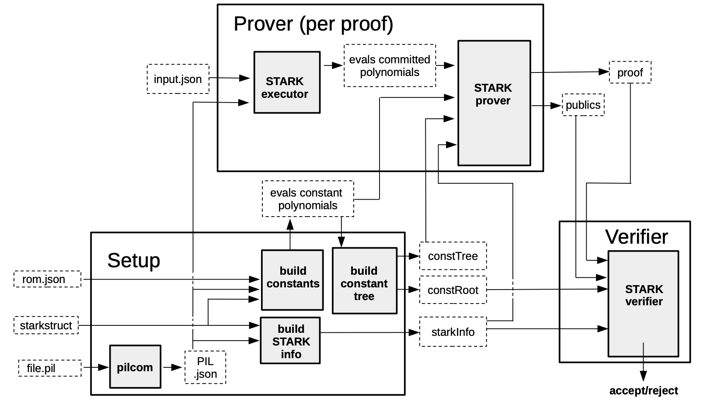

In this document, we provide a brief outline of the proving tool called **PIL-STARK** and the two proving techniques namely **FRI** and **STARK**.

## PIL-STARK

PIL-STARK proof/verification consists of three components; Setup, Prover, and Verifier.

- **Setup** refers to the **preprocessing of all data required by the Prover and Verifier**. It takes the PIL description of the State Machine being proved and verified as well as the **STARK** configuration JSON-file as inputs.

- **Prover** requires some input values in the form of a JSON-file together with the evaluations of the constant polynomials, the `constTree` and the `starkInfo` from the preprocessing. It outputs the **STARK** proof and public values called `publics`.

- The Verifier receives the **STARK** proof and public values from the Prover, as well as the `starkInfo` and `constRoot` from the Setup phase. The Verifier's output is either an `Accept` if the proof is accepted, or a `Reject` if the proof is rejected.

The full details of the PIL-STARK process are given [here](../../../concepts/mfibonacci/pil-stark.md), while the following diagram summarizes entire PIL-STARK process.

## Role of FRI

The zkProver uses an extended version of the **STARK** protocol, dubbed e**STARK**, which is especially designed to prove PIL specifications. It is so called because it is not confined to proving polynomials equalities, but extends to arguments such as lookups, permutations or even copy-constraints (called **connection arguments**).

The e**STARK** protocol is composed of two main phases; the **low-degree reduction phase** and the **FRI phase**.

!!!info
     What is FRI

     [**FRI**](https://drops.dagstuhl.de/opus/volltexte/2018/9018/pdf/LIPIcs-ICALP-2018-14.pdf) refers to **Fast Reed-Solomon Interactive Oracle Proof of Proximity**. The FRI protocol consists of two phases: a **commit phase** and **query phase**. You can read more about the protocol in [this document](https://eprint.iacr.org/2021/582.pdf) by **StarkWare Team**.

1. **Low-degree reduction phase**

    During this phase, we receive a FRI polynomial, which codifies the validity of the execution trace values according to the PIL code into the fact that it has a low degree. This polynomial, along with numerous other polynomials required to provide consistency checks, is committed to the Verifier.

2. **FRI Phase**

    Following the acquisition of the FRI polynomial, the Prover and Verifier communicate using the standard FRI Protocol, with the goal of precisely demonstrating and verifying that the committed polynomial has a low degree. More specifically, **it demonstrates that the committed values of the polynomials raise a function that is suffuciently near to a low degree polynomial**.

## e**STARK** Protocol

On a high level, the description of the e**STARK** protocol can be broken down into several rounds. Here's what each rounds aims to achieve:

- $Round\ 1$: Given the trace column polynomials after interpolating the execution trace, the Prover commits to these polynomials.

- $Round\ 2$: For each lookup argument, the Prover commits to the so-called $h$-polynomials of the modified Plookup version described in [PlonKup](https://eprint.iacr.org/2022/086.pdf).

- $Round\ 3$: The Prover commits to the grand-product polynomials for each of the arguments appearing in the PIL code, together with some intermediate polynomials used to reduce the degree of the grand products. This is due to the fact that PIL-STARK imposes a degree bound when committing to a polynomial.

  See [Plookup](https://eprint.iacr.org/2022/086.pdf) or [Plonk](https://eprint.iacr.org/2019/953.pdf) for the specification of the grand-products of each of the different arguments allowed in PIL.

- $Round\ 4$: The Prover commits to two polynomials $Q_1$ and $Q_2$ arising from the splitting of the quotient polynomial $Q$.

- $Round\ 5$: The Prover provides the Verifier with all the necessary evaluations of the polynomials so that corresponding checks can be executed.

- $Round\ 6$: The Prover receives two random values from the Verifier, which are used to construct the FRI polynomial. Then the Prover and the Verifier get engaged (non-Interactively) in a FRI Protocol, which ends with the Prover sending the corresponding FRI proof to the Verifier.

After the proof is generated, it is sent to the Verifier instance for the verification procedure to begin. The final output is either an `accept` or a `reject`, indicating whether the proof was accepted or rejected.
