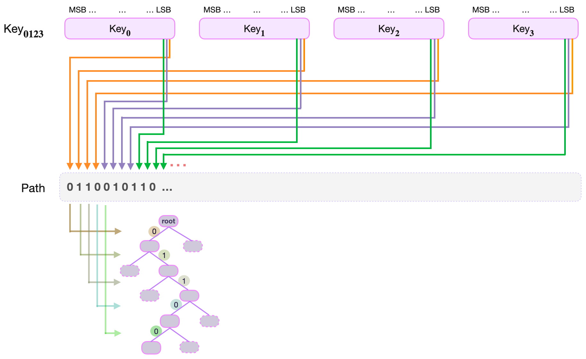

Let us first look at the zkProver's storage parameters.

In the Storage SM, keys and values are strings of 256 bits. Keys are henceforth represented as 256-bit unsigned integers that are quadruples of 64-bit field elements. For example:

$$
\text{Key}_{\mathbf{0123}} = \big( \text{Key}_{\mathbf{0}} , \text{Key}_{\mathbf{1}} , \text{Key}_{\mathbf{2}} , \text{Key}_{\mathbf{3}} \big)
$$

where each $\text{Key}_{\mathbf{i}} \in \mathbb{F}_p$, where $p = 2^{64} - 2^{32} + 1$.

Although hashed-values are also 256-bit long and are used in quadruple form, committed values are 256-bit long and are often expressed as octets. 
It is mainly due to the Poseidon SM convention, where 256-bit committed values are input as

$$
\text{V}_{\mathbf{01..7}} = \big( \text{V}_{\mathbf{0}} , \text{V}_{\mathbf{1}} , \text{V}_{\mathbf{2}} , \dots , \text{V}_{\mathbf{7}} \big)
$$

and each 32-bit $V_{\mathbf{j}}$ chunk of bits.

In fact, almost every other 256-bit value in storage is expressed in the form of a quadruple of 64-bit field elements.

## How keys are created

In the key-value pair SMT context of our storage design, a key uniquely identifies a leaf. And it is because, although values can change, keys do not.

Keys must consequently be generated deterministically, and in such a way that there are no collisions. That is, there must be a one-to-one correspondence between keys and leaves.

A collision-resistant hash function is therefore the best tool for generating keys. And the most convenient way to generate keys is by hashing some specific information so that the resultant hash uniquely identifies the leaf. 

The specific information used for generating keys is the _Ethereum address_ and some constant. The Poseidon hash function is again used for this purpose.

## Constructing navigation paths

A path refers to the edges traversed from the root to a leaf. Since the SMTs are binary, all edges can be thought of as labeled with either a bit _0_ or _1_.

Edges to the left are labeled with a bit _0_, while edges to the right are labeled with a bit _1_.

Paths are therefore strings of bits, and are derived from keys in a very specific way.

First of all, every key can be thought of as a quadruple, 

$$
\text{Key}_{\mathbf{0123}} = \big( \text{Key}_{\mathbf{0}} , \text{Key}_{\mathbf{1}} , \text{Key}_{\mathbf{2}} , \text{Key}_{\mathbf{3}} \big) \in \mathbb{F}_{p}^4
$$ 

Denote each 64-bit key part $\text{Key}_{\mathbf{i}}$ bit-wise as;

$$
\begin{aligned}
\text{Key}_{\mathbf{0}} = k_{\mathbf{0,63}\ } k_{\mathbf{0,62}\ } \dots k_{\mathbf{0,2}\ } k_{\mathbf{0,1}\ } k_{\mathbf{0,0} },\\ 
\text{Key}_{\mathbf{1}} = k_{\mathbf{1,63}\ } k_{\mathbf{1,62}\ } \dots k_{\mathbf{1,2}\ } k_{\mathbf{1,1}\ } k_{\mathbf{1,0} },\\ 
\text{Key}_{\mathbf{2}} = k_{\mathbf{2,63}\ } k_{\mathbf{2,62}\ } \dots k_{\mathbf{2,2}\ } k_{\mathbf{2,1}\ } k_{\mathbf{2,0} },\\ 
\text{Key}_{\mathbf{3}} = k_{\mathbf{3,63}\ } k_{\mathbf{3,62}\ } \dots k_{\mathbf{3,2}\ } k_{\mathbf{3,1}\ } k_{\mathbf{3,0} },
\end{aligned}
$$

where the most-significant bit $\text{MSB}(\text{Key}_{\mathbf{i}}) = k_{\mathbf{i,63}\ }$ and the least-significant bit $\text{LSB}(\text{Key}_{\mathbf{i}}) = k_{\mathbf{i,0}}$, for each  $\mathbf{i} \in \{ \mathbf{0}, \mathbf{1}, \mathbf{2}, \mathbf{3} \}$.

The _navigation path_ to the leaf corresponding to the key $\text{Key}_{\mathbf{0123}}$ is defined as the following string of shuffled key-bits;

$$
\begin{aligned}
k_{\mathbf{0,0}\ } k_{\mathbf{1,0}\ } k_{\mathbf{2,0}\ } k_{\mathbf{3,0}\ } k_{\mathbf{0,1}\ } k_{\mathbf{1,1}\ } k_{\mathbf{2,1}\ } k_{\mathbf{3,1}\ } k_{\mathbf{0,2}\ } k_{\mathbf{1,2}\ } k_{\mathbf{2,2}\ } k_{\mathbf{3,2}\ }  \dots \\
k_{\mathbf{0,62}\ }  k_{\mathbf{1,62}\ } k_{\mathbf{2,62}\ }  k_{\mathbf{3,62}\ }  k_{\mathbf{0,63}\ } k_{\mathbf{1,63}\ } k_{\mathbf{2,63}\ } k_{\mathbf{3,63} }.
\end{aligned}
$$

That is, the navigation path to the leaf corresponding to $\text{Key}_{\mathbf{0123}}$ is the string of bits composed of:

- The least-significant bits of the four 64-bit key parts, $\text{Key}_{\mathbf{0}}$, $\text{Key}_{\mathbf{1}}$, $\text{Key}_{\mathbf{2}}$, $\text{Key}_{\mathbf{3}}$, appearing in the order of the key parts as:

$$
k_{\mathbf{0,0}\ } k_{\mathbf{1,0}\ } k_{\mathbf{2,0}\ } k_{\mathbf{3,0}}
$$

- Followed by the second least-significant bits of the four 64-bit key parts, $\text{Key}_{\mathbf{0}}$, $\text{Key}_{\mathbf{1}}$, $\text{Key}_{\mathbf{2}}$, $\text{Key}_{\mathbf{3}}$, appearing in the order of the key parts as: 

$$
k_{\mathbf{0,1}\ } k_{\mathbf{1,1}\ } k_{\mathbf{2,1}\ } k_{\mathbf{3,1}}
$$

- Then the third least-significant bits of the four key parts, 
$\text{Key}_{\mathbf{0}}$, $\text{Key}_{\mathbf{1}}$, $\text{Key}_{\mathbf{2}}$, $\text{Key}_{\mathbf{3}}$, appearing in the order of the key parts as: 

$$
k_{\mathbf{0,2}\ } k_{\mathbf{1,2}\ } k_{\mathbf{2,2}\ } k_{\mathbf{3,2}}
$$

- Up until the most-significant bits of the four key parts, $\text{Key}_{\mathbf{0}}$, $\text{Key}_{\mathbf{1}}$, $\text{Key}_{\mathbf{2}}$, $\text{Key}_{\mathbf{3}}$, appearing in the order of the key parts as: 

$$
k_{\mathbf{0,63}\ } k_{\mathbf{1,63}\ } k_{\mathbf{2,63}\ } k_{\mathbf{3,63}}
$$

This construction ensures that in every quadruplet of consecutive path-bits, there is a one-to-one correspondence between the bits and the four parts of the key, $\text{Key}_{\mathbf{0}}$, $\text{Key}_{\mathbf{1}}$, $\text{Key}_{\mathbf{2}}$, $\text{Key}_{\mathbf{3}}$.

## Reconstructing the key from path-bits

When executing a basic operation such as an UPDATE of a value at a leaf, one has to reconstruct the key from the remaining key found at the leaf and the path-bits spent in navigating to the leaf.

Denote the remaining key as a quadruple, 

$$
\text{RKey}_{\mathbf{0123}} = \big(\text{RKey}_{\mathbf{0}} , \text{RKey}_{\mathbf{1}} , \text{RKey}_{\mathbf{2}} , \text{RKey}_{\mathbf{3}}\big)
$$

Since the Path was constructed by shuffling key-bits from the four parts, $\text{Key}_{\mathbf{0}}$, $\text{Key}_{\mathbf{1}}$, $\text{Key}_{\mathbf{2}}$, $\text{Key}_{\mathbf{3}}$, one would expect the reverse-process (going from the path-bits to the original key) to work just as easily.

Perhaps taking the level $\text{lvl}$ of a leaf and reducing it modulo 4, should be sufficient to tell which part of the Remaining Key, $\text{RKey}_{\mathbf{i}}$, must the Path key-bit be appended to.

## Example of key reconstruction

Suppose the leaf storing the key-value pair $\big( \text{Key}_{\mathbf{0123}}, \text{V}_{\mathbf{01..7}}  \big)$ is reached at level 7, the path-bits used are $0110101$, and the remaining key is 

$$
\text{RKey}_{\mathbf{0123}} = \big( \text{RKey}_{\mathbf{0}} , \text{RKey}_{\mathbf{1}} , \text{RKey}_{\mathbf{2}} , \text{RKey}_{\mathbf{3}} \big)
$$

That is, the path-bits are 

$$
\begin{aligned}
\text{path-bit}_6 = 1, \text{ path-bit}_5 = 0, \text{ path-bit}_4 = 1, \text{ path-bit}_3 = 0, \\
\text{ path-bit}_2 = 1, \text{ path-bit}_1 = 1, \text{ path-bit}_0 = 0.
\end{aligned}
$$

So, in order to place $\text{path-bit}_6$, one first computes $7 \text{ modulo } 4$ to get $3$. Hence, the $\text{key-bit}_6$ must be appended to the third key part, $\text{RKey}_{\mathbf{2}}$.

Next, one climbs the tree to level $6$, where $\text{path-bit}_5 = 0$. One then computes $6 \text{ modulo } 4$ and gets $2$. The $\text{path-bit}_5$ must then be appended to the second key part, $\text{RKey}_{\mathbf{1}}$.

Again, one climbs the tree to level $5$, where $\text{path-bit}_4 = 1$. Computing  $5 \text{ modulo } 4$  yields $1$. The $\text{path-bit}_4$ is thence appended to the first key part, $\text{RKey}_{\mathbf{0}}$.

One then continues in the same fashion:

$\text{Climbs the tree to level } 4. \text{ Computes }\ 4 \text{ modulo } 4 = 0. \text{ Appends a path-bit to the fourth part, } \text{RKey}_{\mathbf{3}}.$
$\text{Climbs the tree to level } 3. \text{ Computes }\ 3 \text{ modulo } 4 = 3. \text{ Appends a path-bit to the third part, } \text{RKey}_{\mathbf{2}}.$
$\text{Climbs the tree to level } 2. \text{ Computes }\ 2 \text{ modulo } 4 = 2. \text{ Appends a path-bit to the second part, } \text{RKey}_{\mathbf{1}}.$
$\text{Climbs the tree to level } 1. \text{ Computes }\ 1 \text{ modulo } 4 = 1. \text{ Appends a path-bit to the first part, } \text{RKey}_{\mathbf{0}}.$

The next climb is to the root. The navigation path-bits have been exhausted, and the last append has actually completed reconstruction of the key.

## Leaf levels and integers modulo 4

It is clear, from the above example, that there is a one-to-one correspondence between the integers modulo 4 (i.e., elements of the group $\mathbb{Z}_4 = \{ 0, 1, 2, 3 \}$) and remaining key parts $\text{RKey}_{\mathbf{0}}$, $\text{RKey}_{\mathbf{1}}$, $\text{RKey}_{\mathbf{2}}$, $\text{RKey}_{\mathbf{3}}$.

That is, there is a mapping:

$$
1 \mapsto \text{RKey}_{\mathbf{0}},\ \ 2 \mapsto \text{RKey}_{\mathbf{1}},\ \  3 \mapsto \text{RKey}_{\mathbf{2}} \text{ and }\ 0 \mapsto \text{RKey}_{\mathbf{3}}.
$$

The quadruple structure of the path bits and the level of leaves therefore have a homomorphic relationship that can be described in terms of the cyclic group of integers modulo 4, $\mathbb{Z}_4 = \{ 0, 1, 2, 3 \}$.

Since addition modulo n is an expensive computation in the state machine context, it is important to find a more efficient algorithm to achieve the same result.

## Alternate cyclic group of order 4

In order to explore cyclic groups of order 4, take the vector  $\mathbf{x} = (1,0,0,0)$ , and rotate the components of $\mathbf{x}$ one position to the left.

Note that, rotating $\mathbf{x} = (1,0,0,0)$

- once, yields $(0,0,0,1)$
- twice, one obtains $(0,0,1,0)$
- thrice, one gets $(0,1,0,0)$
- four times, and the result is  $\mathbf{x} = (1,0,0,0)$

Continuously rotating $\mathbf{x} = (1,0,0,0)$ does not result in any other vector but the four vectors

$$
\mathbf{G_4} = \{ (1,0,0,0),\ (0,0,0,1),\ (0,0,1,0),\ (0,1,0,0) \}.
$$

This set of four vectors $\mathbf{G_4}$ together with the described rotation, forms a group.

In fact, $\mathbf{G_4}$ is isomorphic (or homomorphically equivalent) to $\mathbb{Z}_4$ under addition modulo 4.

That is, there is a natural one-to-one correspondence between the elements of $\mathbb{Z}_4$ and those of $\mathbf{G_4}$, as follows:

$$
0 \mapsto (1,0,0,0),\ \ 1 \mapsto (0,1,0,0),\ \ 2 \mapsto (0,0,1,0)\  \text{ and }\ 3 \mapsto (0,0,0,1).
$$

Note that the four numbers $0$, $1$, $2$ and $3$ can be expressed in their binary form with just two bits, and the same one-to-one correspondence holds as:

$$
\text{00} \mapsto (1,0,0,0),\ \ \text{01} \mapsto (0,1,0,0),\ \ \text{10} \mapsto (0,0,1,0)\  \text{ and }\ \text{11} \mapsto (0,0,0,1).
$$

## Special cyclic register for leaf levels

Define a register called _LEVEL_ which is a vector of four bits; three 0 bits and one 1 bit. And the operation  _ROTATE_LEVEL_  which is the left rotation of _LEVEL_'s bits by one position.

If _LEVEL_ is initialised as $(1,0,0,0)$, observe that applying _ROTATE_LEVEL_ four times brings _LEVEL_ back to $(1,0,0,0)$. That is,

$$
(1,0,0,0) \to (0,0,0,1)  \to (0,0,1,0) \to (0,1,0,0) \to (1,0,0,0)
$$

Therefore, _LEVEL_ is cyclic under _ROTATE_LEVEL_, and is in fact algebraically the same as the cyclic group $\mathbf{G_4}$ described above.

### Using LEVEL register in key reconstruction

First note that, when navigating the tree, the leaf level can be indicated by one of the four possible states of the _LEVEL_ register. And this works for all possible leaf levels because, for any positive integer $j$:

$$
\begin{aligned}
{\text{LEVEL}} = (1,0,0,0)\ \text{indicates that the leaf level is one of the following};\ 0, 4, 8, \dots , 0 + 4j. \ \\
{\text{LEVEL}} = (0,1,0,0)\ \text{indicates that the leaf level is one of the following};\ 1, 5, 9, \dots , 1 + 4j. \ \\
{\text{LEVEL}} = (0,0,1,0)\ \text{indicates that the leaf level is one of the following};\ 2, 6, 10, \dots, 2 + 4j. \\
{\text{LEVEL}} = (0,0,0,1)\ \text{indicates that the leaf level is one of the following};\ 3, 7, 11, \dots, 3 + 4j.
\end{aligned}
$$

Second, the two least-significant bits of each of these number, when written in binary, are as follows:

$$
\begin{aligned}
\text{Each of these numbers};\ 0, 4, 8, \dots , 0 + 4j;\ \text{ends with } 00.\ \ \\
\text{Each of these numbers};\ 1, 5, 9, \dots , 1 + 4j;\ \text{ends with } 01.\ \ \\
\text{Each of these numbers};\ 2, 6, 10, \dots , 2 + 4j; \text{ends with } 10.\ \\
\text{Each of these numbers};\ 3, 7, 11, \dots , 3 + 4j;\ \text{ends with } 11.
\end{aligned}
$$

It suffices therefore to only read the two least-significant bits of the leaf level in order to determine the position of the bit 1 in the _LEVEL_ register.

Third, the position of the bit 1 in the _LEVEL_ register tallies precisely with the part of the remaining key, $\text{RKey}_{\mathbf{i}}$, to which the last used path-bit came from.

So then, when reconstructing the key, one needs only to check where the bit 1 is in the _LEVEL_ register, because:

$$
\begin{aligned}
{\text{LEVEL}} = (1,0,0,0)\ \ \text{means, the last used path bit must be appended to } \mathbf{RKey_0}.\\
{\text{LEVEL}} = (0,1,0,0)\ \ \text{means, the last used path bit must be appended to } \mathbf{RKey_1}.\\
{ \text{LEVEL}} = (0,0,1,0)\ \ \text{means, the last used path bit must be appended to } \mathbf{RKey_2}.\\
{\text{LEVEL}} = (0,0,0,1)\ \ \text{means, the last used path bit must be appended to } \mathbf{RKey_3}.
\end{aligned}
$$

Since things are rather mechanical in state machines, one or two more functions are needed. For instance, one for initialising the _LEVEL_ register, and another for reading the position of the bit 1.
