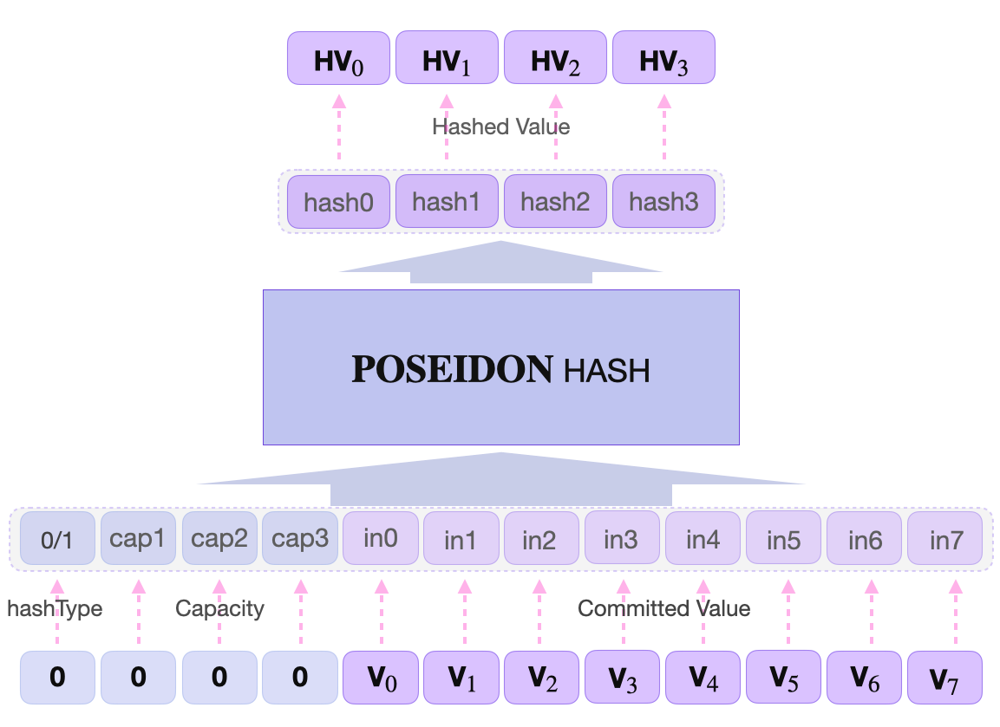

The Storage Executor is like a slave-worker to the master, the Storage Assembly code. It carries out all Storage Actions in accordance with rules and logic that the Assembly code has set out.

As per instruction of the Main SM, the Storage Executor makes function calls to the Storage ROM for a specific secondary Assembly code stored as a JSON-file, by using the same aforementioned **selectors** of secondary Assembly codes.

For example, if the Main SM requires a new leaf to be created at a found non-zero leaf, the Storage Executor uses `isSetInsertFound` as a function call for the `Set_InsertFound` (or `SIF`) Storage Action. The Storage Executor then proceeds to build committed polynomials and executes the `SIF` Storage Action.

As previously observed, in our very first UPDATE example in this document, all values are expressed as quadruplets of unsigned integers. For example, the **Remaining Key** looks like this,

$$
\text{RKey} = \big( \text{RKey}_0, \text{RKey}_1, \text{RKey}_2, \text{RKey}_3 \big)
$$

The Executor therefore uses an internal 4-element register called `op = [_,_,_,_]`, for handling values from the Storage ROM, which are needed in the internal step-by-step evaluations of the Storage Action being executed. It is thus reset to 0 after every evaluation.

All the function calls seen in the Assembly code:

`GetSibling()`, `GetValueLow()`, `GetValueHigh()`, `GetRKey()`, `GetSiblingRKey()`, `GetSiblingHash()`, `GetSiblingValueLow()`, `GetSiblingValueHigh()`, `GetOldValueLow()`, `GetOldValueHigh()`, `GetLevelBit()`, `GetTopTree()`, `GetTopBranch()` and `GetNextKeyBit()`;

are actually performed by the Storage Executor. The values being fetched are carried with the `op` register. For instance, if the function call is `GetRKey()` then the Storage Executor gets the RKey from the rom.line file, carries it with `op` as;

`op[0] = ctx.rkey[0];`

`op[1] = ctx.rkey[1];`

`op[2] = ctx.rkey[2];`

`op[3] = ctx.rkey[3];` where `ctx` signifies a **Storage Action**.

Also, since all Storage Actions require some hashing, the Storage SM delegates all hashing actions to the POSEIDON SM. However, from within the Storage SM, it is best to treat the POSEIDON SM as a blackbox. The Storage Executor simply specifies the sets of twelve values to be digested. And the POSEIDON SM then returns the required digests of the values.

## Storage PIL

All computations executed in the Storage SM must be verifiable. A special Polynomial Identity Language (PIL) code is therefore used to set up all the polynomial constraints the verifier needs so as to validate correctness of execution.

The preparation for these polynomial constraints actually starts in the Storage Executor. In order to accomplish this, the Storage Executor uses; selectors, setters and instructions; which are in fact Boolean polynomials. See the list of these Boolean committed polynomials in the table below.

| Selectors              | Setters                | Instructions      |
| :--------------------- | :--------------------- | :---------------- |
| selFree[i]             | setHashLeft[i]         | iHash             |
| selSiblingValueHash[i] | setHashRight[i]        | iHashType         |
| selOldRoot[i]          | setOldRoot[i]          | iLatchSet         |
| selNewRoot[i]          | setNewRoot[i]          | iLatchGet         |
| selValueLow[i]         | setValueLow[i]         | iClimbRkey        |
| selValueHigh[i]        | setValueHigh[i]        | iClimbSiblingRkey |
| selRkeyBit[i]          | setSiblingValueLow[i]  | iClimbSiblngRkeyN |
| selSiblingRkey[i]      | setSiblingValueHigh[i] | iRotateLevel      |
| selRkey[i]             | setRkey[i]             | iJmpz             |
|                        | setSiblingRkey[i]      | iConst0           |
|                        | setRkeyBit[i]          | iConst1           |
|                        | setLevel[i]            | iConst2           |
|                        |                        | iConst3           |
|                        |                        | iAddress          |

  

Every time each of these Boolean polynomials are utilised or performed, a record of a "1" is kept in its register. This is called an **Execution Trace**.

Therefore, instead of performing some expensive computations in order to verify correctness of execution (at times repeating the same computations being verified), the trace of execution is tested.

The verifier takes the execution trace, and tests if it satisfies the polynomial constraints (or identities) in the PIL code. This technique helps the zkProver to achieve succintness as a zero-knowledge proof/verification system.

## Poseidon hash

Poseidon SM is more straightforward once one understands the internal mechanism of the original Poseidon hash function. The hash function's permutation process translates readily to the Poseidon SM states.

The POSEIDON State Machine carries out POSEIDON Actions in accordance with instructions from the Main SM Executor and requests from the Storage SM. That is, it computes hashes of messages sent from any of the two SMs, and also checks if the hashes were correctly computed.

The zkProver uses the **goldilocks POSEIDON** which is defined over the field  $\mathbb{F}_p$, where $p = 2^{64} - 2^{32} + 1$.

The states of the POSEIDON SM coincide with the twelve (12) internal states of the $\text{POSEIDON}^{\pi}$ permutation function. These are; `in0`, `in1`, ... , `in7`, `hashType`, `cap1`, `cap2` and `cap3`.

$\text{POSEIDON}^{\pi}$ runs 30 rounds, 3 times. Adding up to a total of 90 rounds. It outputs four (4) hash values; `hash0`, `hash1`, `hash2` and `hash3`.

In the case of the zkProver storage, two slightly different POSEIDON hashes are used; $\text{HASH0}$ is used when a branch node is created, whilst $\text{HASH1}$ is used when a leaf node is created. This depends on the `hashType`, which is a boolean. So POSEIDON acts as $\text{HASH1}$ when `hashType` = 1, and $\text{HASH0}$ when `hashType` = 0.

Since POSEIDON Hashes outputs $4 * \lfloor(63.99)\rfloor \text{ bits} = 252$, and one bit is needed to encode each direction, the tree can therefore have a maximum of 252 levels.
