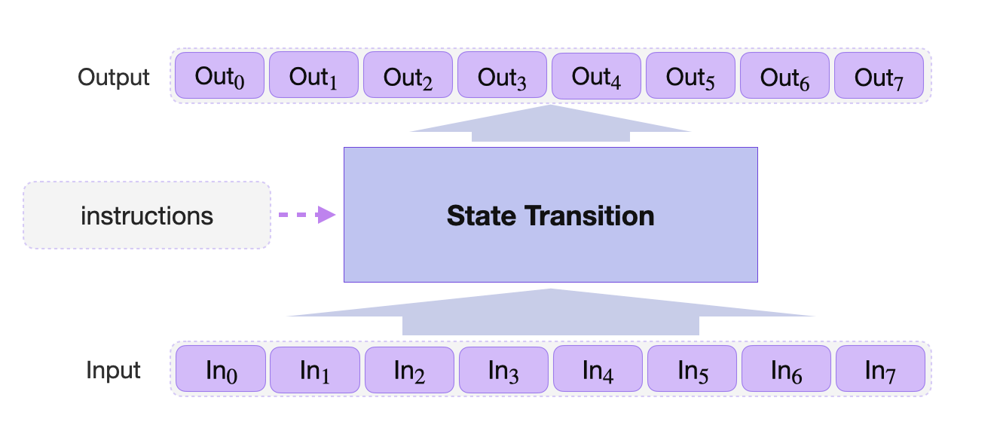

A standard state machine is characterized by sets of states (as inputs) stored in registers, instructions on how the states should transition, and the resultant states (as outputs) stored as new values in the same registers. The below figure demonstrates a standard state machine.

Some state machines can be monolithic, serving as prototypes for a specific computation, while others may specialize in performing multiple computations of the same type. Depending on the computational algorithm, a state machine may have to run through a number of state transitions before producing the desired output. Iterations of the same sequence of operations may be required, to the extend that most common state machines are cyclic by nature.

The _Storage_ state machine is one of the secondary zkProver state machines responsible for all operations on data stored in the zkProver's storage. It receives instructions from the Main state machine, called _Storage Actions_. The Main state machine performs typical database operations such as: Create, Read, Update and Delete (CRUD); and then instructs the Storage state machine to verify whether these were correctly performed.

## A microprocessor-type state machine

The Storage SM is in fact a micro-processor with both the firmware and the hardware parts.

It is in the firmware part of the Storage SM where the logic and rules are set up, expressed in JSON format and stored in a ROM. The _zero-knowledge Assembly_ (zkASM) is a language developed by the team and especially designed to map instructions from the zkProver Main SM to other state machines, in this case, to the Storage SM's executor.

The Main SM's instructions, or Storage Actions, are passed to the Storage SM executor for execution in compliance with the rules and logic specified in the JSON-file.

The hardware part uses another novel language, called _Polynomial Identity Language_ (PIL), which is also developed by the team and especially designed for the zkProver, because almost all state machines express computations in terms of polynomials. State transitions in state machines must satisfy computation-specific polynomial identities.

In order for the Storage SM to carry out Storage Actions, its executor generates committed and constant polynomials, which are then checked against polynomial identities to prove that computations were correctly executed. See the [Design approach](../../../concepts/mfibonacci/mfibonacci.md) section for how this achieved.

## zkProver's storage

As a means to achieve zero-knowledge, all data is stored in the form of Merkle trees. This means the Storage SM often makes requests of another state machine, the Poseidon SM, to perform hashing (referred to as _Poseidon Actions_).

The Main SM performs computations on the key-value data stored in special Merkle trees, called Sparse Merkle trees (SMTs). The keys and values are stored as strings of 256 bits and can be interpreted as 256-bit unsigned integers.

The mechanics of the Storage SM and its basic operations are described in detail in later sections of this documentation. They cover:

1. The basic design of the zkProver's Storage and some preliminaries. Also explains how the Sparse Merkle trees (SMTs) are built.

2. Explanations of the basic operations routinely performed on these SMTs.

3. Details about specific parameters the Storage SM uses, such as how keys and paths are created, and the two Poseidon hash functions used in the SMTs.

4. The three main components of the Storage SM:
    - The Storage SM Assembly
    - The Storage SM executor, and
    - The Storage SM PIL code, for all the polynomial identities and proving correctness of execution.
