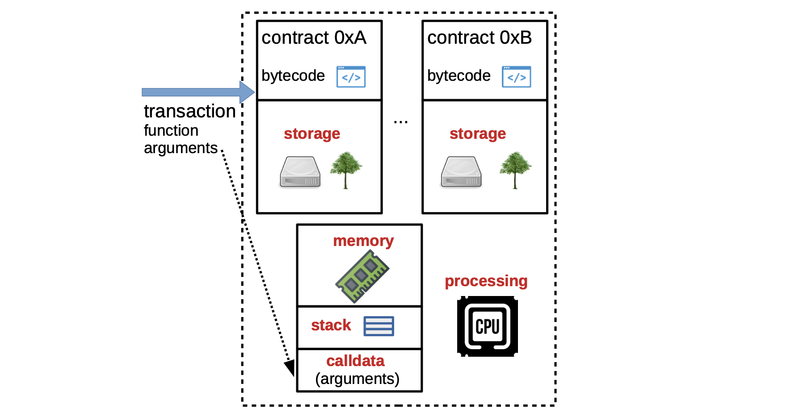

In this series of documents, we will dig deeper into the Main State Machine Executor component of the zkProver. It is one of the four main components of the zkProver, outlined [here](../architecture/zkprover/index.md). These are - Executor, STARK Recursion, CIRCOM, and Rapid SNARK.

Since the design of the zkProver emulates that of the EVM, this document focuses on explaining the basics of Ethereum Virtual Machine (EVM).

## Overview of Polygon zkEVM

Polygon zkEVM is an L2 network that implements a special instance of the Ethereum Virtual Machine (EVM). It emulates the EVM in that the zkProver, which is core to proving and verifying computation correctness, is also designed as a state machine or a cluster of state machines.

The terms state machine and virtual machine are used interchangeably in this documentation.

Although the Polygon zkEVM architecture and state differ from the Ethereum, communication with the Polygon zkEVM is done through a JSON-RPC interface, which is fully compatible with Ethereum RPC. This allows all Ethereum-compatible applications and tools to be natively compatible with the Polygon zkEVM.

Since Polygon zkEVM is a separate instance, with a state distinct from Ethereum, balances in accounts may differ and therefore L1 smart contracts cannot be directly accessed through L2 transactions.

A special zkEVM bridge and cross-chain messaging mechanism have been developed so as to enable the exchange of data between both networks. More details on the zkEVM Bridge are documented [here](../architecture/protocol/zkevm-bridge/index.md).

## Basics of EVM

The Ethereum blockchain is a distributed digital ledger that keeps track of all transactions and interactions that occur on the Ethereum network. In addition to recording transactions, the EVM can store and execute smart contracts. These smart contracts are low-level codes that can perform a variety of tasks and operations on the network.

The Ethereum Virtual Machine (EVM) is therefore the computational engine of the Ethereum blockchain responsible for smart contract deployment and execution.

The EVM is categorized as a quasi–Turing-complete state machine because it can handle all execution processes except that, due to the gas limit set in every smart contract, it is limited to computations with a finite number of steps.

At any given point in time, the current state of the Ethereum blockchain is defined by a collection of the blockchain data. An Ethereum state therefore includes account balances, smart contract code, smart contract storage, and other information relevant to the operation of the network.

Since Ethereum is a distributed digital ledger, its state is maintained by each of the network's full-nodes.

## Key features of EVM

In terms of how it operates, the EVM is described as; deterministic, sandboxed, and Stack-based.

Deterministic &rarr; for any given input, it always produces the exact same output. This feature is critical for ensuring dependability and predictability of smart contract execution, as well as enabling reliable verification of execution.

Sandboxed &rarr; because transactions processed by smart contracts run in an environment that is isolated from the rest of the system, making it impossible for transactions to access or modify data outside this environment. This contributes towards network security by preventing unauthorized access to sensitive data.

Stack-based &rarr; because it employs a Last-In First-Out (LIFO) memory data structure for processing operations, with data being pushed onto a Stack and popped off as needed.

## Components of EVM

The EVM is made up of several components that work together to execute smart contracts on the Ethereum blockchain and provide the above-mentioned features.

The main components of the EVM involved in the processing of a transaction are:

1. Smart contract bytecode, which is the low-level code executed by the EVM.

    Each bytecode is a sequence of opcodes (machine-level instructions). And each opcode in an EVM bytecode corresponds to a specific operation, such as arithmetic, conditional branching or memory manipulation. The EVM executes bytecode in a step-by-step fashion, with each opcode being processed in a given sequence.

    In general, smart contracts are written in a high-level programming language, such as [Solidity](https://docs.soliditylang.org/en/v0.8.20/) or [Vyper](https://docs.vyperlang.org/en/stable/), and then compiled into an EVM bytecode.

2. Processing Environment refers to the component responsible for executing smart contracts. It provides a runtime environment for the smart contract bytecode to execute in and manage the memory and storage used by smart contract.

3. Stack is the Last-In First-Out (LIFO) data structure used to execute the EVM's operations, and thus turning the EVM into a Stack-based machine.

4. Memory is the component that allows smart contracts to store and retrieve data. It is organized as a linear array of bytes, while data is accessed by specifying its location in memory.

5. `calldata` refers to the set of parameters & values required for a smart contract to perform its function.

    The transaction that invokes a particular smart contract must contain the right `calldata`, and thus pass the `calldata` to that smart contract. `calldata` is read-only and therefore smart contracts cannot modify it during execution.

    The smart contract's input data is part of the transaction which is stored on the blockchain, and therefore any changes to the input data would result in a different transaction-hash and hence a different state of the blockchain.

6. Storage is the EVM’s storage component where smart contracts can also store data. It is a persistent key-value store that is associated with each smart contract, and it can be used to store state information.

The EVM is a variant of the [Von Neumann architecture](https://en.wikipedia.org/wiki/Von_Neumann_architecture) which means it uses a single shared memory for both data and instructions.

&rarr; The smart contract’s bytecode is stored in memory in the EVM, and the Program Counter (PC) keeps track of the current instruction being executed.

&rarr; Stack is used for storing small values, such as integers and booleans, values needed for immediate use, such as function parameters, local variables, and return values.

&rarr; Memory is used for storing large data structures, such as arrays and strings.

### EVM computational costs

The EVM has its own instruction set or list of available opcodes, which is a set of low-level commands used to manipulate data in the Stack, Memory and Storage components.

The instruction set includes operations such as Arithmetic, Bit manipulation and Control flow.

Additionally, in order to prevent spam and Denial of Service (DoS) attacks, the EVM employs a gas system. Gas is a unit of measurement for the computational resources required to execute a smart contract, and each operation in the instruction set has its own gas cost.

## Stack

The EVM is a Stack-based machine because it uses a Stack data structure to execute its operations. When an operation is performed, values that are currently top of the Stack are popped off, used in the executed operation, and then the result of the operation is pushed back onto the Stack.

Some of the main Stack operations executed in the EVM are:

1. `PUSH`: This opcode pushes a value onto the Stack. It is usually followed by:

    - A byte which indicates the number of bytes to be pushed onto the Stack, and

    - The actual bytes to be pushed onto the Stack.

    For example, the opcode `PUSH2 0x0123` pushes the bytes `0x01` and `0x23` onto the Stack as one word `0x0123`.

2. `POP`: Removes the top value from the Stack and discards it.

3. `DUP`: Duplicates the top value on the Stack and pushes the duplicate onto the Stack.

4. `SWAP`: Swaps the top two values on the Stack.

5. `ADD`, `SUB`, `MUL`, `DIV`, `MOD`: These opcodes perform specific Arithmetic operations on the top two values of the Stack, and push the result back onto the Stack.

6. `AND`, `OR`, `XOR`, `NOT`: These opcodes perform bitwise logic operations on the top two values of the Stack, and push the result back onto the Stack.

7. `EQ`, `LT`, `GT`: These opcodes perform comparison operations on the top two values of the Stack, and push the result back onto the Stack as a Boolean.

8. `SHA3`: Computes the `SHA3` hash of the top value on the Stack, and pushes the hash onto the Stack.

9. `JUMP`, `JUMPI`: These opcodes modify the program counter, allowing the program to jump to a different part of the code.

The EVM Stack is limited to $1024$ elements. This yields the capacity of $(1024 \times 256)$ bits because each EVM word is 256 bits long.

If a contract attempts to `PUSH` more elements onto the Stack, exceeding the $1024$-limit, a `Stack overflow error` will occur, causing the transaction to fail.

## Memory

The EVM Memory is used for storing large data structures, such as arrays and strings. It is a linear array of bytes used by smart contracts to store and retrieve data. The size of the memory is dynamically allocated at runtime, meaning that the amount of memory available to a smart contract can grow depending on its needs.

EVM Memory is byte-addressable, which means that each byte in the memory can be individually addressed using a unique index.

EVM word size is 256 bits (or 32 bytes), which means data is typically loaded and stored in 32-byte chunks. The EVM also provides instructions for loading and storing smaller chunks of data, such as individual bytes or $16$-bit words.

EVM Memory is referred to as non-persistent or volatile, because the data it stores gets cleared as soon as the execution of a smart contract is completed. This means the EVM needs to have a special component, called the EVM Storage, for permanently storing results of smart contract execution.

It’s also worth noting that, since accessing and modifying EVM Memory consumes computational resources, which are paid for in the form of gas, its use is subject to gas costs.

### Managing EVM memory

- When a contract calls another contract, a new execution environment is created with its own memory space.

- The parent contract’s memory space is saved, and the new contract’s memory space is initialized. The new contract can then make use of its memory as needed.

- When the called contract’s execution is completed, the memory space is released and the parent contract’s saved memory is restored.

It is worth noting that if a smart contract does not actually use the memory it has been allocated, that memory cannot be reclaimed or reused in the execution context of another contract.

The opcodes related to memory are as follows:

- `MLOAD` is an opcode used to load a $32$-byte word from Memory into the Stack. It takes a Memory address as its input and pushes the value stored at that address onto the Stack.

- `MSTORE` is an opcode used to store a $32$-byte word from the Stack into Memory. It takes a Memory address and a value from the Stack as its input, and stores the value at the specified address.

- `MSTORE8` is an opcode similar to `MSTORE`, except that it stores a single byte of data instead of a $32$-byte word. It takes a Memory address and a byte value from the Stack as its input, and stores the byte at the specified address.

- `MSIZE` is an opcode that returns the size of the current Memory area in bytes.

## Storage

EVM storage is a persistent key-value storage associated with each smart contract. It is organized as a large array of $32$-byte words and each word is identified by a unique $256$-bit key, which is used to access and modify the value stored in that word. Since the EVM Storage is non-volatile, data stored in it persists even after the smart contract execution has been completed.

Accessing and modifying storage is a relatively expensive operation in terms of gas costs. EVM storage is implemented as a modified version of the Merkle Patricia Tree data structure, which allows for efficient access and modification of the storage data.

A Patricia Tree is a specific type of a trie designed to be more space-efficient than a standard trie, by storing only the unique parts of the keys in the tree. Patricia Trees are particularly useful in scenarios where keys share common prefixes, as they allow for more efficient use of memory and faster lookups compared to standard tries.

The following opcodes are used to manipulate the storage of a smart contract:

- `SLOAD` loads a $256$-bit word from Storage at a given index, and pushes it onto the Stack.
- `SSTORE` stores a $256$-bit word to Storage at a given index. The value to be stored is popped from the Stack, and its index is specified as the next value on the Stack.

## Transaction process

Processing transactions in the EVM involves,

- the Recursive Length Prefix (RLP) encoding and decoding of transaction data,
- the verification of signatures,
- the execution of transactions,
- storing output values.

### RLP decoding

Transaction data are encoded for storage and decoded for processing. The Recursive Length Prefix (RLP) encoding and decoding is used for this purpose. The first step in processing an Ethereum transaction is to therefore decode the transaction.

Transactions are decoded so as to obtain relevant information such as; the recipient's address, the amount of ETH being transferred, and the data payload.

### Signature verification

Every transaction is digitally signed with a signature, which is generated using the Elliptic Curve Digital Signature Algorithm (ECDSA).

The ECDSA signature is represented by three (3) values, generally denoted as $\texttt{r}, \texttt{s}, \texttt{v}$.

Since the signature, or in particular the triplet $(\texttt{r}, \texttt{s}, \texttt{v})$, was computed from the secret key which is uniquely associated with the address of the Ethereum account (being debited), the three values $(\texttt{r}, \texttt{s}, \texttt{v})$ are sufficient to accurately verify that the transaction has been signed by the owner of the Ethereum account.

The Ethereum account is identified by a 20-byte (160-bit) address. The address is derived from the public key associated with the Ethereum account. It is in fact the last 20 bytes of the 256-bit Keccak hash of the public key.

### Processing a transaction

The EVM begins by creating a context with an empty stack and memory space.

The bytecode instructions are then executed. The execution involves values being pushed and popped onto and from the Stack as required.

EVM uses a Program Counter to keep track of which instruction to execute next. Each opcode has a fixed number of bytes, so the Program Counter increments by the appropriate number of bytes after each instruction is executed.

### Stack elements and word size

Stack elements are 32 bytes in size. This means each value pushed onto the Stack by an opcode, as well as each value popped off the Stack by an opcode, are each 32 bytes in size.

The 32-byte size limit for Stack elements is a fundamental design choice in Ethereum, and is purely based on the size of the EVM word. The EVM word is the basic unit of storage and processing in the EVM, defined as a 256-bit (32-byte) unsigned integer. Since the EVM word is the smallest unit of data that can be processed by the EVM, the stack elements are conveniently set to be of the same size.

### Summary

The EVM sequentially executes the opcodes in the bytecode, by following the Program Counter. It also manipulates $32$-byte values on the Stack and in Memory, in accordance with computations required to be performed, and permanently stores relevant values as required.

## EVM interpreter

EVM interpreter is a software component that processes and executes Ethereum transactions.

Ethereum smart contracts are written in a high-level programming language such as Solidity, Vyper, Fe or Yul, but are compiled into bytecodes. A bytecode is a set of instructions which the EVM nterpreter processes and executes.

Each bytecode is a sequence of Ethereum opcodes. The Ethereum opcodes are low-level instructions set for the EVM, and represent the basic operations that the EVM can perform during the execution of a smart contract triggered by a transaction.

A complete list of Ethereum opcodes includes over 200 different operations, ranging from general Arithmetic and Logical operations to more advanced and blockchain environment-specific operations, like calls to other contracts, contract creation, and storage management.

Some of the most commonly used opcodes include:

- `ADD`, `SUB`, `MUL`, `DIV`, which are basic arithmetic operations.
- `CALL`, `DELEGATECALL`, `CALLCODE`, which are calls to other contracts.
- `PUSH`, `POP`, which are Stack management operations.
- `JUMP`, `JUMPI`, which respectively refer to jumps and conditional jumps, from one line of a program to another.
- `SLOAD`, `SSTORE`, which are Storage management operations.
- `MLOAD`, `MSTORE`, which are Memory management operations.

## References

The [Ethereum yellow paper](https://ethereum.github.io/yellowpaper/paper.pdf) entails technical details on the Ethereum with some of the opcodes listed and described on Pages 30 to 38.

A more elaborate exposition of the Ethereum Blockchain is provided in the book [Mastering Ethereum](https://github.com/ethereumbook/ethereumbook) by Andreas M. Antonopoulos and Gavin Wood.

The shortest and less technical paper on Ethereum is [Beigepaper: An Ethereum Technical Specification](https://github.com/chronaeon/beigepaper/blob/master/beigepaper.pdf) by Micah Dameron.
