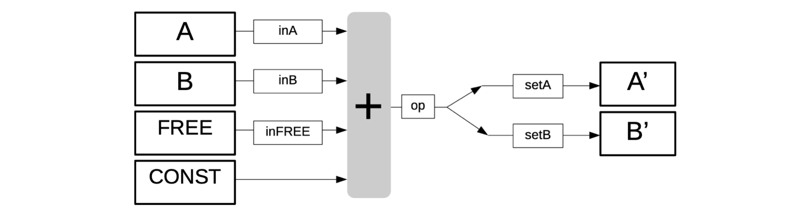
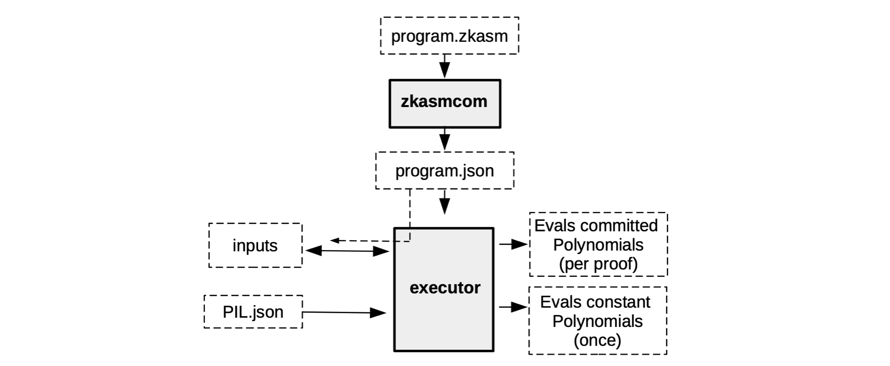
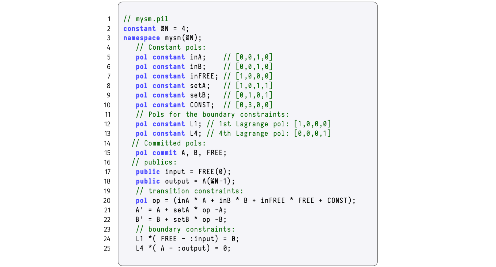

In this document we discuss how the correctness of the Execution Trace is ensured.

The first step is to build a mechanism for verifying correctness of the execution trace. This requires creating a set of arithmetic constraints that only hold true when the execution trace is correct. These arithmetic constraints are equations that registry values in any two consecutive rows of the correct execution trace, must satisfy.

Similar to the mFibonacci SM, where each state had to conform to polynomial identities, the arithmetic constraints of the generic state machine will be translated into polynomial identities and ultimately be translated into the PIL language.

## Constructing arithmetic constraints

Since these arithmetic constraints govern state transitions, they express the next state $\big(\mathtt{A'} ,\mathtt{B'}\big)$ in terms of the current state $\big(\texttt{A},\texttt{B}\big)$. That is, in terms of the execution trace, the new registry values are linear combinations of previous registry values, together with constants and free inputs.

We therefore need auxiliary columns for **selectors**. Like switches that can either be ON or OFF, selectors too can either have a value $\mathtt{1}$ or $\mathtt{0}$, depending on the instruction being executed.

In continuing with the previous example of a four-instruction state machine,

- We use selectors; $\texttt{inFREE}$, $\texttt{inA}$, $\texttt{inB}$, $\texttt{setA}$ and $\texttt{setB}$; corresponding to the columns; $\texttt{FREE}$, $\texttt{A}$, $\texttt{B}$, $\mathtt{A'}$ and $\mathtt{B'}$, respectively.

- If the instruction being executed involves a column $\texttt{X}$, then the corresponding selector $\texttt{inX}$ must have the value $\mathtt{1}$, otherwise $\texttt{inX}$ must be $\mathtt{0}$.

- If the instruction being executed moves the result of the computation into column $\mathtt{X'}$, then the corresponding selector $\texttt{setX}$ must have the value $\mathtt{1}$, otherwise $\texttt{setX}$ must be $\mathtt{0}$.

- Notice that $\texttt{CONST}$ does not need a selector. If a computation constant is not needed in an instruction, the corresponding value in the $\texttt{CONST}$ column is simply set to $\texttt{0}$.

The **arithmetic constraints** are therefore defined by the following linear combinations;

$$
\mathtt{A′ = A + setA \cdot \big( inA \cdot A + inB \cdot B + inFREE \cdot FREE + CONST - A \big)} \\ \tag{Eqn 1a}
$$

$$
\mathtt{B′ = B + setB \cdot \big( inA \cdot A + inB \cdot B + inFREE \cdot FREE + CONST - B \big)} \\ \tag{Eqn 1b}
$$

The figure below depicts the linear combinations of our state machine as an algebraic processor of sorts.

The vertical gray box (with the "+" sign) in the above figure denotes addition. It expresses forming linear combinations of some of the columns; $\texttt{FREE}$, $\texttt{A}$, $\texttt{B}$, or $\texttt{CONST}$. Each is either included or excluded from the linear combination depending on whether their corresponding selectors have the value $\mathtt{1}$ or $\mathtt{0}$. An extra register denoted by $\texttt{op}$ acts as a carrier of intermediate of the computation being executed and waiting to be placed in the correct output register (on the right in above figure), depending on the values of $\texttt{setA}$ and $\texttt{setB}$.

## Testing arithmetic constraints

We now test if the arithmetic constraints tally with each of the four instructions of our program.

1. **The first instruction: "$\mathtt{\$\{getAFreeInput()\} => A}$"**

    The first instruction involves a free input $7$ and this free input is moved into registry $\texttt{A}$, as its the next value. Therefore, by definition of the selectors, $\mathtt{inFREE = 1}$ and $\mathtt{setA = 1}$. Also, the value of the other selectors is $\texttt{0}$. Substituting these values in the above arithmetic constraints yields;

    $$
    \mathtt{A′ = A + 1 \cdot \big( 0 \cdot A + 0 \cdot B + 1 \cdot 7 + 0 - A \big) = A + (7 - A) = 7}\text{ }
    $$

    $$
    \mathtt{B′ = B + 0 \cdot \big( 0 \cdot A + 0 \cdot B + 1 \cdot 7 + 0 - B \big) = B}\qquad\qquad\qquad \\
    $$

    This illustrates that the value of the free input was moved into $\texttt{A}$, while $\texttt{B}$ remains unaltered. Hence, the first instruction was correctly executed.

2. **The second instruction: "$\mathtt{3 => B}$"**

    The second instruction involves the $\mathtt{CONST}$ column, and the constant value $\texttt{3}$ is moved into registry $\texttt{B}$, as its next value. Consequently, $\mathtt{CONST = 3}$ and $\mathtt{setB = 1}$. All other selectors have the value $\texttt{0}$. 
    
    Again, substituting these values in the arithmetic constraints yields;

    $$
    \mathtt{A′ = A + 0 \cdot \big( 0 \cdot A + 0 \cdot B + 0 \cdot FREE + 3 - A \big) = A}\qquad\qquad\qquad
    $$

    $$
    \mathtt{B′ = B + 1 \cdot \big( 0 \cdot A + 0 \cdot B + 0 \cdot FREE + 3 - B \big) = B + (3 - B) = 3}
    $$

    This shows that the value of $\texttt{A}$ was not changed, but the constant value $\mathtt{3}$  was moved into $\texttt{B}$. And thus, the second instruction was correctly executed.

3. **The third instruction, "$\mathtt{:ADD }$"**

    This instruction involves the registries $\texttt{A}$ and $\texttt{B}$, and the result is moved into registry $\texttt{A}$, as its the next value. This means, the values of the corresponding selectors are as follows; $\mathtt{inA = 1}$, $\mathtt{inB = 1}$ and $\mathtt{setA = 1}$.
    
    The arithmetic constraints become;

    $$
    \mathtt{A′ = A + 1 \cdot \big( 1 \cdot A + 1 \cdot B + 0 \cdot FREE + 0 - A \big) = A + (A + B - A) = A + B}\text{ }
    $$

    $$
    \mathtt{B′ = B + 0 \cdot \big( 1 \cdot A + 1 \cdot B + 0 \cdot FREE + 0 - B \big) = B}\qquad\qquad\qquad\qquad\quad
    $$

    The sum of the registry values in $\mathtt{A}$ and $\mathtt{B}$ was moved into $\texttt{A}$, while $\texttt{B}$ remains unmodified, proving that the third instruction was correctly executed.

4. **The fourth instruction, "$\mathtt{:END }$"**

    The fourth instruction moves the initial registry values (i.e., $\mathtt{A = 0}$ and $\mathtt{B_0 = 0}$) into registries $\texttt{A}$ and $\texttt{B}$, as their next values, respectively. As a result, values of the corresponding selectors are; $\mathtt{setA = 1}$ and $\mathtt{setB = 1}$.
    
    Substitutions into the arithmetic constraints give us the following;

    $$
    \mathtt{A′ = A + 1 \cdot \big( 0 \cdot A + 0 \cdot B + 0 \cdot FREE + 0 - A \big) = A - A = 0}
    $$

    $$
    \mathtt{B′ = B + 1 \cdot \big( 0 \cdot A + 0 \cdot B + 0 \cdot FREE + 0 - B \big) = B - B = 0} 
    $$

    Clearly, the next registry values of both $\mathtt{A}$ and $\mathtt{B}$ are reset to zeros as per the fourth instruction.

The execution trace can now be updated to reflect the selector columns, as shown below.

$$
\small
\begin{aligned}
\begin{array}{|l|c|c|c|c|c|c|c|}\hline
    \texttt{ }\texttt{ }\texttt{ }\texttt{ }\texttt{ }\texttt{ } \bf{Instructions } & \texttt{FREE} & \texttt{CONST}& \texttt{setB}& \mathtt{setA}& \texttt{inFREE}& \mathtt{inB} & \mathtt{inA} & \mathtt{A} & \mathtt{A'} & \mathtt{B} & \mathtt{B'} \\ \hline
    \texttt{ } \mathtt{\$\{getAFreeInput()\} => A} & \texttt{7} & \texttt{0} & \texttt{0} & \texttt{1} & \texttt{1} & \texttt{0} & \texttt{0} & \mathtt{0} & \mathtt{7} & \mathtt{0} & \mathtt{0} \\ \hline
    \texttt{ } \mathtt{3 => B} \qquad\qquad\qquad\qquad\quad & \texttt{0} & \texttt{3} & \texttt{1} & \texttt{0} & \texttt{0} & \texttt{0} & \texttt{0} & \mathtt{7} & \mathtt{7} & \mathtt{0} & \mathtt{3} \\ \hline
    \texttt{ } \mathtt{:ADD } \qquad\qquad\qquad\quad\quad\quad\text{ }\text{ } & \texttt{0} & \texttt{0} & \texttt{0} & \texttt{1} & \texttt{0} & \texttt{1} & \texttt{1} & \mathtt{7} & \mathtt{10} & \mathtt{3} & \mathtt{3} \\ \hline
    \texttt{ } \mathtt{:END } \qquad\qquad\qquad\quad\qquad\text{}\text{ }\text{ } & \texttt{0} & \texttt{0} & \texttt{1} & \texttt{1} & \texttt{0} & \texttt{0} & \texttt{0} & \mathtt{10} & \mathtt{0} & \mathtt{3} & \mathtt{0} \\ \hline
\end{array}
\end{aligned}
$$

## Remarks

1. The $\texttt{CONST}$ column stores the constants of the computation. It should however, not be mistaken for a constant polynomial. The term 'constant' refers to the fact that the column contains constants of the computations.

2. It shall be seen later, in our implementation of a state machine with jumps, that $\texttt{CONST}$ is in fact a committed polynomial rather than a constant polynomial.

3. All the operations in the constraints are carried out $\mathtt{\ modulo }$ the order $p$ of the prime field. The so-called **Goldilocks-like Field**, with $p = 2^{64} − 2^{32} +1$, is mainly used where 64-bit numbers suffice (see [Plonky2](https://github.com/mir-protocol/plonky2/blob/main/plonky2/plonky2.pdf)). Otherwise, the [BN128 field](https://iden3-docs.readthedocs.io/en/latest/iden3_repos/research/publications/zkproof-standards-workshop-2/baby-jubjub/baby-jubjub.html) is deployed.

In order to match the type of commitment scheme used in the zkEVM, these arithmetic constraints must first be expressed as polynomial identities, which are in turn compiled with PILCOM.

## Deeper context for the executor

Up to this stage, we have only mentioned that the SM Executor reads instructions in a program written in zkASM, and **it may take some free inputs in order to produce an execution trace**. There is however a lot more detail that goes into this process.

For example, the Executor does not really read the zkASM program as is. But rather, the zkASM program (which we name here, `program.zkasm`), is first compiled with a tool called $\bf{zkasmcom}$, into a JSON file (call the JSON file, `program.json`).

Also, **the free inputs may come in the form of another JSON file**, let's name it `input.json`. In addition, the Executor can read information in databases and receive relevant input such as the `PIL.json`.

See below diagram for a concise description of what the Executor does.

Although the execution trace is composed of the evaluations of the committed polynomials and the evaluations of the constant polynomials, the two evaluations do not happen simultaneously.

Instead, the constant polynomials are preprocessed only once, because they do not change and are specific for a particular state machine.

The committed polynomials, on the other hand, can vary. And are therefore only processed as and when their corresponding verifiable proof is required.

## Polynomial identities

For verification purposes, the execution trace needs to be interpolated into polynomial identities.

The general theory on interpolation of polynomials involves technical terms such as; Lagrange's interpolation, roots of unity and Fast Fourier Transforms. However, these concepts are not prerequisites because the way we construct the execution trace makes sure the polynomial identities follow readily from the arithmetic constraints.

In the above example of a zkASM program with four instructions, we can use the fourth-roots of unity $\mathcal{H} = \{ 1 = \omega^4, \omega, \omega^2, \omega^3 \} \subset \mathbb{F}_p$  to interpolate, such that the columns,

$$
\mathtt{ A, inA, setA, B, inB, setB, FREE, inFREE, CONST }
$$

correspond to polynomials in $\texttt{x}$ , where $\mathtt{x = \omega^i}$, written (without changing symbols) as,

$$
\mathtt{ A(x), inA(x), setA(x), B(x), inB(x), setB(x), FREE(x), inFREE(x), CONST(x)}.
$$

That is, according to the execution trace in Table 3 above, these polynomials are equivalent to the column-arrays, as follows,

$$
\begin{aligned}
\mathtt{ A = [0,7,7,10]}\text{ }\text{ } \iff\text{ } \ \mathtt{ A(x) = A(\omega^i) = A[i]}  \qquad\qquad\qquad\qquad\quad\text{ }\text{ }\text{ }  \\
\mathtt{ B = [0,0,3,3] } \text{ }\text{ } \iff\text{ } \  \mathtt{ B(x) = B(\omega^i) = B[i] }\qquad\qquad\qquad\qquad\qquad\text{}\text{ } \\
\mathtt{ inA = [0,0,1,1]\text{ }\text{ } \iff\text{ } \ \mathtt{ inA(x) = inA(\omega^i) = inA[i]}   }\qquad\qquad\quad\text{}\text{ } \\
\mathtt{ inB = [0,0,1,0] } \text{ }\text{ } \iff\text{ } \ \mathtt{inB(x) = inB(\omega^i) = inB[i]} \quad\text{}\text{}\qquad\qquad\text{ }\text{ }\text{}\text{ }\text{ }\text{ } \\
\mathtt{ setA = [1,0,1,1] \text{ }\text{ } \iff\text{ } \  \mathtt{ setA(x) = setA(\omega^i) = setA[i] } }\qquad\text{ }\text{ }\text{ }\text{ } \\
\mathtt{ setB = [0,1,0,1] } \text{ }\text{ } \iff\text{ } \ \mathtt{setB(x) = setB(\omega^i) = setB[i]} \qquad\qquad\text{}\\
\mathtt{ FREE = [7,0,0,0] }\text{ }\text{ } \iff\text{ } \  \mathtt{FREE(x) =  FREE(\omega^i) = FREE[i]}\qquad\qquad\text{} \\
\mathtt{ CONST = [1,0,0,0] }\text{ }\text{ } \iff\text{ } \  \mathtt{CONST(x) = CONST(\omega^i) = CONST[i]}\qquad\text{} \\
\text{ }\mathtt{ inFREE = [1,0,0,0] } \text{ }\text{ } \iff\text{ } \ \mathtt{inFREE(x) = inFREE(\omega^i) = inFREE[i]} \\
\end{aligned}
$$

The arithmetic constraints seen above as $\bf{Eqn\ 1}$, are easily written as polynomial identities, as follows,

$$
\begin{aligned}
\mathtt{A(x\omega) - \big(A(x) + setA(x) \cdot \big( op(x) - A(x) \big) \big) = 0} \\
\mathtt{B(x\omega) - \big( B(x) + setB(x) \cdot \big(  op(x) - B(x) \big) \big) = 0} 
\end{aligned}
$$

where $\mathtt{op(x) = inA(x) \cdot A(x) + inB(x) \cdot B(x) + inFREE(x) \cdot FREE(x) + CONST(x)}$.

As far as **boundary constraints** are concerned, we can, for instance,

- make both the free input and the last registry value of $\mathtt{A}$ public,

- create public 'variables'; $\texttt{input}$ and $\texttt{output}$,

- set boundary constraints,
  $$
  \mathtt{L1(x) \cdot \big(FREE(\omega^0) - input\big) = 0} \\
  \mathtt{L2(x) \cdot \big(A(\omega^{3}) - output\big) = 0}\quad \\
  $$
  where $\mathtt{L1(x)}$ and $\mathtt{L2(x)}$ are precomputed constant polynomials.
   In fact, $\mathtt{L1(x) = [1,0,0,0]}$ and  $\mathtt{L2(x) = [0,0,0,1]}$.

In the big scheme of things, these are Lagrange polynomials emanating from interpolation. Verification relies on the fact that: these polynomial identities, including the boundary constraints, hold true *if, and only if* the execution trace is correct and faithful to the instructions in the zkASM program.

The PIL description of the SM Executor, reading instructions from the zkASM program with four instructions, is depicted in the figure provided below.

