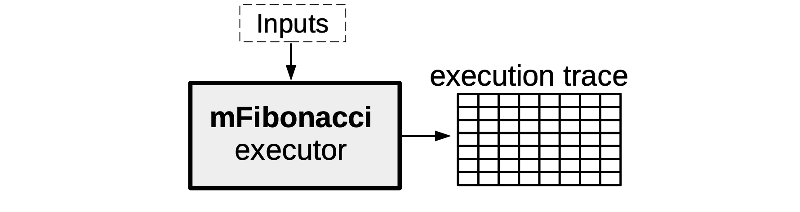
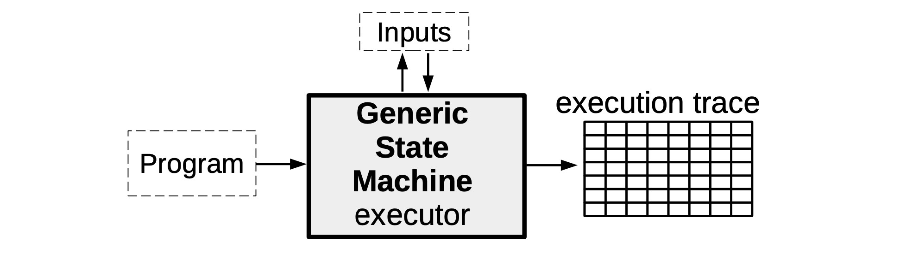

In this document is an introduction of the basic components of a generic state machine.

Unlike the mFibonacci state machine, which is an implementation of one specific computation, we now describe a generic state machine that can be instantiated with various computations of the user's choice.

The idea here is to create a state machine that behaves like a processor of sorts. In as much as a processor has registries and a clock, so is our generic state machine. It receives instructions in the form of programs written in Assembly, and makes state transitions at each clock in accordance with these instructions.

See Figure below, for such a state machine with registries $\texttt{A}$ and $\texttt{B}$, and a state $\big(\texttt{A}^{\texttt{i}},\texttt{B}^{\texttt{i}}\big)$ that changes to another state $\big(\texttt{A}^{\texttt{i+2}},\texttt{B}^{\texttt{i+2}}\big)$ in accordance with two instructions, $\texttt{Instruction}_{\texttt{i}}$ and $\texttt{Instruction}_{\texttt{i+1}}$.

The aim with this document is to explain how the machinery used in the mFibonacci SM; to execute computations, produce proofs of correctness of execution, and verify these proofs; can extend to a generic state machine.

Think of our state machine as being composed of two parts; the part that has to do with generating the execution trace, while the other part is focused on verifying that the executions were correctly executed.

- The former part is more like the "software" of the state machine, as it is concerned with interpreting program instructions and correctly generating the execution trace. A novel language dubbed the **Zero-knowledge Assembly Language** (zkASM) is used in this part.

- But the latter part is more like the "hardware" as it consists of a set of arithmetic constraints (or their equivalent, polynomial identities) that every correctly generated execution trace must satisfy. Since these arithmetic constraints are transformed into polynomial identities (via an interpolation process), they are described in a novel language called the **Polynomial Identity Language** (PIL).

## Generic SM executor

As seen with the mFibonacci SM, the SM executor takes certain inputs together with the description of the SM, in order to produce the execution trace specifically corresponding to these inputs.

The main difference, in the Generic State Machine case, is the inclusion of a program which stipulates computations to be carried out by the SM executor. These computations could range from a simple addition of two registry values, or moving the value in registry $\texttt{A}$ to registry $\texttt{B}$, to computing some linear combination of several registry values.

So then, instead of programming the SM executor ourselves with a specific set of instructions as we did with the mFibonacci SM, the executor of a Generic SM is programmed to read arbitrary instructions encapsulated in some program (depending on the capacity of the SM or the SM's context of application). As mentioned above, each of these programs is initially written, not in a language like Javascript, but in the zkASM language.

### State machine instructions

We continue with the state machine model shown in Figure 1 above; a state machine with two registries $\texttt{A}$ and $\texttt{B}$, and executes computations as per instruction(s) specified in a program.

Here is an example of a program containing four instructions, expressed in the zkASM language,

$$
\begin{aligned}
\begin{array}{|l|c|}
\hline
\texttt{ } & \bf{Instructions } \text{ }\text{ }\text{ }\text{ } \\ \hline
\texttt{ } & \mathtt{\$\{getAFreeInput()\} => A} \text{ }\\ \hline
\texttt{ } & \mathtt{3 => B} \qquad\qquad\qquad\qquad\quad \\ \hline
\texttt{ } & \mathtt{:ADD } \qquad\qquad\qquad\quad\quad\quad\text{ }\text{ } \\ \hline
\texttt{ } & \mathtt{:END } \qquad\qquad\qquad\quad\qquad\text{}\text{ }\text{ } \\ \hline
\end{array}
\end{aligned}
$$

Suppose the state machine starts with the initial state $\big(\texttt{A},\texttt{B}\big) = \big(\texttt{0},\texttt{0} \big)$. The SM executor sequentially executes each instruction as follows;  

- Firstly, "$\mathtt{\$\{getAFreeInput()\} => A}$" is a request to execute the function $\texttt{getAFreeInput()}$. That is, the executor must get a free input value and move it into register $\texttt{A}$. Note that "free input" simply means the input can be any numeric value.
- Secondly, "$\mathtt{3 => B}$" means the executor must move the constant value $\mathtt{3}$ into register $\mathtt{B}$. Since the value $\texttt{3}$ is part of an instruction, it is referred to as the *constant of the execution*. Also, it is called a constant because, for a given program, it cannot be freely chosen.
- Thirdly, "$\mathtt{:ADD }$" instructs the executor to compute the sum of registry value in $\mathtt{A}$ with the one in $\mathtt{B}$, and save the output into register $\mathtt{A}$.
- Lastly, "$\mathtt{:END }$" tells the executor to reset the registries $\mathtt{A}$ and $\mathtt{B}$ to their initial values in the next state, and thus achieving the cyclic behaviour.

### Execution trace

In addition to carrying out computations as per instructions in programs, the executor must also generate the trace of all state transitions, called the **Execution Trace**.

Consider, as an example, the execution trace the executor produces for the above program of four instructions. Suppose the free input value used is $7$. The generated execution trace can be depicted in tabular form as shown below.

$$
\begin{aligned}
\begin{array}{|l|c|c|c|c|c|c|c|}\hline
\texttt{ } & \bf{Instructions } \text{ }\text{ }\text{ }\text{ } & \texttt{FREE} & \texttt{CONST}& \texttt{A}& \mathtt{A'}& \texttt{B}& \mathtt{B'} \\ \hline
\texttt{ } & \mathtt{\$\{getAFreeInput()\} => A} \text{ } & \texttt{7} & \texttt{0} & \texttt{0} & \texttt{7} & \texttt{0} & \texttt{0}\\ \hline
\texttt{ } & \mathtt{3 => B} \qquad\qquad\qquad\qquad\quad & \texttt{0} & \texttt{3} & \texttt{7} & \texttt{7} & \texttt{0} & \texttt{3} \\ \hline
\texttt{ } & \mathtt{:ADD } \qquad\qquad\qquad\quad\quad\quad\text{ }\text{ } & \texttt{0} & \texttt{0} & \texttt{7} & \texttt{10} & \texttt{3} & \texttt{3} \\ \hline
\texttt{ } & \mathtt{:END } \qquad\qquad\qquad\quad\qquad\text{}\text{ }\text{ } & \texttt{0} & \texttt{0} & \texttt{10} & \texttt{0} & \texttt{3} & \texttt{0} \\ \hline
\end{array}
\end{aligned}
$$

This execution trace utilises a total of six columns. Perhaps the use of the columns corresponding to the two registries $\texttt{A}$ and $\texttt{B}$, as well as the columns for the constant $\texttt{CONST}$ and the free input $\texttt{FREE}$, are a bit obvious. But the reason for having the other two columns, $\mathtt{A'}$ and $\mathtt{B'}$, may not be so apparent.

The reason there are two extra columns, instead of only four, is the need to capture each state transition in full, and per instruction. The column labelled $\mathtt{A'}$ therefore denotes the next state of the registry $\mathtt{A}$, and similarly, $\mathtt{B'}$ denotes the next state of the registry $\mathtt{B}$. This ensures that each row of the execution trace reflects the entire state transition pertaining to each specific instruction.

The execution trace is therefore read *row-by-row* as follows,

- The first row, which is per instruction "$\mathtt{\$\{getAFreeInput()\} => A}$", reads thus: The function $\texttt{getAFreeInput()}$ was executed, by getting the free input value of $7$, which is to be moved into the registry $\texttt{A}$ as the next registry value.
- The second row, which is per instruction "$\mathtt{3 => B}$", reads as follows: A constant value $\texttt{3}$ is to be moved into the registry $\texttt{B}$ as the next registry value, and the registry $\texttt{A}$ now reflects the value $\texttt{7}$ as expected per previous instruction.
- The third row, which is per instruction "$\mathtt{:ADD }$", indicates that: The executor executed the sum of registry values in $\mathtt{A}$ and $\mathtt{B}$ $\big( \text{i.e.},\ \mathtt{7 + 3 = 10}\big)$ and the output $\mathtt{10}$ is to be moved into register $\mathtt{A}$, as the next value of the $\mathtt{A}$ registry.
- The last row, which is per instruction "$\mathtt{:END }$", tells us that: The executor has updated the registry value in $\mathtt{A}$ according to the previous instruction, and will reset the registries $\mathtt{A}$ and $\mathtt{B}$ to zeros (their initial values) as their next registry values.

Note that, for this specific program, a change in the free input from $7$ to another number would obviously yield a different execution trace, yet without violating the first instruction.
