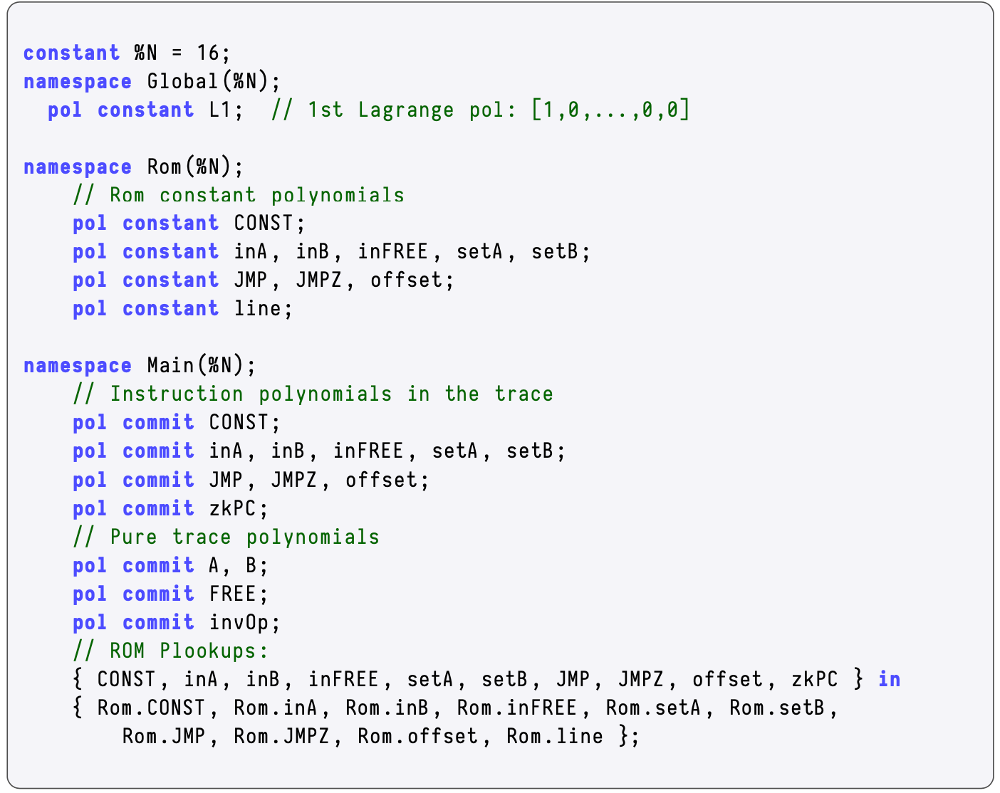

The **Main State Machine Executor** sends various instructions to the secondary state machines within the zkProver. Although secondary state machines specialize in specific types of computations, they frequently use [**Plookup**](https://eprint.iacr.org/2020/315.pdf) in their PIL codes to complete tasks mandated by the Main SM Executor.

This subsection is part of the Generic SM and its goal is to define Plookup before showing how it is used in PIL verification.

## What is Plookup?

Plookup was described by the original authors in [GW20](https://eprint.iacr.org/2020/315.pdf) as a protocol for checking whether values of a committed polynomial, over a multiplicative subgroup $\text{H}$ of a finite field  $\mathbb{F}$, are contained in a vector  $\mathbf{t} \in \mathbb{F}^d$  that represents values of a table  $\mathcal{T}$. More precisely, Plookup is used to check if certain evaluations of some committed polynomial are part of some row $\mathbf{t}$ of a lookup table  $\mathcal{T}$.

One particular use case of this primitive is: checking whether all evaluations of a polynomial $f(x)$, restricted to values of a multiplicative subgroup $\text{H} \subset \mathbb{F}$, fall in a given range $\{ 0 , 1 , \dots , M \}$. i.e., proving that, for every $z \in \text{H}$, we have $\mathbf{f(z) \in \{ 0 , 1 , \dots , M \}}$.

Plookup's strategy for soundness depends on a few basic mathematical concepts described below.

## Notations and Preliminaries

### Sets And Multisets

Recall that a **set** is a collection of distinct objects, called elements, where repetitions and order of elements are disregarded. That is, the set  $\{ 1 , 3 , 7 \}$  is the same set as  $\{ 3 , 7 , 1 , 7 , 1 , 1 \}$.

Yet, as **multisets**, $\{ 1 , 3 , 7 \}$ is not the same as $\{ 3 , 7 , 1 , 7 , 1 , 1 \}.$ It is because multisets take into consideration all instances of an element.

Given a multiset $\mathbf{s}$, we define **multiplicity** to be the number of all instances of an element.

So, in the multiset  $\{ 3 , 7 , 1 , 7 , 1 , 1 \}$; the element  $3$  has multiplicity 1, while  $7$  is of multiplicity  2 , and lastly, $1$  has multiplicity  3.

Therefore, a **set** can be described as a collection of distinct objects where multiplicity and ordering of objects have no significance.

Multisets are similar to sets in that they also do not respect the ordering of elements. That is, $\{ 1 , 3 , 1 , 7 \}$ and $\{ 1, 7 , 1 , 3 \}$ represent the same multiset, because they both contain the same elements, each with the same multiplicity.

Given multisets $\mathbf{t} = \{ 1 , 3 , 7 \}$ and $\mathbf{s} = \{ 3 , 7 , 1 , 7 , 1 , 1 \}$,  $\mathbf{s}$  can be **sorted by** $\mathbf{t}$ as follows, $\mathbf{s} = \{ 1 , 1 , 1 , 3 , 7 , 7 \}$. That is, "$\mathbf{s}$ **sorted by** $\mathbf{t}$" means the elements of $\mathbf{s}$ are ordered according to the order they appear in $\mathbf{t}$, without losing their multiplicity.

### Sorted Multisets And Set Differences

Unless otherwise stated, all sorted multisets will henceforth be **sorted by $\mathbb{N}$**, where $\mathbb{N}$ is the set of natural numbers $\{1, 2, 3, \dots \}$.

For any given sorted multiset $\mathbf{s} = \{a_1 , a_2 , \dots , a_n\}$, define **the set of differences** of $\mathbf{s}$ as the set of non-zero differences $\{a_2 - a_1 , a_3 - a_2 , \dots , a_n - a_{n-1}\}$. That is, zero-differences, $a_i - a_{i-1} = 0$, are discarded.

Take as examples the following sorted multisets: $\mathbf{t} = \{1, 3, 7\}$, $\mathbf{s} = \{1 , 1 , 1 , 3 , 7 , 7\}$ and $\mathbf{r} = \{2, 6, 6, 6, 8\}$. These three multisets have the same set of differences, which is $\{2, 4\}$.

Although $\mathbf{r}$ has the same set of differences as $\mathbf{s}$ and $\mathbf{t}$, note that the differences appear in a different order; 4 appeared first then 2.

#### Testing For Containment

Let $\mathbf{s}$ and $\mathbf{t}$ be ordered multisets, $\mathbf{s} = \{s_1 , s_2 , \dots , s_d\}$ and none of the elements of $\mathbf{t}  = \{t_1 , t_2 , \dots , t_n\}$ are repeated.

It can be observed that:

- If $\mathbf{s} \subset \mathbf{t}$ and $s_d = t_n$, then $\mathbf{s}$ and $\mathbf{t}$ have the same set of differences and the differences appear in the same order.

- If $\mathbf{s}$ and $\mathbf{t}$ have the same set of differences except for the differences' order of appearance, then $\mathbf{s} \not\subset \mathbf{t}$.

- If $\mathbf{s}$ and $\mathbf{t}$ have the same set of differences and the differences appear in the same order, then $\mathbf{s} \subset \mathbf{t}$.

It follows from these three observations that the criteria for testing containment "$\mathbf{s} \subset \mathbf{t}$" boils down to checking:

1. The **equality of the sets of differences**, and
2. The **order in which the differences ($\mathbf{a_j - a_{j-1}}$) appear in both multisets are the same**.

#### Testing For Repeated Elements

Consider again the ordered multisets: $\mathbf{t} = \{t_1 , t_2 , \dots , t_n\}$ and $\mathbf{s} = \{s_1 , s_2 , \dots , s_d\}$.

If $\mathbf{s}$ has some repeated elements, $s_i = s_{i+1}$ for some $1 \leq i \leq n$, then these can be tested by comparing randomized sets of differences.

A **randomized set of differences** related to $\mathbf{s}$ is created by selecting a random field element $\beta \in \mathbb{F}$ and defined as the set $\{s_i + \beta\cdot s_{i+1}\ |\ 1 \leq i < d \}$.

So, instead of a pair $(s_i, s_{i+1})$ of repeated elements yielding a difference of zero because $s_i = s_{i+1}$, they yield

$$
s_i + \beta \cdot s_{i+1} = (1 + \beta)\cdot s_i
$$

in the setting of randomized set of differences.

This property of repeated elements yielding a multiple of $(1 + \beta)$, characterizes repeated elements in ordered multisets. Consequently, when computing randomized set of differences, repeated elements can be identified by these multiples of $(1 + \beta)$.

A test can therefore be coined using a **grand product argument** akin to the one used in PLONK’s permutation argument [GWC19](https://eprint.iacr.org/2019/953).

### Vectors

The above concepts defined for multisets apply similarly to vectors, and the Plookup protocol also extends readily to vectors.

A **vector** is a collection of ordered field elements, for some finite field $\mathbb{F}$, and it is denoted by $\mathbf{a} = ( a_1 , a_2 , \dots , a_n )$.

A vector $\mathbf{a} = ( a_1 , a_2 , \dots , a_n )$ is **contained** in a vector $\mathbf{b} = ( b_1 , b_2 , \dots , b_d )$, denoted by $\mathbf{a} \sub \mathbf{b}$ , if each $a_i \in  \{ b_1 , b_2 , \dots , b_d \}$ for  $i \in \{ 1 , 2 , \dots , n \}$.

The **vector of differences** of a given vector $\mathbf{a} = ( a_1 , a_2 , \dots , a_n )$  is defined as the vector $\mathbf{a'} = (a_2 - a_1, a_3 - a_2, \dots , a_n - a_{n-1})$, which has one less component (or element) compared to $\mathbf{a}$. That is, $|\mathbf{a'}| = n - 1$  because $|\mathbf{a}| = n$.

Given a random scalar $\beta$ in a field $\mathbb{F}$ and a vector $\mathbf{a} = ( a_1 , a_2 , \dots , a_n )$, a **randomized vector of differences** of $\mathbf{a}$ is defined as $\mathbf{a'} = ( a_1 + \beta\cdot a_2 , a_2 + \beta\cdot a_3 , \dots , a_{n-1} + \beta\cdot a_{n})$.

The **concatenation** of vectors $\mathbf{a} = (a_1 , a_2 , \dots , a_n)$ and $\mathbf{b} = ( b_1 , b_2 , \dots , b_d )$ is the vector $(\mathbf{a}, \mathbf{b}) = (a_1 , a_2 , \dots , a_n , b_1 , b_2 , \dots , b_d)$, and it has  $n + d$  components.

## Plookup Protocol

The context of Plookup is within a **Polynomial Commitment Scheme**, where a party $\mathcal{P}$ ,called the **Prover**, seeks to convince the second party $\mathcal{V}$, called the **Verifier**, that it knows a certain polynomial.

The protocol, as described in the [Plookup paper](https://eprint.iacr.org/2020/315.pdf), mentions a third party called the **Ideal Party**, denoted by $\mathcal{I}$,  which is also called the **Trusted Party**.

It is this **Trusted Party** who is responsible for generating all the proof/verification system parameters. Among these parameters are the so-called **preprocessed** polynomials.

In the case of a non-interactive proof/verification system, **the Trusted Party is equipped so as to act as an intermediary between the Prover and the Verifier**.

1. The protocol starts with the **generation of preprocessed polynomials** $\{t\}$ and **describing them as a Lookup Table**.

2. **Prover submits messages in the form of polynomials** $\{f\}$ expressed either as multisets or vectors.

3. The **Verifier also sends randomly selected field elements** $\{\alpha_i\} \subset \mathbb{F}$, called challenges.

4. The **Prover then evaluates a special polynomial** $Z[X]$ on the $\alpha_i$'s and sends them to $\mathcal{I}$.

5. The **Verifier subsequently requests** $\mathcal{I}$ **to check if certain polynomial identities** $\{F \equiv G\}$ **hold true**.

6. The **Verifier accepts the Prover's submissions as true if all identities hold true, otherwise it rejects**.

The polynomials $F$ and $G$ in the polynomial identities $\{F \equiv G\}$ are bi-variate polynomials in $\beta$ and $\gamma$, related to randomized sets of differences associated with $\{f\}$ and $\{t\}$. They are defined in terms of grand product expressions seen here,

$$
\begin{aligned}
F(\beta, \gamma) := (1+\beta)^n \cdot \prod_{i \in [n]} (\gamma + f_i) \prod_{i \in [d-1]} (\gamma (1+\beta) + t_i + \beta t_{i+1}) \\
G(\beta, \gamma) := \prod_{i\in[n+d-1]}(\gamma(1+\beta) + s_i + \beta s_{i+1})
\end{aligned}
$$

where $\beta$ and $\gamma$ are the randomly selected field elements.

The Plookup protocol boils down to proving that the two polynomials $F$ and $G$ are the same by comparing vectors of their evaluations and multiplicities of elements in those vectors. Simply put, it checks if two polynomials are the same **up to multiplicities** of elements in their witness vectors.

!!!info
     Plookup Optimization Strategies

     - Using randomized sets of differences
     - Soundness is backed by the **Schwarz-Zippel Lemma**
     - Deploying the **grand product argument** which describes the polynomials $F$ and $G$ appearing in the polynomial identities
     - Concatenation of witness vectors with the LUT vectors 

### Plookup in PIL

The test for whether the polynomial identities $\{F \equiv G\}$ hold true, is based on the following Lemma (viz. Claim 3.1 as stated and proved in Pages 4 and 5 of the [Plookup paper](https://eprint.iacr.org/2020/315.pdf)).

$\mathbf{Lemma\ 1}.$ The polynomial identities $\{F \equiv G\}$ hold true  *if, and only if*,  $f \subset t$ and $s = (f,t)$, which is the concatenation of $f$ and $t$, is sorted by $t$.

A Plookup applies to Polynomial Commitment Scheme settings, where the polynomials are expressed as vectors; $t$, $f$ and $s = (f,t)$. It is therefore a test of inclusion, denoted by $f \subset t$.

In the zkEVM setting, Plookup typically appears in PIL code as:

$$
\{f_1, \dots , f_m \} \texttt{ in } \{t_1, \dots , t_m \}
$$

where "$\texttt{in}$" is a PIL keyword for set inclusion, $f \subset t$.

#### Application of Plookup in PIL

In the Generic state machine, recall [polynomials that define instructions](exec-trace-correct.md#polynomial-identities); $\texttt{CONST}$, $\texttt{inA}$, $\texttt{inB}$, $\texttt{inFREE}$, $\texttt{setA}$, $\texttt{setB}$, $\texttt{JMP}$, $\texttt{JMPZ}$, $\texttt{offset}$ and $\texttt{line}$.

The polynomials; $\texttt{A}$, $\texttt{B}$, $\texttt{FREE}$ and $\texttt{invOp}$; are only used during execution, and therefore do not form part of the instructions.

When verifying correct execution, there is a need to check if the combination of committed polynomials,

$$
\{\texttt{CONST}, \texttt{inA}, \texttt{inB}, \texttt{inFREE}, \texttt{setA}, \texttt{setB}, \texttt{JMP}, \texttt{JMPZ}, \texttt{offset}, \texttt{zkPC} \}
$$

is one of the valid combinations of the ROM instructions,

$$
\{ \texttt{Rom.CONST},\ \texttt{Rom.inA},\ \texttt{Rom.inB},\ \texttt{Rom.inFREE},\ \texttt{Rom.setA},\ \texttt{Rom.setB},\ \texttt{Rom.JMP},\\
 \texttt{Rom.JMPZ},\ \texttt{Rom.offset},\ \texttt{Rom.line} \}.
\\
$$

**PIL uses Plookup to carry out this check.** This appears at the last three lines of the PIL code for the Generic state machine, shown in the below figure.

Recall that the ROM's polynomial counterpart to the $\texttt{zkPC}$ is the $\texttt{line}$.

### Role in zkEVM

Plookup instructions appear in the PIL codes of state machines in the zkEVM. Plookup is used by some state machines to ensure that certain output values are included in a given lookup table. Plookup is useful when set inclusion must be verified.

The diagram below depicts the extensive role that Plookup plays in the zkProver's secondary state machines.

