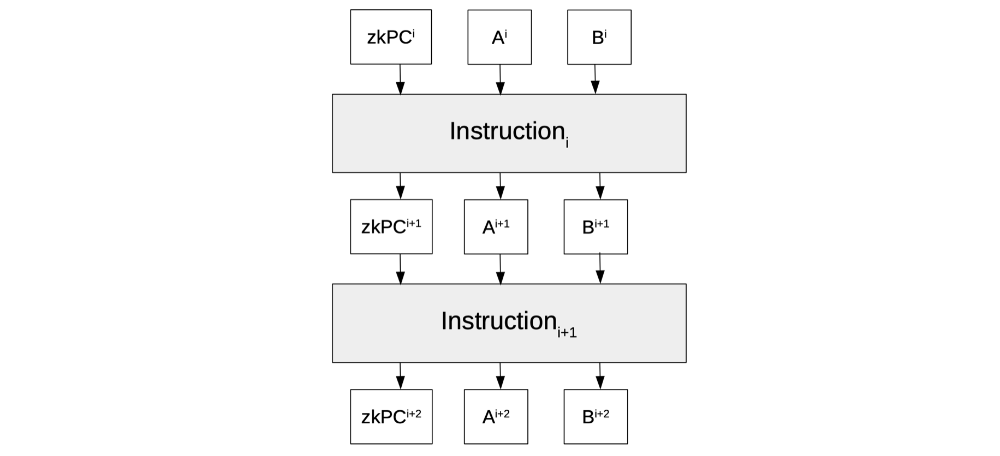
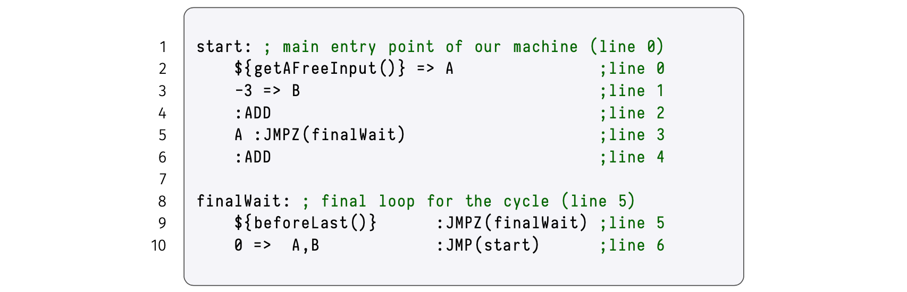

## Checking sequence of instructions

In order to keep track of which line of the program is currently being executed, a new registry called "Program Counter" is added to the state machine.

We denote it by $\texttt{zkPC}$ because it is verified in a zero-knowledge manner.

The $\texttt{zkPC}$ is therefore a new column of the execution trace and it contains, at each clock, the line in the zkASM program of the instruction being executed.



In addition to the $\texttt{JMPZ(addr)}$, an unconditional jump instruction $\texttt{JMP(addr)}$ is allowed in the zkASM program.

Unlike the $\texttt{JMPZ(addr)}$ instruction, when the state machine executes $\texttt{JMP(addr)}$, it must jump to the line $\texttt{addr}$, irrespective of what the value of $\texttt{op}$ is.

### Program Counter constraint related to JMP

This is how the $\texttt{JMP(addr)}$ instruction is implemented: A new selector called $\texttt{JMP}$ is added, as a column to the execution trace. And, the Program Counter $\texttt{zkPC}$ now uses the following identity to keep track of the correct line of the assembly program to be executed next;
$$
\mathtt{zkPC' = (zkPC+1)+JMP \cdot \big(addr−(zkPC+1)\big)} \tag{Eqn 0*}
$$
$\texttt{JMP}$ therefore acts as a 'flag' where;

- $\mathtt{zkPC' =  (zkPC+1)+ 0 \cdot \big(addr−(zkPC+1)\big) = zkPC+1}$, if $\texttt{JMP}$ is not activated (i.e., if $\texttt{JMP}$ is $\mathtt{0}$), or
- $\mathtt{zkPC' = (zkPC+1)+ 1 \cdot \big(addr−(zkPC+1)\big) = addr}$, if $\texttt{JMP}$ is activated (i.e., if $\texttt{JMP}$ is $\mathtt{1}$).

Note that execution continues with the next chronological line of instruction $\texttt{zkPC+1}$ when $\texttt{JMP}$ is $\mathtt{0}$, but otherwise proceeds to execute the instruction in line number $\texttt{addr}$.

### Program Counter constraint related to JMPZ

The $\texttt{JMPZ(addr)}$ similarly needs a selector to be added as an extra column to the execution trace, call it $\texttt{JMPZ}$.

Since the $\texttt{JMPZ(addr)}$ instruction is executed only on condition that $\texttt{op}$ is zero, we introduce a flag called $\mathtt{isZero}$, such that;
$\mathtt{isZero = 1}$ if $\texttt{op = 0}$, and $\mathtt{isZero = 0}$ if $\mathtt{op \not= 0}$.
This means $\texttt{op}$ and $\mathtt{isZero}$ satisfy the following constraint,

$$
\mathtt{isZero \cdot op = 0}. \qquad\qquad\qquad \tag{Eqn 1*}
$$

Note that $\texttt{op}$ is a field element, and every non-zero element of the prime field $\mathbb{F}_p$ has an inverse. That is, $\texttt{op}^{-1}$ exists *if and only if* $\mathtt{op \not= 0}$. The following constraint together with $\text{Eqn 1*}$ can be tested to check whether  $\texttt{op}$ and $\mathtt{isZero}$ are as required,

$$
\mathtt{isZero\ := (1 − op \cdot op^{−1})} \qquad \tag{Eqn 2*}
$$

Since $\mathtt{JMPZ = 1}$ only if $\texttt{JMPZ(addr)}$ is the very instruction in the line currently being executed, and $\mathtt{zkPC' = addr}$  only if  $\mathtt{isZero = 1}$. It follows that the factor  $(\mathtt{JMPZ \cdot isZero})$ $\mathtt{ = 1}$  only if both  $\texttt{JMPZ}$  $\mathtt{= 1}$  and $\mathtt{isZero}$ $\mathtt{= 1}$ hold true.

Hence, the following constraint enforces the correct sequence of instructions when $\texttt{JMPZ}$ is executed;

$$
\mathtt{zkPC' = (zkPC+1)+(JMPZ \cdot isZero) \cdot \big(addr−(zkPC+1)\big)}\quad \tag{Eqn 3*}
$$

In order to ascertain correct execution of the $\texttt{JMPZ(addr)}$ instruction, it suffices to check the above three constraints; $\text{Eqn 1*}$, $\text{Eqn 2*}$ and $\text{Eqn 3*}$.

Note that $\mathtt{op^{−1}}$ is not part of any instruction. The evaluations of $\mathtt{op^{−1}}$ therefore have to be included in the execution trace as a committed polynomial, and thus enables checking the first identity, $\text{Eqn 1*}$.

Most importantly, we rename the polynomial $\mathtt{op^{−1}}$ as $\texttt{invOp}$.

### Program Counter constraint related to JMP and JMPZ

All four constraints, $\text{Eqn 0*}$, $\text{Eqn 1*}$, $\text{Eqn 2*}$ and $\text{Eqn 3*}$ can be merged as follows;

$$
\mathtt{isZero\ := (1 − op \cdot op^{−1})},\qquad\qquad\qquad\qquad\text{ }\qquad \\
\mathtt{isZero \cdot op = 0},\qquad\qquad\qquad\qquad\qquad\qquad\qquad\quad \\
\mathtt{doJMP := JPMZ \cdot isZero + JMP}, \qquad\qquad\qquad\qquad\quad \\
\mathtt{zkPC′ = (zkPC+1)+doJMP \cdot \big(addr−(zkPC+1)\big)} \tag{Eqn 4*}
$$

Define "$\texttt{addr}$" as an intermediate polynomial,

$$
\mathtt{ addr := offset}, \tag{Eqn **}
$$

where $\texttt{offset}$ is provided as part of the jump instructions, $\texttt{JMPZ(addr)}$ and $\texttt{JMP(addr)}$.

We now have the following new columns in the execution trace;

$$
\begin{array}{|l|c|c|c|c|c|c|c|}\hline
\mathtt{zkPC} & \mathtt{JMP} & \mathtt{JMPZ} & \mathtt{invOp} & \mathtt{offset}\\\hline
\quad\mathtt{\dots\ } & \mathtt{\dots } & \mathtt{\dots} & \mathtt{\dots} & \mathtt{\dots}\\\hline
\quad\mathtt{\dots} &\mathtt{\dots} & \mathtt{\dots} & \mathtt{\dots} & \mathtt{\dots}\\\hline
\quad\mathtt{\dots} & \mathtt{\dots} & \mathtt{\dots} & \mathtt{\dots} & \mathtt{\dots}\\\hline
\quad\mathtt{\dots} & \mathtt{\dots} & \mathtt{\dots} & \mathtt{\dots} & \mathtt{\dots}\\
\end{array}
$$

With the intermediate definition in $\text{Eqn **}$ , we are preparing the path to expanding the $\texttt{addr}$ definition, for example, to include other sources (apart from instructions) from which to get the destination address in jumps.

## Correct program ending with a loop

We have previously resorted to ending our program by repeating the "$\texttt{:END}$" instruction. This was not the best solution.

To properly finish our programs, we need to ensure that the execution trace generated from the assembly is cyclic.

We therefore utilise a loop while the current $\texttt{line}$ is less than $\mathtt{N-1}$, a step before the last step of the execution trace. That is, before jumping back to the start, with the $\texttt{JMP(start)}$ instruction, the current $\texttt{line}$ is checked with the function "$\texttt{beforeLast()}$".

So, we query the executor for when the execution trace is at its last but one row, with the following line of code,

```$beforeLast()    :JMPZ(finalWait);```

The assembly program uses labels instead of explicit line numbers, hence conforming to how assembly programs are typically written. Labels are convenient because with them, the assembly compiler can take care of computing actual line numbers. For instance, as in Figure 8 below; $\mathtt{start}$ is line $\mathtt{0}$ and $\mathtt{finalWait}$ is line $\mathtt{5}$.



## Commentary on the execution trace

The intention here to give a step-by-step commentary on the execution trace for the Assembly code in Figure 8 above, for a free input equal to $\mathtt{3}$ and a trace size (interpolation size) equal to $\texttt{N = 8}$.

We show the values corresponding to each $\texttt{step}$ of the execution trace, particularly for,

- The committed polynomials that form part of the instruction; $\texttt{CONST}$, $\texttt{offset}$, $\texttt{JMP}$, $\texttt{JMPZ}$, $\texttt{setB}$, $\texttt{setA}$, $\texttt{inFREE}$,  $\texttt{inB}$, $\texttt{inA}$, $\texttt{zkPC}$ and $\mathtt{zkPC'}$.
- The committed polynomials that are only part of the trace; $\texttt{FREE}$, $\texttt{A}$, $\mathtt{A'}$, $\texttt{B}$, $\mathtt{B'}$ and  $\texttt{invOp}$.
- The intermediate polynomials $\texttt{Im}$, which are just intermediate definitions; $\texttt{op}$, $\texttt{isZero}$ and $\texttt{doJMP}$.

### Step 0: "getAFreeInput()=>A"

Since the instruction here at $\texttt{Step}$ $\mathtt{0}$ (corresponding to $\texttt{line}$ $\texttt{0}$ of the Assembly code) requires a free input $\mathtt{3}$ to be taken and moved into the registry $\mathtt{A}$. The values of the involved polynomials are therefore;

$$
 \mathtt{inFREE = 1},\ \mathtt{FREE = 3},\ \mathtt{setA = 1},\ \mathtt{A' = 3}\ \texttt{and}\ \mathtt{CONST = 0}.
$$

As a result,

$$
\mathtt{op\ =\ inA \cdot A\ +\ inB \cdot B\ +\ inFREE \cdot FREE\ +\ CONST = 0 \cdot A\ +\ 0 \cdot B\ +\ 1 \cdot 3\ +\ 0\ = 3}
$$

and $\mathtt{invOp = 3^{-1}}$.

Regarding the Program Counter; First note that initially $\mathtt{zkPC = 0}$. And, since $\mathtt{op = 3}$  and $\mathtt{invOp = 3^{-1}}$, then

$$
\mathtt{isZero\ := (1 − op \cdot op^{−1}) = (1 − 3 \cdot 3^{−1}) = 0}.\qquad\qquad\qquad\qquad\text{ }\qquad \\
$$

Also, since there are no jumps in the instruction, $\mathtt{JMP = 0}$ and $\mathtt{JMPZ = 0}$, and therefore $\mathtt{zkPC′ = zkPC + 1}$.

We use Eqn 4* to check whether $\mathtt{zkPC′ = zkPC + 1 = 0+1 = 1}$.

First, note that,

$$
\mathtt{doJMP := JPMZ \cdot isZero + JMP = 0 \cdot 0 + 0 = 0}. \qquad\qquad\qquad\qquad\qquad \\
$$

This means, according to Eqn 4,

$$
\mathtt{zkPC′ = (zkPC+1)+doJMP \cdot \big(addr−(zkPC+1)\big) = (0+1) + 0 \cdot \big( addr−(0+1) \big) = 0+1 = 1}.
$$

### Step 1: "−3=>B−3=>B"

In this step, a constant  $\mathtt{CONST = -3}$  is moved into the $\texttt{B}$ registry. Hence $\mathtt{setB = 1}$, $\mathtt{B' = -3}$, but $\mathtt{inB = 0}$, $\mathtt{inA = 0}$ and $\mathtt{inFREE = 0}$. This yields,

$$
\mathtt{op =\ inA \cdot A\ +\ inB \cdot B\ +\ inFREE \cdot FREE\ +\ CONST\ =\ 0 \cdot A\ +\ 0 \cdot B\ +\ 0 \cdot FREE\ + (-3)    = -3}
$$

and $\mathtt{invOp = (-3)^{-1}}$.

So, $\mathtt{isZero\ := (1 − op \cdot op^{−1}) = \big(1 − (-3) \cdot (-3)^{−1}\big) = 0}$.

Again, the absence of jumps in the instruction means, $\mathtt{JMP = 0}$ and $\mathtt{JMPZ = 0}$. And therefore $\mathtt{zkPC′ = zkPC + 1}$.

Again, we use Eqn 4 to check whether $\mathtt{zkPC′ = zkPC + 1 = 1+1 = 2}$.

Note that,

$$
\mathtt{doJMP := JPMZ \cdot isZero + JMP = 0 \cdot 0 + 0 = 0}. \qquad\qquad\qquad\qquad\qquad \\
$$

Since $\mathtt{zkPC = 1}$, the next value of the Program Counter (according to Eqn 4*) must therefore be,

$$
\mathtt{zkPC′ = (zkPC+1)+doJMP \cdot \big(addr−(zkPC+1)\big) = (1+1) + 0 \cdot \big( addr−(1+1) \big) = 2}.
$$

Here is the execution trace thus far;

$$
\small
\begin{aligned}
\begin{array}{|l|c|c|c|c|c|c|c|c|} \hline
\texttt{step} & \bf{instructions} & \mathtt{CONST} & \mathtt{offset} & \mathtt{JMP} & \mathtt{JMPZ} & \mathtt{setB} & \mathtt{setA} & \mathtt{inFREE} & \mathtt{inB} & \mathtt{inA} & \mathtt{zkPC} & \mathtt{zkPC'} \\ \hline
\quad\texttt{0} & \mathtt{{getAFreeInput()} => A}\text{ } & \quad\mathtt{0} & \mathtt{0} & \mathtt{0} & \mathtt{0} & \mathtt{0} & \mathtt{1} & \mathtt{1} & \mathtt{0} & \mathtt{0} & \mathtt{0} & \mathtt{1} \\ \hline
\quad\texttt{1} & \mathtt{-3 => B}\text{ }\qquad\qquad\qquad\text{ }\text{ } & \ \mathtt{-3} & \mathtt{0} & \mathtt{0} & \mathtt{0} & \mathtt{1} & \mathtt{0} & \mathtt{0} & \mathtt{0} & \mathtt{0} & \mathtt{1} & \mathtt{2} \\ \hline
\end{array}
\end{aligned}
$$

$$
\small
\begin{aligned}
\begin{array}{|l|c|c|c|c|c|c|c|}\hline
\mathtt{op} & \mathtt{isZero} & \mathtt{doJMP} & \mathtt{FREE} & \mathtt{A} & \mathtt{A'} & \mathtt{B} & \mathtt{B'} & \mathtt{invOp} \\\hline
\text{ }\mathtt{3} & \mathtt{0} & \mathtt{0} & \quad\mathtt{3} & \mathtt{0} & \mathtt{3} & \mathtt{0} & \mathtt{0\ } & \mathtt{3^{-1}} \\\hline
\mathtt{-3} &\mathtt{0} & \mathtt{0} & \quad\mathtt{0} &\mathtt{3} & \mathtt{3} & \mathtt{0} & \mathtt{-3\ } & \mathtt{(-3)^{-1}}\\\hline
\end{array}
\end{aligned}
$$

### Step 2: ": ADD"

Here the sum of the registry values $\mathtt{A = 3}$ and $\mathtt{B = -3}$ is computed, and the result is moved into the registry $\mathtt{A}$. That is, $\mathtt{A' = 3 + (-3) = 0}$  and  $\mathtt{setA = 1}$. Also, $\mathtt{inA = 1}$ , $\mathtt{inB = 1}$ and $\mathtt{inFREE = 0}$.

These values yield the following value of $\mathtt{op}$,
$$
\mathtt{op\ =\ inA \cdot A\ +\ inB \cdot B\ +\ inFREE \cdot FREE\ +\ CONST\ =\ 1 \cdot 3\ +\ 1 \cdot (-3)\ +\ 0 \cdot FREE\ +\ 0\  =\ 0}.
$$
So, $\mathtt{invOp}$ is set to a randomly chosen non-zero $\mathtt{\alpha}$ in $\mathbb{F}_p$ , used to pass the identities related to $\texttt{isZero}$.

And, $\mathtt{isZero\ := (1 − op \cdot invOp) = \big(1 − 0\cdot \alpha \big)\ =\ 1}$.

Note that there are no jumps in the instruction, so $\mathtt{JMP = 0}$ and $\mathtt{JMPZ = 0}$. And therefore $\mathtt{zkPC′ = zkPC + 1}$.

In order to verify that $\mathtt{zkPC′ = zkPC + 1 = 2 + 1 = 3}$, we use the constraints given as Eqn 4* above.

Firstly, check $\mathtt{doJMP}$ as follows,
$$
\mathtt{doJMP\ :=\ JPMZ \cdot isZero + JMP\ = 0 \cdot 1\ +\ 0\ =\ 0}. \qquad\qquad\qquad\qquad\qquad \\
$$
Then,
$$
\mathtt{zkPC′ = (zkPC+1)+doJMP \cdot \big(addr−(zkPC+1)\big) = (2+1)\ +\ 0 \cdot \big( addr - (2+1)\big)\ =\ 3}.
$$
The Program Counter therefore moves to the subsequent line of instruction. That is, the next instruction to be executed must the one in $\texttt{line}$ $\texttt{3}$ of the Assembly code.

### Step 3: "A :JMPZ(finalWait)"

According this instruction, the executor has to jump on condition that $\texttt{A}$ is $\mathtt{0}$, otherwise there is no jump. The polynomials immediately involved in this instruction are $\mathtt{inA}$ and $\mathtt{JMPZ}$. Therefore, $\mathtt{inA = 1}$ and $\mathtt{JMPZ = 1}$.

As mentioned above, the implicit address label "$\mathtt{finalWait}$" is computed by the Assembly compiler, and in this example, that address is $\mathtt{line}$ $\mathtt{5}$. That is, $\mathtt{offset = 5}$. It follows that $\mathtt{zkPC′ = 5}$.

Note that, $\mathtt{inB = 0}$ , $\mathtt{inFREE = 0}$ and $\mathtt{CONST = 0}$. Therefore,

$$
\mathtt{op\ =\ inA \cdot A\ +\ inB \cdot B\ +\ inFREE \cdot FREE\ +\ CONST\ =\ 1 \cdot 0\ +\ 0 \cdot (-3)\ +\ 0 \cdot FREE\ +\ 0\  =\ 0}.
$$

Consequently,  $\mathtt{isZero\ := (1 − op \cdot invOp) = \big(1 − 0 \big)\ =\ 1}$. And since there are no unconditional jumps, $\mathtt{JMP = 0}$.  

We use Eqn 4 to check whether $\mathtt{zkPC′ = 5}$. Note that,

$$
\mathtt{doJMP := JPMZ \cdot isZero + JMP = 1 \cdot 1 + 0 = 1}. \qquad\qquad\qquad\qquad\qquad \\
$$

The next value of the Program Counter, according to Eqn 4, is

$$
\mathtt{zkPC′ = (zkPC+1)+doJMP \cdot \big(addr−(zkPC+1)\big)\ =\ (3+1)\ +\ 1 \cdot \big(5−(3+1)\big)\ =\ 4 + (5-4)\ =\ 5.}
$$

### Step 4:  "{beforeLast()} :JMPZ(finalWait)"

The $\texttt{beforeLast()}$ function, which keeps track of the number of steps being executed, reads the current step-number as a free input. Since the execution trace is currently at step $\mathtt{4}$ and not $\mathtt{6}$, then the executor returns a zero. And thus, $\mathtt{inFREE = 1}$ and $\mathtt{JMPZ = 1}$ but $\mathtt{inA = 0}$, $\mathtt{inB =0}$, $\mathtt{FREE = 0}$ and $\mathtt{CONST = 0}$. Consequently,
$$
\mathtt{op\ =\ inA \cdot A\ +\ inB \cdot B\ +\ inFREE \cdot FREE\ +\ CONST\ =\ 0 \cdot A\ +\ 0 \cdot B\ +\ 1 \cdot 0\ +\ 0\  =\ 0}.
$$
Therefore $\mathtt{isZero \ := (1 − op \cdot invOp)\ = (1 − 0 \cdot \alpha) = 1}$.

Hence according to $\texttt{JMPZ(finalWait)}$, a jump is executed. This means the executor must jump to the $\mathtt{offset = 5}$ address, as computed by the Assembly compiler. It follows that $\mathtt{zkPC′}$ must be $\mathtt{5}$.

Let us use Eqn 4* to check if indeed $\mathtt{zkPC′ = 5}$. We first note that, there are no unconditional jumps, so $\mathtt{JMP = 0}$. And,

$$
\mathtt{doJMP := JPMZ \cdot isZero + JMP = 1 \cdot 1 + 0 = 1}. \qquad\qquad\qquad\qquad\qquad \\
$$

The next value of the Program Counter is given by,

$$
\mathtt{zkPC′ = (zkPC+1)+doJMP \cdot \big(addr−(zkPC+1)\big)\ =\ (5+1)\ +\ 1 \cdot \big(5−(5+1)\big)\ =\ 6 + (5-6)\ =\ 5.}
$$

The execution trace is currently as follows,

$$
\small
\begin{aligned}
\begin{array}{|l|c|c|c|c|c|c|c|}\hline
\texttt{step} & \bf{instructions} & \mathtt{CONST} & \mathtt{offset} & \mathtt{JMP} & \mathtt{JMPZ} & \mathtt{setB} & \mathtt{setA} & \mathtt{inFREE} & \mathtt{inB} & \mathtt{inA} & \mathtt{zkPC} & \mathtt{zkPC'} \\\hline
\quad\texttt{0} & \mathtt{{getAFreeInput()} => A}\quad\qquad\qquad & \quad\mathtt{0} & \mathtt{0} & \mathtt{0} & \mathtt{0} & \mathtt{0} & \mathtt{1} & \mathtt{1} & \mathtt{0} & \mathtt{0} & \mathtt{0} & \mathtt{1}\\\hline
\quad\texttt{1} & \mathtt{-3 => B}\qquad\qquad\qquad\qquad\qquad\qquad\text{ }\text{ } & \ \mathtt{-3} & \mathtt{0} & \mathtt{0} & \mathtt{0} & \mathtt{1} & \mathtt{0} & \mathtt{0} & \mathtt{0} & \mathtt{0} & \mathtt{1} & \mathtt{2}\\\hline
\quad\texttt{2} & \mathtt{:ADD}\qquad\quad\qquad\qquad\qquad\qquad\qquad\ & \quad\mathtt{0} & \mathtt{0} & \mathtt{0} & \mathtt{0} & \mathtt{0} & \mathtt{1} & \mathtt{0} & \mathtt{1} & \mathtt{1} & \mathtt{2} & \mathtt{3}\\\hline
\quad\texttt{3} & \mathtt{A \qquad :JMPZ(finalWait)}\qquad\qquad & \quad\mathtt{0} & \mathtt{5} & \mathtt{0} & \mathtt{1} & \mathtt{0} & \mathtt{0} & \mathtt{0} & \mathtt{0} & \mathtt{1} & \mathtt{3} & \mathtt{5}\\\hline
\quad\texttt{4} & \mathtt{\{beforeLast()\}\quad:JMPZ(finalWait)} & \quad\mathtt{0} & \mathtt{5} & \mathtt{0} & \mathtt{1} & \mathtt{0} & \mathtt{0} & \mathtt{1} & \mathtt{0} & \mathtt{0} & \mathtt{5} & \mathtt{5}\\\hline
\end{array}
\end{aligned}
$$

$$
\small
\begin{aligned}
\begin{array}{|l|c|c|c|c|c|c|c|}\hline
\mathtt{op} & \mathtt{isZero} & \mathtt{doJMP} & \mathtt{FREE} & \mathtt{A} & \mathtt{A'} & \mathtt{B} & \mathtt{B'} & \mathtt{invOp}\\\hline
\text{ }\mathtt{3} & \mathtt{0} & \mathtt{0} & \quad\mathtt{3} & \mathtt{0} & \mathtt{3} & \mathtt{0} & \mathtt{0\ } & \mathtt{3^{-1}}\\\hline
\mathtt{-3} &\mathtt{0} & \mathtt{0} & \quad\mathtt{0} &\mathtt{3} & \mathtt{3} & \mathtt{0} & \mathtt{-3\ } & \mathtt{(-3)^{-1}}\\\hline
\text{ }\mathtt{0} & \mathtt{1} & \mathtt{0} & \quad\mathtt{0} & \mathtt{3} & \mathtt{0} & \mathtt{-3\ } & \mathtt{-3\ } & \mathtt{\alpha}\\\hline
\text{ }\mathtt{0} & \mathtt{1} & \mathtt{1} & \quad\mathtt{0} & \mathtt{0} & \mathtt{0} & \mathtt{-3\ } & \mathtt{-3\ } & \mathtt{\alpha}\\\hline
\text{ }\mathtt{0} & \mathtt{1} & \mathtt{1} & \quad\mathtt{0} & \mathtt{0} & \mathtt{0} & \mathtt{-3\ } & \mathtt{-3} & \mathtt{\alpha}\\\hline
\end{array}
\end{aligned}
$$

### Step 5:  "{beforeLast()} :JMPZ(finalWait)"

As seen in Step 4, the $\texttt{beforeLast()}$ function checks if the execution trace is currently at Step 6. Since the current step is $\mathtt{5}$ and not $\mathtt{6}$, the executor returns a zero.  

Similarly, $\mathtt{inFREE = 1}$ and $\mathtt{JMPZ = 1}$ but $\mathtt{inA = 0}$, $\mathtt{inB =0}$, $\mathtt{FREE = 0}$ and $\mathtt{CONST = 0}$. As a result,

$$
\mathtt{op\ =\ inA \cdot A\ +\ inB \cdot B\ +\ inFREE \cdot FREE\ +\ CONST\ =\ 0 \cdot A\ +\ 0 \cdot B\ +\ 1 \cdot 0\ +\ 0\  =\ 0},
$$

which means  $\mathtt{FREE = 0}$ and $\mathtt{isZero \ := (1 − op \cdot invOp)\ = (1 − 0 \cdot \alpha) = 1}$. So, again $\texttt{JMPZ(finalWait)}$ gets executed.

The absence of unconditional jumps means $\mathtt{JMP = 0}$, while $\mathtt{JMPZ = 1}$. Since $\mathtt{offset = 5}$, the Program Counter, $\mathtt{zkPC′}$, must in the next step be $\mathtt{5}$.

We verify this by first checking:

$$
\mathtt{doJMP := JPMZ \cdot isZero + JMP = 1 \cdot 1 + 0 = 1}, \qquad\qquad\qquad\qquad\qquad \\
$$

and use Eqn 4,

$$
\mathtt{zkPC′ = (zkPC+1)+doJMP \cdot \big(addr−(zkPC+1)\big)\ =\ (5+1)\ +\ 1 \cdot \big(5−(5+1)\big)\ =\ 6 + (5-6)\ =\ 5.}
$$

### Step 6: "{beforeLast()} :JMPZ(finalWait)"

In this case, the current step is the last but one step. That is, the $\texttt{beforeLast()}$ function holds true, and hence the executor must return a $\mathtt{1}$. So, $\mathtt{inFREE = 1}$ and $\mathtt{JMPZ = 1}$ while $\mathtt{inA = 0}$, $\mathtt{inB =0}$ and $\mathtt{CONST = 0}$. Then,
$$
\mathtt{op\ =\ inA \cdot A\ +\ inB \cdot B\ +\ inFREE \cdot FREE\ +\ CONST\ =\ 0 \cdot A\ +\ 0 \cdot B\ +\ 1 \cdot 1\ +\ 0\  =\ 1}.
$$
This means  $\mathtt{FREE = 1}$ and $\mathtt{isZero \ := (1 − op \cdot invOp)\ = (1 − 1 \cdot 1) = 0}$. And, this time $\texttt{JMPZ(finalWait)}$ is not executed, implying the next Program Counter, $\mathtt{zkPC′ = zkPC + 1}$.

Since there are no jumps in this step, $\mathtt{JMP = 0}$ and $\mathtt{JMPZ = 0}$, yielding
$$
\mathtt{doJMP := JPMZ \cdot isZero + JMP = 0 \cdot 1 + 0 = 0}, \\
$$
and with a quick verification using Eqn 4*, we obtain

$$
\mathtt{zkPC′ = (zkPC+1)+doJMP \cdot \big(addr−(zkPC+1)\big)\ =\ (5+1)\ +\ 0 \cdot \big(addr −(5+1)\big)\ =\ 6.}
$$

### Step 7: "0=>A,B :JMP(start)"

The aim with this instruction is to complete the execution trace such that it is of the correct size (which is $\mathtt{8}$ in this example).

It ends the execution by setting $\texttt{A}$ and $\texttt{B}$ to zero, and jumps to $\mathtt{start}$, which is line $\mathtt{0}$. And thus, $\mathtt{zkPC'}$ must be $\mathtt{0}$.

Hence, $\mathtt{setA = 1}$, $\mathtt{setB = 1}$ and $\mathtt{JMP = 1}$ but $\mathtt{inFREE = 0}$, $\mathtt{inA =0}$, $\mathtt{inB =0}$ and $\mathtt{CONST = 0}$. Consequently,

$$
\mathtt{op\ =\ inA \cdot A\ +\ inB \cdot B\ +\ inFREE \cdot FREE\ +\ CONST\ =\ 0 \cdot 0\ +\ 0 \cdot (-3)\ +\ 0 \cdot 1\ +\ 0\  =\ 0}.
$$

Therefore $\mathtt{isZero \ := (1 − op \cdot invOp)\ = (1 − 0 \cdot \alpha) = 1}$.

There are no conditional jumps, so $\mathtt{JMPZ = 0}$. Then, as a consequence of this,

$$
\mathtt{doJMP := JPMZ \cdot isZero + JMP = 0 \cdot 1 + 1 = 1}. \\
$$

The constraint in Eqn 4* verifies the next value of the Program Counter as follows,

$$
\mathtt{zkPC′ = (zkPC+1)+doJMP \cdot \big(addr−(zkPC+1)\big)\ =\ (6+1)\ +\ 1 \cdot \big(0 −(6+1)\big)\ =\ 0.}
$$

This instruction, as the last step the Assembly program, achieves two things; Firstly, the program ends correctly with the specified size of the execution trace. Secondly, resetting $\texttt{A}$, $\texttt{B}$ and $\texttt{zkPC}$ to zero causes the execution trace to attain cyclicity.

See the complete execution trace below,  

<!-- $$
\begin{aligned}
\begin{array}{|l|c|}
\hline
\texttt{step} & \bf{instructions} \\ \hline
\quad\texttt{0} & \mathtt{{getAFreeInput()} => A}\quad\qquad\qquad\\ \hline
\quad\texttt{1} & \mathtt{-3 => B}\qquad\qquad\qquad\qquad\qquad\qquad\text{ }\text{ } \\ \hline
\quad\texttt{2} & \mathtt{:ADD}\qquad\quad\qquad\qquad\qquad\qquad\qquad\ \\ \hline
\quad\texttt{3} & \mathtt{A \qquad :JMPZ(finalWait)}\qquad\qquad \\ \hline
\quad\texttt{4} & \mathtt{\{beforeLast()\}\quad:JMPZ(finalWait)} \\ \hline
\quad\texttt{5} & \mathtt{\{beforeLast()\}\quad:JMPZ(finalWait)}\\ \hline
\quad\texttt{6} & \mathtt{\{beforeLast()\}\quad:JMPZ(finalWait)}\\ \hline
\quad\texttt{7} & \mathtt{0 => A,B \quad\qquad\ \ :JMP(start)}\qquad \\ \hline
\end{array}
\end{aligned}
$$ -->

<!-- \hspace{0.02cm} -->

$$
\small
\begin{aligned}
\begin{array}{|l|c|c|c|c|c|c|c|}\hline
\texttt{step} & \bf{instructions} & \mathtt{CONST} & \mathtt{offset} & \mathtt{JMP} & \mathtt{JMPZ} & \mathtt{setB} & \mathtt{setA} & \mathtt{inFREE} & \mathtt{inB} & \mathtt{inA} & \mathtt{zkPC} & \mathtt{zkPC'} \\\hline
\quad\texttt{0} & \mathtt{{getAFreeInput()} => A}\quad\qquad\qquad & \quad\mathtt{0} & \mathtt{0} & \mathtt{0} & \mathtt{0} & \mathtt{0} & \mathtt{1} & \mathtt{1} & \mathtt{0} & \mathtt{0} & \mathtt{0} & \mathtt{1}\\\hline
\quad\texttt{1} & \mathtt{-3 => B}\qquad\qquad\qquad\qquad\qquad\qquad\text{ }\text{ } & \ \mathtt{-3} & \mathtt{0} & \mathtt{0} & \mathtt{0} & \mathtt{1} & \mathtt{0} & \mathtt{0} & \mathtt{0} & \mathtt{0} & \mathtt{1} & \mathtt{2}\\\hline
\quad\texttt{2} & \mathtt{:ADD}\qquad\quad\qquad\qquad\qquad\qquad\qquad\ & \quad\mathtt{0} & \mathtt{0} & \mathtt{0} & \mathtt{0} & \mathtt{0} & \mathtt{1} & \mathtt{0} & \mathtt{1} & \mathtt{1} & \mathtt{2} & \mathtt{3}\\\hline
\quad\texttt{3} & \mathtt{A \qquad :JMPZ(finalWait)}\qquad\qquad & \quad\mathtt{0} & \mathtt{5} & \mathtt{0} & \mathtt{1} & \mathtt{0} & \mathtt{0} & \mathtt{0} & \mathtt{0} & \mathtt{1} & \mathtt{3} & \mathtt{5}\\\hline
\quad\texttt{4} & \mathtt{\{beforeLast()\}\quad:JMPZ(finalWait)} & \quad\mathtt{0} & \mathtt{5} & \mathtt{0} & \mathtt{1} & \mathtt{0} & \mathtt{0} & \mathtt{1} & \mathtt{0} & \mathtt{0} & \mathtt{5} & \mathtt{5}\\\hline
\quad\texttt{5} & \mathtt{\{beforeLast()\}\quad:JMPZ(finalWait)} & \quad\mathtt{0} & \mathtt{5} & \mathtt{0} & \mathtt{1} & \mathtt{0} & \mathtt{0} & \mathtt{1} & \mathtt{0} & \mathtt{0} & \mathtt{5} & \mathtt{5}\\\hline
\quad\texttt{6} & \mathtt{\{beforeLast()\}\quad:JMPZ(finalWait)} & \quad\mathtt{0} & \mathtt{5} & \mathtt{0} & \mathtt{1} & \mathtt{0} & \mathtt{0} & \mathtt{1} & \mathtt{0} & \mathtt{0} & \mathtt{5} & \mathtt{6}\\\hline
\quad\texttt{7} & \mathtt{0 => A,B \quad\qquad\ \ :JMP(start)}\qquad & \quad\mathtt{0} & \mathtt{0} & \mathtt{1} & \mathtt{0} & \mathtt{1} & \mathtt{1} & \mathtt{0} & \mathtt{0} & \mathtt{0} & \mathtt{6} & \mathtt{0}\\\hline
\end{array}
\end{aligned}
$$

<!-- \hspace{0.02cm} -->

<!-- $$
\begin{aligned}
\begin{array}{|l|c|c|c|c|c|c|c|}\hline
\mathtt{op} & \mathtt{isZero} & \mathtt{doJMP} \\\hline
\text{ }\mathtt{3} & \mathtt{0} & \mathtt{0} \\\hline
\mathtt{-3} &\mathtt{0} & \mathtt{0}\\\hline
\text{ }\mathtt{0} & \mathtt{1} & \mathtt{0} \\\hline
\text{ }\mathtt{0} & \mathtt{1} & \mathtt{1}\\\hline
\text{ }\mathtt{0} & \mathtt{1} & \mathtt{1} \\\hline
\text{ }\mathtt{0} &\mathtt{1} & \mathtt{1} \\\hline
\text{ }\mathtt{1} & \mathtt{0} & \mathtt{0} \\\hline
\text{ }\mathtt{0} & \mathtt{1} & \mathtt{1}\\\hline
\end{array}
\end{aligned}
$$ -->

<!-- \hspace{0.02cm} -->

$$
\small
\begin{aligned}
\begin{array}{|l|c|c|c|c|c|c|c|}\hline
\mathtt{op} & \mathtt{isZero} & \mathtt{doJMP} & \mathtt{FREE} & \mathtt{A} & \mathtt{A'} & \mathtt{B} & \mathtt{B'} & \mathtt{invOp}\\\hline
\text{ }\mathtt{3} & \mathtt{0} & \mathtt{0} & \quad\mathtt{3} & \mathtt{0} & \mathtt{3} & \mathtt{0} & \mathtt{0\ } & \mathtt{3^{-1}}\\\hline
\mathtt{-3} &\mathtt{0} & \mathtt{0} & \quad\mathtt{0} &\mathtt{3} & \mathtt{3} & \mathtt{0} & \mathtt{-3\ } & \mathtt{(-3)^{-1}}\\\hline
\text{ }\mathtt{0} & \mathtt{1} & \mathtt{0} & \quad\mathtt{0} & \mathtt{3} & \mathtt{0} & \mathtt{-3\ } & \mathtt{-3\ } & \mathtt{\alpha}\\\hline
\text{ }\mathtt{0} & \mathtt{1} & \mathtt{1} & \quad\mathtt{0} & \mathtt{0} & \mathtt{0} & \mathtt{-3\ } & \mathtt{-3\ } & \mathtt{\alpha}\\\hline
\text{ }\mathtt{0} & \mathtt{1} & \mathtt{1} & \quad\mathtt{0} & \mathtt{0} & \mathtt{0} & \mathtt{-3\ } & \mathtt{-3} & \mathtt{\alpha}\\\hline
\text{ }\mathtt{0} &\mathtt{1} & \mathtt{1} & \quad\mathtt{0} & \mathtt{0} & \mathtt{0} & \mathtt{-3\ } & \mathtt{-3\ } & \mathtt{\alpha}\\\hline
\text{ }\mathtt{1} & \mathtt{0} & \mathtt{0} & \quad\mathtt{1} & \mathtt{0} & \mathtt{0} & \mathtt{-3\ } & \mathtt{-3\ } & \mathtt{1}\\\hline
\text{ }\mathtt{0} & \mathtt{1} & \mathtt{1} & \quad\mathtt{0} & \mathtt{0} & \mathtt{0} & \mathtt{-3\ } & \mathtt{0} & \mathtt{\alpha}\\\hline
\end{array}
\end{aligned}
$$

In conclusion, our Assembly program uses jumps to create a loop in its execution. That is, at the right point of the execution, when the registry values of interest have been attained, the executor retains these values until the execution trace is in the last but one row. This way, the result of the computations can be reflected in the last position of the registry $\mathtt{A}$, in the last row of the execution trace, which is the output of the mFibonacci state machine.

Note that in cases where the jumps are such that $\mathtt{offset}$ is one of the previous addresses, the length of the execution trace can turn out to be much bigger than the final value of the Program Counter. i.e., $\mathtt{zkPC \leq 2^N - 1}$ where $\mathtt{2^N -1}$ is the degree of the state machine polynomials.  

## Publics placed at known steps

Regarding the $\texttt{publics}$, it is best to place these at specific and known steps.

Notice that, in the above example, the final loop added to Assembly program repeats the values of the registries $\mathtt{A}$ and $\mathtt{B}$ until they are reset to Step $\mathtt{0}$.

So if, for example, the execution result or state machine output is the state of registry $\mathtt{A}$ at the end of all the instructions, we will find this value at $\mathtt{A(N-1)}$.

This is important for verification purposes, because then, we need only add the proper boundary constraint in the PIL, referencing a specific step in the execution trace.
