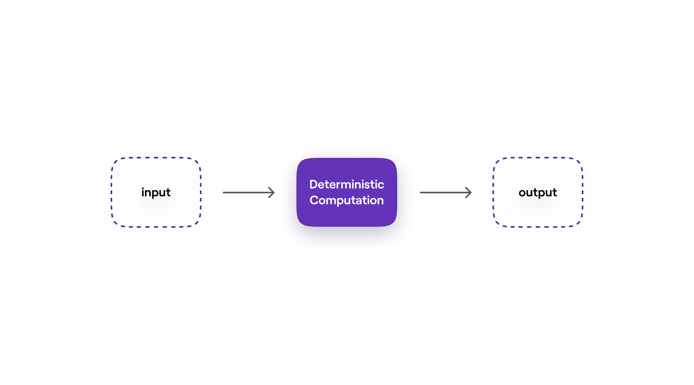
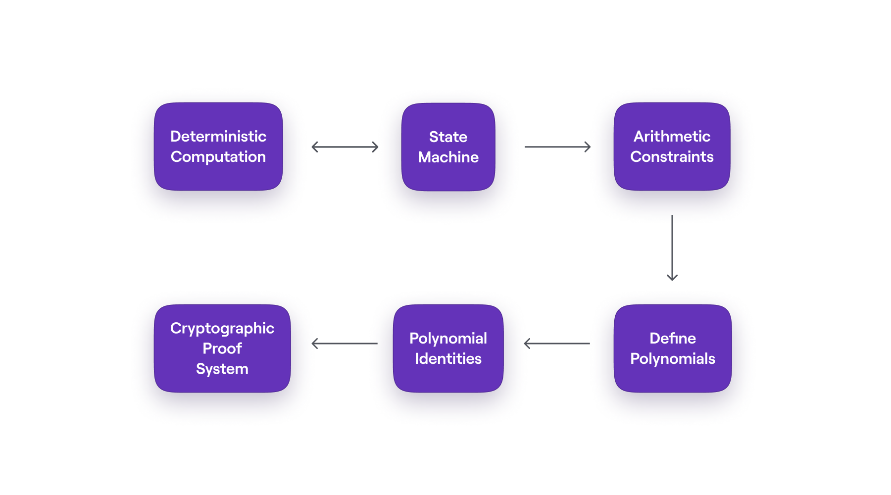

## Introduction

This document gives a short summary of the multiplicative Fibonacci state machine, presented as a simple model for the zkProver state machines. As already mentioned in preceding sections, the overall design of the Polygon zkEVM follows the state machine model, and thus emulates the Ethereum virtual machine (EVM).

The computations involved in Ethereum such as, making payments, transferring ERC20 tokens and running smart contracts, are repeatedly carried out and are all deterministic. That is, a particular input always produces the same output. Unlike the arithmetic circuit model which would need loops to be unrolled and hence resulting in undesirably larger circuits, the state machine model is most suitable for iterative and deterministic computations.

## zkProver's state machine design

To break down the complexity of the zkProver's design, we use a simplified _Hello World_ example. In particular, the multiplicative Fibonacci state machine. This simple state machine helps illustrate, in a general sense, how the state machine approach has been implemented to realize the zkProver.

!!!info
    Computing consecutive members of the well-known Fibonacci series, starting with specific initial values, is a deterministic computation.

Consider a scenario where a party called the prover, needs to prove knowledge of the initial values of the Fibonacci series used to produce a given N-th value of the series, in a verifiable manner.

These computations serve as an ideal analogy for the zkProver's role, which is to generate verifiable proofs confirming the validity of transactions submitted to the Ethereum blockchain.

The approach involves developing a state machine that enables a prover to generate and submit a verifiable proof of knowledge, which anyone can then use to verify its validity.

The process that leads to achieving such a state machine-based system takes a few steps:

- Modeling deterministic computation as a state machine.
- Specifying the equations that fully describe the state transitions of the state machine, known as arithmetic constraints.
- Using established and efficient Mathematical methods to define the corresponding polynomials.
- Expressing the previously stated arithmetic constraints into their equivalent polynomial identities.

These polynomial identities are equations that can be easily tested in order to verify the prover's claims. A so-called _commitment scheme_ is required for facilitating the proving and the verification. Hence, in the zkProver context, a proof-verification scheme called PIL-STARK is used.

This series of documents on the multiplicative Fibonacci state machine culminates in a DIY guide to implementing the proving and verification of the mFibonacci state machine.
