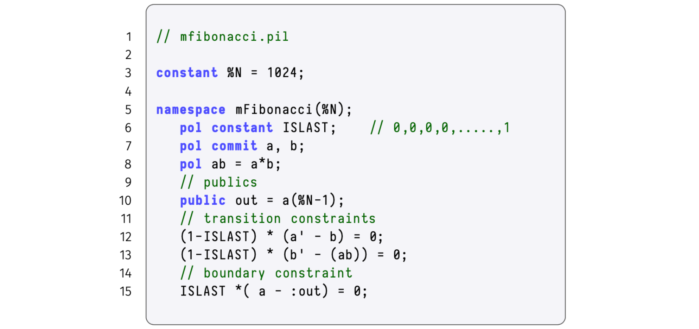
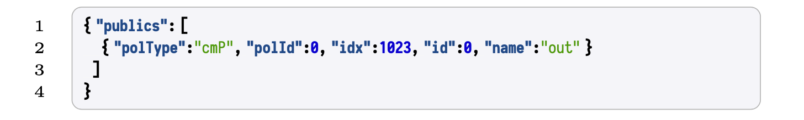
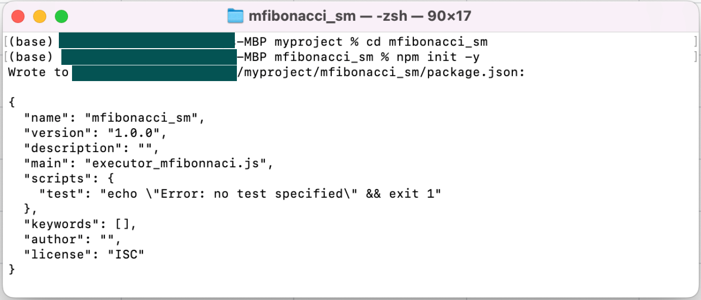
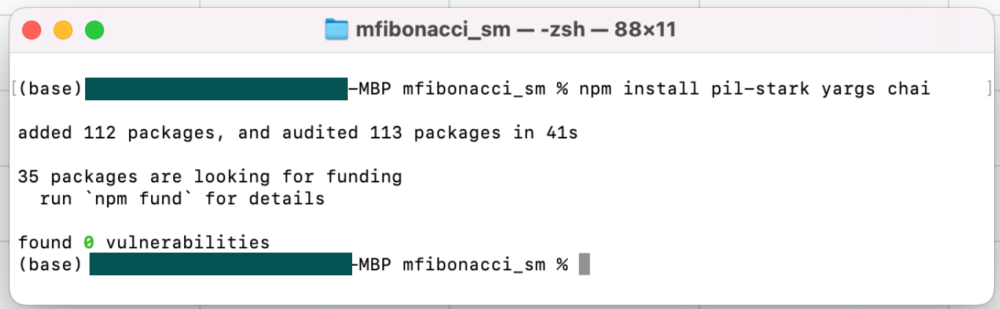

!!!note
    This document is a DIY implementation guide for the PIL-STARK proof-verification system.

Before delving into the implementation, we first ensure the boundary constraints in the  $\texttt{mFibonacci.pil}$ code are not hardcoded. The aim here is to implement these values as $\texttt{publics}$. This subsequently populates the $\texttt{publics}$' field in the parsed $\texttt{\{ \} fibonacci.pil.json}$ file.

## Boundary constraints as publics

As seen in the description of PIL-STARK, one of the outputs of the SM-prover is the $\texttt{publics}$, which are publicly known values. However, looking back at our demonstration, where the $\texttt{mFibonacci.pil}$ file was compiled with $\texttt{PILCOM}$, you can notice that the $\texttt{publics}$ field in the parsed $\texttt{\{ \} fibonacci.pil.json}$ file is empty. Check $\text{line 6}$ in the provided snapshot of the "$\texttt{\{ \} fibonacci.pil.json}$" file, and notice it reads thus:

$$
\texttt{"publics": [],}
$$

This is so, because no $\texttt{publics}$ were defined in the $\texttt{mFibonacci.pil}$ file that we compiled.

Again, you'll notice that the 1024-th value of the polynomial $\texttt{a}$ was hardcoded as $\mathtt{144115188042301440}$ in $\texttt{line}$ $\texttt{13}$, which checks the boundary constraint:

$$
\mathtt{ISLAST*(a - 144115188042301440) = 0;}
$$

This is undesirable because any change in the initial conditions would yield a wrong proof, which the verifier would reject.

The aim in this subsection is to therefore, rewrite the boundary constraint in the $\texttt{mFibonacci.pil}$ file such that, instead of hardcoding this public value, it is rather generically defined. So, $\mathtt{144115188042301440}$, is replaced with a public variable called "$\texttt{out}$". The new variable must be declared, and it is defined as;

$$
\textbf{public} \texttt{ out = a(\%N - 1);}
$$

The modified boundary constraint check in  $\texttt{mFibonacci.pil}$ now looks like this;

$$
\texttt{ISLAST*(a - :out) = 0;}
$$

where the  ` : `  colon-prefix indicates a read of the value stored at $\texttt{out}$.

The modified $\texttt{mFibonacci.pil}$ file, before compilation with $\texttt{PILCOM}$, is now as follows,



This modified $\texttt{mFibonacci.pil}$ file can be compiled with $\texttt{PILCOM}$ in the manner demonstrated earlier. The resulting parsed PIL file, "$\texttt{\{ \} mfibonacci.pil.json}$", now reflects some information in the "$\texttt{publics}$" field, as shown below.



## PIL-STARK implementation guide

Here is a step-by-step guide on how PIL-STARK is implemented. You are encouraged to Do-It-Yourself by following the steps provided below.

### Initialise a node project

The first step is to make a new subdirectory named `mfibonacci_sm`, switch directory to it and initialise a node project as indicated below;

```bash
npm init -y
```

A successful initialisation looks like this:



Next, install the required dependencies with the following command,

```bash
npm install pil-stark yargs chai
```

The installation takes seconds, and again the results looks like this,



### Create input files

First of all, the overall inputs to PIL-STARK are; the $\texttt{.pil}$ file describing the mFibonacci state machine, the STARK configuration $\texttt{.json}$ file and the inputs $\texttt{.json}$ file, which contains initial values of the mFibonacci state machine.

- Either move the modified version of the $\texttt{mfibonacci.pil}$ file to the $\mathtt{mfibonacci\_sm}$ subdirectory, or create a new file afresh at this subdirectory. Call it $\texttt{mfibonacci.pil}$. That is, copy the text below to the new file. Save the file.

  ```pil title="mfibonacci.pil"
  constant %N = 1024;
  
  namespace mFibonacci(%N);
    pol constant ISLAST; // 0,0,0,0,.....,1 
    pol commit a, b;
    pol ab = a*b;

  // publics
   public out = a(%N-1);

  // transition constraints
   (1-ISLAST) * (a' - b) = 0;
   (1-ISLAST) * (b' - (ab)) = 0;

  // boundary constraint
    ISLAST*(a-:out)=0;              
  ```

- Next, create a new file and call it `mfib.starkstruct.json`. Copy the code provided below into this JSON file, and save it.

  ```json
  {
    "nBits": 10,
    "nBitsExt": 11,
    "nQueries": 8, 
    "verificationHashType": "GL", 
    "steps": [
     {"nBits": 11}, 
      {"nBits": 7}, 
      {"nBits": 3}
   ]
  }
  ```

- Create a new file and call it `mfib.input.json`. Populate this JSON file with the initial values of the mFibonacci state machine of your choice (the numbers must be positive integers). We use here $\texttt{[ 234, 135 ]}$. Simply type the 2-element array in the `mfib.input.json` file and save it.

### Create the executor

In our earlier description of PIL-STARK, the $\texttt{executor}$ was 'split' into the _setup executor_ and the _prover executor_. This was done for the sake of simplicity. The two $\texttt{executors}$ are but one program that generates the evaluations of the constant polynomial, as well as the evaluations of the committed polynomials.

Create a new file and call it  `executor_mfibonacci.js`. Copy the code-text shown below, into this `.js` file and save it in the `mfibonacci_sm` subdirectory.

```js title="executor_mfibonacci.js"
const { FGL } = require("pil-stark");

module.exports.buildConstants = async function (pols) {
 const N = 1024;
 for ( let i=0; i<N; i++) { 
   pols.ISLAST[i] = (i == N-1) ? 1n : 0n;}
    }

module.exports.execute = async function (pols, input) { 
  const N = 1024;
 pols.a[0] = BigInt(input[0]);
 pols.b[0] = BigInt(input[1]); 
  for(let i=1; i<N; i++){
  pols.a[i] = pols.b[i-1];
  pols.b[i] = FGL.mul(pols.a[i-1], pols.b[i-1]);
 }
 return pols.a[N-1];
}
```

### Create PIL-STARK proof generator and verifier

Finally, create the PIL-STARK proof generator and verifier by creating a new file (using a code editor) and name it `mfib_gen_and_prove.js`.

Copy the code-text shown below, into this `mfib_gen_and_prove.js` file and save it in the `mfibonacci_sm` subdirectory.

```js
const { FGL, starkSetup, starkGen, starkVerify } = require("pil-stark");
const { newConstantPolsArray, newCommitPolsArray, compile, verifyPil } = require("pilcom");
const path = require("path");
// Files
const pilFile = path.join(__dirname, "mfibonacci.pil");
const input = require("./mfib.input.json");
const mFibExecutor = require("./executor_mfibonacci");
const starkStruct = require("./mfib.starkstruct.json");

async function generateAndVerifyPilStark() {
    // Generate constants (preprocessed)
    const pil = await compile(FGL, pilFile);
    const constPols = newConstantPolsArray(pil);
    const cmPols = newCommitPolsArray(pil);
    await mFibExecutor.buildConstants(constPols.mFibonacci);
    const executionResult = await mFibExecutor.execute(cmPols.mFibonacci, input); 
    console.log(executionResult);

    // Generate trace
    const evaluationPilResult = await verifyPil(FGL, pil, cmPols , constPols); 
   if (evaluationPilResult.length != 0) {
        console.log("Abort: the execution trace generated does not satisfy the PIL description!"); 
        for (let i=0; i < evaluationPilResult.length; i++) {
          console.log(pilVerificationResult[i]); } return;
      } else { 
          console.log("Continue: execution trace matches the PIL!"); }

    // Setup for the stark
    const setup = await starkSetup(constPols, pil, starkStruct);

    // Generate the stark
    const proverResult = await starkGen(cmPols,constPols,setup.constTree,setup.starkInfo);

    // Verify the stark
    const verifierResult= await starkVerify(proverResult.proof, proverResult.publics, setup.constRoot,setup.starkInfo);
    if (verifierResult === true) { console.log("VALID proof!");
     } else { console.log("INVALID proof!"); }
}
generateAndVerifyPilStark();
```

Run the `mfib_gen_and_prove.js` code:

```bash
node mfib_gen_and_prove.js
```

After a long reporting on all the checks made, a successful STARK generation and its verification is indicated with a $\texttt{VALID proof!}$ message. If you used different filenames from ours, you might have to do some light debugging.
